# App bars

Source: https://m3.material.io/components/app-bars/specs

## Variants

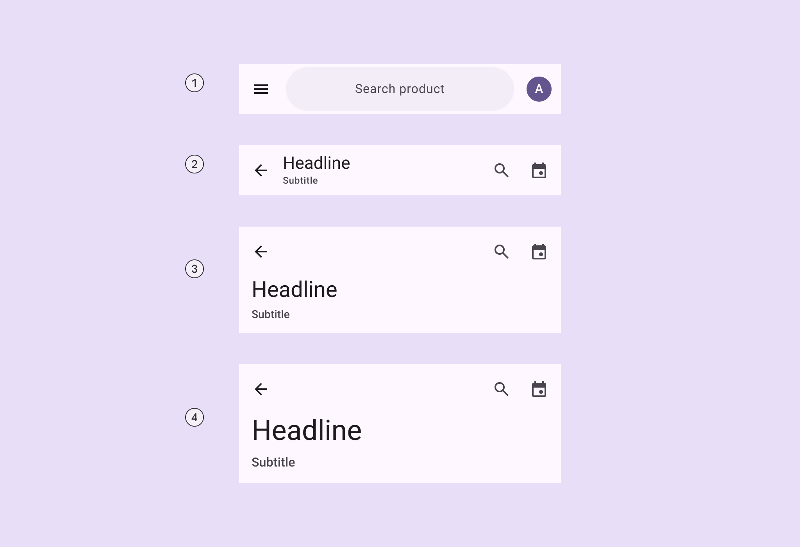

*Search app bar; Small; Medium flexible; Large flexible*

### Baseline variants

The baseline M3 medium and large app bars are no longer recommended in M3 Expressive, and should be replaced with medium flexible and large flexible app bars, which are similar visually, but have multi-line support, a shorter height, and can contain a wide variety of elements, like images. [Jump to baseline app bar specs](https://m3.material.io/m3/pages/app-bars/specs#faec9baf-140f-41dc-8b88-2792e90d9d5d)

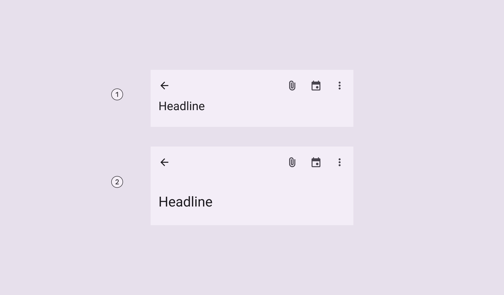

*Medium; Large*

| Variant | M3 | M3 Expressive |
| --- | --- | --- |
| Search app bar | -- | Available |
| Small | Available | Available |
| Center-aligned | Available | Merged into small. Use centered-text configuration. |
| Medium (baseline) | Available | Not recommended. Use medium flexible |
| Medium flexible | -- | Available |
| Large (baseline) | Available | Not recommended. Use large flexible |
| Large flexible | -- | Available |

## Configurations

### Text alignment

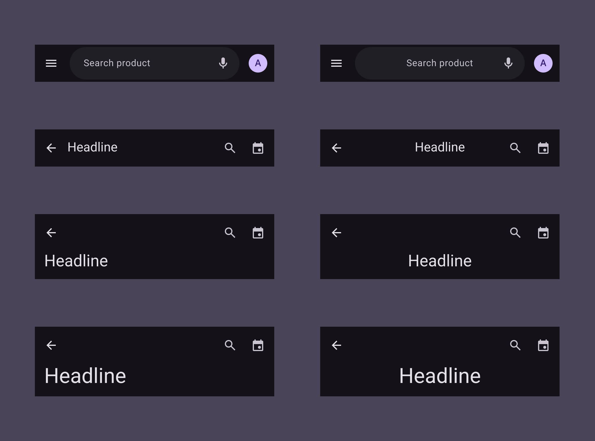

*Text labels, including supporting text, can be aligned to the leading edge or centered*

| Category | Configuration | M3 | M3 Expressive |
| --- | --- | --- | --- |
| Text alignment | Leading edge (default) | Available | Available |
| Text alignment | Centered | -- | Available |

## Tokens & specs

Select a token set to view in the table's menu. App bar token sets are organized into a common token set, and size-specific tokens. [Learn about design tokens](https://m3.material.io/m3/pages/design-tokens/overview)

- Token sets: App bar - Common; App bar - Size - Small; App bar - Size - Medium Flexible; App bar - Size - Large Flexible
- Columns: Token; Value
- Visible groups: Color; Spacing; Shape; Size

### Search component tokens & specs

The default search (Search lets people enter a keyword or phrase to get relevant information. [More on search](https://m3.material.io/m3/pages/search/overview)) component tokens are used in the search app bar.

- Columns: Token
- Visible groups: Color; Layout and Text

## Anatomy

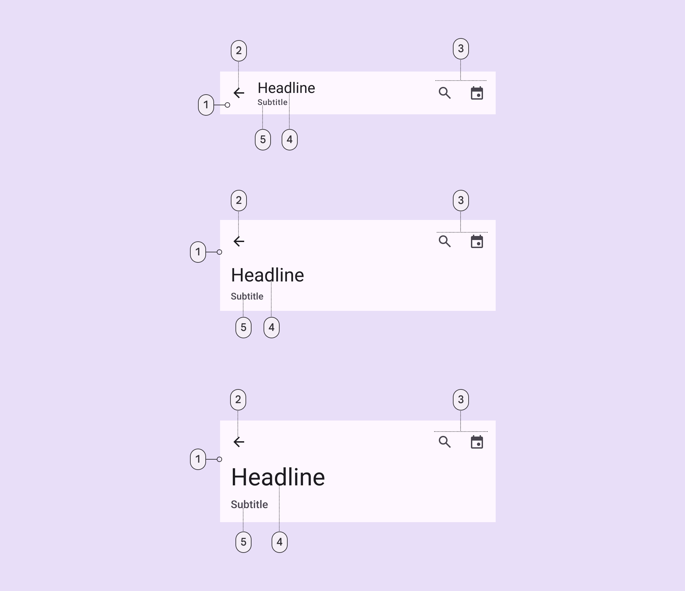

*Container; Leading button; Trailing elements; Headline; Subtitle*

App bars can be customized to include:

- An image or logo
- A subtitle
- A filled icon button

Avoid customizing the size of the heading and subtitle, or adding too many actions.

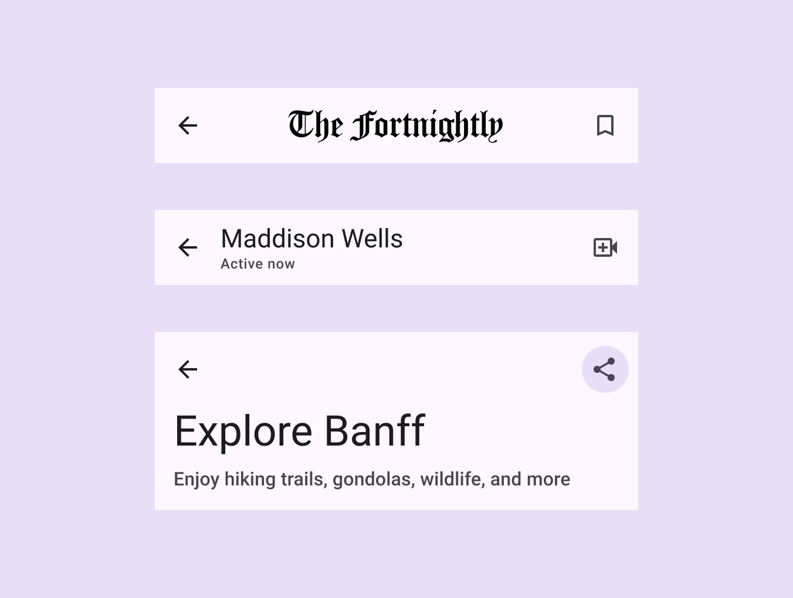

*The app bar can have different layouts depending on which elements are shown*

### Search

The search app bar can include trailing actions inside and outside the search bar. When the search bar is selected, it should open the search view (The search view is a full-screen modal often used to display a list of search results. It can also be opened by selecting a search icon. [More on search view](https://m3.material.io/m3/pages/search/overview)) component.

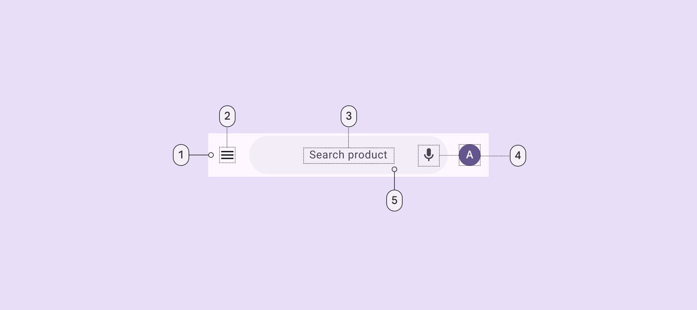

*Container; Leading icon button; Hinted search text; Trailing icon or avatar; Search container*

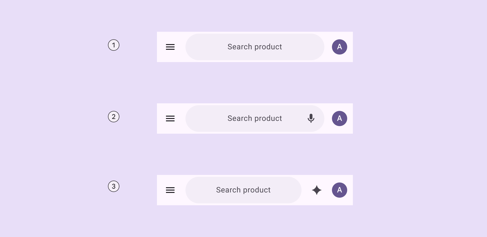

*A leading element and a trailing element outside search; A leading element, a trailing element inside search, and a trailing element outside search; A leading element and two trailing elements outside search*

### Image

An image can be placed in the app bar. In small app bars, this can replace the label text.

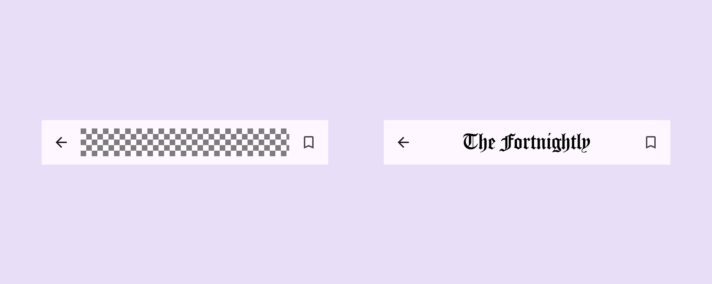

*Images can be added to app bars and can replace label text on small app bars*

### Filled trailing icon button

The app bar's trailing icon buttons can be replaced with a single, primary, or tonal filled icon button in default or wide sizes.

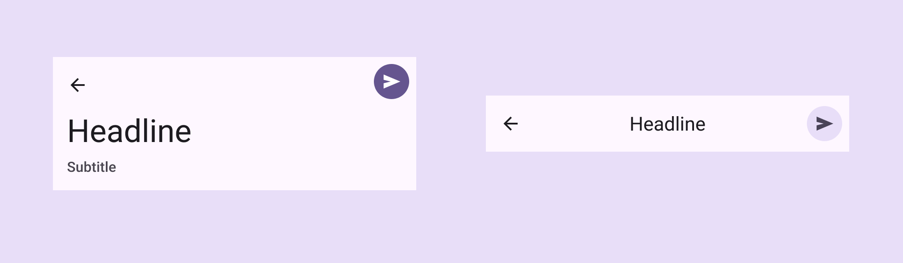

*The trailing icons can be configured to be a single filled icon button*

### Subtitle

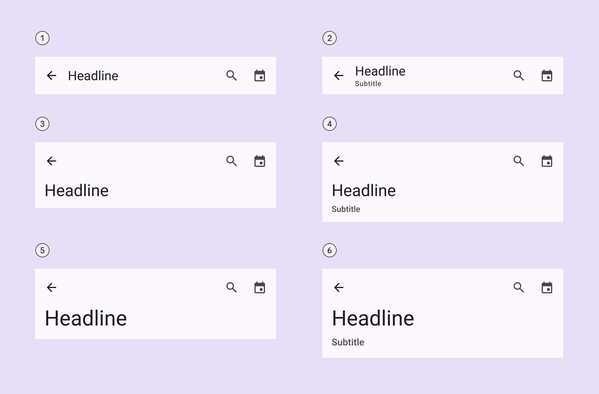

*Small; Small with subtitle; Medium flexible; Medium flexible with subtitle; Large flexible; Large flexible with subtitle*

## Color

Color values are implemented through design tokens. For design, this means working with color values that correspond with tokens. For implementation, a color value will be a token that references a value. [Learn more about design tokens](https://m3.material.io/m3/pages/design-tokens/overview)

All app bars share the same color roles. On scroll, the container changes color to surface container.

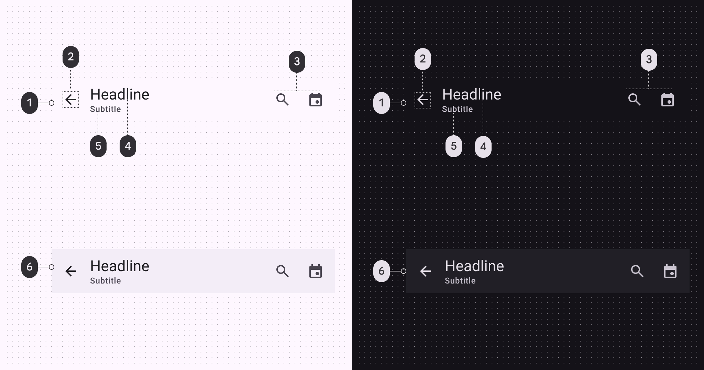

*Surface; On surface; On surface variant; On surface; On surface variant; Surface container (on scroll)*

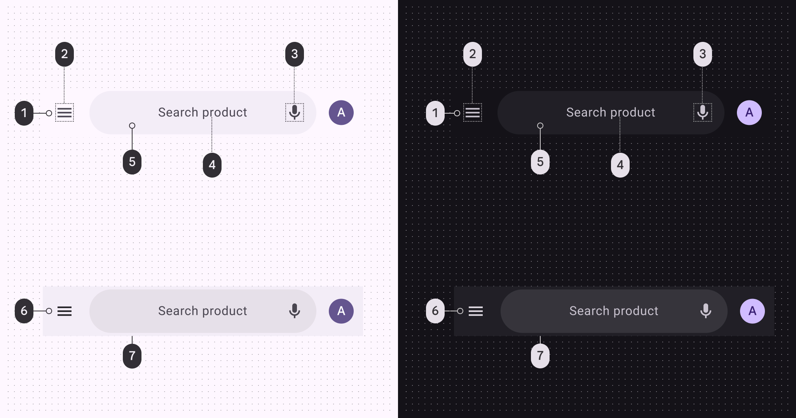

*Surface; On surface variant; On surface variant; On surface variant; Surface container; Surface container; Surface container highest*

### Scroll states

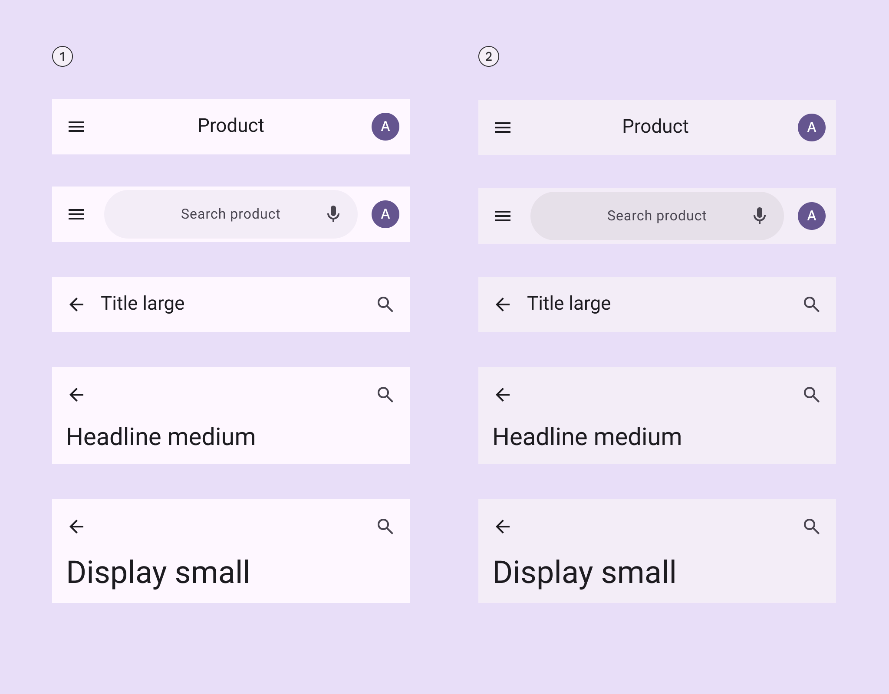

*Flat; On scroll*

## Measurements

### Search app bar

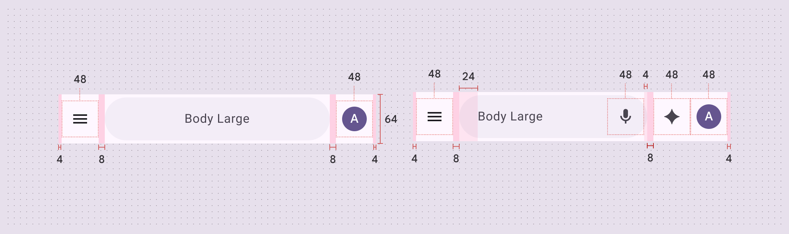

*Search app bar padding and size measurements*

### Small app bar

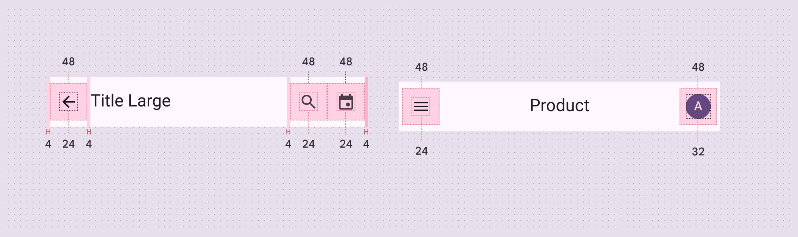

*Small app bar padding and size measurements*

### Medium flexible app bar

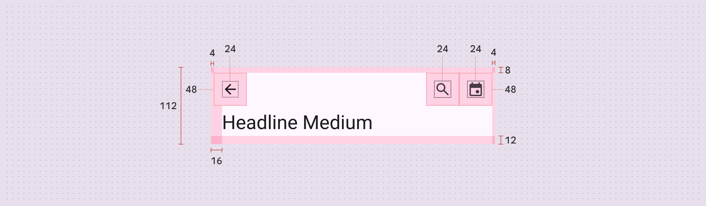

*Medium flexible app bar padding and size measurements*

### Large flexible app bar

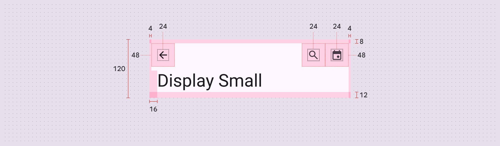

*Large flexible app bar padding and size measurements*

## Baseline app bars

The medium and large app bars are no longer recommended in M3 Expressive. Use the medium flexible and large flexible app bars in their place.

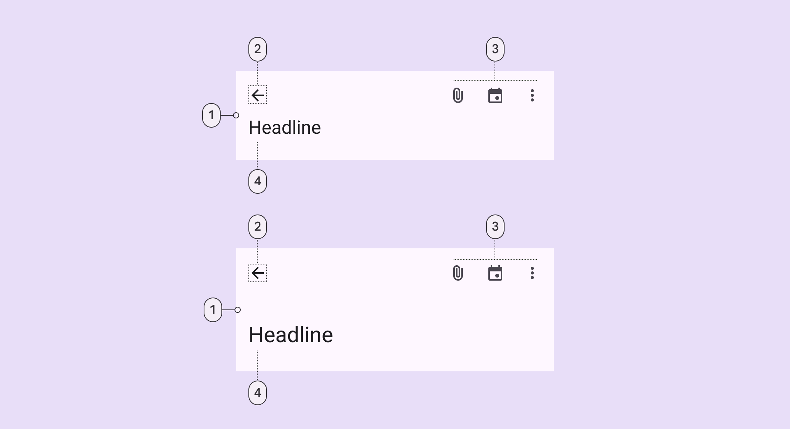

*Container; Leading button; Trailing icons; Headline*

### Tokens & specs

Select a token set to view in the table's menu. Baseline app bar token sets are organized into medium, large, and older baseline token sets. [Learn about design tokens](https://m3.material.io/m3/pages/design-tokens/overview)

- Token sets: App bar - Size - Medium (baseline); App bar - Size - Large (baseline); [Deprecated] Top app bar - Small; [Deprecated] Top app bar - Medium; [Deprecated] Top app bar - Large; [Deprecated] Top app bar - Small, Center-aligned
- Columns: Token; Value

### Color

Color values are implemented through design tokens. For designers, this means working with color values that correspond with tokens. In implementation, a color value will be a token that references a value. [Learn more about design tokens](https://m3.material.io/m3/pages/design-tokens/overview)

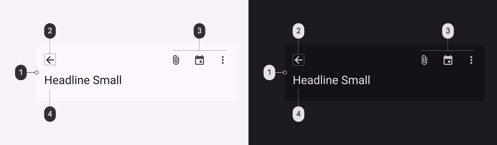

*Surface; On surface; On surface; On surface variant*

### Measurements

#### Medium app bar

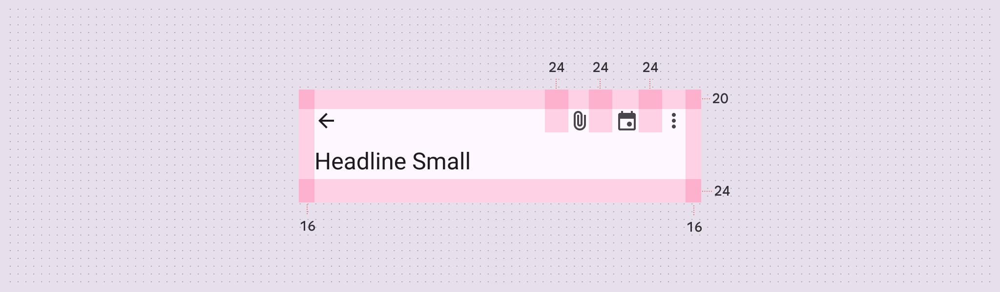

*Medium app bar padding and size measurements*

#### Large app bar

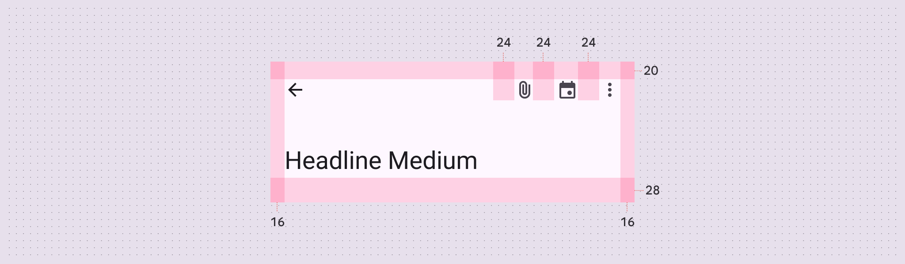

*Large app bar padding and size measurements*
