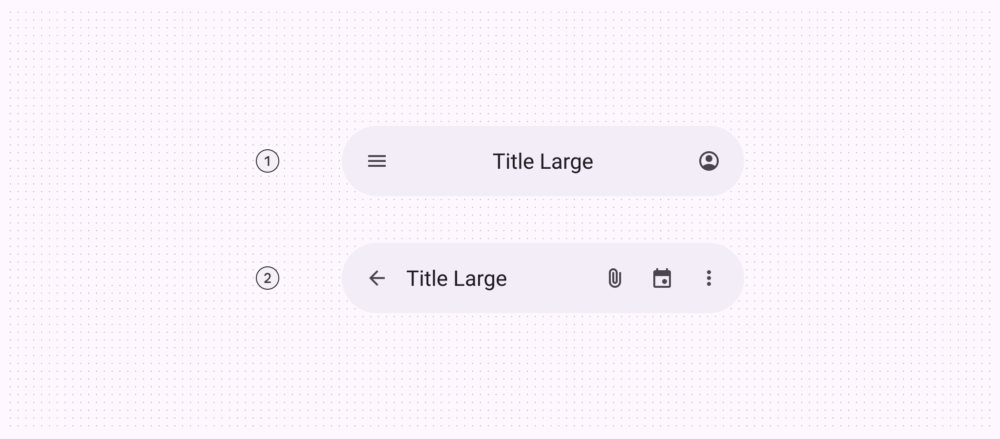
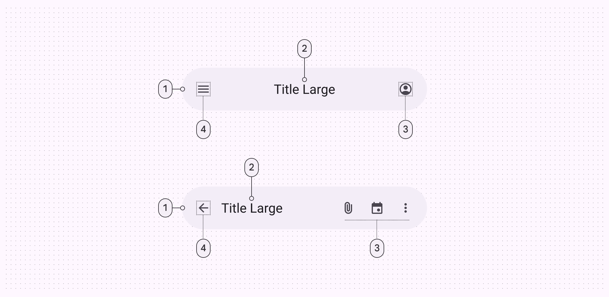
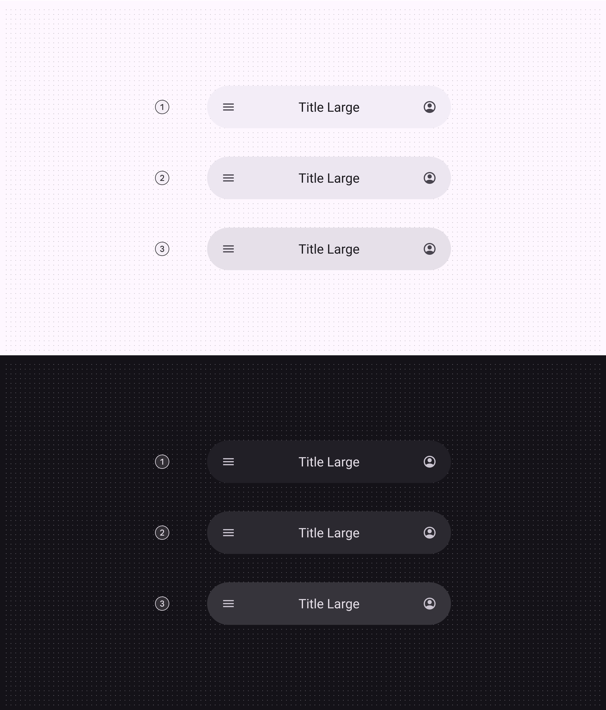
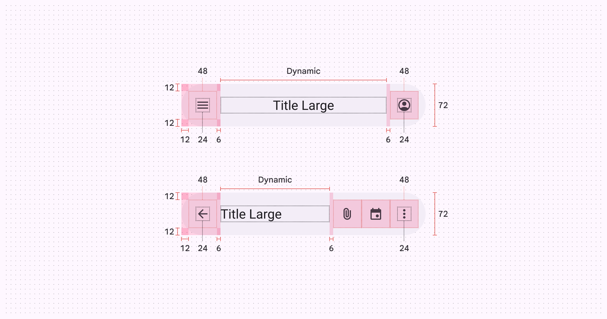
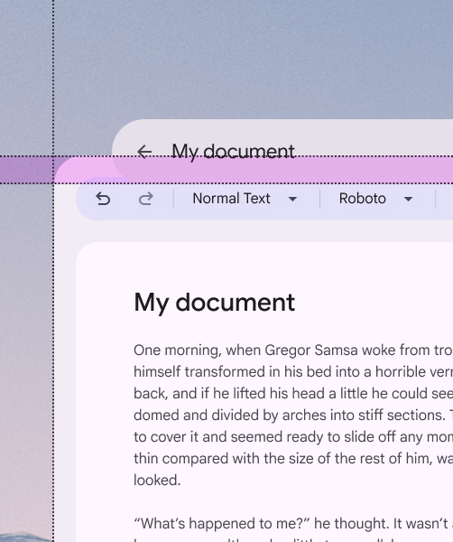
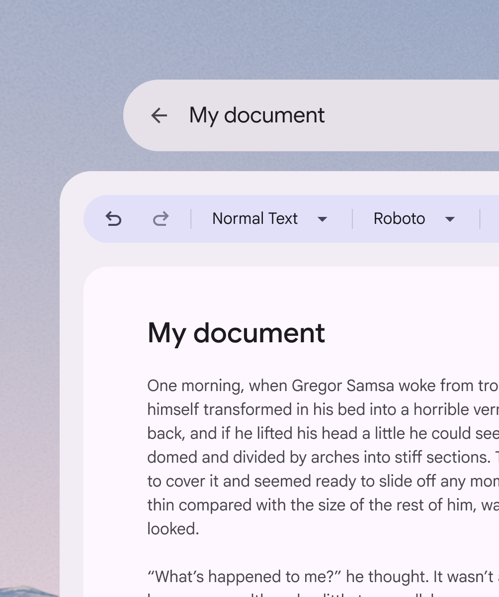
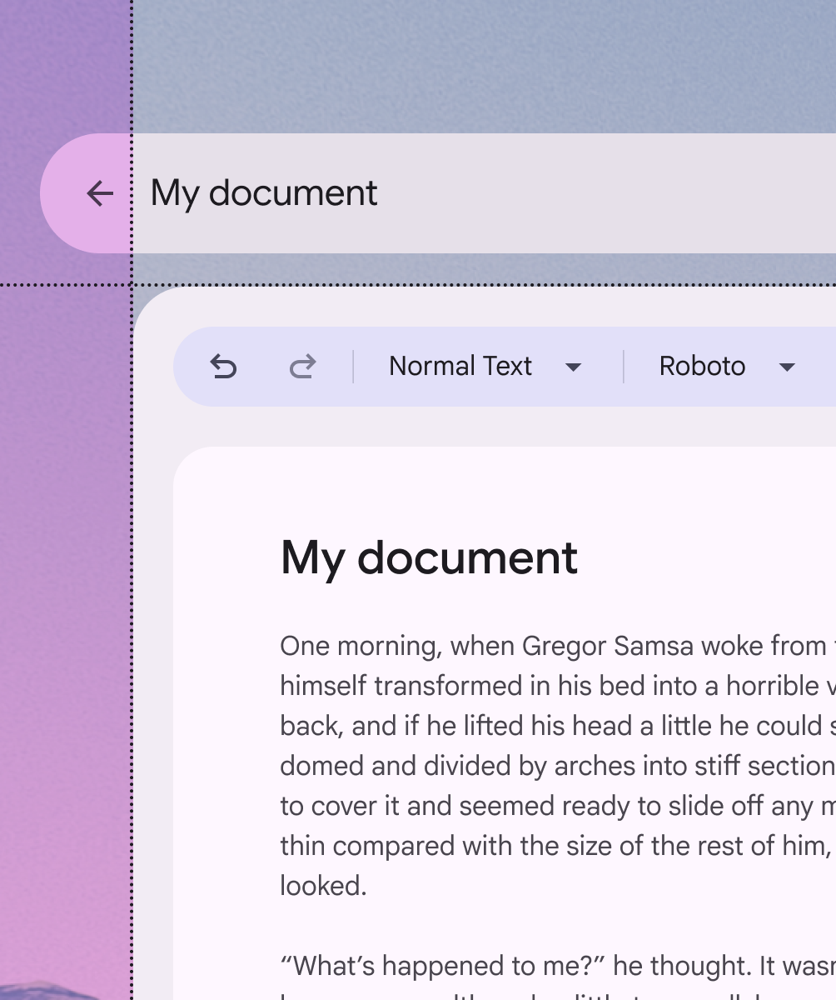
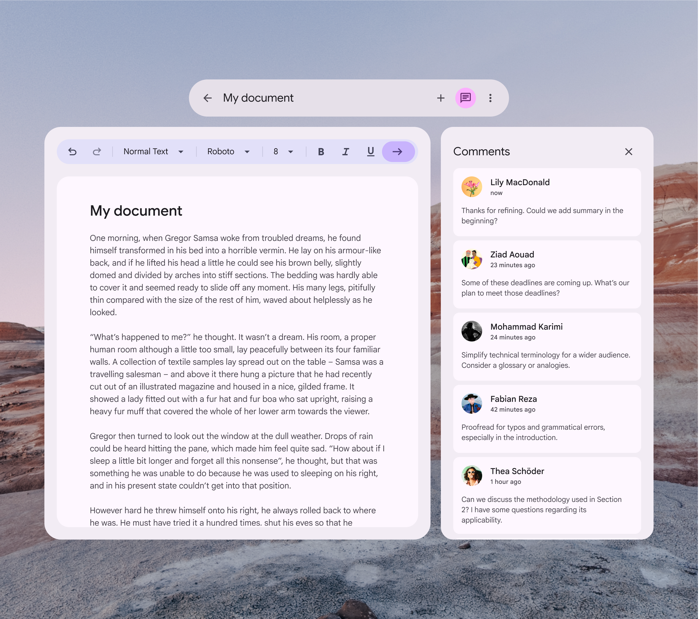
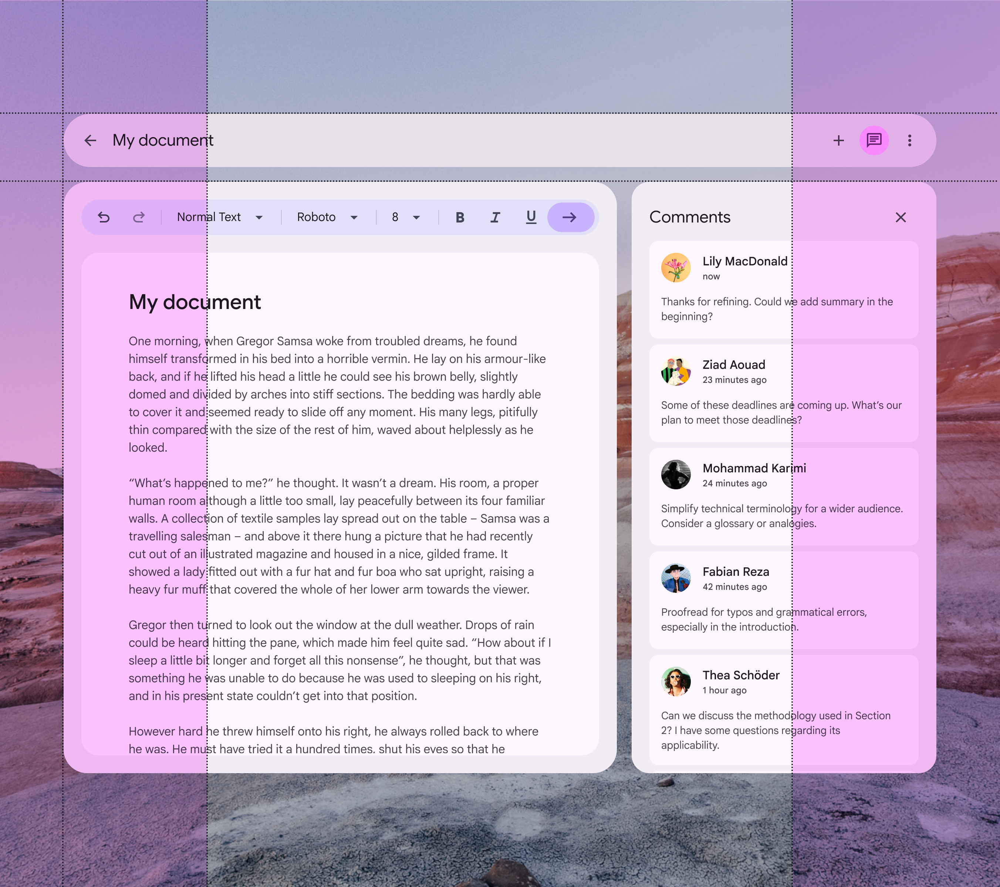

# App bars

Source: https://m3.material.io/components/app-bars/xr

Extended reality (XR) interfaces have special design requirements, like showing apps in 3D space. Material has an XR-specific app bar with custom specs and guidance. See [XR developer documentation](https://developer.android.com/design/ui/xr/guides/foundations) for more details.

## Types & configurations

There is one app bar orbiter (Orbiters are floating elements that control the content within spatial panels. [More on orbiters](https://developer.android.com/design/ui/xr/guides/spatial-ui#orbiters)). It closely aligns with the small app bar (Small app bars display information and actions in compact layouts. They're often used for scrolled views on subpages that require back navigation and multiple actions. [More on small app bars](https://m3.material.io/m3/pages/app-bars/overview)). It can be configured to be center-aligned or left-aligned.

*Center-aligned app bar; Left-aligned app bar*

## Anatomy

*Container; Headline; Trailing icons; Leading icon*

## Color & elevation

XR uses color to communicate the elevation of UI elements and orbiters. With [spatial elevation](https://developer.android.com/design/ui/xr/guides/spatial-ui#spatial-elevation), the app bar displays above the spatial panel (In Android XR, a spatial panel is a container for UI elements, interactive components, and immersive content. [More on spatial panels](https://developer.android.com/design/ui/xr/guides/spatial-ui#spatial-panels)) on the Z-axis. Elevated app bars can use any of these color options:

*Surface container; Surface container high; Surface container highest*

## Measurements

*Measurements and padding for app bar orbiters*

## Usage

An app bar can appear in an orbiter (Orbiters are floating elements that control the content within spatial panels. [More on orbiters](https://developer.android.com/design/ui/xr/guides/spatial-ui#orbiters)) for a more immersive experience. Currently, this spatial capability is only available in full space (Full space is Android XR’s immersive mode and supports spatial components. [More on full space](https://developer.android.com/design/ui/xr/guides/foundations#modes)). In home space (Home space is compatible with mobile and large screen apps, but doesn’t support spatial components. [More on home space](https://developer.android.com/design/ui/xr/guides/foundations#modes)), use a regular app bar on the same plane as the body content to mimic a 2D experience.

[Video: Animation showing an app bar changing from 2D to 3D.](assets/asset-005-an-app-bar-s-behavior-and-placement-changes-5b9b59d641.webp)

*An app bar’s behavior and placement changes from a 2D to a 3D experience*

## Behavior

### Global context

When placed in global context, the orbiter is centered at the top of the app it controls.

It stays anchored to the app during layout or content changes.

This ensures navigation elements are always easy to find and use.

[Video: An app bar orbiter placed in global context.](assets/asset-006-global-app-bar-orbiters-should-be-centered-and-16be86eb8b.webp)

*Global app bar orbiters should be centered and anchored to the top of the app*

### Local context

When placed in local context, the orbiter is centered at the top of the spatial panel it controls.

It repositions in response to layout or content changes.

[Video: An app bar orbiter placed in local context.](assets/asset-007-caution-local-app-bar-orbiters-should-be-centered-e39ee2f2b6.webp)

*Caution Local app bar orbiters should be centered and anchored to the top of the panel. However, this is less common, so make sure that it contains actions that only affect its anchored panel.*

### Additional app bars

In most cases, apps should only have one app bar orbiter, placed in global context.

[Video: An app switches between 1 and 2 app bar orbiters.](assets/asset-008-caution-limit-the-use-of-multiple-app-bars-608db1c4fe.webp)

*Caution Limit the use of multiple app bars to rare cases when additional spatialization improves usability*

## Placement

### Offset and inset positioning

*Do Include a 20dp margin. This visually separates the app bar orbiter from the spatial panel, and prevents content obstruction.*

*Don’t overlap the app bar orbiter and spatial panel*

### Horizontal alignment

*Do Always align the app bar orbiter within the bounds of nearby spatial panels*

*Don’t The app bar orbiter shouldn’t exceed the width of adjacent spatial panels*

### Spatial panel alignment

By default, app bar orbiters are center-aligned to the spatial panel. Their width and placement can be adjusted to accommodate specific user needs, such as improved ergonomics or right-to-left (RTL) languages.

[Video: App bar orbiter alignment options in relation to spatial panels: left, center, and right-aligned.](assets/asset-013-app-bar-orbiters-can-align-to-the-center-4cc5b32a02.webp)

*App bar orbiters can align to the center, left, or right of the spatial panel*

### Width boundaries

An app bar orbiter’s width should adjust to stay in a person’s [field of view](https://developer.android.com/design/ui/xr/guides/spatial-ui#where-place).

This makes crucial navigation elements easy to find.

*Do Adjust the width of the app bar orbiter to fit in a person’s field of view*

It’s not recommended to increase the width of an app bar orbiter beyond a person’s natural [field of view](https://developer.android.com/design/ui/xr/guides/spatial-ui#where-place).

This creates a visual imbalance and makes it difficult to find navigation elements.

*Don’t Avoid expanding the app bar orbiter beyond the adjacent panel’s width and a person’s field of view*

### Adaptable width

When placed in a local context, an app bar orbiter can expand to the width of its adjacent spatial panel.

Be sure the orbiter stays in a person’s field of view, and test for usability.

[Video: 2 app bar orbiters with the same width as their adjacent spatial panels.](assets/asset-016-caution-use-caution-before-expanding-the-app-bar-81f9504875.webp)

*Caution Use caution before expanding the app bar’s width to match its spatial panel. The orbiter may not fit in a person’s primary field of view.*

## Accessibility considerations

[XR accessibility](https://developer.android.com/design/ui/xr/guides/get-started#make-app) guidelines are still evolving. XR app bars should follow applicable Material [app bar accessibility standards](https://m3.material.io/m3/pages/app-bars/accessibility).
