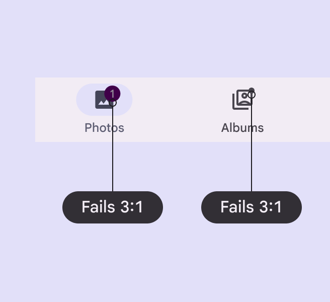
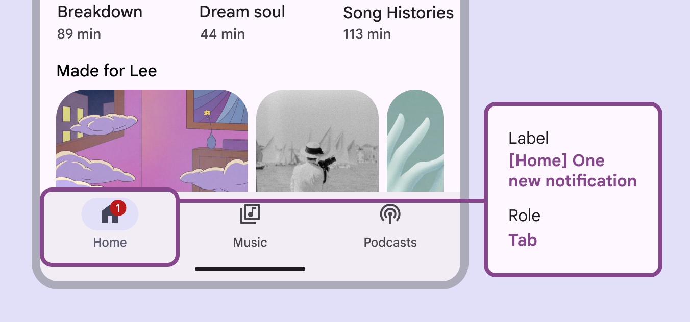

# Badges

Source: https://m3.material.io/components/badges/accessibility

## Use cases

People should be able to use assistive technology to:

- Understand the dynamic information conveyed in badges, such as counts or labels
- Address badge announcements by selecting corresponding navigation destinations

## Interaction & style

Badges are most commonly used within other components, such as navigation bar (Navigation bars let people switch between UI views on smaller devices. [More on navigation bars](https://m3.material.io/m3/pages/navigation-bar/overview)), navigation rail (Navigation rails let people switch between UI views on mid-sized devices. [More on navigation rails](https://m3.material.io/m3/pages/navigation-rail/overview)), app bars (App bars display navigation, actions, and text at the top of a screen. [More on app bars](https://m3.material.io/m3/pages/app-bars/overview)), and tabs (Tabs organize content across different screens and views. [More on tabs](https://m3.material.io/m3/pages/tabs/overview)). When a badge is used to indicate an unread notification, the badge gets hidden once it's selected.

[Video: An animation of a badge disappearing once it's tapped.](assets/asset-001-an-animation-of-a-badge-disappearing-once-it-d790c06d3e.webp)

## Visual indicators

Badges use a color intended to stand out against labels, icons, and navigation elements. Use the default color mapping to avoid color conflict issues.

*Do Badges must use default color with at least 3:1 contrast*

*Don’t Avoid using custom color roles for the badge container and label text. If custom roles are necessary, make sure they have contrast of at least 3:1.*

## Labeling elements

The accessibility (Accessible design makes products usable for people with all kinds of abilities. [More on accessibility](https://m3.material.io/m3/pages/overview/principles)) label for a badge item will be read after its navigation destination. Any numerical badges will have their number read, while non-counting badges will simply announce New notification.

*Numerical badges will have their number read*

*Non-counting badges will simply announce New notification*
