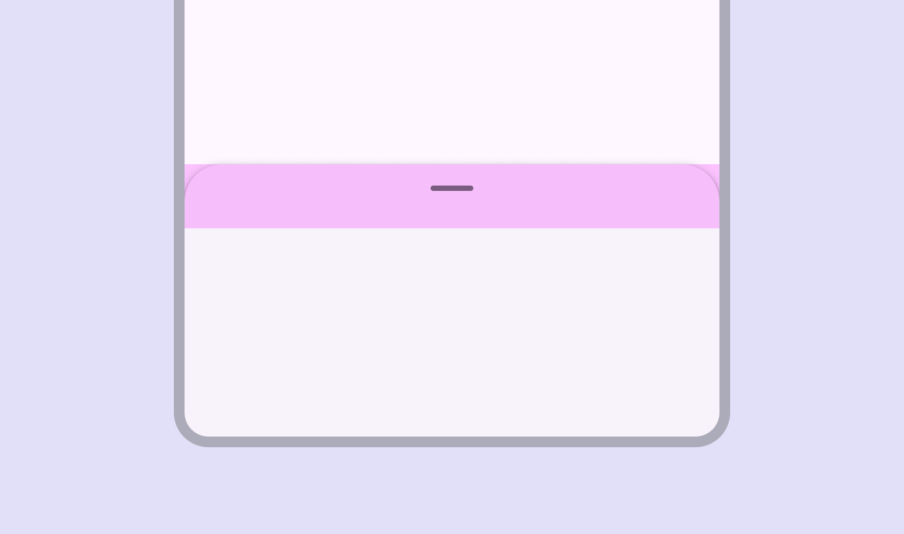
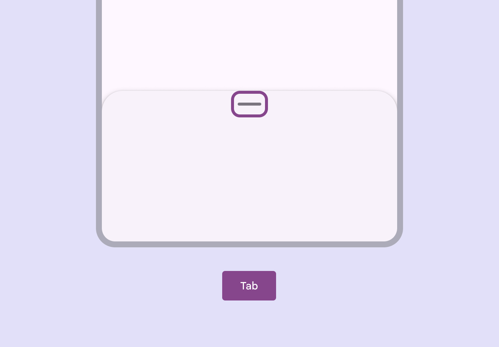
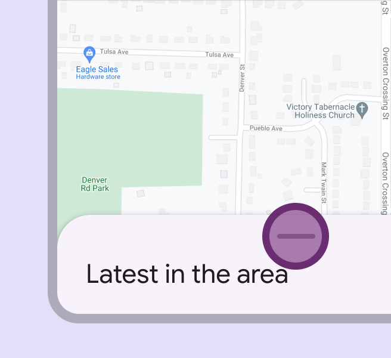
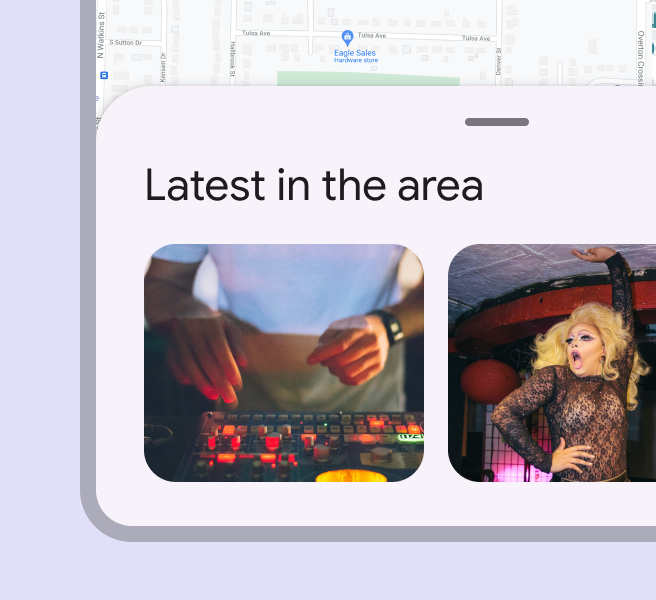
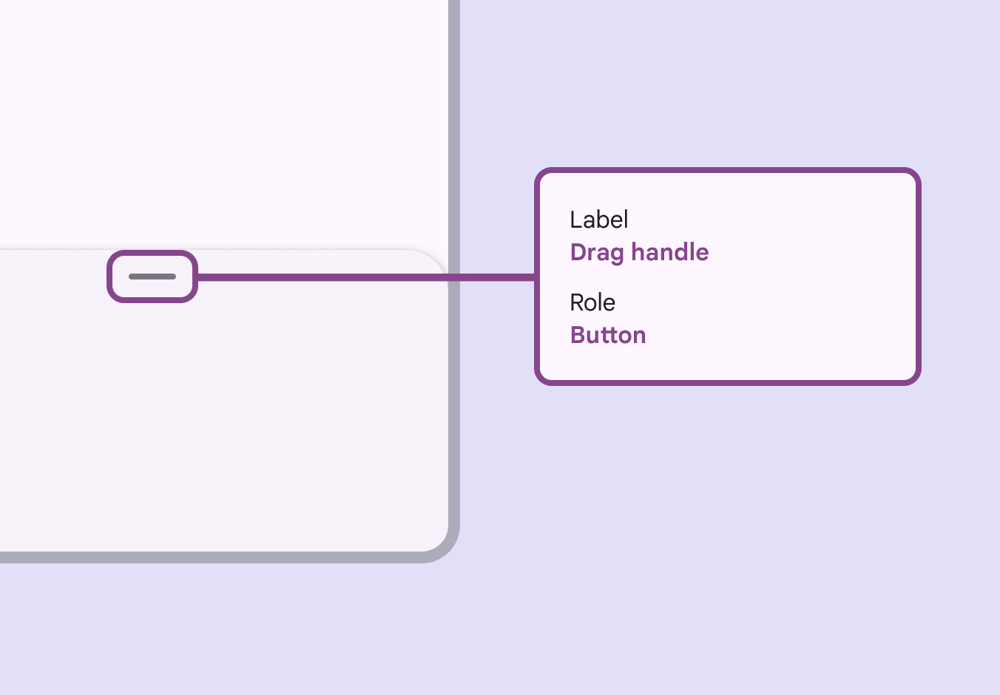

# Bottom sheets

Source: https://m3.material.io/components/bottom-sheets/accessibility

## Use cases

Users should be able to:

- Resize bottom sheets without having to rely on touch gestures

## Interaction & style

### Touch target area

The top 48dp portion of the bottom sheet is interactive when user-initiated resizing is available and the drag handle is present.

*To ensure touch target accessibility, the top portion of a bottom sheet can be reserved for resize interactions*

### Initial focus

The optional drag handle can be focused (A focused state communicates when a user has highlighted an element, using an input method such as a keyboard or voice. [More on focused state](https://m3.material.io/m3/pages/interaction-states/applying-states#bc6d6853-48ef-490e-8076-448e89e69f0f)) in the tab order and interacted with using non-touch inputs (Inputs are devices that provide interactive control of an app. Common inputs are a mouse, keyboard, and touchpad.), such as keyboard or switch (Switches toggle the state of an item on or off. [More on switches](https://m3.material.io/m3/pages/switch/overview)) controls.

*Visible focus shown on the drag handle affordance*

### Dragging

Include a single-pointer alternative for any action that can be completed by dragging.

Drag handles should cycle the bottom sheet through available heights when selected. If a drag handle can’t be used, add a button to do this action.

*Interacting with the drag handle can quickly move a bottom sheet through preset heights*

*A bottom sheet can automatically resize to another height after interacting with the drag handle*

## Keyboard navigation

| Keys | Actions |
| --- | --- |
| Tab | Focus lands on drag handle |
| Space / Enter | Toggles between available heights |

## Labeling

Label only the drag handle. The accessibility (Accessible design makes products usable for people with all kinds of abilities. [More on accessibility](https://m3.material.io/m3/pages/overview)) role for the drag handle is “button.”

*Label the drag handle*
