# Bottom sheets

Source: https://m3.material.io/components/bottom-sheets/guidelines

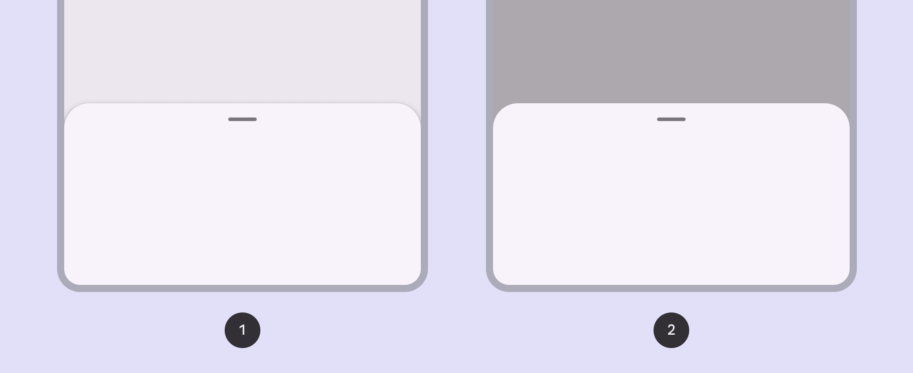

*Standard bottom sheets; Modal bottom sheets*

## Usage

Bottom sheets display supplementary content and actions on a mobile screen.

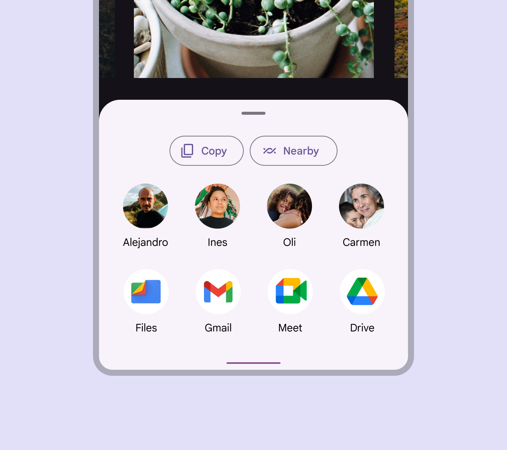

*Bottom sheet containing contacts and applications*

Bottom sheets are a versatile component that can contain a wide variety of information and layouts (Layout is the visual arrangement of elements on the screen. [More on layout](https://m3.material.io/m3/pages/understanding-layout/overview)), including menu (Menus display a list of choices on a temporary surface. [More on menus](https://m3.material.io/m3/pages/menus/overview)) items (in list (Lists are continuous, vertical indexes of text and images. [More on lists](https://m3.material.io/m3/pages/lists/overview)) or grid layouts), actions, and supplemental content.

*Bottom sheet with menu items in a list*

## Anatomy

A container is the only required element of a bottom sheet. Bottom sheet layouts (Layout is the visual arrangement of elements on the screen. [More on layout](https://m3.material.io/m3/pages/understanding-layout/overview)) can vary widely to support the kinds of content they contain.

*Container; Drag handle (optional); Scrim (modal only)*

### Container

Bottom sheet containers hold all bottom sheet elements. Their size is determined by the space those elements occupy.

The container is the only required element of a bottom sheet. All other elements are optional.

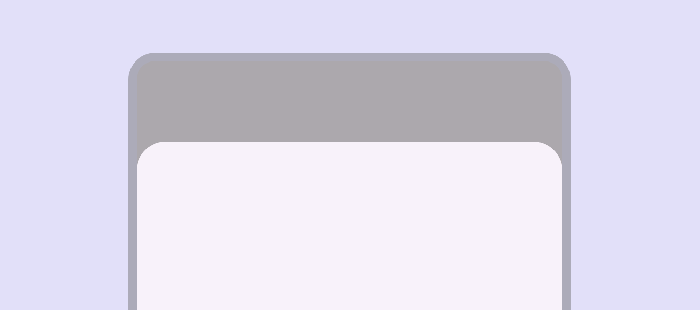

*Bottom sheets are flexible containers that adapt to their content and available space*

### List items (optional)

Lists (Lists are continuous, vertical indexes of text and images. [More on lists](https://m3.material.io/m3/pages/lists/overview)) are a continuous group of text or images. List items can include label text, icons, and text buttons (Buttons let people take action and make choices with one tap. [More on buttons](https://m3.material.io/m3/pages/common-buttons/overview)), among other elements.

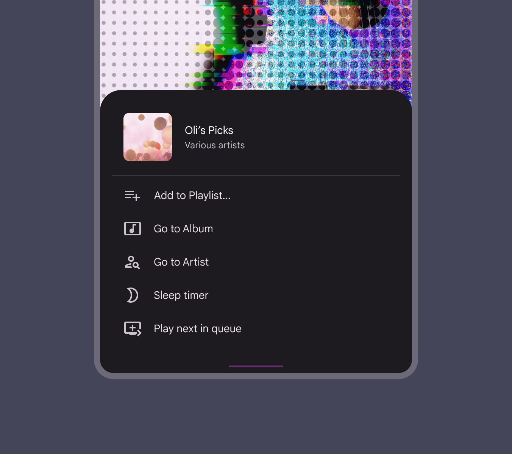

*Bottom sheet containing a list with icons*

### Dividers (optional)

Dividers (Dividers are thin lines that group content in lists or other containers. [More on dividers](https://m3.material.io/m3/pages/divider/overview)) can be used to separate related content in bottom sheets.

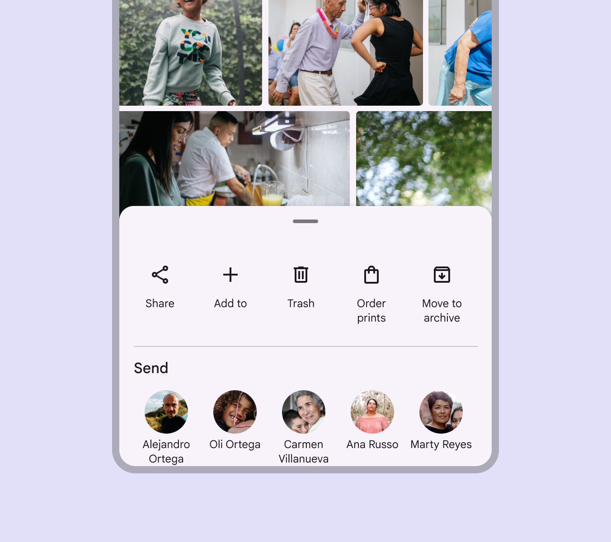

*Bottom sheet with a divider separating kinds of actions*

### Media (optional)

Thumbnail Bottom sheets can include thumbnails for an avatar or logo.

Image Bottom sheets can include photos, illustrations, and other graphics, such as weather icons.

Video Bottom sheets can include video.

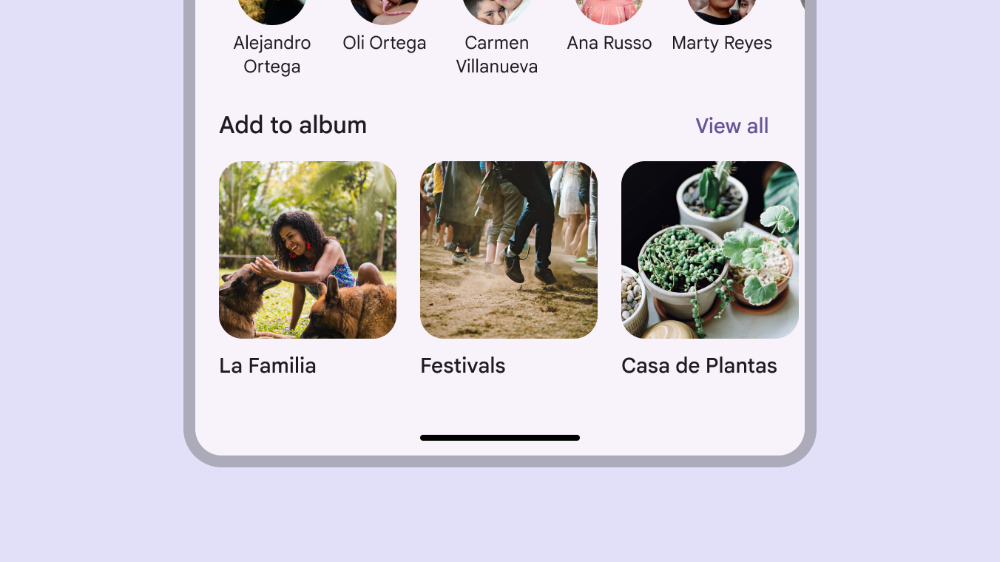

*Bottom sheets can contain thumbnails, images, and video*

## Standard bottom sheets

Standard bottom sheets co-exist with the screen’s main UI region and allow for simultaneously viewing and interacting with both regions, especially when the main UI region is frequently scrolled or panned.

Use a standard bottom sheet to display content that complements the screen’s primary content, such as an audio player in a music app.

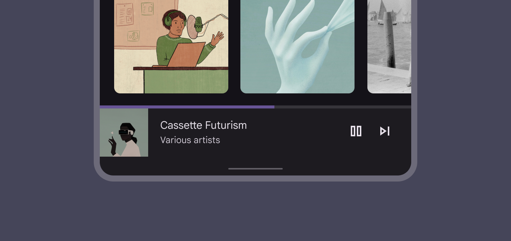

*The music player in this standard bottom sheet allows people to control their music while browsing albums*

At full-screen height, standard bottom sheets contain a collapse icon in an app bar to return to their initial position.

Standard bottom sheets can contain supplementary content that continues below the screen, such as location information over a map.

[Video: Standard bottom sheets](assets/asset-010-a-bottom-sheet-can-have-preset-positions-from-0e1242f411.webp)

*A bottom sheet can have preset positions from full-screen height to preview*

## Modal bottom sheets

Like dialogs (Dialogs provide important prompts in a user flow. [More on dialogs](https://m3.material.io/m3/pages/dialogs/overview)), modal bottom sheets appear in front of app content, disabling all other app functionality when they appear, and remaining on screen until confirmed, dismissed, or a required action has been taken.

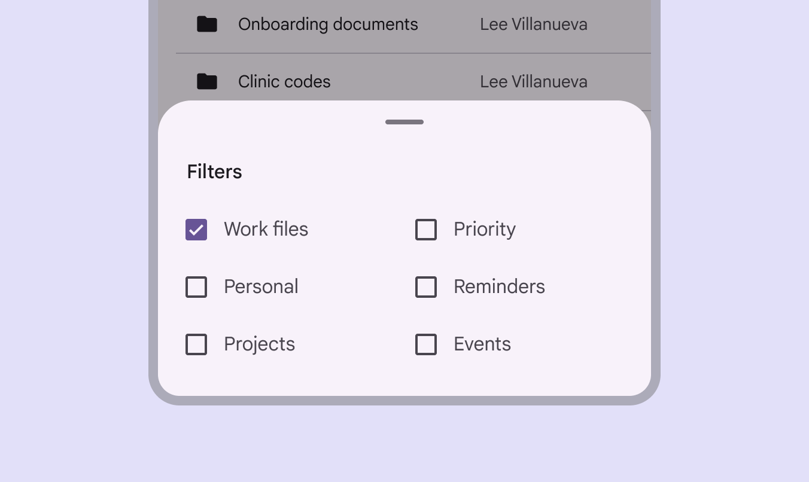

*A modal bottom sheet must be interacted with or dismissed. Its blocking behavior makes it suitable for a menu, such as in this files app, to help people focus on their available choices.*

Use a modal bottom sheet as an alternative to inline menus (Menus display a list of choices on a temporary surface. [More on menus](https://m3.material.io/m3/pages/menus/overview)) or simple dialogs (Dialogs provide important prompts in a user flow. [More on dialogs](https://m3.material.io/m3/pages/dialogs/overview)) on mobile, especially when offering a long list (Lists are continuous, vertical indexes of text and images. [More on lists](https://m3.material.io/m3/pages/lists/overview)) of action items, or when items require longer descriptions and icons.

Modal bottom sheets are used in mobile apps only.

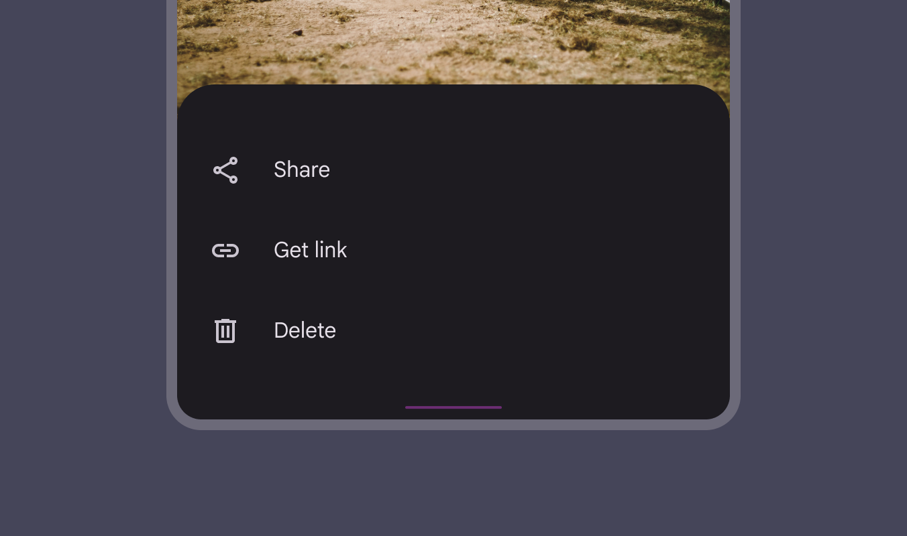

*Modal bottom sheets can be used instead of menus to present additional actions*

### Visibility

To provide access to its top actions, the initial vertical position of modal bottom sheets (Modal bottom sheets appear in front of app content, disabling all other app functionality when they appear, and remaining on screen until confirmed, dismissed, or a required action has been taken.) is capped at 50% of the screen height.

Modal bottom sheets whose contents exceed 50% of the screen height can then be pulled across the full screen and scrolled internally to access their remaining items.

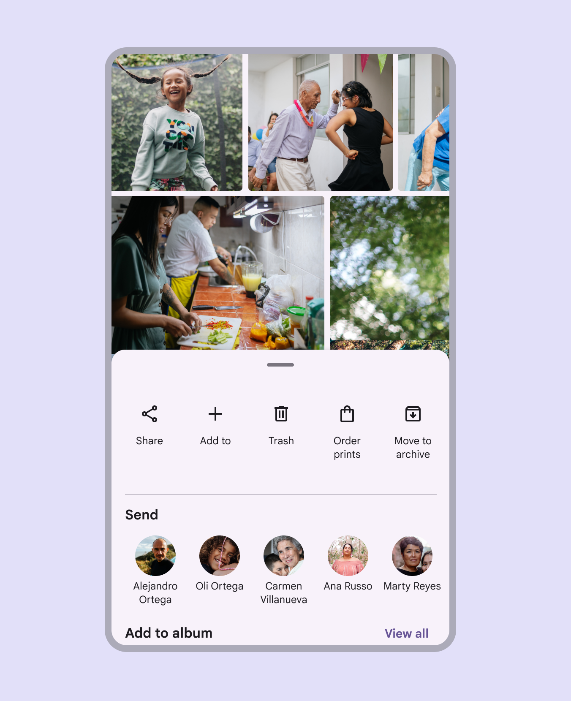

*The initial vertical position of modal bottom sheets can't exceed 50% of the screen height*

Modal bottom sheets (Modal bottom sheets appear in front of app content, disabling all other app functionality when they appear, and remaining on screen until confirmed, dismissed, or a required action has been taken.) appear when triggered by a user action, such as tapping a button (Buttons let people take action and make choices with one tap. [More on buttons](https://m3.material.io/m3/pages/common-buttons/overview)) or an overflow icon. They can be dismissed by:

- Tapping a menu (Menus display a list of choices on a temporary surface. [More on menus](https://m3.material.io/m3/pages/menus/overview)) item or action within the bottom sheet
- Tapping the scrim
- Swiping the sheet down
- Using a close affordance within the bottom sheet’s app bar (App bars display information and actions at the top of a screen. [More on app bars](https://m3.material.io/m3/pages/app-bars/overview)), if available

Display a close affordance in a full-screen modal bottom sheet.

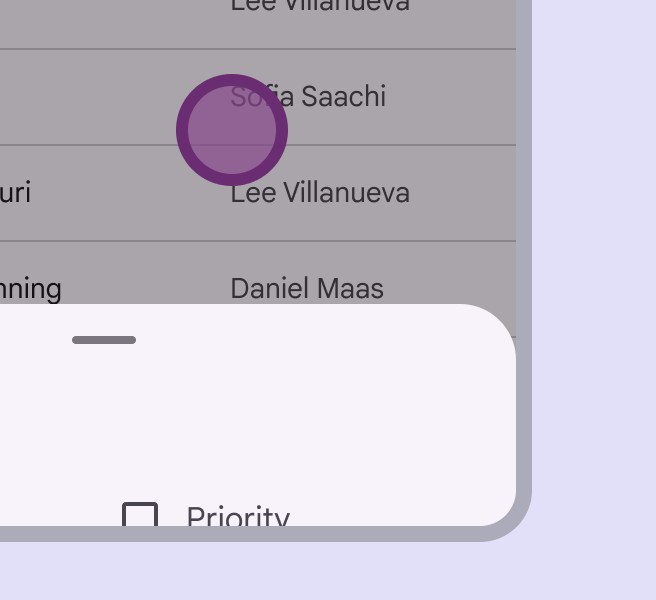

*Tapping the scrim dismisses a modal bottom sheet*

*A modal bottom sheet can be dismissed by swiping the sheet down*

## Responsive layout

### Compact window size

In compact window sizes (Window widths smaller than 600dp, such as a phone in portrait orientation. [More on compact window size class](https://m3.material.io/m3/pages/applying-layout/compact)), like mobile devices, bottom sheets extend across the width of a screen and are elevated above the primary content.

*Bottom sheets should extend to the width of the screen on mobile*

### Medium and expanded window sizes

For larger screens with medium (Window widths from 600dp to 839dp, such as a tablet or foldable in portrait orientation. [More on medium window size class](https://m3.material.io/m3/pages/applying-layout/medium)) and expanded window sizes (Window widths 840dp to 1199dp, such as a tablet or foldable in landscape orientation, or desktop. [More on expanded window size class](https://m3.material.io/m3/pages/applying-layout/expanded)), bottom sheets have a default max-width to prevent undesired layouts (Layout is the visual arrangement of elements on the screen. [More on layout](https://m3.material.io/m3/pages/understanding-layout/overview)) and awkward spacing. However, this can be overridden if needed. For more complex tasks and flows, consider using a non-transient surface such as a floating sheet (Floating sheets show secondary content on a surface that can be anchored to the screen or moved.).

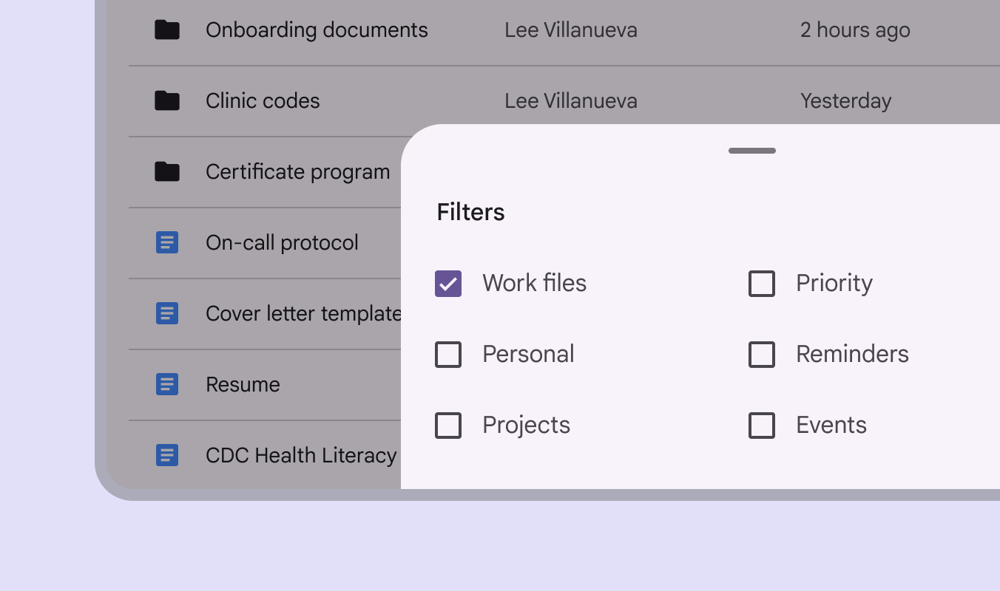

*Bottom sheets on larger screens like tablet have a max width that can be overridden*

On larger expanded window sizes (Window widths 840dp to 1199dp, such as a tablet or foldable in landscape orientation, or desktop. [More on expanded window size class](https://m3.material.io/m3/pages/applying-layout/expanded)), like desktop, a bottom sheet can be swapped for a side sheet (Side sheets show secondary content anchored to the side of the screen. [More on side sheets](https://m3.material.io/m3/pages/side-sheets/overview)) that shows similar content.

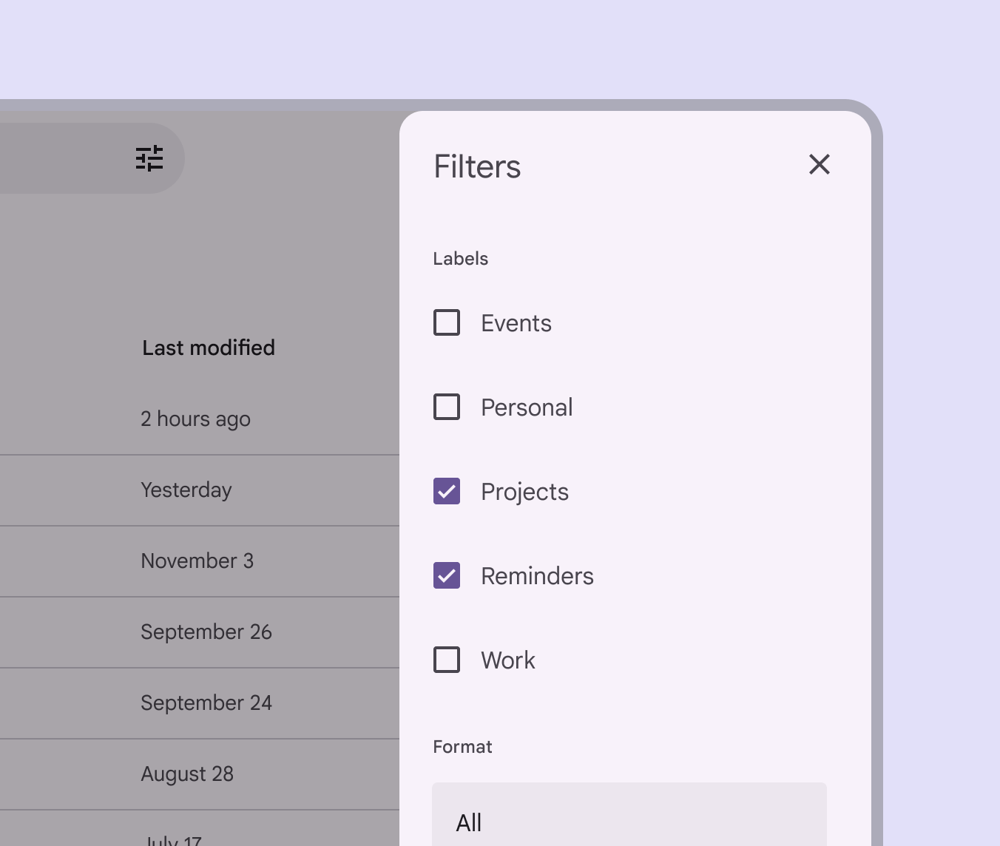

*Side sheets can contain the same content as bottom sheets and may be more suitable for desktop*

## Behavior

Bottom sheets can offer an expansion option where the sheet is fully raised and toggled between a collapsed and expanded state (States show the interaction status of a component or UI element. [More on states](https://m3.material.io/m3/pages/interaction-states/overview)). This provides a more predictable footprint of the sheet, and can be set by the system or toggled by the user.

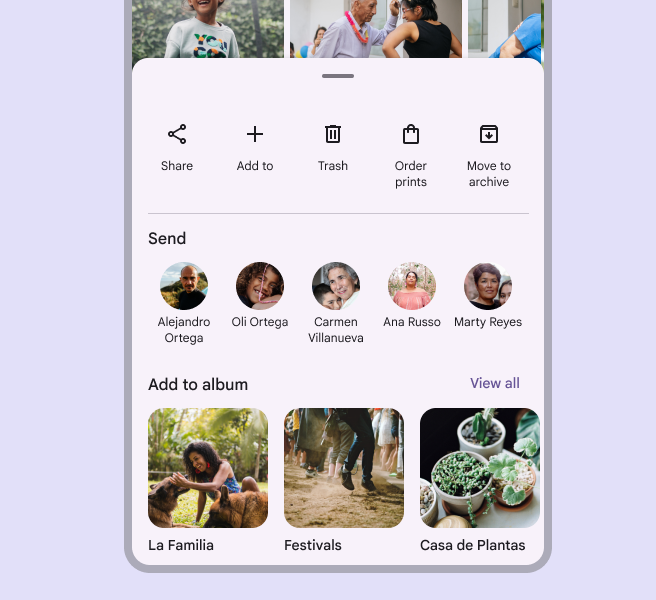

*A bottom sheet for sharing can appear fully raised if needed*

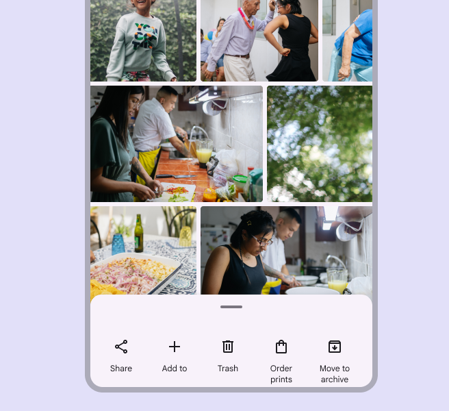

*Alternately, a bottom sheet for sharing can appear collapsed for a more focused set of actions*

### Custom positioning

The drag handle can be dragged or selected to change the bottom sheet height. Sheets should be able to cycle through preset heights and close completely without dragging. Selecting the drag handle should toggle through preset heights or close the sheet, while selecting the scrim should always close the bottom sheet. If the bottom sheet has multiple preset heights but can’t use a drag handle, Material requires the inclusion of a single-pointer alternative to change height.

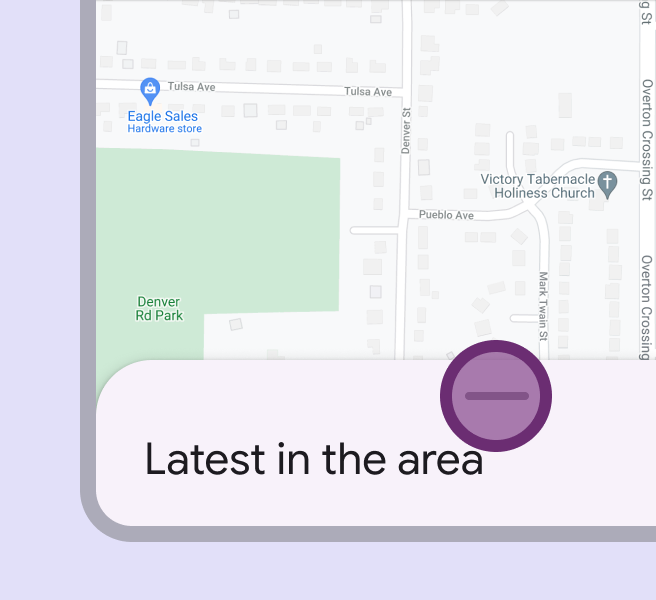

*Interacting with the drag handle can quickly move a bottom sheet through preset heights*

*A bottom sheet can automatically resize to another height after interacting with the drag handle*

### Scrolling

Bottom sheets can be horizontally scrolled, independent of the rest of the screen’s content.

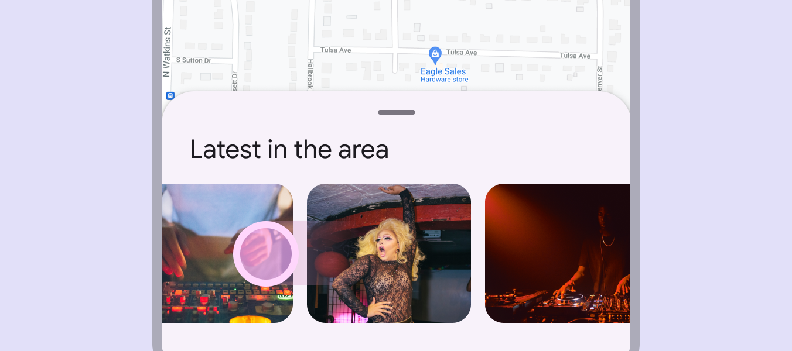

*Bottom sheets should be scrollable when their content exceeds the initial viewable height*

### Back

On Android, a gesture (Gestures are all the ways people interact with UI elements using touch. [More on gestures](https://m3.material.io/m3/pages/gestures)) called predictive back allows a user to swipe left or right on the bottom sheet.

- Bottom sheet detaches from the left and right edges of the screen to signal it will close
- Previous screen is revealed in a preview

A list of compatible components is available in the [gestures article](https://m3.material.io/m3/pages/gestures).

[Video: Back](assets/asset-024-preview-of-the-result-of-the-gesture-release-597c1f82f1.webp)

*Preview of the result of the gesture, release to commit, fling to commit, and cancel*
