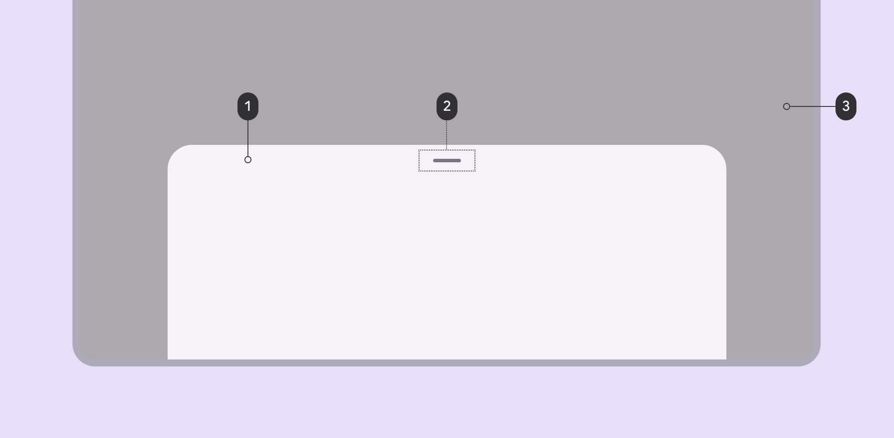
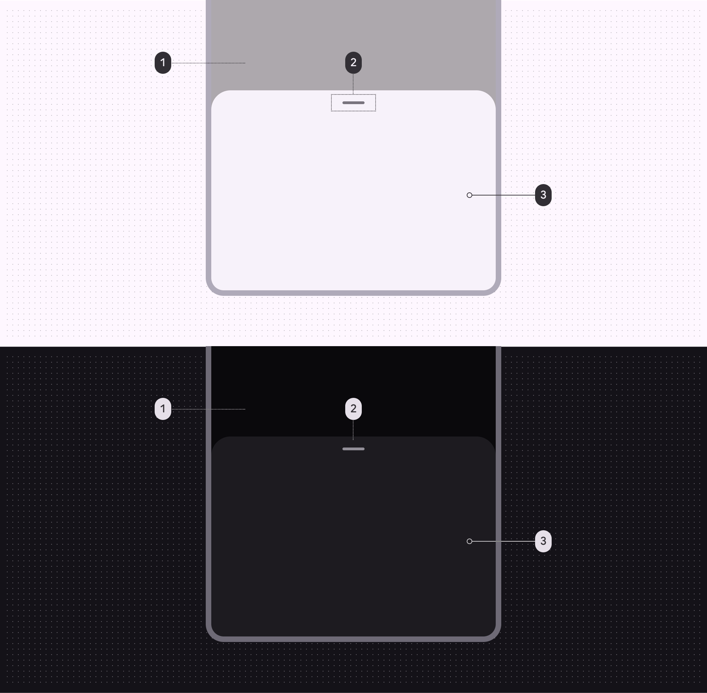
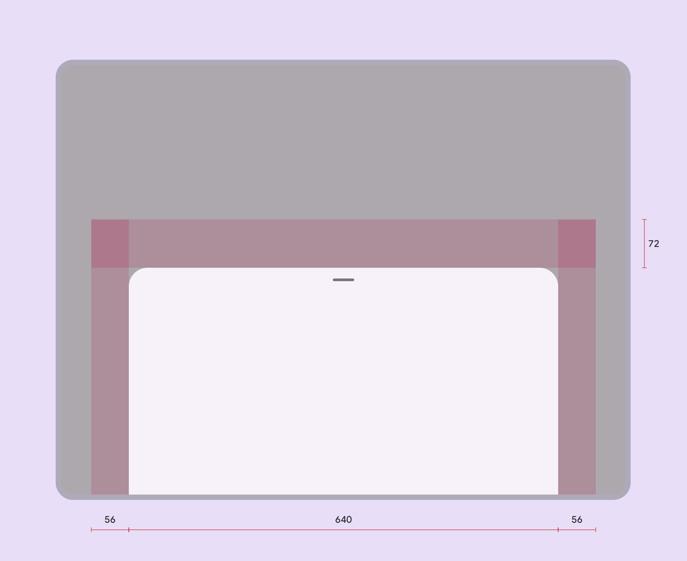

# Bottom sheets

Source: https://m3.material.io/components/bottom-sheets/specs

Modal bottom sheets (Modal bottom sheets appear in front of app content, disabling all other app functionality when they appear, and remaining on screen until confirmed, dismissed, or a required action has been taken.) are above a scrim while standard bottom sheets (Standard bottom sheets display supplementary content without blocking access to the screen’s primary content, such as an audio player at the bottom of a music app.) don't have a scrim. Besides this, both variants of bottom sheets have the same specs.

*Container; Drag handle (optional); Scrim*

## Tokens and specs

Browse the component elements, attributes, tokens, and their values. [Learn more about design tokens](https://m3.material.io/m3/pages/design-tokens/overview)

- Columns: Token
- Visible groups: Enabled

## Color

Color values are implemented through design tokens (Design tokens are the building blocks of all UI elements. The same tokens are used in designs, tools, and code. [More on tokens](https://m3.material.io/m3/pages/design-tokens/overview)). For design, this means working with color values that correspond with tokens. For implementation, a color value will be a token that references a value. [Learn more about design tokens](https://m3.material.io/m3/pages/design-tokens/overview)

*Scrim*; On surface variant; Surface container low*

## Measurements

*Bottom sheet padding and size measurements*

Bottom sheets span the full window width up to 640dp. When the window width exceeds 640dp, bottom sheets adjust to have a top margin of 56dp and side margins of 56dp.

| Attribute | Value |
| --- | --- |
| Drag handle alignment (horizontal) | Center |
| Drag handle padding top/bottom | 22dp |
| Top margin | 72dp |
| Top margin (window width > 640dp) | 56dp |
| Start/end margin (window width > 640dp) | 56dp |
| Width | Full width, up to max-width 640dp |
| Height | Variable |
