# Buttons

Source: https://m3.material.io/components/buttons/specs

## Variants

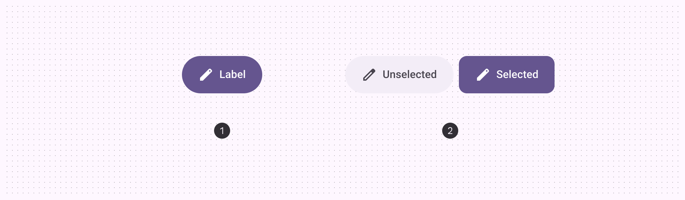

*Default button; Toggle button*

| Variant | M3 | M3 Expressive |
| --- | --- | --- |
| Default | Available | Available |
| Toggle (selection) | -- | Available |

## Configurations

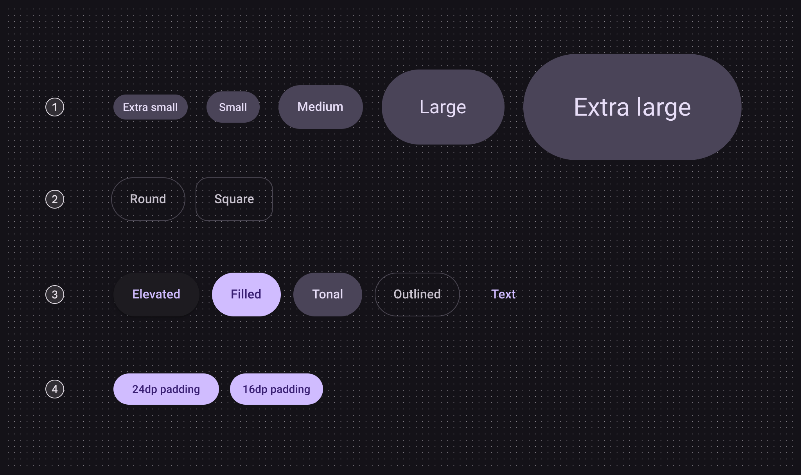

*Size; Shape; Color; Small button padding*

| Category | Configuration | M3 | M3 Expressive |
| --- | --- | --- | --- |
| Size | Small (default) | Available | Available |
| Size | XS, M, L, XL | -- | Available |
| Shape | Round (default) | Available | Available |
| Shape | Square | -- | Available |
| Color | Elevated, filled (default), tonal, outlined, text | Available | Available |
| Small button padding | 24dp | Available | Not recommended. Use 16dp |
| Small button padding | 16dp | -- | Available |

## Tokens & specs

Use the table's menu to select a token set. Button token sets are separated into common tokens, color, and size. [View baseline tokens](https://m3.material.io/google-material-3/pages/common-buttons/specs/#a89b82c2-d44e-4ccb-b519-2c62ed8d6ae4)

- Token sets: Button - Color - Elevated; Button - Color - Filled; Button - Color - Tonal; Button - Color - Outlined; Button - Color - Text; Button - Size - Xsmall; Button - Size - Small; Button - Size - Medium; Button - Size - Large; Button - Size - Xlarge
- Columns: Token
- Visible groups: Enabled; Disabled; Hovered; Focused; Pressed

## Anatomy

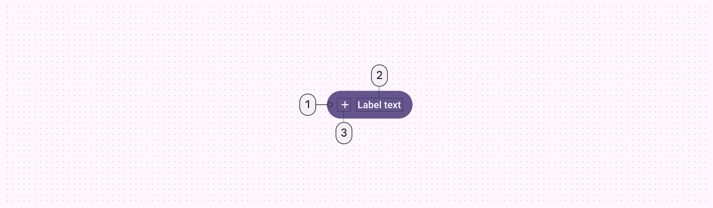

*Container; Label text; Icon (optional)*

## Color

Color values are implemented through design tokens (Design tokens are the building blocks of all UI elements. The same tokens are used in designs, tools, and code. [More on tokens](https://m3.material.io/m3/pages/design-tokens/overview)). For designers, this means working with color values that correspond with tokens. In implementation, a color value will be a token that references a value.

- There are five built-in button color styles: elevated, filled, tonal, outlined, and text
- The default and toggle buttons use different colors
- Toggle buttons don’t use the text style

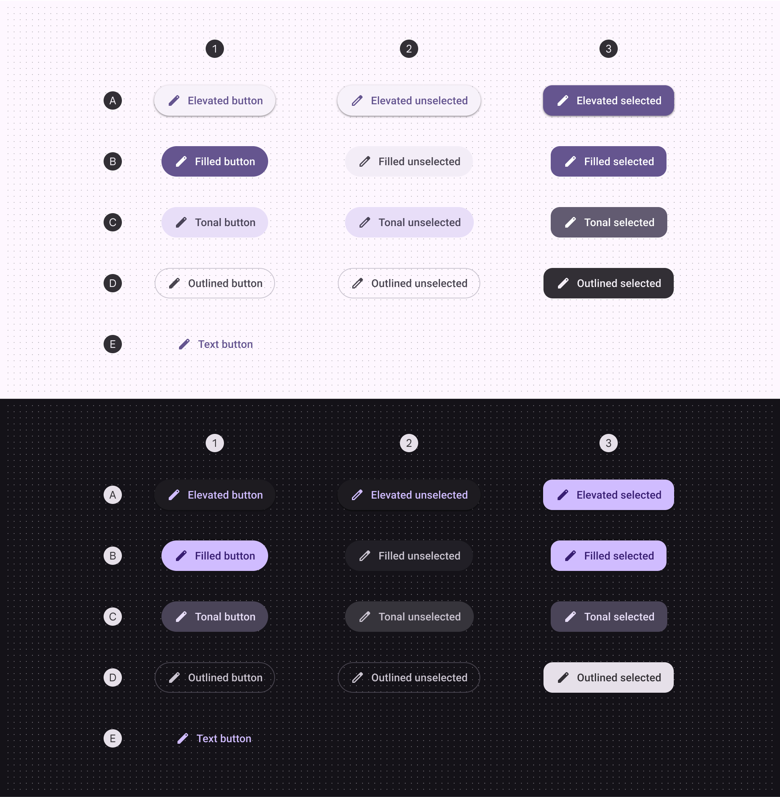

*Default; Toggle: unselected; Toggle: selected*

|  | 1. Default | 2. Toggle unselected | 3. Toggle selected |
| --- | --- | --- | --- |
| Elevated container Elevated icon & label | Surface container low Primary | Surface container low Primary | Primary On primary |
| Filled container Filled icon & label | Primary On primary | Surface container On surface variant | Primary On primary |
| Tonal container Tonal icon & label | Secondary container On secondary container | Secondary container On secondary container | Secondary On secondary |
| Outlined container Outlined icon & label | Outline variant (outline) On surface variant | Outline variant (outline) On surface variant | Inverse surface Inverse on surface |
| Text icon & label | Primary | -- | -- |

## States

States (States show the interaction status of a component or UI element. [More on states](https://m3.material.io/m3/pages/interaction-states/overview)) are visual representations used to communicate the status of a component or interactive element.

### Elevated button states

The elevated button style has an elevation of 1 by default and 0 when disabled.

#### Default

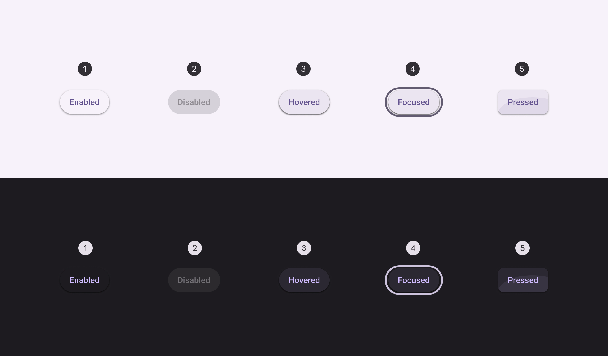

*Enabled; Disabled; Hovered; Focused; Pressed*

#### Toggle

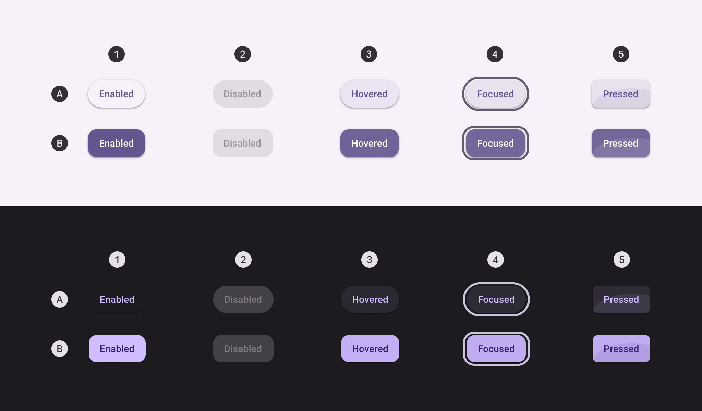

*Enabled; Disabled; Hovered; Focused; Pressed*

### Filled button states

#### Default

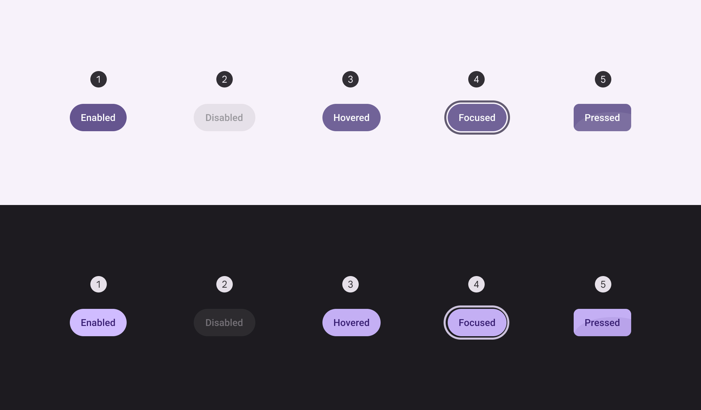

*Enabled; Disabled; Hovered; Focused; Pressed*

#### Toggle

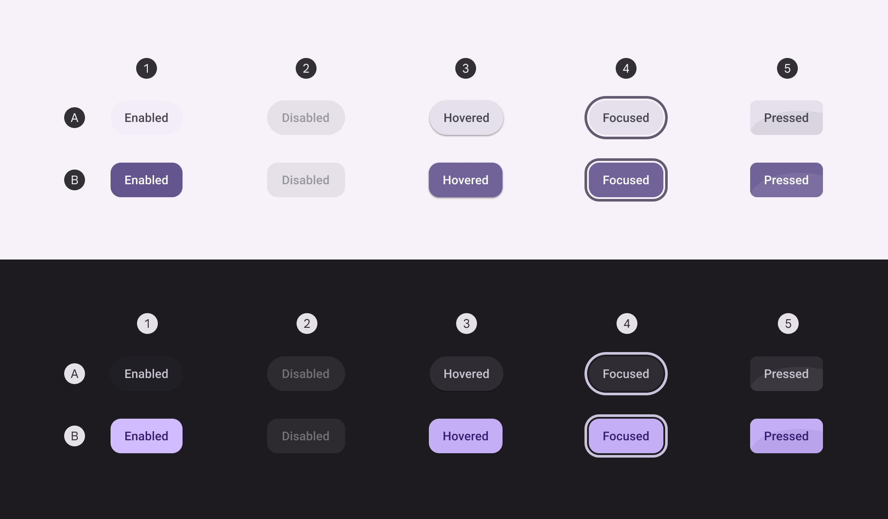

*Enabled; Disabled; Hovered; Focused; Pressed*

### Tonal button states

#### Default

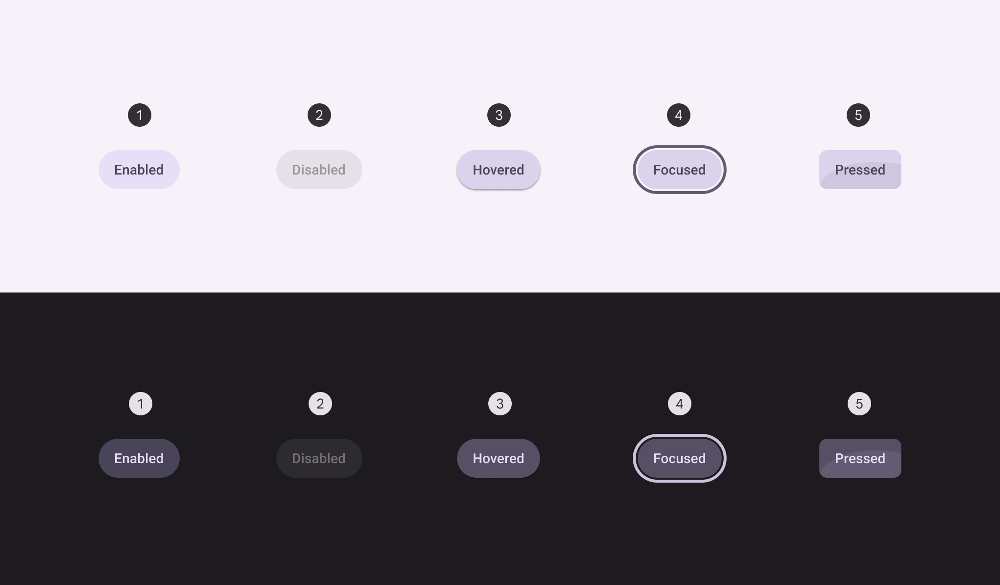

*Enabled; Disabled; Hovered; Focused; Pressed*

#### Toggle

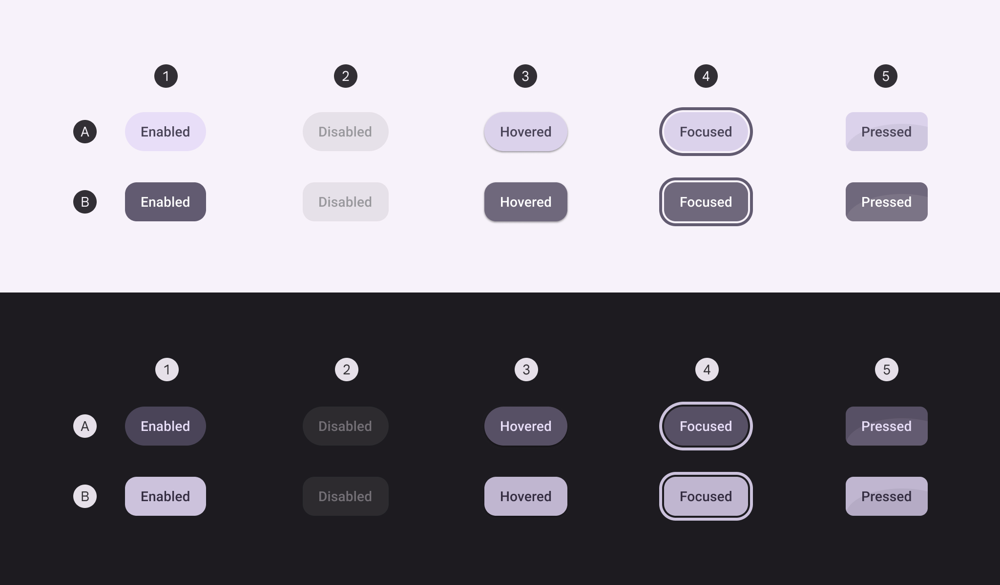

*Enabled; Disabled; Hovered; Focused; Pressed*

### Outlined button states

The outlined button’s container fill is invisible at rest, but the opacity and state layers behave the same as other button styles when disabled, hovered, focused, or pressed.

#### Default

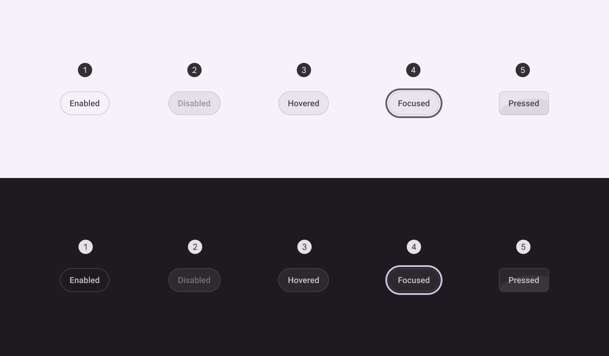

*Enabled; Disabled; Hovered; Focused; Pressed*

#### Toggle

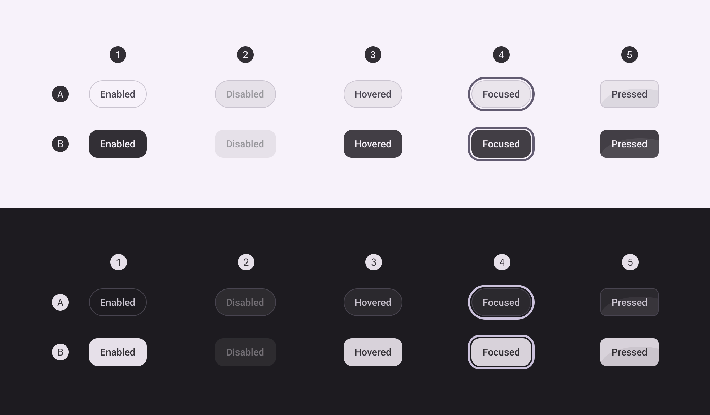

*Enabled; Disabled; Hovered; Focused; Pressed*

### Text button style states

The text button’s container is invisible at rest, but the opacity and state layers behave the same as other button styles when disabled, hovered, focused, or pressed. There is no toggle text button.

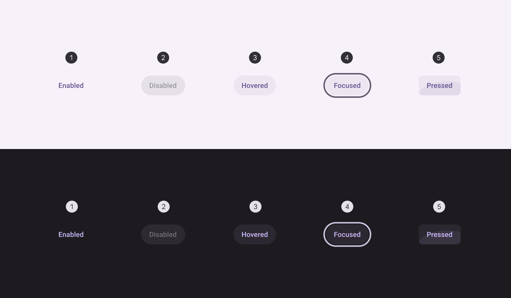

*Enabled; Disabled; Hovered; Focused; Pressed*

## Shape morph

### Pressed state

When pressed, buttons can morph to become more square. Both round and square buttons should have the same pressed shape.

The corner radius value differs for each button size. [See full button corner measurements](https://m3.material.io/m3/pages/common-buttons/specs#b1f39738-6f3a-409b-8f08-4cab6d78d756)

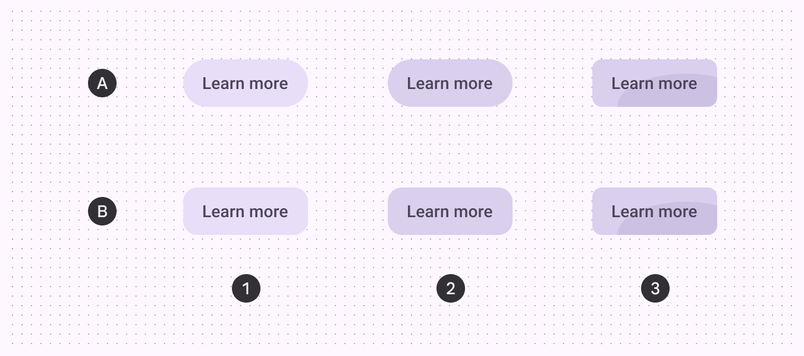

*Enabled; Hovered; Pressed*

### When selected

In addition to changing shape when pressed, toggle buttons also change the resting shape from round (unselected) to square (selected).

If the resting unselected shape is square, the selected shape should be round.

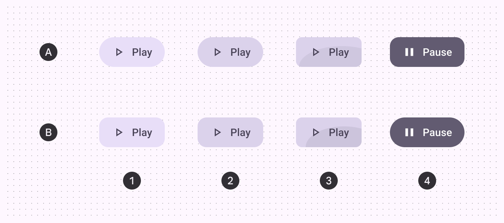

*Enabled; Hovered; Pressed; Selected*

## Measurements

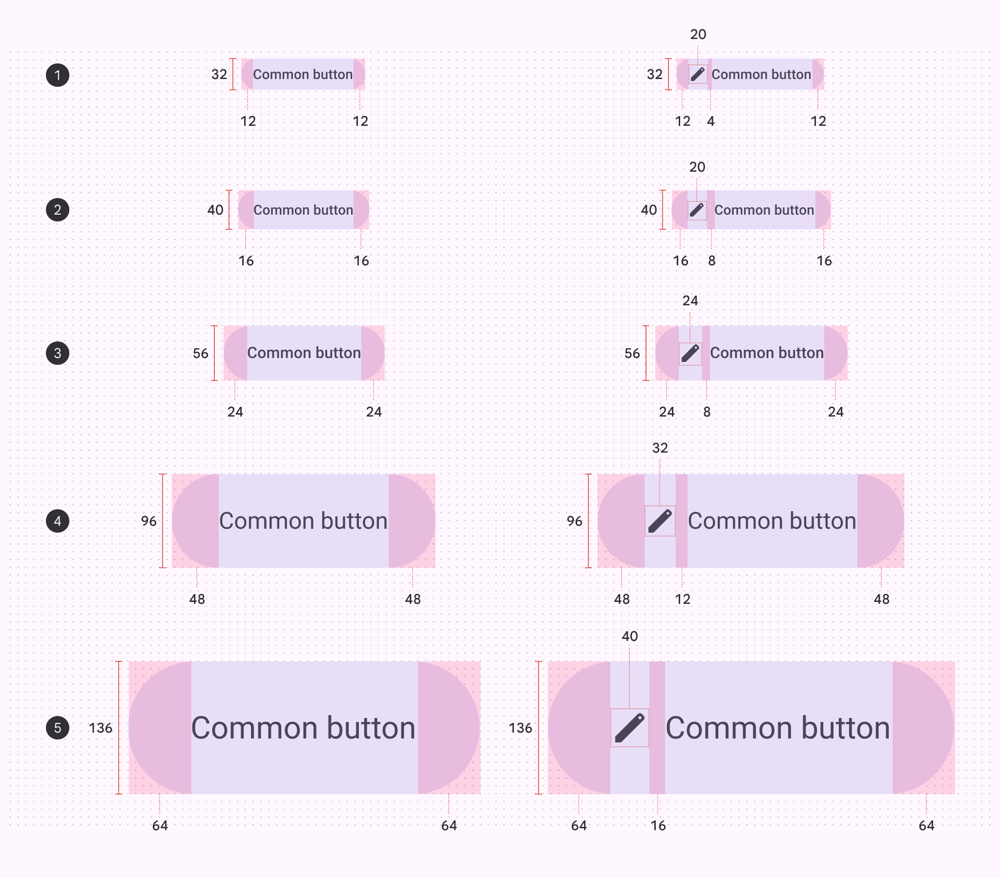

*Extra small; Small; Medium; Large; Extra large*

### Target areas

Extra small and small icon buttons must have a target size of 48x48dp or larger to be accessible.

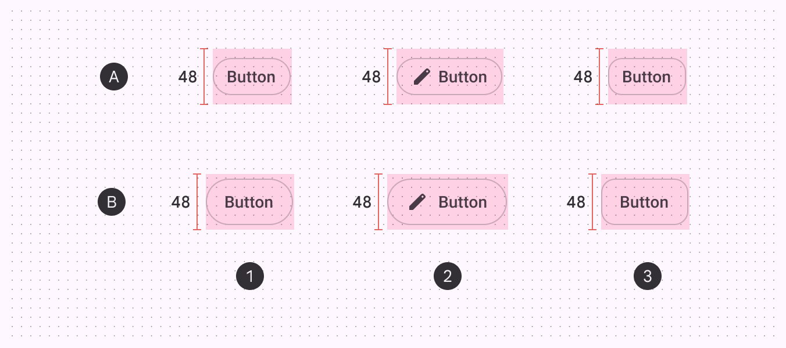

*Round button; Button with icon; Square button*

### Corner sizes

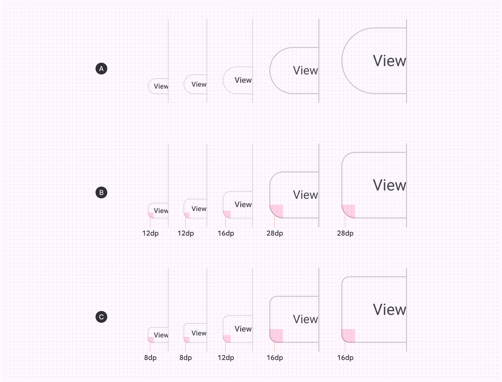

|  | XS | S | M | L | XL |
| --- | --- | --- | --- | --- | --- |
| A. Round button | Full | Full | Full | Full | Full |
| B. Square button | 12dp | 12dp | 16dp | 28dp | 28dp |
| C. Pressed state | 8dp | 8dp | 12dp | 16dp | 16dp |

## Baseline tokens

Use the table's menu to switch token sets. The baseline button token sets are organized by color.

- Token sets: [Deprecated] Button - Elevated; [Deprecated] Button - Filled; [Deprecated] Button - Tonal; [Deprecated] Button – Outlined; [Deprecated] Button - Text
- Columns: Token
- Visible groups: [Deprecated] Enabled; [Deprecated] Disabled; [Deprecated] Hovered; [Deprecated] Focused; [Deprecated] Pressed (ripple)
