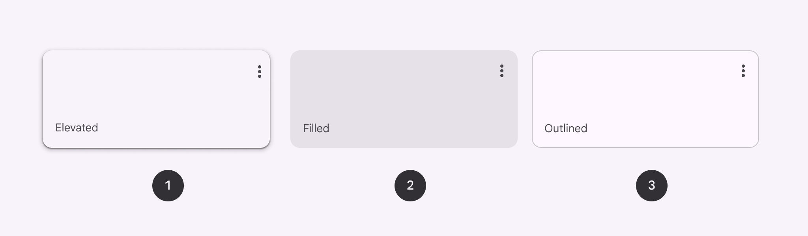

# Cards

Source: https://m3.material.io/components/cards/overview

- Use cards to contain related elements
- Three variants: elevated (Elevated cards have a drop shadow, providing more separation from the background than filled cards, but less than outlined cards), filled (Filled cards provide subtle separation from the background. This has less emphasis than elevated or outlined cards.), outlined (Outlined cards have a visual boundary around their container. This can provide greater emphasis than the other types.)
- Contents can include anything from images to headlines, supporting text, buttons (Buttons let people take action and make choices with one tap. [More on buttons](https://m3.material.io/m3/pages/common-buttons/overview)), and lists (Lists are continuous, vertical indexes of text and images. [More on lists](https://m3.material.io/m3/pages/lists/overview))
- Can also contain other components
- Cards have flexible layouts (Layout is the visual arrangement of elements on the screen. [More on layout](https://m3.material.io/m3/pages/understanding-layout/overview)) and dimensions based on their contents

*Elevated card; Filled card; Outlined card*

## Availability & resources

| Type | Resource | Status |
| --- | --- | --- |
| Design | [Design Kit (Figma)](https://www.figma.com/community/file/1035203688168086460) | Available |
| Implementation | [Flutter](https://api.flutter.dev/flutter/material/ThemeData/useMaterial3.html) | Available |
| Implementation | [MDC-Android](https://github.com/material-components/material-components-android/blob/master/docs/components/Card.md) | Available |
| Implementation | [Jetpack Compose](https://developer.android.com/develop/ui/compose/components/card) | Available |
| Implementation | Web | Unavailable |

## Differences from M2

- Color: New color mappings and compatibility with dynamic color (Dynamic color takes a single color from a user's wallpaper or in-app content and creates an accessible color scheme assigned to elements in the UI. [More on dynamic color](https://m3.material.io/m3/pages/dynamic-color/overview))
- Elevation: Lower elevation and no shadow by default
- Variants: Three official card variants – elevated (Elevated cards have a drop shadow, providing more separation from the background than filled cards, but less than outlined cards), filled (Filled cards provide subtle separation from the background. This has less emphasis than elevated or outlined cards.), and outlined (Outlined cards have a visual boundary around their container. This can provide greater emphasis than the other types.)

*Cards have updated colors, elevation, and variants*
