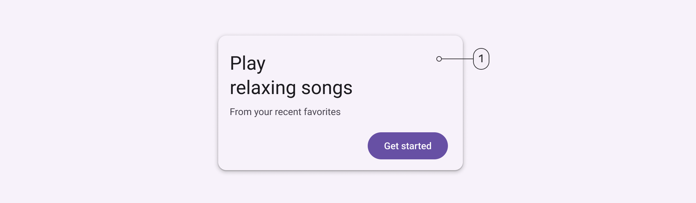
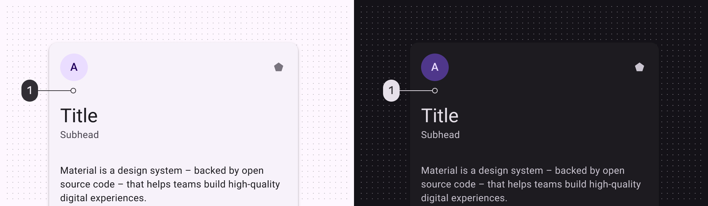
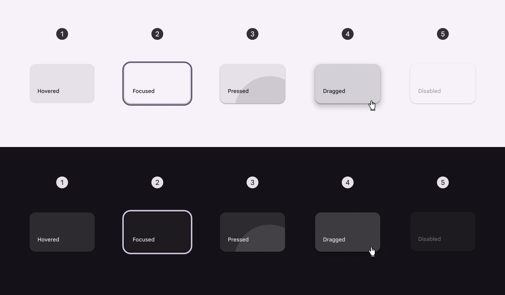
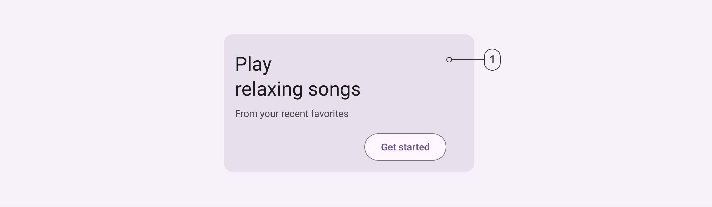
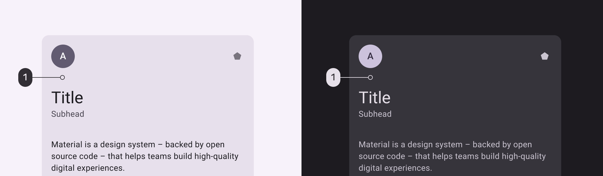
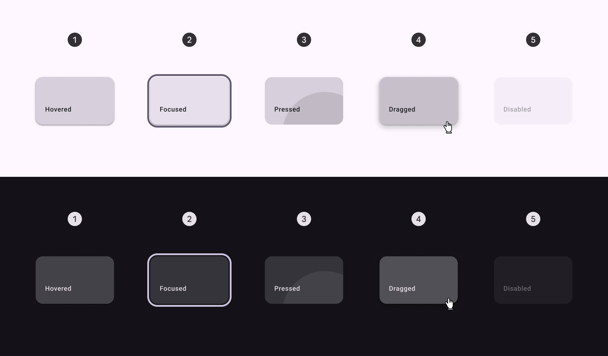
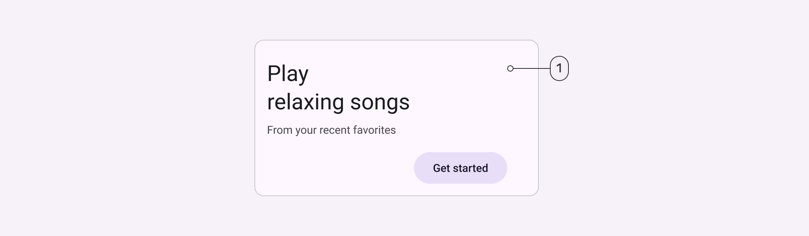
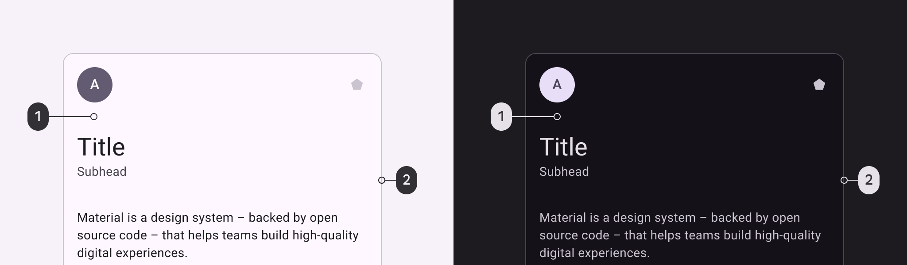
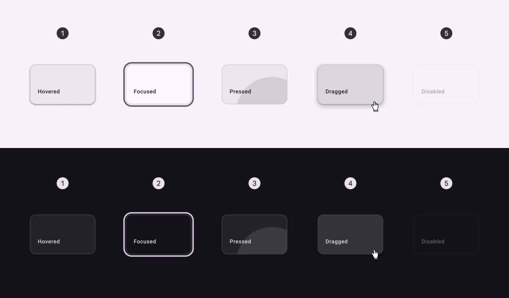
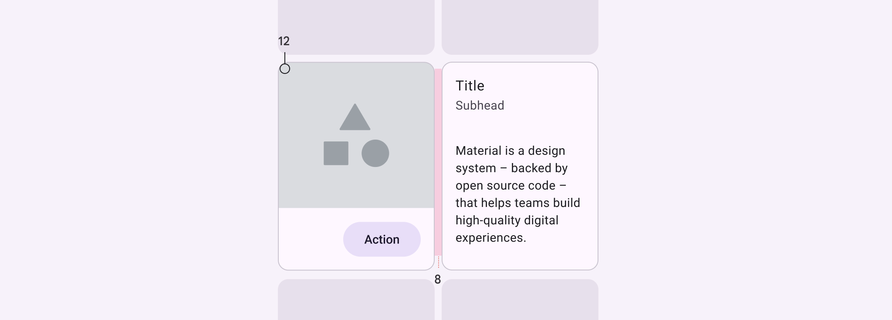

# Cards

Source: https://m3.material.io/components/cards/specs

## Tokens & specs

Select a component variant below to see its elements, attributes, tokens, and their values.

- Token sets: Card - Elevated; Card - Filled; Card - Outlined
- Columns: Token
- Visible groups: Enabled; Disabled; Hovered; Focused; Pressed (ripple); Dragged

## Elevated card

*Container*

### Elevated card color

Color values are implemented through design tokens. For design, this means working with color values that correspond with tokens. For implementation, a color value will be a token that references a value. [Learn more about design tokens](https://m3.material.io/m3/pages/design-tokens/overview/)

*Surface container low*

### Elevated card states

States are visual representations used to communicate the status of a component or interactive element. [Learn more about interaction states](https://m3.material.io/m3/pages/interaction-states)

*Hovered; Focused; Pressed; Dragged; Disabled*

## Filled card

*Container*

### Filled card color

Color values are implemented through design tokens. For design, this means working with color values that correspond with tokens. For implementation, a color value will be a token that references a value. [Learn more about design tokens](https://m3.material.io/m3/pages/design-tokens/overview/)

*Surface container highest*

### Filled card states

States are visual representations used to communicate the status of a component or interactive element. [Learn more about interaction states](https://m3.material.io/m3/pages/interaction-states)

*Hovered; Focused; Pressed; Dragged; Disabled*

## Outlined card

*Container; Outline*

### Outlined card color

Color values are implemented through design tokens. For design, this means working with color values that correspond with tokens. For implementation, a color value will be a token that references a value. [Learn more about design tokens](https://m3.material.io/m3/pages/design-tokens/overview/)

*Surface; Outline variant*

### Outlined card states

States are visual representations used to communicate the status of a component or interactive element. [Learn more about interaction states](https://m3.material.io/m3/pages/interaction-states)

*Hovered; Focused; Pressed; Dragged; Disabled*

## Measurements

*Card padding and size measurements*

| Attribute | Value |
| --- | --- |
| Shape | 12dp corner radius |
| Left/right padding | 16dp |
| Padding between cards | 8dp max |
| Label text alignment | Start-aligned |
