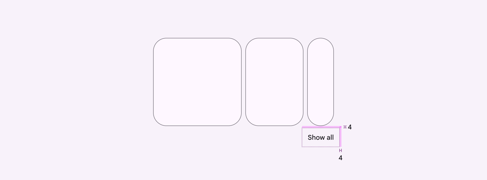
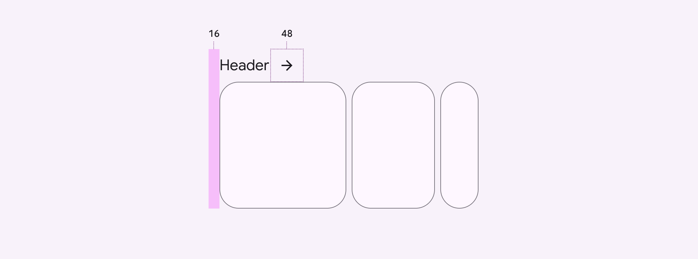
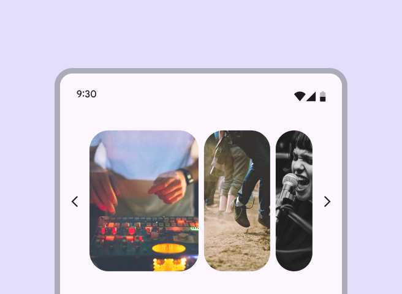
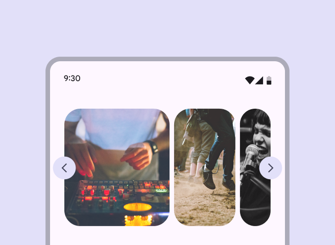
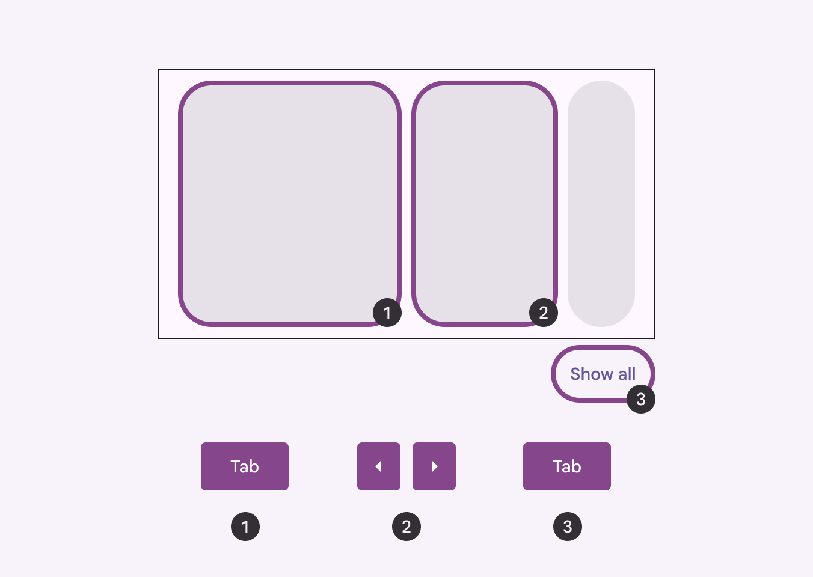
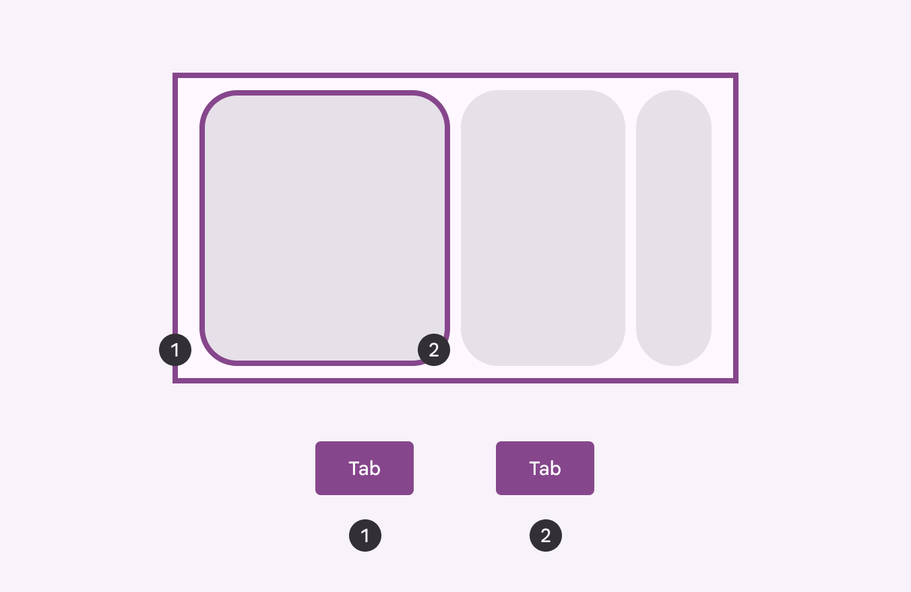
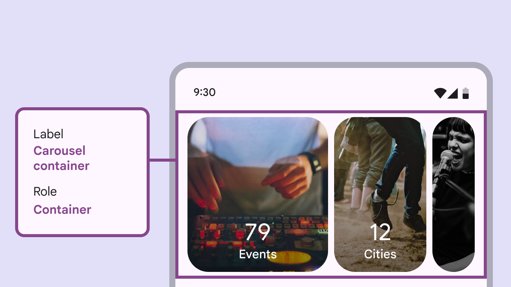
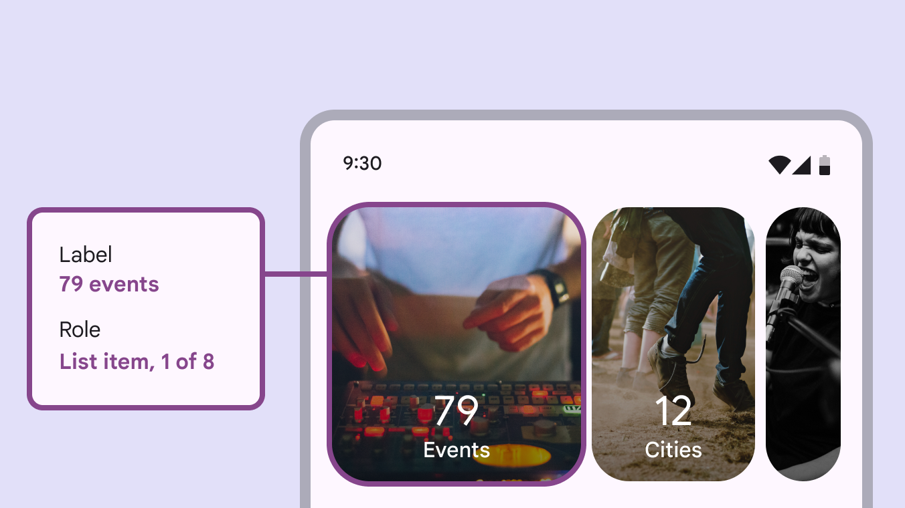

# Carousel

Source: https://m3.material.io/components/carousel/accessibility

## Use cases

Users should be able to do the following with assistive technology:

- Navigate to the carousel container
- Navigate between different carousel items
- Activate a carousel item
- Skip over the carousel items

## Requirements on scrolling pages

On vertically-scrolling pages, carousels require an accessible way to view all the items without horizontally scrolling. (This requirement doesn't apply to full-screen carousels (The full-screen carousel layout shows one edge-to-edge large item at a time and scrolls vertically.).)

Material recommends adding a Show all button below the carousel, which opens a dedicated vertically-scrolling page of all carousel items.

[Video: Carousel on mobile has a "show all" button that opens a page with all carousel items.](assets/asset-001-carousels-without-headers-should-use-a-show-all-c66190a38a.webp)

*Carousels without headers should use a Show all button to view all carousel items*

*The Show all button should have a padding of 4dp*

If the carousel has a header, you can use an arrow icon button instead. Place the arrow icon directly next to the header or in the same row.

Make sure the header is also displayed on the page of all carousel items.

[Video: Carousels in a list on mobile with headers have an arrow icon that opens a page with all carousel items.](assets/asset-003-carousels-with-headers-should-use-an-arrow-to-9adbacefbf.webp)

*Carousels with headers should use an arrow to view all carousel items*

*Headers should align with the leading edge, and the arrow icon should have a size of 48dp*

Avoid customizing the accessibility solution when possible. However, if your product needs an alternative solution, consider adding a Show all button in nearby navigation, or add alternative control buttons close to the carousel.

Avoid adding UI elements, like arrows or other icons, within or beside the carousel.

*Don’t Avoid adding buttons into the carousel container or beside it. Place any buttons above or below the carousel.*

*Don’t Don't cover the carousel with buttons or other UI*

## Interaction & style

### Touch

Tapping on a carousel item changes the shape slightly, and creates a touch ripple for interaction feedback.

[Video: Carousel providing a ripple feedback when being tapped.](assets/asset-007-touch-tap-63cb262d8f.webp)

*Touch: Tap*

### Cursor

The hover state (A hover state communicates when a user has placed a cursor above an interactive element. [More on hover state](https://m3.material.io/m3/pages/interaction-states/applying-states#71c347c2-dd75-485b-892e-04d2900bd844)) provides a visual cue that the carousel item is interactive.

When the carousel item is clicked (in both active and inactive states), a ripple appears for interaction feedback.

[Video: Carousel changing state when hovered.](assets/asset-008-cursor-hover-click-f375f33603.webp)

*Cursor: Hover, click*

### Initial focus

When navigating to a carousel using assistive technology, use Tab to place initial focus on the first carousel item. Then, use Tab or the arrow keys to navigate the carousel items.

Use the up and down arrow keys to leave the carousel and focus on the next element on the page, like the Show all button.

*Do Set initial focus on the first carousel item, and use arrows to navigate items*

*Don’t Avoid focusing on the carousel container*

## Keyboard navigation

| Keys | Actions |
| --- | --- |
| Tab or Arrows | Moves to the previous or next carousel item |
| Space or Enter | Activates the focused (A focused state communicates when a user has highlighted an element, using an input method such as a keyboard or voice. [More on focused state](https://m3.material.io/m3/pages/interaction-states/applying-states#bc6d6853-48ef-490e-8076-448e89e69f0f)) carousel item |

## Labeling elements

The carousel container has the container role.

*The carousel container is labelled appropriately and has the container role*

Each carousel may have a different number of items, so the label reads out the total amount of items and the current item in focus.

*The carousel item label indicates the current item in focus and the total number of items*

## Reduced motion

When reduced motion settings are turned on, the parallax effect should be removed and carousel items should no longer expand as they come into view. All items are the same size.

Make sure carousels with reduced motion reach the edges of the window to avoid clipping visuals.

[Video: Comparison of a multi-browse carousel with the reduced motion setting off and on.](assets/asset-013-default-carousel-for-multi-scroll-carousel-with-reduced-ef31e75036.webp)

*Default carousel for multi-scroll; Carousel with reduced motion settings turned on*

For hero carousels (The hero carousel layout shows at least one large and one small item at a time.) with reduced motion, the small carousel item is only partially shown on screen.

[Video: Comparison of a hero carousel with the reduced motion setting off and on.](assets/asset-014-default-carousel-for-single-scroll-carousel-with-reduced-75609f9666.webp)

*Default carousel for single-scroll; Carousel with reduced motion settings turned on*
