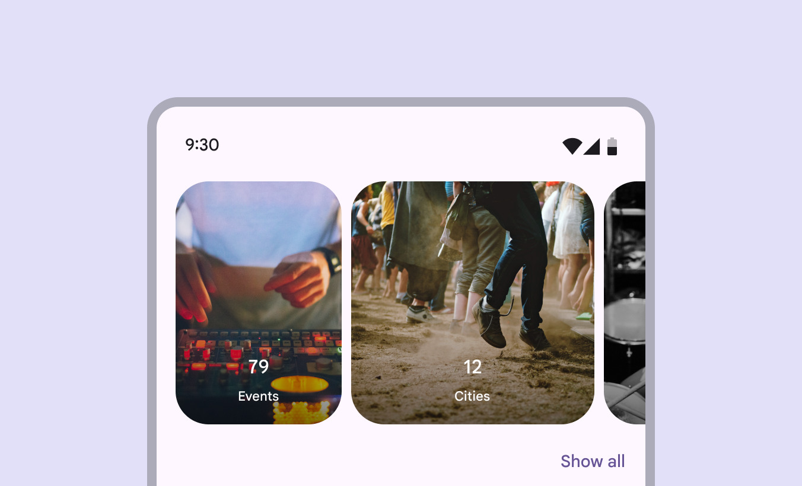
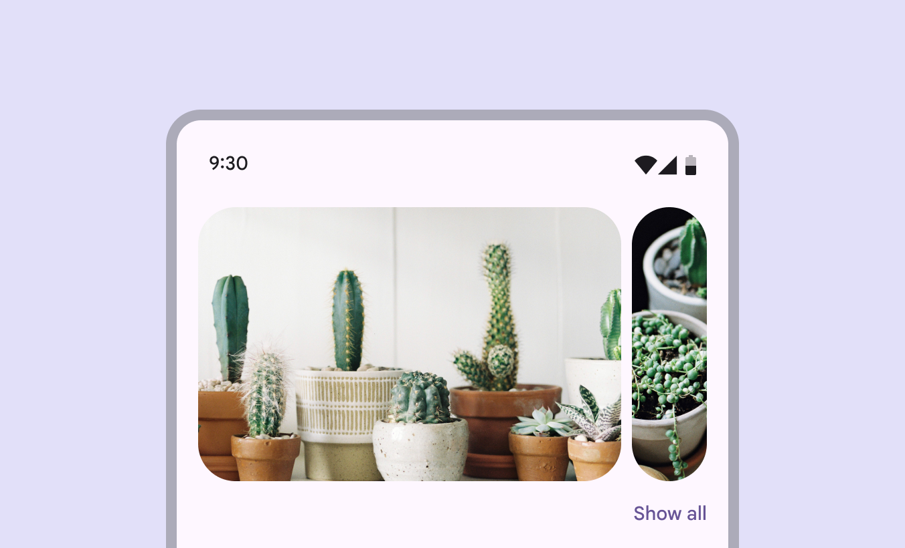

# Carousel

Source: https://m3.material.io/components/carousel/overview

- Contain visual items like images or video, along with optional label text
- Six layouts: Multi-browse (The multi-browse carousel layout shows at least one large, medium, and small carousel item at a time.), uncontained (The uncontained carousel layout show items that scroll to the edge of the container.), uncontained multi-aspect ratio (The uncontained multi-aspect ratio layout shows carousel items of various widths.), hero (The hero carousel layout shows at least one large and one small item at a time.), center-aligned hero (The center-aligned hero carousel layout shows at least one large and two small items at a time. The large item is centered.) and full-screen (The full-screen carousel layout shows one edge-to-edge large item at a time and scrolls vertically.)
- Layouts can be start-aligned or center-aligned
- Item visuals have a parallax effect when scrolled
- Items change size as they move through the carousel

[Video: A carousel being scrolled horizontally. Each carousel item changes shape as it scrolls.](assets/asset-001-carousels-can-show-items-of-various-sizes-c054be049a.webp)

*Carousels can show items of various sizes*

## Availability & resources

| Type | Resource | Status |
| --- | --- | --- |
| Design | [Design Kit (Figma)](https://www.figma.com/community/file/1035203688168086460) | Available |
| Implementation | [Flutter](https://api.flutter.dev/flutter/material/CarouselView-class.html) | Available |
| Implementation | [Jetpack Compose](https://developer.android.com/develop/ui/compose/components/carousel) | Available |
| Implementation | [MDC-Android](https://github.com/material-components/material-components-android/blob/master/docs/components/Carousel.md) | Available |
| Implementation | Web | Unavailable |

## Updates

November 2025

New carousel layout:

- Uncontained multi-aspect ratio (The uncontained multi-aspect ratio layout shows carousel items of various widths.)

2023

Additional layouts and configurations:

- Uncontained (The uncontained carousel layout show items that scroll to the edge of the container.)
- Full-screen (The full-screen carousel layout shows one edge-to-edge large item at a time and scrolls vertically.)
- Centered carousels (The center-aligned hero carousel layout shows at least one large and two small items at a time. The large item is centered.)
- Hero carousel layout (The hero carousel layout shows at least one large and one small item at a time.)
- Multi-browse layout (The multi-browse carousel layout shows at least one large, medium, and small carousel item at a time.)

*New carousel layout: uncontained multi-aspect ratio*

## Differences from M2

This component is new in Material 3.

- Shape: Dynamic carousel items change shape when scrolled
- Motion: Carousel items move at a different speed than their content, creating a parallax effect
- Interaction: When scrolled, carousel items snap into place to maintain the same layout. Hero carousels (The hero carousel layout shows at least one large and one small item at a time.) swipe through one item at a time. Multi-browse carousels (The multi-browse carousel layout shows at least one large, medium, and small carousel item at a time.) scroll through many items at once.

*Hero carousels scroll through one large item at a time*

## Research

The Material Research Team conducted two studies (quantitative and qualitative) with over 200 participants to understand their perspectives of five different carousel designs. The studies measured their understanding of how to interact with each carousel, their expectations of the number of items in each design, and how they expected carousels to be used.

Summary of findings:

- Participants thought carousels were a good way to explore many different kinds of content
- A previewed or squished item strongly indicated that there was more content to swipe through
- Participants expected around 10 items in a carousel that scrolled multiple items at once
- While some contexts were considered better for some carousel designs, all designs were considered similarly usable
