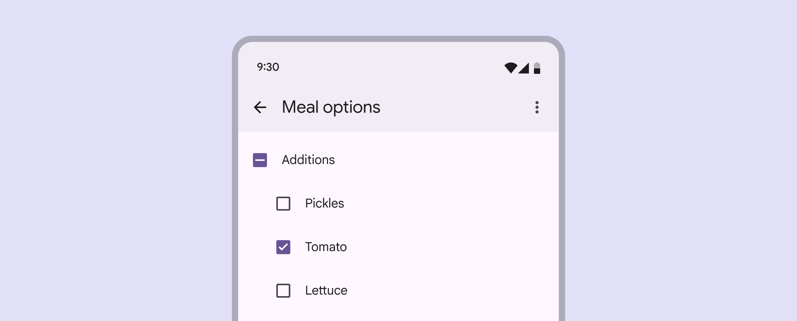
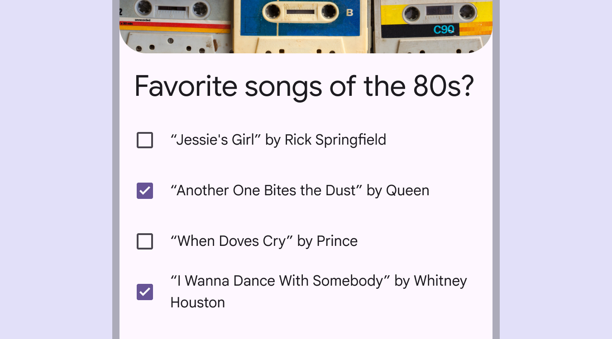
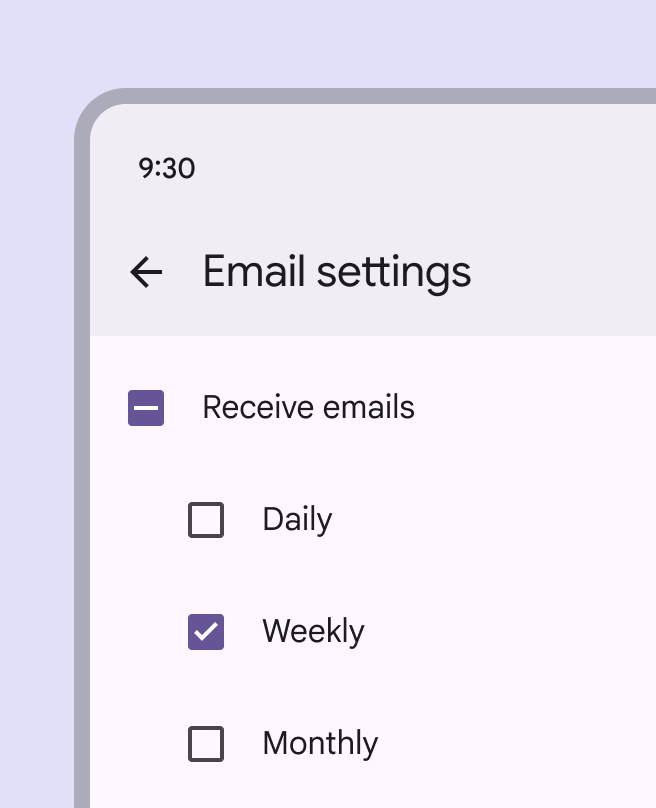
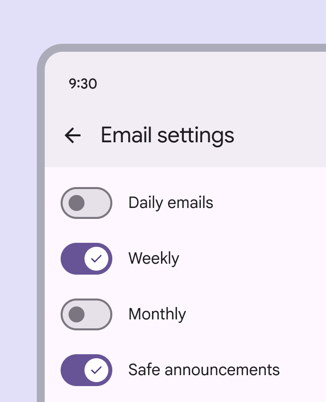
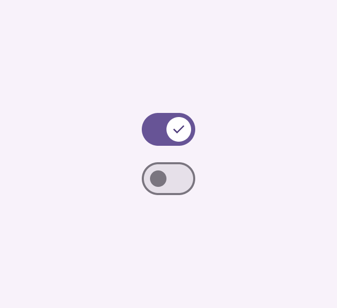
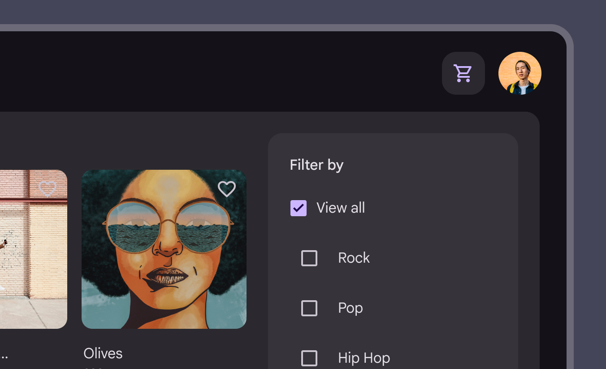

# Checkbox

Source: https://m3.material.io/components/checkbox/guidelines

*Checkboxes in a list of items*

## Usage

Use checkboxes to:

- Select one or more options from a list
- Present a list containing sub-selections
- Turn an item on or off in a desktop environment
- Visually group similar options together

*Checkboxes select multiple, related options*

Checkboxes should be used instead of switches (Switches toggle the state of an item on or off. [More on switches](https://m3.material.io/m3/pages/switch/overview)) if multiple, related options can be selected from a list. Checkboxes visually group similar items effectively and take up less space than switches.

*Do Checkboxes let users select one or more options from a list. A parent checkbox allows for easy selection or deselection of all items.*

*Don’t If a list consists of multiple options, don't use switches. Instead, use checkboxes. Checkboxes imply the items are related, and take up less visual space.*

### Alternate selection controls

Checkboxes, radio buttons (Radio buttons let people select one option from a set of options. [More on radio buttons](https://m3.material.io/m3/pages/radio-button/overview)), and switches (Switches toggle the state of an item on or off. [More on switches](https://m3.material.io/m3/pages/switch/overview)) are the three main selection controls. They all help people make choices, like selecting options or switching settings on or off.

- Use checkboxes to select multiple related options in a list.
- Use radio buttons to select a single option in a list.
- Use switches to select standalone or more verbose options in a list, like settings.

*Radio buttons*

*Switches*

## Anatomy

*1. Container 2. Icon*

## Responsive layout

In expanded window sizes (Window widths 840dp to 1199dp, such as a tablet or foldable in landscape orientation, or desktop. [More on expanded window size class](https://m3.material.io/m3/pages/applying-layout/expanded)), placing checkboxes within a contained region such as a side sheet (Side sheets show secondary content anchored to the side of the screen. [More on side sheets](https://m3.material.io/m3/pages/side-sheets/overview)) can help group related controls and available actions.

*A side sheet can group related controls on larger screens*

## Behavior

Multiple checkboxes in a list can be selected.

[Video: Using checkboxes to select a list of extra ingredients, like pickles and tomatoes, to add to a meal.](assets/asset-009-selecting-multiple-items-in-a-list-using-checkboxes-e53ba469ad.webp)

*Selecting multiple items in a list using checkboxes*

Checkboxes can have a parent-child relationship with other checkboxes.

- When the parent checkbox is checked, all child checkboxes are checked
- If a parent checkbox is unchecked, all child checkboxes are unchecked
- If some, but not all, child checkboxes are checked, the parent checkbox becomes an indeterminate checkbox. Checking an indeterminate checkbox checks all child items.

[Video: Checking parent checkbox also checks child items. Unchecking one child item makes parent indeterminate.](assets/asset-010-use-a-parent-checkbox-to-make-it-more-c0eb73a2b2.webp)

*Use a parent checkbox to make it more efficient to select many items*

When selected, a checkbox clearly and instantly communicates its selected state.

If used to turn something on or off, the action should be immediately executed.

[Video: Selecting a checkbox for turning on dark mode immediately changes the phone theme.](assets/asset-011-turning-an-item-on-or-off-using-a-e7f8addd85.webp)

*Turning an item on or off using a checkbox*
