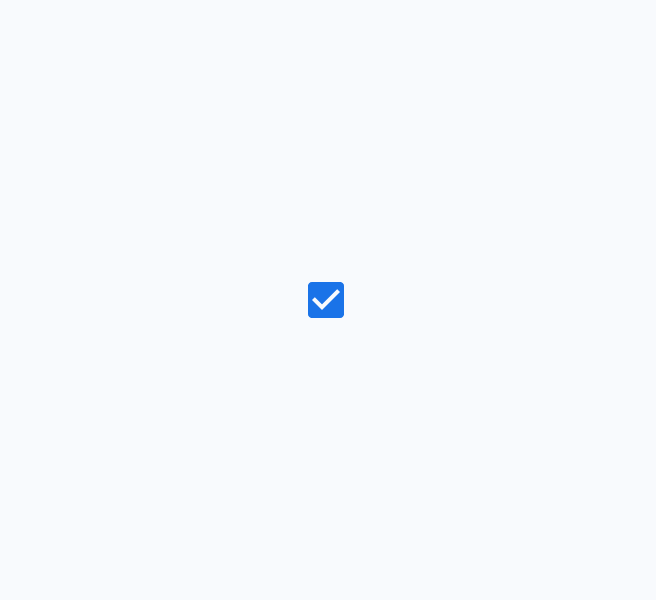

# Checkbox

Source: https://m3.material.io/components/checkbox/overview

- Use checkboxes (instead of switches (Switches toggle the state of an item on or off. [More on switches](https://m3.material.io/m3/pages/switch/overview)) or radio buttons (Radio buttons let people select one option from a set of options. [More on radio buttons](https://m3.material.io/m3/pages/radio-button/overview)) ) if multiple options can be selected from a list (Lists are continuous, vertical indexes of text and images. [More on lists](https://m3.material.io/m3/pages/lists/overview))
- Label should be scannable
- Selected items are more prominent than unselected items

*Unselected, selected (hover), and indeterminate checkboxes*

## Availability & resources

| Type | Resource | Status |
| --- | --- | --- |
| Design | [Design Kit (Figma)](https://www.figma.com/community/file/1035203688168086460) | Available |
| Implementation | [Flutter](https://api.flutter.dev/flutter/material/Checkbox-class.html) | Available |
| Implementation | [Jetpack Compose](https://developer.android.com/develop/ui/compose/components/checkbox) | Available |
| Implementation | [MDC-Android](https://github.com/material-components/material-components-android/blob/master/docs/components/Checkbox.md) | Available |
| Implementation | [Web](https://github.com/material-components/material-web/blob/main/docs/components/checkbox.md) | Available |

## Differences from M2

- Color: New color mappings and compatibility with dynamic color (Dynamic color takes a single color from a user's wallpaper or in-app content and creates an accessible color scheme assigned to elements in the UI. [More on dynamic color](https://m3.material.io/m3/pages/dynamic-color/overview))
- States (States show the interaction status of a component or UI element. [More on states](https://m3.material.io/m3/pages/interaction-states/overview)): New indeterminate states as well as error states for unselected, selected, and indeterminate

*M2*

*M3*
