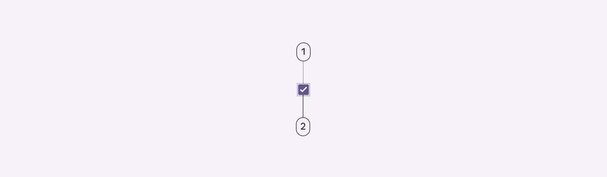
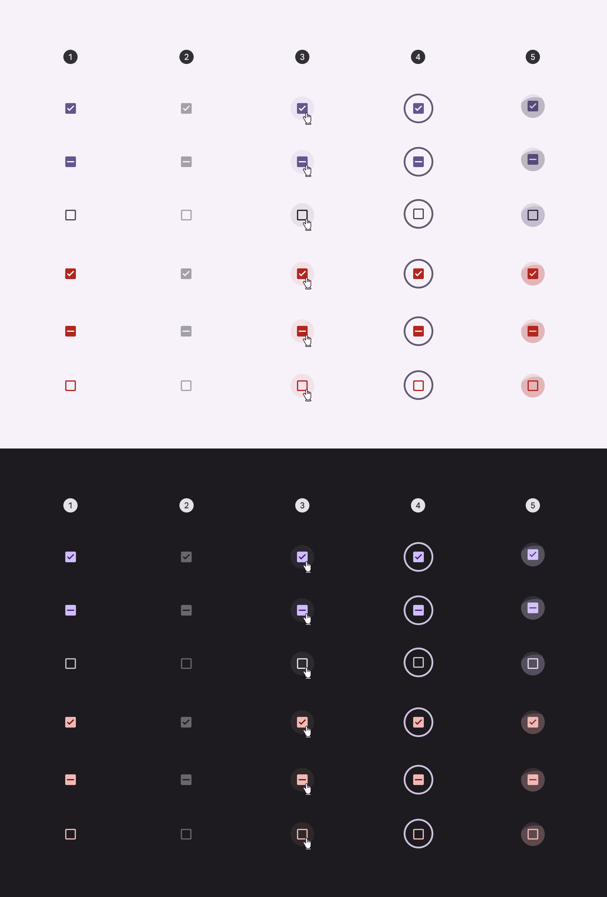
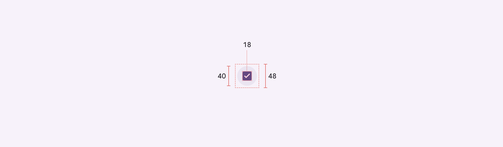

# Checkbox

Source: https://m3.material.io/components/checkbox/specs

## Tokens & specs

Browse the component elements, attributes, tokens, and their values.

- Columns: Token
- Visible groups: Enabled; Disabled; Hovered; Focused; Pressed (ripple)

## Checkbox

*Container; Icon*

## Color

Color values are implemented through design tokens (Design tokens are the building blocks of all UI elements. The same tokens are used in designs, tools, and code. [More on tokens](https://m3.material.io/m3/pages/design-tokens/overview)). For design, this means working with color values that correspond with tokens. For implementation, a color value will be a token that references a value. [Learn more about design tokens](https://m3.material.io/m3/pages/design-tokens/overview)

*Checkbox; State-layer; Icon*

### Adjacent text label color

Use the color role (Color roles are assigned to UI elements based on emphasis, container type, and relationship with other elements. This ensures proper contrast and usage in any color scheme.) on surface for adjacent text labels. This remains the same even if interacting with the label or component.

*The text color remains the same regardless if the checkbox is selected or not*

## States

States are visual representations used to communicate the status of a component or interactive element. [Learn more about interaction states](https://m3.material.io/m3/pages/interaction-states/overview)

*Enabled; Disabled; Hovered; Focused; Pressed*

## Measurements

| Attribute | Value |
| --- | --- |
| Container size | 18dp |
| Container corner shape | 2dp |
| Icon size | 18dp |
| Icon alignment | Center-aligned |
| Target size | 48dp |
| State-layer size | 40dp |
