# Chips

Source: https://m3.material.io/components/chips/specs

## Tokens & specs

Select a component variant below to see its elements, attributes, tokens, and values.

- Token sets: Chip - Assist; Chip - Filter; Chip - Input; Chip - Suggestion
- Columns: Token
- Visible groups: Enabled; Disabled; Hovered; Focused; Pressed (ripple); Dragged

## Assist chip

*Container; Label text; Leading icon*

### Assist chip color

Color values are implemented through design tokens (Design tokens are the building blocks of all UI elements. The same tokens are used in designs, tools, and code. [More on tokens](https://m3.material.io/m3/pages/design-tokens/overview)). For design, this means working with color values that correspond with tokens. For implementation, a color value will be a token that references a value. [Learn more about design tokens](https://m3.material.io/m3/pages/design-tokens/overview)

*Surface container low (optional); On surface; Outline; Primary*

### Assist chip states

States (States show the interaction status of a component or UI element. [More on states](https://m3.material.io/m3/pages/interaction-states/overview)) are visual representations used to communicate the status of a component or interactive element. [Learn more about interaction states](https://m3.material.io/m3/pages/interaction-states/overview)

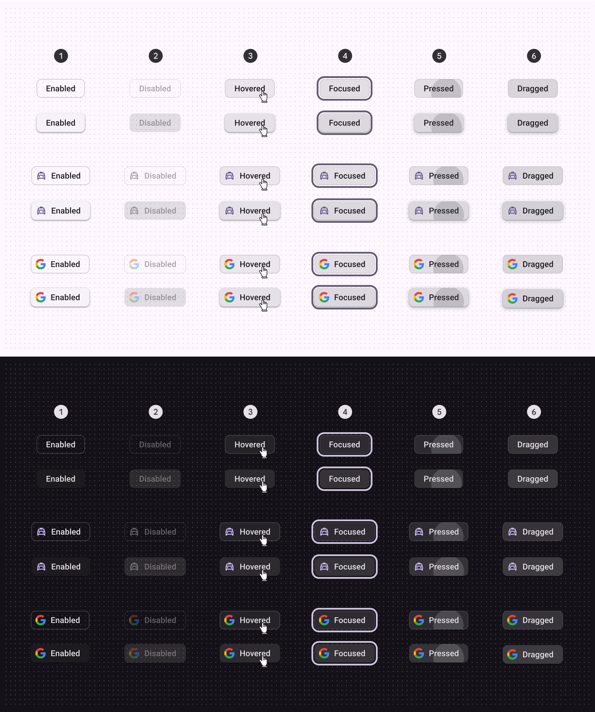

*Enabled; Disabled; Hovered; Focused; Pressed; Dragged*

### Assist chip measurements

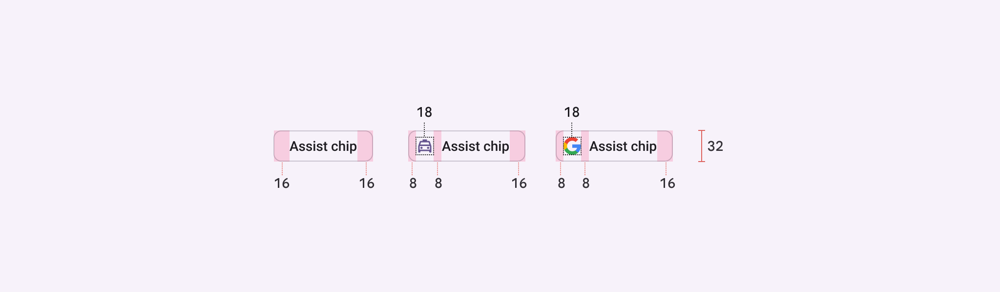

*Assist chip padding and size measurements*

| Attribute | Value |
| --- | --- |
| Height | 32dp |
| Shape | 8dp corner radius |
| Icon size | 18dp |
| Vertical label text alignment | Center-aligned |
| Horizontal label text alignment | Start-aligned |
| Left/right padding | 16dp |
| Left/right padding with icon | 8dp |
| Padding between elements | 8dp |

## Filter chip

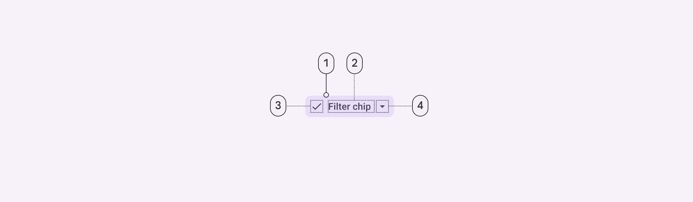

*Container; Label text; Leading icon; Trailing icon*

### Filter chip color

Color values are implemented through design tokens (Design tokens are the building blocks of all UI elements. The same tokens are used in designs, tools, and code. [More on tokens](https://m3.material.io/m3/pages/design-tokens/overview)). For design, this means working with color values that correspond with tokens. For implementation, a color value will be a token that references a value. [Learn more about design tokens](https://m3.material.io/m3/pages/design-tokens/overview)

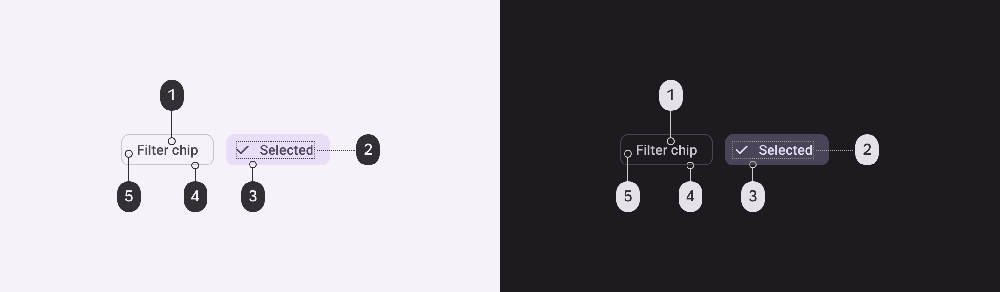

*On surface variant; On secondary container; Secondary container; Outline variant; Surface container low (optional)*

### Filter chip states

States (States show the interaction status of a component or UI element. [More on states](https://m3.material.io/m3/pages/interaction-states/overview)) are visual representations used to communicate the status of a component or interactive element. [Learn more about interaction states](https://m3.material.io/m3/pages/interaction-states/overview)

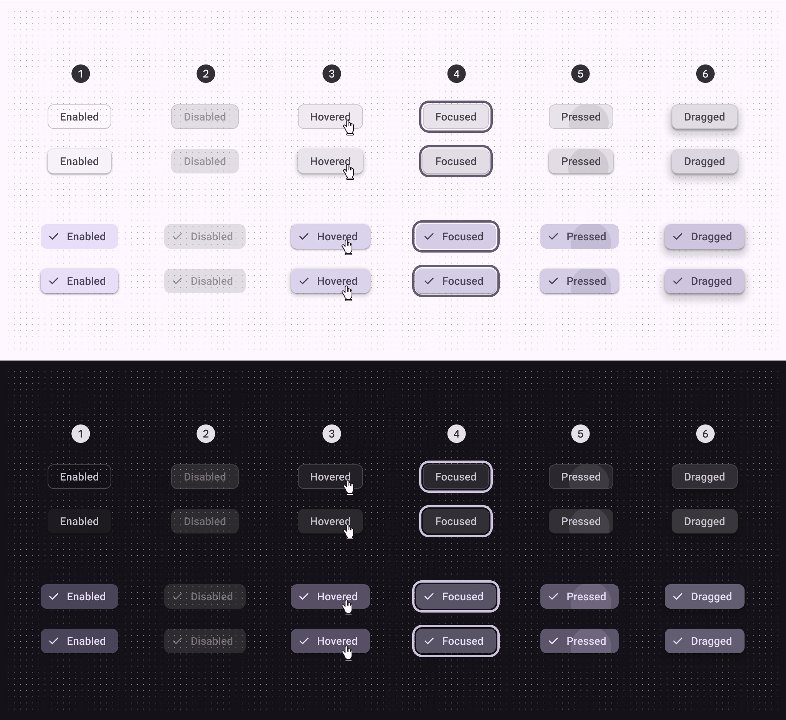

*Enabled; Disabled; Hovered; Focused; Pressed; Dragged*

### Filter chip measurements

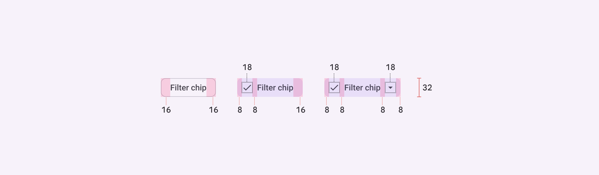

*Filter chip padding and size measurements*

| Attribute | Value |
| --- | --- |
| Container height | 32dp |
| Container shape | 8dp corner radius |
| Icon size | 18dp |
| Vertical label text alignment | Center-aligned |
| Horizontal label text alignment | Start-aligned |
| Left/right padding | 16dp |
| Left/right padding with icon | 8dp |
| Padding between elements | 8dp |

## Input chip

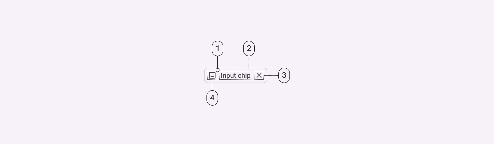

*Container; Label text; Trailing icon; Leading icon*

### Input chip color

Color values are implemented through design tokens (Design tokens are the building blocks of all UI elements. The same tokens are used in designs, tools, and code. [More on tokens](https://m3.material.io/m3/pages/design-tokens/overview)). For design, this means working with color values that correspond with tokens. For implementation, a color value will be a token that references a value. [Learn more about design tokens](https://m3.material.io/m3/pages/design-tokens/overview)

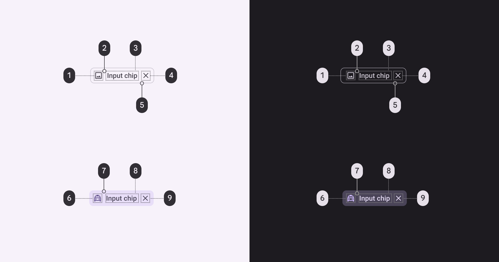

*On surface variant; Surface container low (optional); On surface variant; On surface variant; Outline variant; Primary; Secondary container; On secondary container; On secondary container*

### Input chip states

States (States show the interaction status of a component or UI element. [More on states](https://m3.material.io/m3/pages/interaction-states/overview)) are visual representations used to communicate the status of a component or interactive element. [Learn more about interaction states](https://m3.material.io/m3/pages/interaction-states/overview)

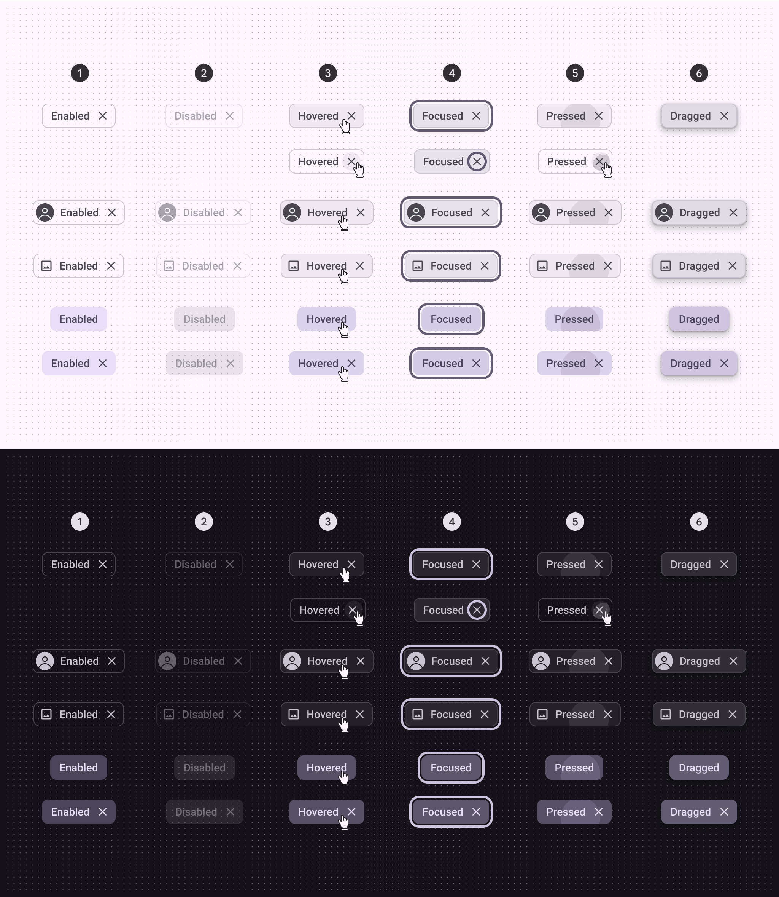

*Enabled; Disabled; Hovered; Focused; Pressed; Dragged*

### Input chip measurements

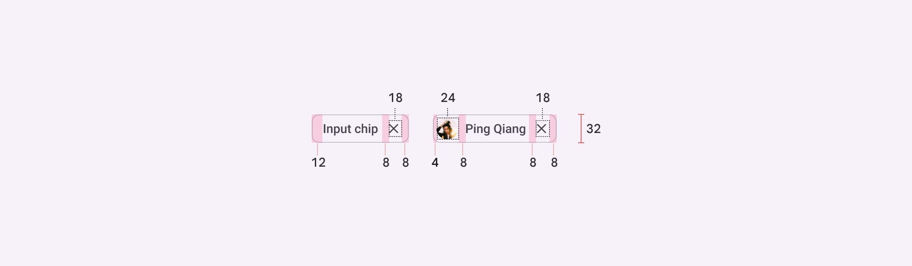

*Input chip padding and size measurements*

| Attribute | Value |
| --- | --- |
| Container height | 32dp |
| Container shape | 8dp corner radius |
| Icon size | 18dp |
| Avatar shape | 12dp corner radius |
| Avatar size | 24dp |
| Vertical label text alignment | Center-aligned |
| Horizontal label text alignment | Start-aligned |
| Left padding for avatar | 4dp |
| Right padding for avatar | 8dp |
| Left/right padding for icon | 8dp |
| Padding between elements | 8dp |
| Target size for close icon | Min 48dp |

## Suggestion chip

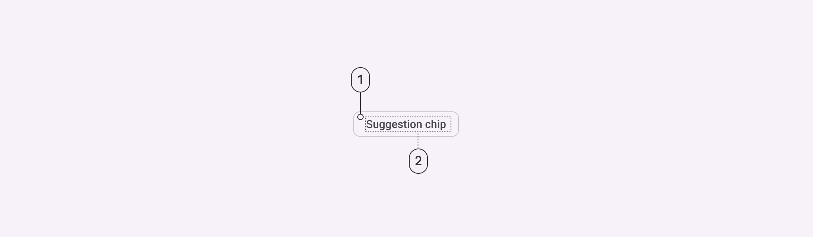

*Container; Label text*

### Suggestion chip color

Color values are implemented through design tokens (Design tokens are the building blocks of all UI elements. The same tokens are used in designs, tools, and code. [More on tokens](https://m3.material.io/m3/pages/design-tokens/overview)). For design, this means working with color values that correspond with tokens. For implementation, a color value will be a token that references a value. [Learn more about design tokens](https://m3.material.io/m3/pages/design-tokens/overview)

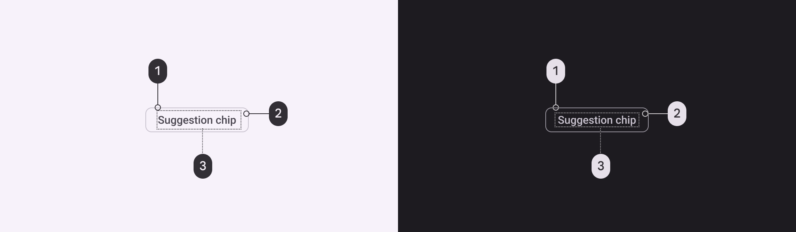

*Outline; Surface container low (optional); On surface variant*

### Suggestion chip states

States (States show the interaction status of a component or UI element. [More on states](https://m3.material.io/m3/pages/interaction-states/overview)) are visual representations used to communicate the status of a component or interactive element. [Learn more about interaction states](https://m3.material.io/m3/pages/interaction-states/overview)

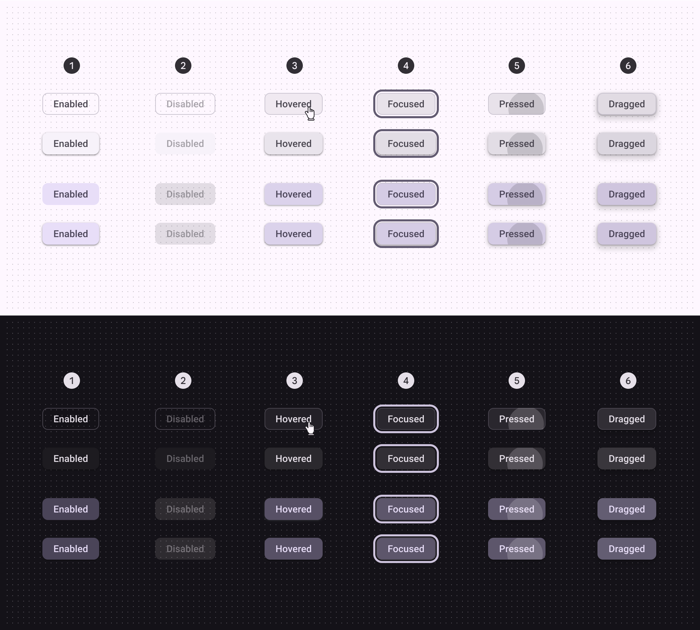

*Enabled; Disabled; Hovered; Focused; Pressed; Dragged*

### Suggestion chip measurements

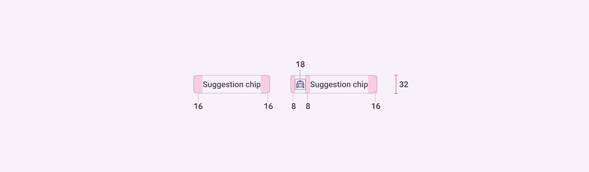

*Suggestion chip padding and size measurements*

| Attribute | Value |
| --- | --- |
| Container height | 32dp |
| Container shape | 8dp corner radius |
| Icon size | 18dp |
| Vertical label text alignment | Center-aligned |
| Horizontal label text alignment | Start-aligned |
| Left/right padding without icon | 16dp |
| Left/right padding with icon | 8dp |
| Padding between elements | 8dp |
