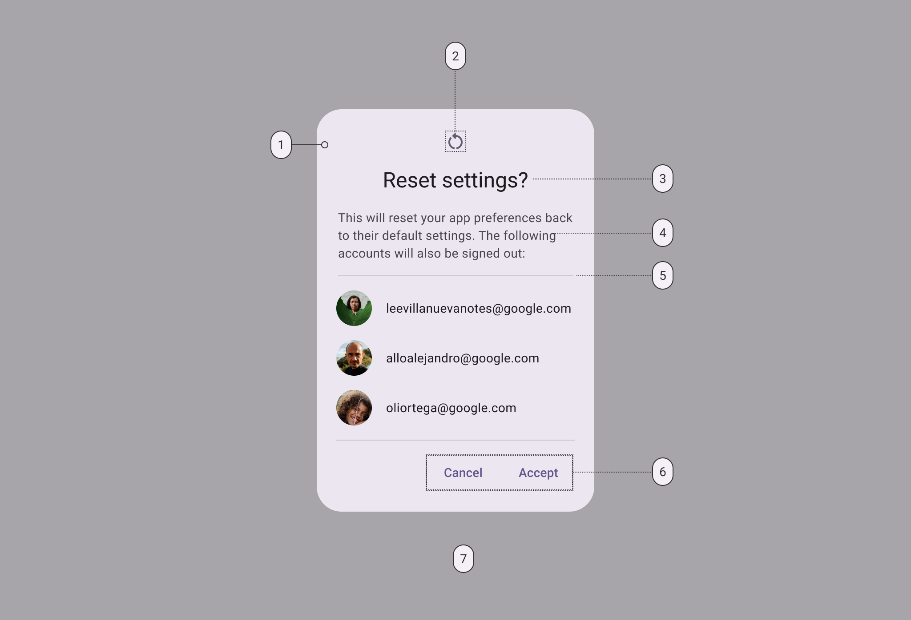
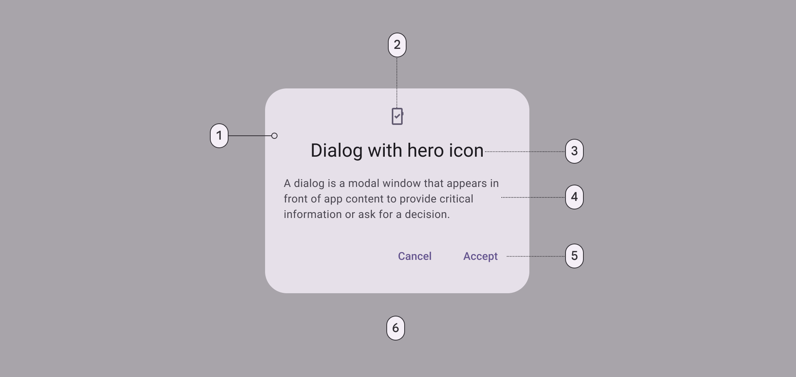
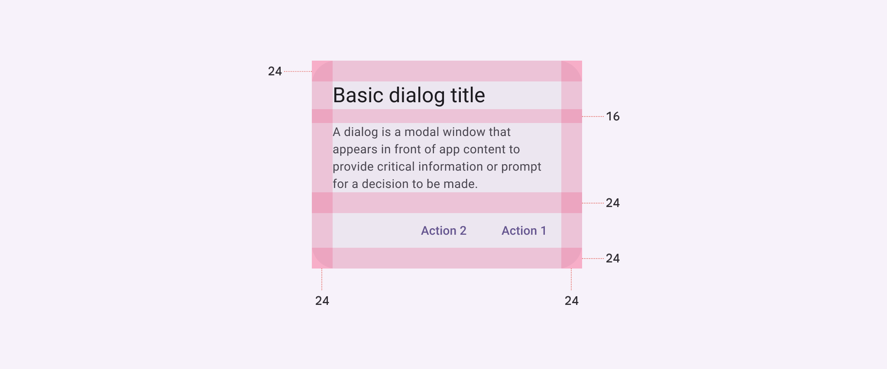
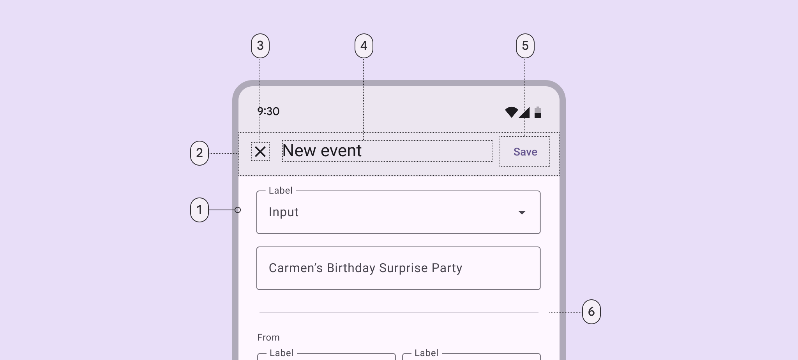
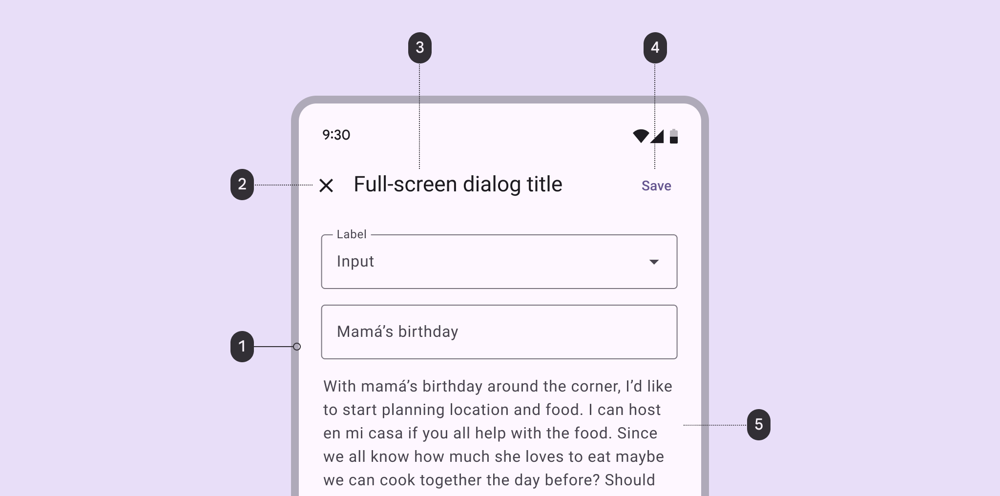
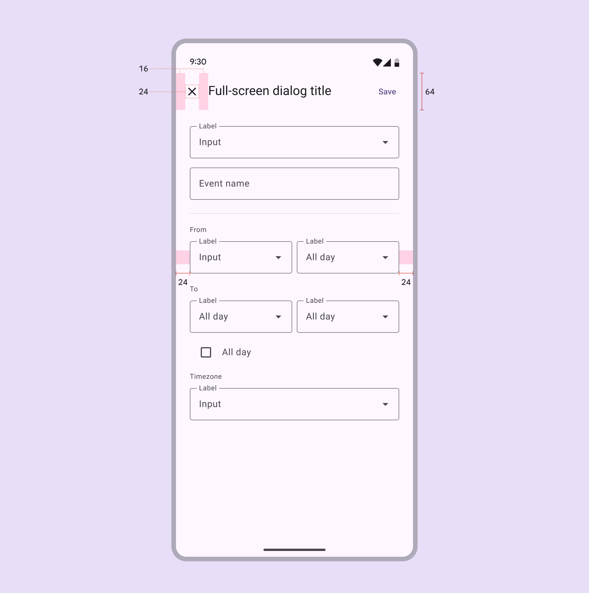

# Dialogs

Source: https://m3.material.io/components/dialogs/specs

## Tokens & specs

Select a component variant below to see its elements, attributes, tokens (Design tokens are the building blocks of all UI elements. The same tokens are used in designs, tools, and code. [More on tokens](https://m3.material.io/m3/pages/design-tokens/overview)), and their values.

- Token sets: Dialog - Basic; Dialog - Full screen
- Columns: Token
- Visible groups: Enabled; Hovered; Focused; Pressed (ripple)

## Basic dialogs

*Container; Icon (optional); Headline (optional); Supporting text; Divider (optional); Button label text; Scrim*

### Basic dialog color

Color values are implemented through design tokens (Design tokens are the building blocks of all UI elements. The same tokens are used in designs, tools, and code. [More on tokens](https://m3.material.io/m3/pages/design-tokens/overview)). For design, this means working with color values that correspond with tokens. For implementation, a color value will be a token that references a value. [Learn more about design tokens](https://m3.material.io/m3/pages/design-tokens/overview)

*Surface container high; Secondary; On surface; On surface variant; Primary; Scrim*

### Basic dialog measurements

*Basic dialog padding and size measurements*

| Attribute | Value |
| --- | --- |
| Container shape | 28dp corner radius |
| Container height | Dynamic |
| Container width | Min 280dp; Max 560dp |
| Divider height | 1dp |
| Icon size | 24dp |
| Minimum width | 280dp |
| Maximum width | 560dp |
| Alignment with icon | Center-aligned |
| Alignment without icon | Start-aligned |
| Top/Left/right/bottom padding | 24dp |
| Padding between buttons | 8dp |
| Padding between title and body | 16dp |
| Padding between icon and title | 16dp |
| Padding between body and actions | 24dp |

## Full-screen dialogs

*Container; Header; Icon (close affordance); Headline (optional); Text button; Divider (optional)*

### Full-screen dialog color

Color values are implemented through design tokens (Design tokens are the building blocks of all UI elements. The same tokens are used in designs, tools, and code. [More on tokens](https://m3.material.io/m3/pages/design-tokens/overview)). For design, this means working with color values that correspond with tokens. For implementation, a color value will be a token that references a value.

*Surface container high; On surface; On surface; Primary; On surface variant*

### Full-screen dialog measurements

*Full-screen dialog padding and size measurements*

| Attribute | Value |
| --- | --- |
| Container shape | 0dp corner radius |
| Container height | Dynamic |
| Container width | Container width; Max 560dp |
| Header height | 56dp |
| Header width | Container width |
| Headline text alignment | Start-aligned |
| Divider height | 1dp |
| Icon (close affordance) size | 24dp |
| Bottom action bar height | 56dp |
| Bottom action bar width | Container width |
| Top/left/right padding | 24dp |
| Padding between elements | 8dp |
