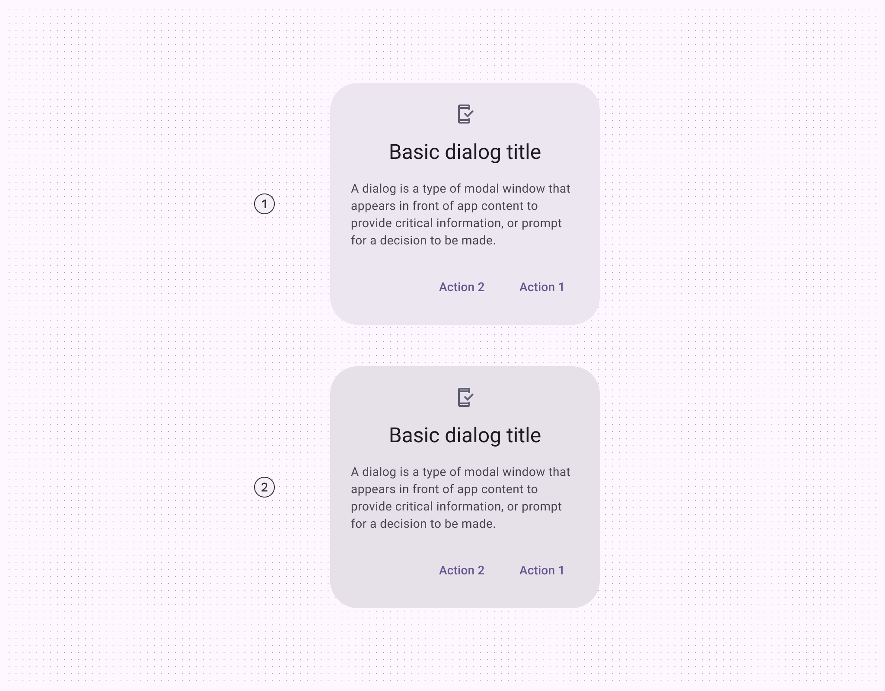
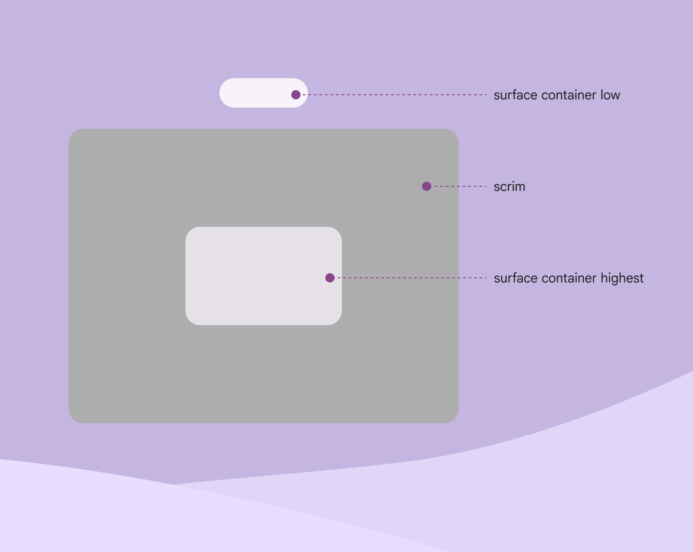
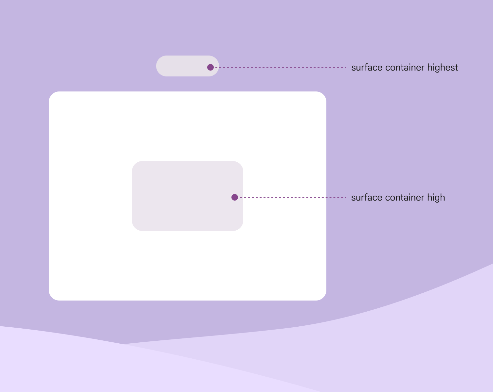
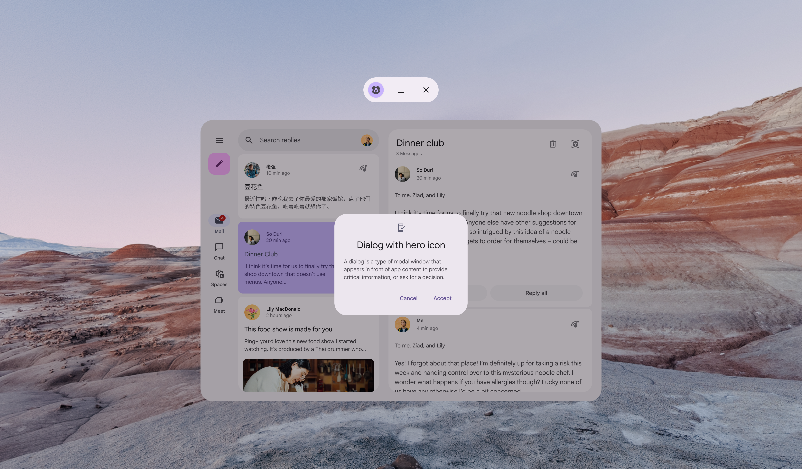
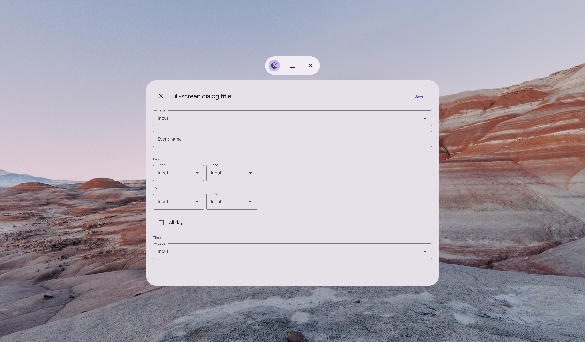
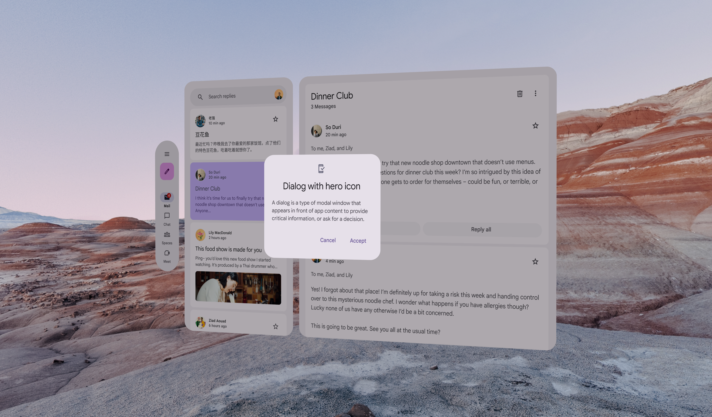

# Dialogs

Source: https://m3.material.io/components/dialogs/xr

Extended reality (XR) introduces spatial capabilities, such as using depth to make dialogs stand out from the background. Currently, spatial dialogs are only available in full space (Full space is Android XR’s immersive mode and supports spatial components. [More on full space](https://developer.android.com/design/ui/xr/guides/foundations#modes)). For home space (Home space is compatible with mobile and large screen apps, but doesn’t support spatial components. [More on home space](https://developer.android.com/design/ui/xr/guides/foundations#modes)), follow Material’s general [dialog guidance](https://m3.material.io/m3/pages/dialogs/guidelines#b33988d3-88e6-432c-acb1-4461a84171c9).

## Color & elevation

XR uses [color roles](https://m3.material.io/m3/pages/color-roles/tab-1#89f972b1-e372-494c-aabc-69aea34ed591) to communicate the elevation of UI elements. Dialogs can use two color options: surface container high or surface container highest.

*Surface container high; Surface container highest*

For effective visual hierarchy, a dialog should be the most prominent element. Add a scrim behind a dialog to improve its visibility. Scrims prevent other content from being selected until the dialog action is complete.

*Do Make sure a spatial dialog’s color is higher than all other UI elements, and use a scrim*

The dialog should have the highest elevation in the product.

For example, if a dialog is surface container high, don’t use surface container highest for any other elements.

*Don’t If a dialog’s color is surface container high, don’t use surface container highest for any other element*

## Usage

[Basic dialogs](https://m3.material.io/m3/pages/dialogs/guidelines#97ac3858-3932-4084-ae8e-73e42b7cb752) are recommended when designing for XR’s expanded window sizes. This keeps the required action in the person’s [field of view](https://developer.android.com/design/ui/xr/guides/spatial-ui#where-place). Limit use of [full-screen dialogs](https://m3.material.io/m3/pages/dialogs/guidelines#007536b9-76b1-474a-a152-2f340caaff6f) to compact window sizes, like mobile devices.

*Do A basic dialog elevated above an app in home space*

*Don’t Avoid using full-screen dialogs in XR. Required actions could appear beyond a person’s field of view.*

## Spatial dialogs

In full space (Full space is Android XR’s immersive mode and supports spatial components. [More on full space](https://developer.android.com/design/ui/xr/guides/foundations#modes)), dialogs can be elevated spatially (Spatial elevation displays a component above an app on the Z-axis. [More on spatial elevation](https://developer.android.com/design/ui/xr/guides/spatial-ui#spatial-elevation)) via [overrides](https://developer.android.com/develop/xr/jetpack-xr-sdk/material-design#use-enablexrcomponentoverrides). This helps dialogs stand out from their background in XR.

*Side view of a basic dialog with spatial elevation in full space*

## Behavior

### Effect

The spatial dialog should scale uniformly. It also fades in when appearing, and fades out when disappearing. The dialog's scrim only fades in and out.

[Video: A direct view of a spatial dialog appearing and disappearing.](assets/asset-007-front-view-of-a-spatial-dialog-in-motion-239581c6d2.webp)

*Front view of a spatial dialog in motion in full space*

### Movement

When activated, the spatial dialog rises from the app to the highest resting level on the Z-axis.

When the action is complete, it returns to a normal resting level.

The dialog's scrim stays at the app content level at all times. To prevent motion sickness, use [standard easing](https://m3.material.io/m3/pages/motion-easing-and-duration/tokens-specs#601d5552-a6e6-4d74-9886-ff8f24b9ec35) and [long duration](https://m3.material.io/m3/pages/motion-easing-and-duration/tokens-specs#48bf653e-46f9-48f5-87e0-eaf8ea3fe716) motion tokens.

[Video: A spatial dialog elevating on the Z-axis, as seen from a side angle.](assets/asset-008-side-view-of-a-spatial-dialog-in-motion-50916988f7.webp)

*Side view of a spatial dialog in motion in full space*

## Placement

Consider factors like field of view, viewing distance, and possible interactions when deciding where to place dialogs in XR.

### Elevation: highest resting level

Display spatial dialogs at the highest resting level. When setting the depth value of the highest resting level, make sure the elevated dialog is at a comfortable viewing distance from the person. [More on spatial elevation](https://developer.android.com/design/ui/xr/guides/spatial-ui#spatial-elevation)

[Video: An animated side view of a dialog moving from the lowest to the highest resting level.](assets/asset-009-a-spatial-dialog-moves-to-the-highest-resting-d4a1c254fd.webp)

*A spatial dialog moves to the highest resting level in full space*

### Center spatial dialogs in field of view

Spatial dialogs should be centered in a person’s [field of view](https://developer.android.com/design/ui/xr/guides/spatial-ui#where-place). If the dialog can't track head movements, position it in the center of the app’s content.

If the dialog can track head movements, configure it with a lazy follow behavior. This keeps the dialog anchored to the center of a person’s field of view until an action is taken.

[Video: A dialog follows a person’s head movements, remaining centered in their field of view.](assets/asset-010-a-dialog-in-full-space-stays-centered-in-a651eca69b.webp)

*A dialog in full space stays centered in a person’s field of view*

## Accessibility considerations

[XR accessibility](https://developer.android.com/design/ui/xr/guides/get-started#make-app) guidelines are still evolving. Spatial dialogs should follow applicable Material [dialog accessibility standards](https://m3.material.io/m3/pages/dialogs/accessibility).
