# Extended FABs

Source: https://m3.material.io/components/extended-fab/specs

## Variants

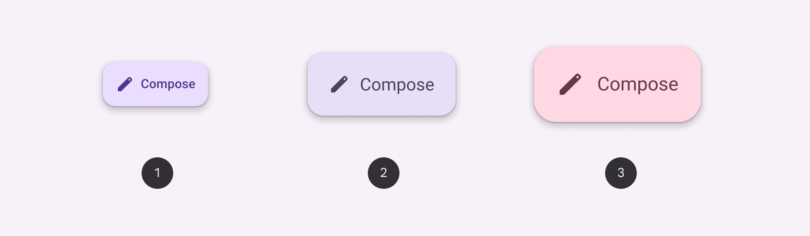

*Small extended FAB; Medium extended FAB; Large extended FAB*

### Baseline variants

The baseline extended FAB is no longer recommended in the M3 expressive update. Use a small extended FAB; the type style was updated from label large to title medium, and the inner padding was reduced. [View baseline extended FAB specs](https://m3.material.io/m3/pages/extended-fab/specs#01e114e6-8c3d-4d39-9376-65aa5c10e01b)

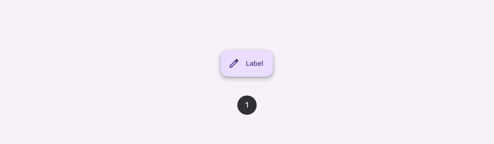

*Extended FAB*

| Variant | M3 | M3 Expressive |
| --- | --- | --- |
| Small extended FAB | -- | Available |
| Medium extended FAB | -- | Available |
| Large extended FAB | -- | Available |
| Extended FAB (baseline) | Available | Not recommended. Use small extended FAB. |

## Tokens & specs

Use the table's menu to select a token set. Extended FAB tokens are organized by size and color.

- Token sets: Extended FAB - Size - Small; Extended FAB - Size - Medium; Extended FAB - Size - Large; Extended FAB - Color - Tonal primary; Extended FAB - Color - Tonal secondary; Extended FAB - Color - Tonal tertiary; Extended FAB - Color - Primary; Extended FAB - Color - Secondary; Extended FAB - Color - Tertiary
- Columns: Token; Value

## Anatomy

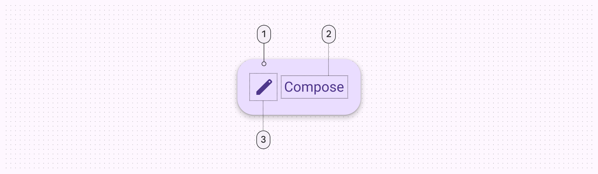

*Container; Label text; Icon*

## Color

Color values are implemented through design tokens. For design, this means working with color values that correspond with tokens. For implementation, a color value will be a token that references a value. [Learn more about design tokens](https://m3.material.io/m3/pages/design-tokens/overview/)

### Color styles

Extended FABs can use several combinations of color and on color styles, such as primary and on primary. The following color mappings provide the same level of contrast and functionality, so choose a color mapping based on visual preference.

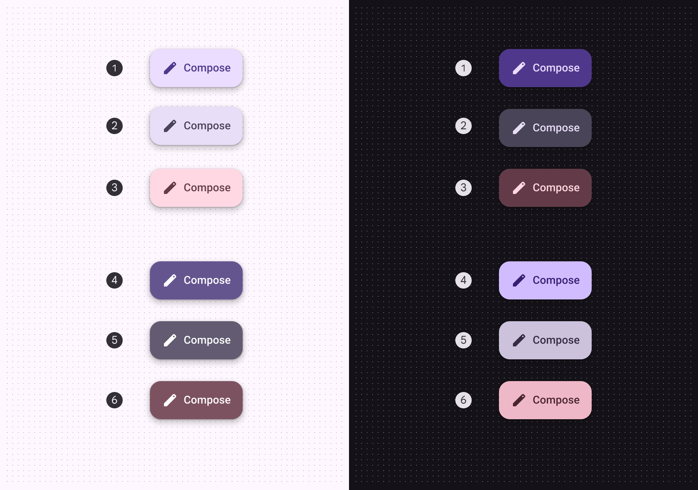

*Primary container & on primary container (default); Secondary container & on secondary container; Tertiary container & on tertiary container; Primary & on primary; Secondary & on secondary; Tertiary & on tertiary*

### Baseline color styles

Extended FABs should no longer use surface color styles. They’re still available, but not recommended.

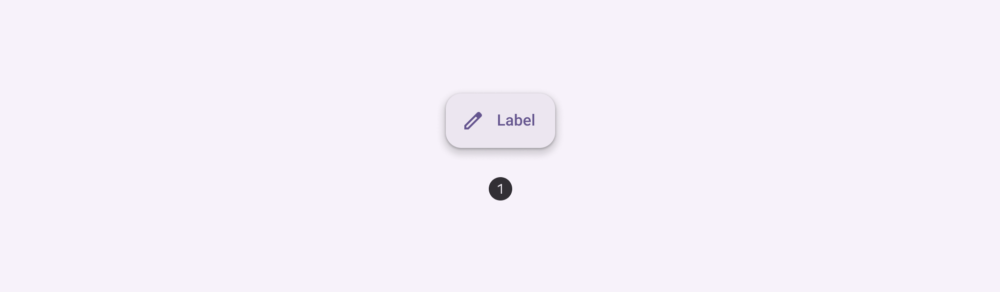

*Surface container FAB*

## States

States are visual representations used to communicate the status of a component or interactive element. [Learn more about interaction states](https://m3.material.io/m3/pages/interaction-states/overview)

When using a non-default color mapping for extended FABs, make sure the state layer color is the same as the icon color. For example, the state layer color for primary mapping should be md.sys.color.primary.

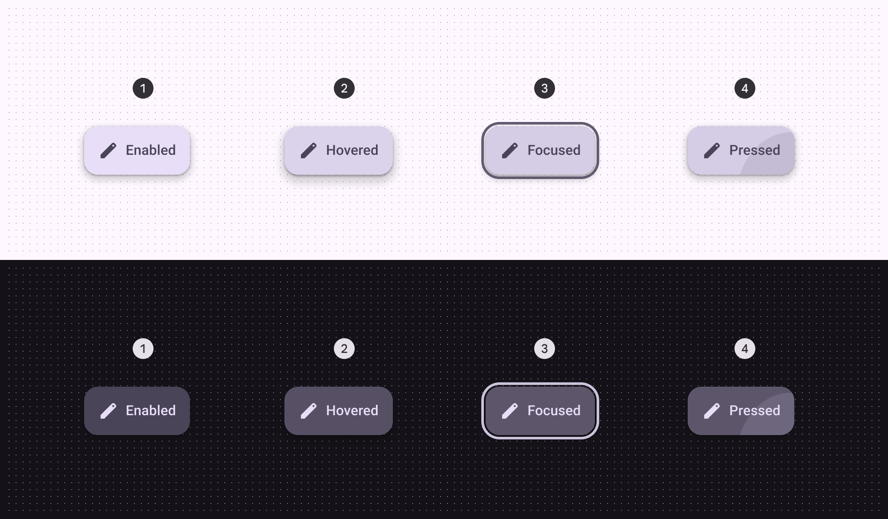

*Enabled; Hovered - elevation 4; Focused; Pressed*

## Measurements

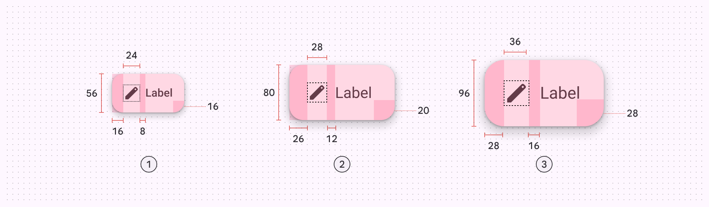

*Size and padding measurements of the small, medium, and large extended FABs*

*Extended FABs should have margins of 16dp*

## Baseline extended FAB

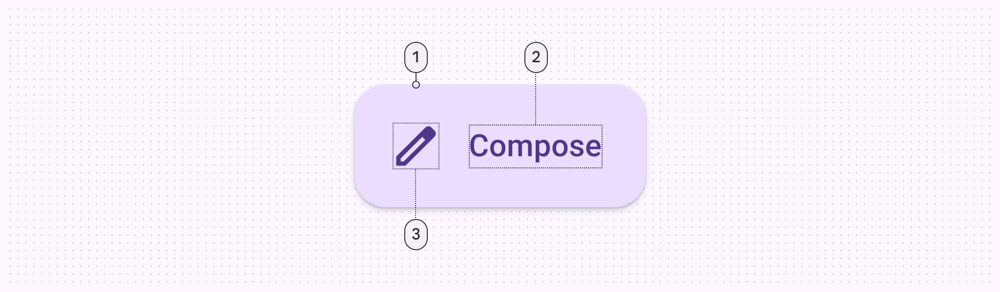

*Container; Label text; Icon*

### Baseline configurations

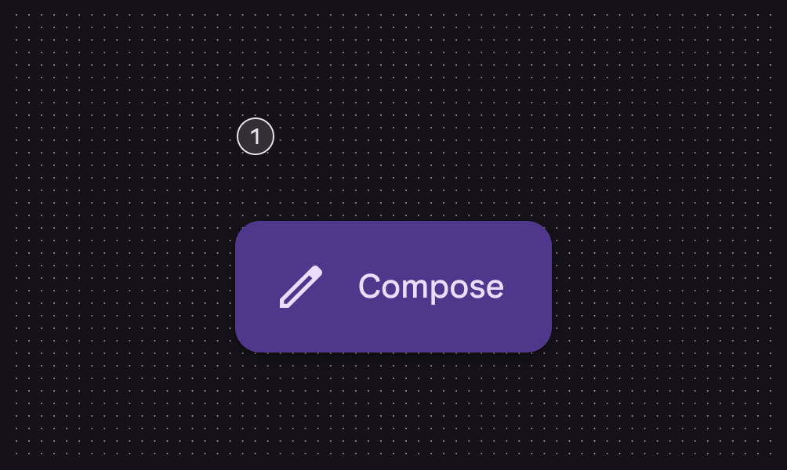

*With icon*

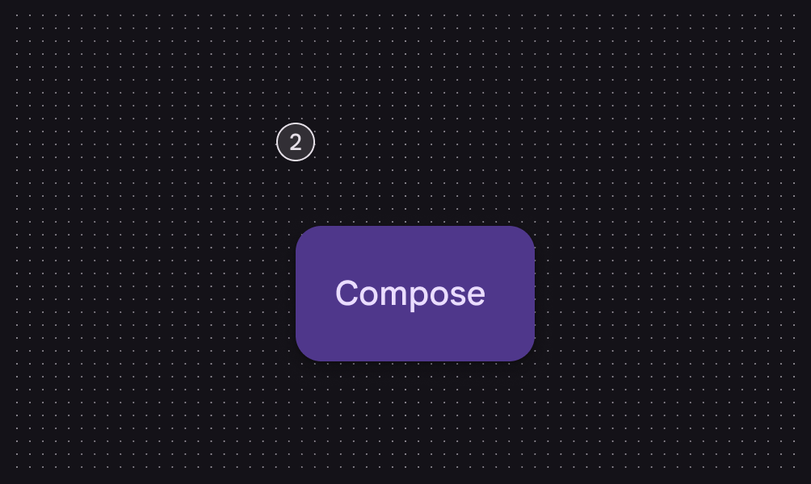

*Without icon*

### Baseline tokens

Use the table's menu to select a token set. The baseline extended FAB token sets are organized by common tokens, then by surface and branded color styles. Other color styles like primary, secondary, and tertiary are still used by the latest extended FABs.

- Token sets: Extended FAB - Color - Tonal primary; Extended FAB - Color - Primary; Extended FAB - Size - Large; Extended FAB - Size - Medium; Extended FAB - Color - Tonal secondary; Extended FAB - Color - Tonal tertiary; Extended FAB - Size - Small; Extended FAB - Size - Baseline; Extended FAB - Color - Tertiary; Extended FAB - Color - Surface; Extended FAB - Color - Secondary; Extended FAB - Color - Branded
- Columns: Token; Value
- Visible groups: Enabled; Hovered; Focused; Pressed

### Baseline colors

Color values are implemented through design tokens. For design, this means working with color values that correspond with tokens. For implementation, a color value will be a token that references a value. [Learn more about design tokens](https://m3.material.io/m3/pages/design-tokens/overview/)

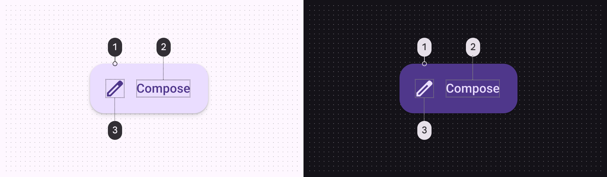

*Primary container + shadow; On primary container; On primary container*

#### Additional color mappings

Extended FABs can use other combinations of container and icon colors. The color mappings below provide the same legibility and functionality as the default, so the color mapping you use depends on style alone.

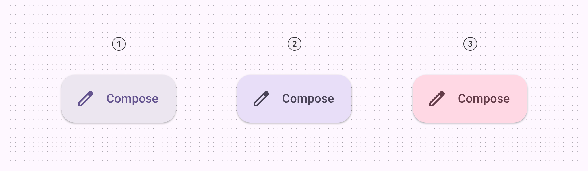

*Extended FABs can use different combinations of container and icon colors*

### Baseline states

States are visual representations used to communicate the status of a component or interactive element. [Learn more about interaction states](https://m3.material.io/m3/pages/interaction-states)

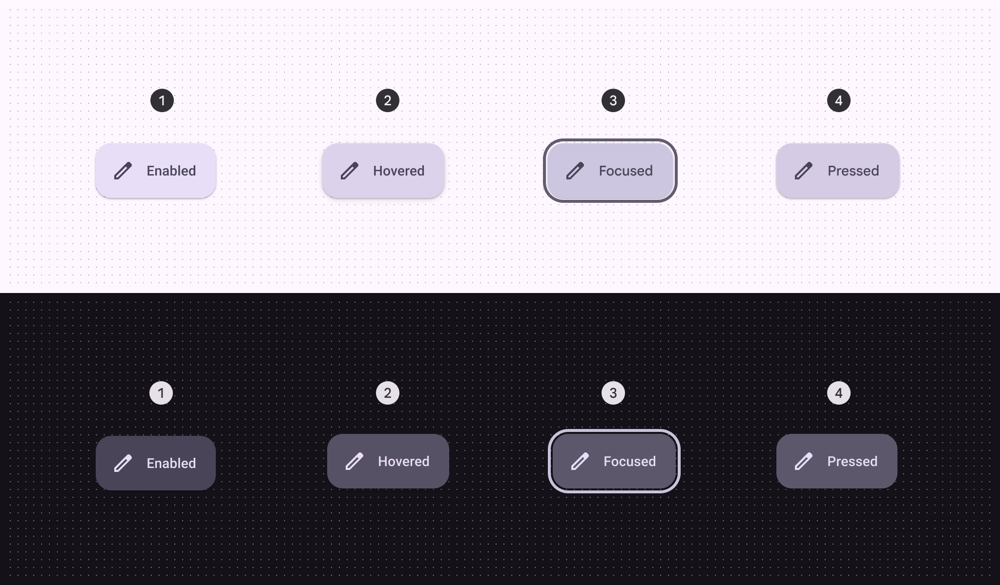

*Enabled; Hovered; Focused; Pressed*

### Baseline measurements

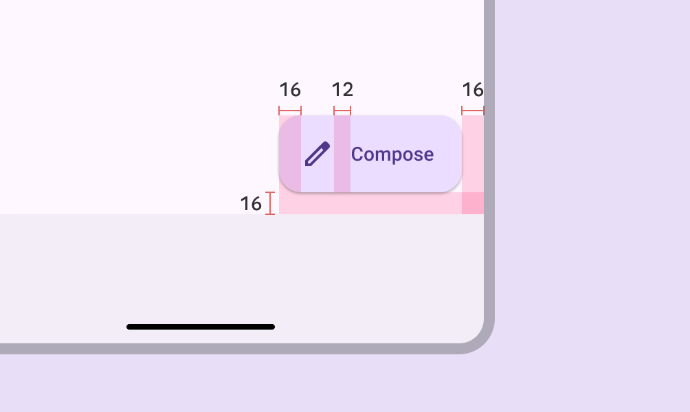

*Extended FABs have a padding of 16dp*

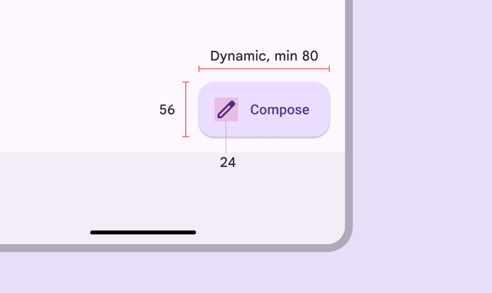

*Extended FAB height, width, and icon size*

| Attribute | Value |
| --- | --- |
| Container height | 56dp |
| Container width | Dynamic, 80dp min |
| Container shape | 16dp corner radius |
| Icon size | 24dp |
| Padding | 16dp |
