# FAB menu

Source: https://m3.material.io/components/fab-menu/guidelines

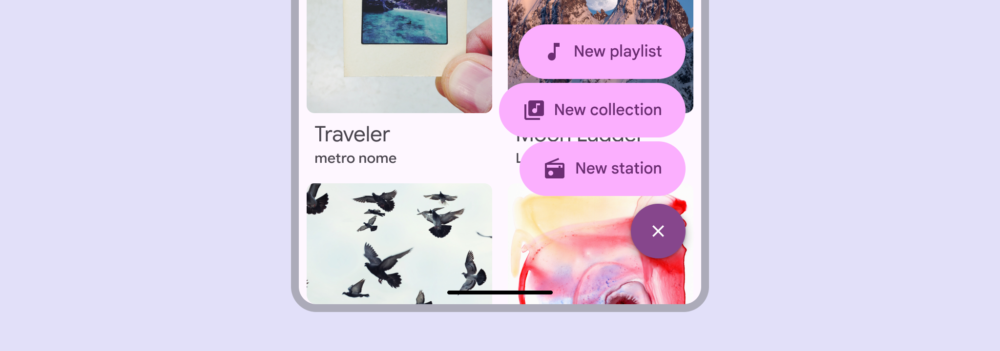

*Use the FAB menu to show multiple related actions in a prominent, expressive style*

## Usage

A FAB menu opens from a FAB to show multiple related actions. It should always appear in the same place as the FAB that opened it.

This makes actions immediately accessible, and keeps the UI clean by concealing actions when they’re not needed.

Don’t open a FAB menu from an extended FAB (Extended floating action buttons (extended FABs) help people take primary actions. [More on extended FABs](https://m3.material.io/m3/pages/extended-fab/overview)) or any other component.

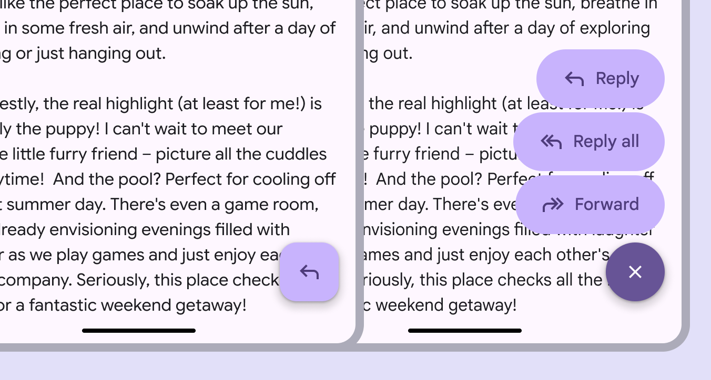

*The FAB menu should always open from a FAB*

The FAB menu should be aligned to the trailing edge of the window.

In right-to-left (RTL) languages, this means the FAB and FAB menu should be aligned to the left edge, and the layout of elements should be mirrored.

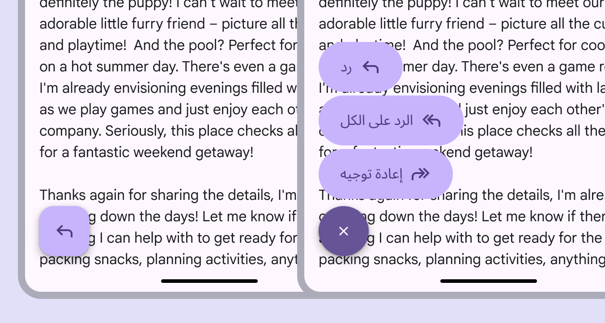

*In RTL languages, the FAB menu should be left-aligned with the icon and text placement mirrored*

FAB menus can contain 2–6 items. These should be closely related under a single action, like Share.

Avoid grouping unrelated actions in the same FAB menu.

*Do FAB menus can have 2-6 items*

*Don’t use a FAB menu with one item*

When a FAB is paired with other components, like the floating toolbar (Floating toolbars float on top of page content and can provide contextual, dynamic actions. [More on toolbars](https://m3.material.io/m3/pages/toolbars/overview)) or navigation rail (Navigation rails let people switch between UI views on mid-sized devices. [More on navigation rails](https://m3.material.io/m3/pages/navigation-rail/overview)), don’t use the FAB menu.

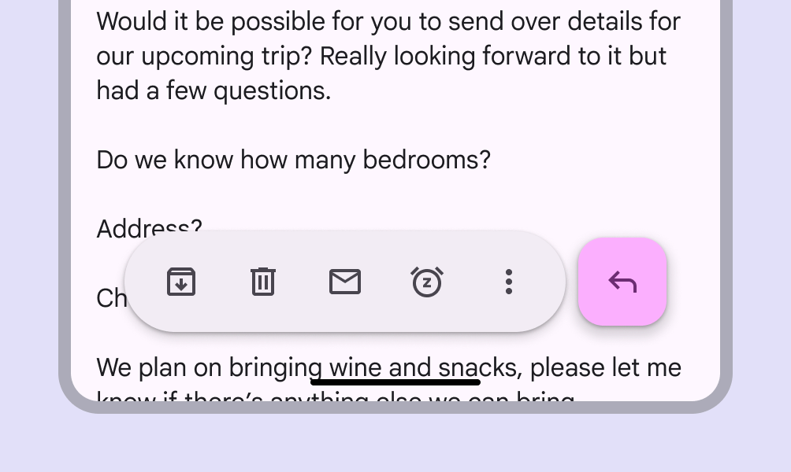

*Do FABs can be placed next to toolbars*

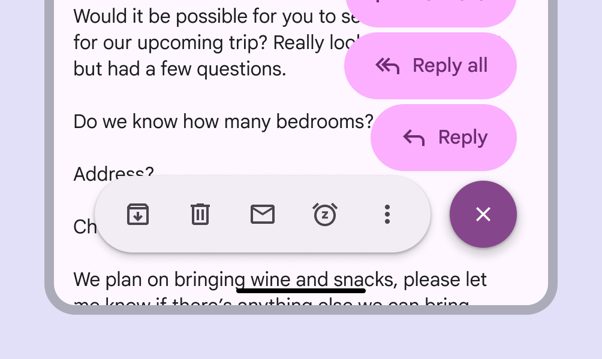

*Don’t add a FAB menu to a FAB next to a toolbar*

### Color sets

FAB menus have three color sets: primary, secondary, and tertiary. Use the color set that best matches the FAB color style.

Use the primary FAB menu color set with the primary or primary container FAB color styles.

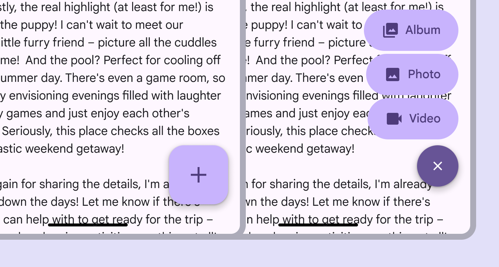

*A primary FAB is paired with a primary FAB menu*

Use the secondary FAB menu color set with the secondary or secondary container FAB color styles.

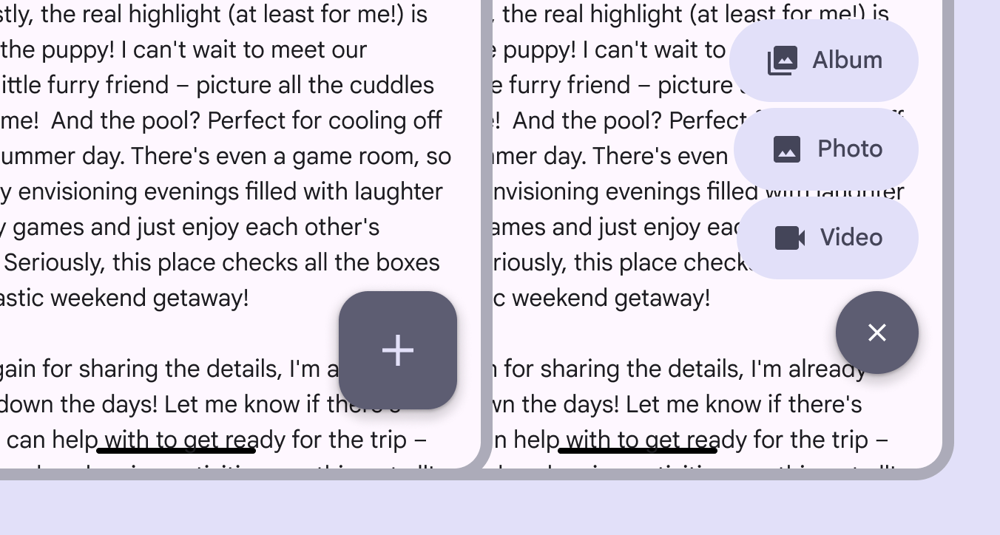

*A secondary FAB is paired with a secondary FAB menu*

Use the tertiary FAB menu color set with the tertiary or tertiary container FAB color styles.

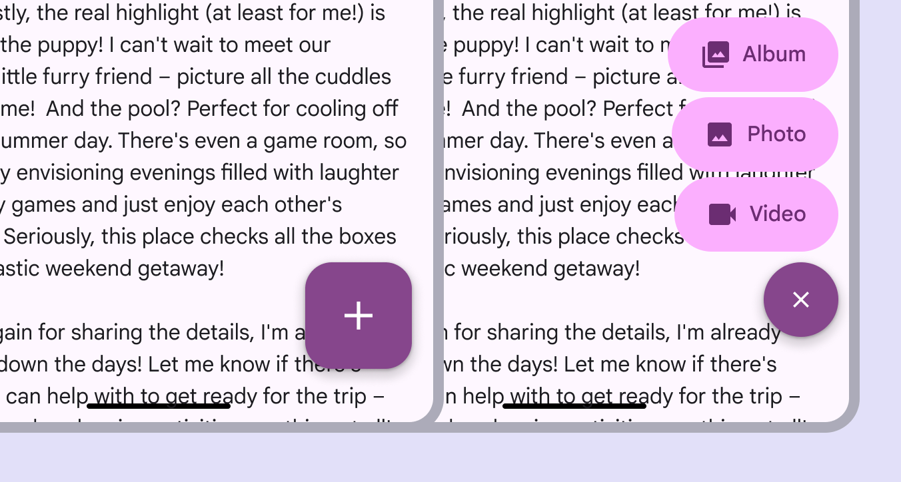

*A tertiary FAB is paired with a tertiary FAB menu*

## Anatomy

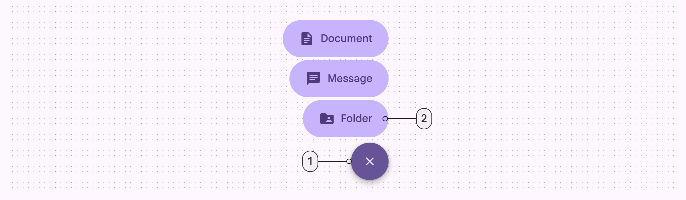

*Close button; List item*

FAB menu items should always have label text. The icons shouldn’t be removed since they make each item easy to identify.

*Caution Only remove the icon if necessary. The icon provides a differentiation between items.*

*Don’t remove the label*

The list item should always hug its contents and look consistent. Avoid truncating text or setting fixed widths. All FAB menu elements should be rounded.

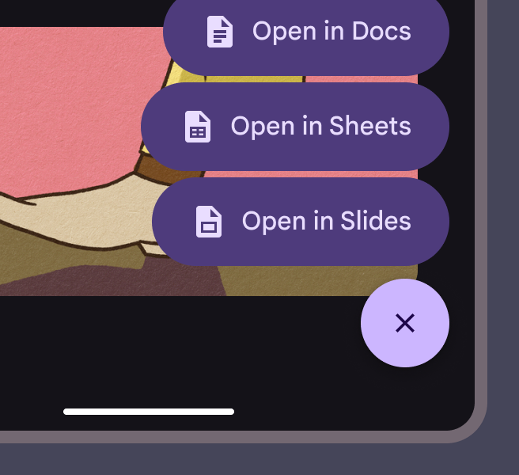

*Do Keep the padding between the container and icon, icon and text, and text and container consistent*

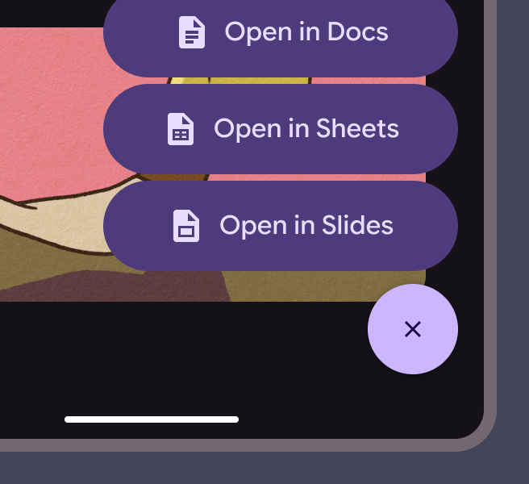

*Don’t expand container sizes*

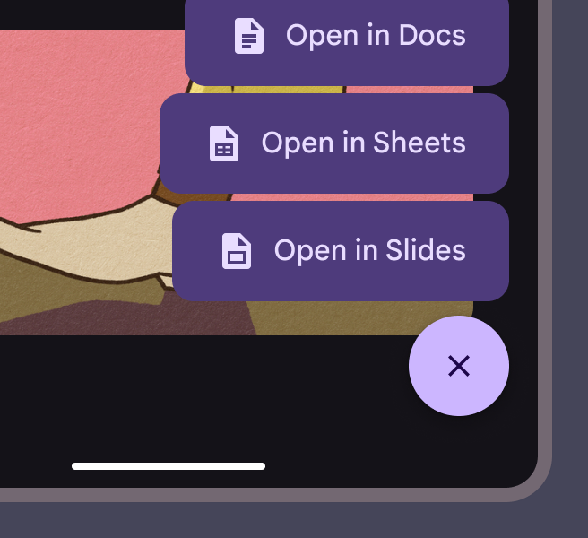

*Don’t change FAB menu shapes*

## Adaptive layout

The FAB menu can open from any sized FAB (Floating action buttons (FABs) help people take primary actions. [More on FABs](https://m3.material.io/m3/pages/fab/overview)). Use with a FAB size suitable for the window size class. For example, larger FABs are recommended for larger windows.

[Video: The same FAB menu used in medium and compact window sizes.](assets/asset-017-the-fab-menu-works-in-any-window-size-23eef87b08.webp)

*The FAB menu works in any window size. Pair it with the FAB suitable for that window size.*

The FAB menu should remain anchored to the same corner or edge regardless of window size.

In large and extra large windows, the FAB and FAB menu margins should increase from 16dp to 24dp.

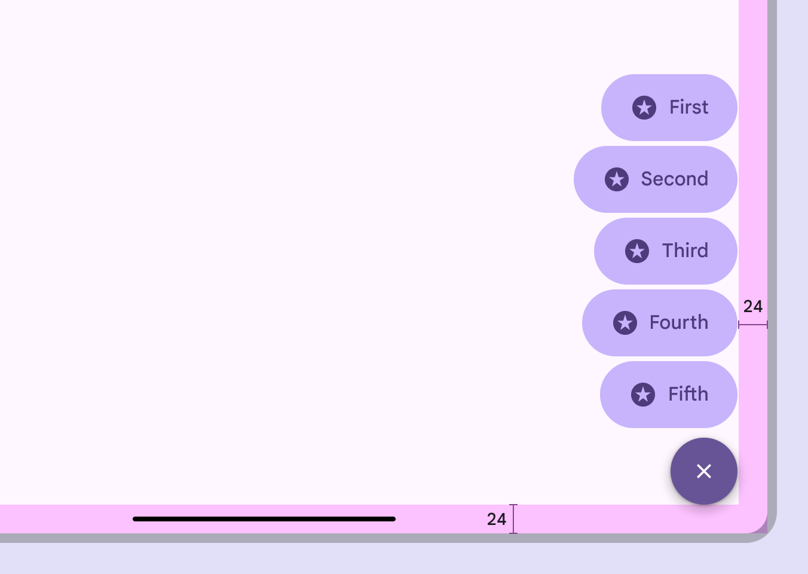

*On desktop, use larger FABs and margins*

On web, the FAB menu uses a menu (Menus display a list of choices on a temporary surface. [More on menus](https://m3.material.io/m3/pages/menus/overview/a47977cb-db49-44f0-8864-ebad19fe3e35?edit=true)) component for an experience that's consistent with other desktop apps.

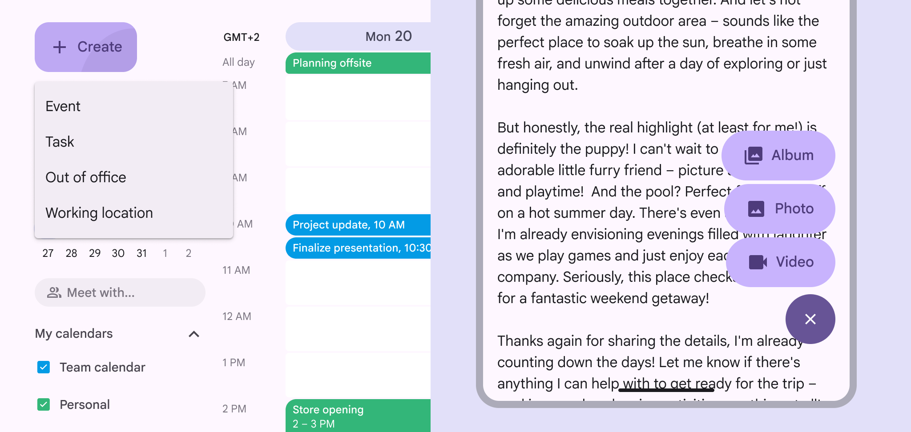

*The same FAB menu options on both large window (left) and an Android compact window (right)*

## Behavior

### Appearing

The FAB should transform into the close button of the FAB menu. The menu items should appear using the [enter and exit](https://m3.material.io/m3/pages/motion-transitions/transition-patterns#e1c2a650-d7a4-4a6d-9025-e6b7845291ed) transition.

Originate the transition from one of the FAB's trailing corners, preferably the top-aligned corner.

[Video: A FAB transforms into a FAB menu while anchoring the animation to the top right corner of the FAB.](assets/asset-020-animate-fab-menus-from-the-top-aligned-corner-5fa22a894a.webp)

*Animate FAB menus from the top-aligned corner of FABs*

To ensure accessibility for keyboard users on the web, avoid positioning the FAB menu to completely obscure the focus indicator of an actionable element. Partially covering the desired element is fine, as long as the focus indicator is visible.

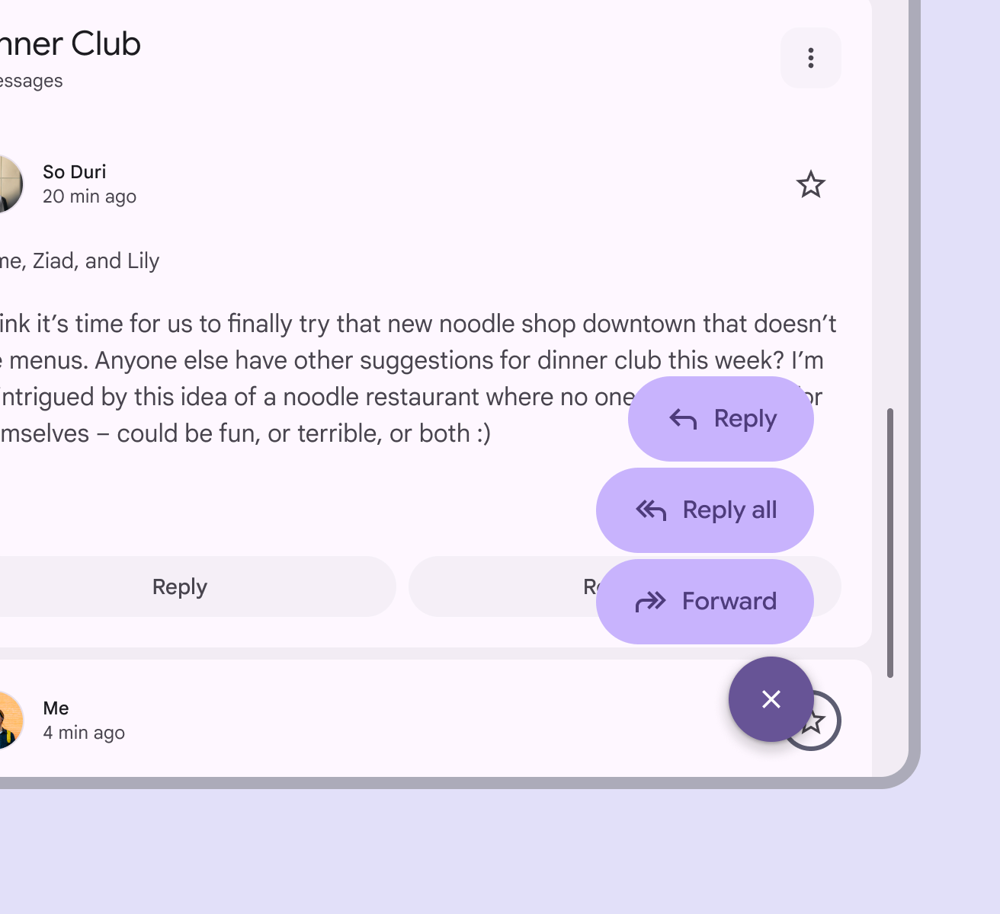

*Do Ensure the actionable element and its focus indicator are visible behind the FAB menu*

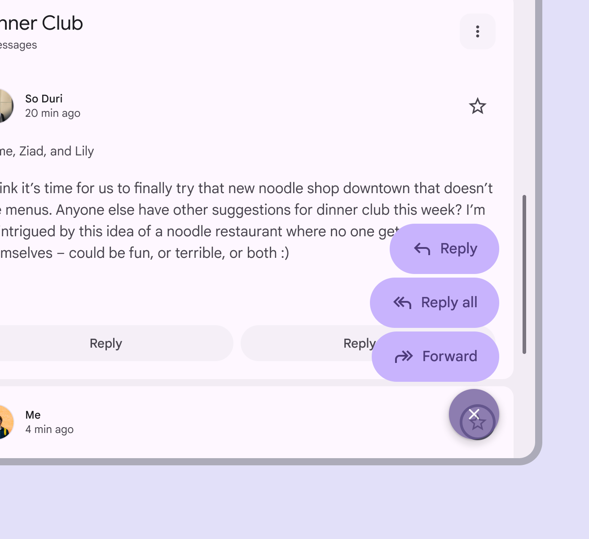

*Don’t block an actionable element and its focus indicator completely with the FAB menu*

### Scrolling

When window height is limited, like when viewing phones in horizontal orientation, FAB menu items can scroll.

The items should scroll behind the close button.

[Video: A FAB menu with 6 items scrolls off screen on a horizontal-oriented device. Scrolled items move behind the close button.](assets/asset-023-fab-menus-can-scroll-if-the-window-height-d694a0d432.webp)

*FAB menus can scroll if the window height is too short to contain all the options*

### Expanding

Any FAB menu item can expand and adapt to any shape using a [container transform](https://m3.material.io/m3/pages/motion-transitions/transition-patterns#b67cba74-6240-4663-a423-d537b6d21187) transition pattern. This includes a surface that is part of the app structure, or a surface that spans the entire screen.

[Video: A FAB menu item expands and transforms into a full screen dialog.](assets/asset-024-fab-menu-items-can-transition-into-any-kind-09c3fe9eda.webp)

*FAB menu items can transition into any kind of shape when selected*
