# FAB menu

Source: https://m3.material.io/components/fab-menu/specs

## Variants

*There’s one variant of FAB menu*

| Variant | M3 | M3 Expressive |
| --- | --- | --- |
| FAB menu | -- | Available |

## Configurations

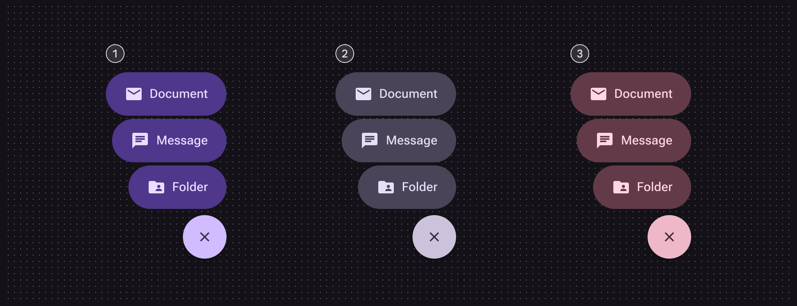

*Primary; Secondary; Tertiary*

| Category | Configuration | M3 | M3 Expressive |
| --- | --- | --- | --- |
| Color | Primary set, secondary set, tertiary set | -- | Available |

## Tokens & specs

Use the table's menu to switch token sets. The FAB menu has a common token set and six color sets, three for each element (close button and menu item). [Learn about design tokens](https://m3.material.io/m3/pages/design-tokens/overview/)

- Token sets: FAB menu - Common; FAB menu close button - Color - Primary; FAB menu close button - Color - Secondary; FAB menu close button - Color - Tertiary; FAB menu list items - Color - Primary; FAB menu list items - Color - Secondary; FAB menu list items - Color - Tertiary
- Columns: Token; Value
- Visible groups: Close button; List item

## Anatomy

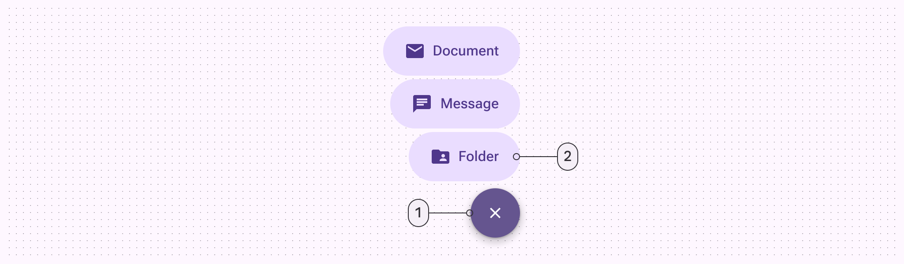

*Close button; Menu item*

*The FAB menu can have up to six items*

## Color

Color values are implemented through design tokens. For designers, this means working with color values that correspond with tokens. In implementation, a color value will be a token that references a value. [Learn more about design tokens](https://m3.material.io/m3/pages/design-tokens/overview)

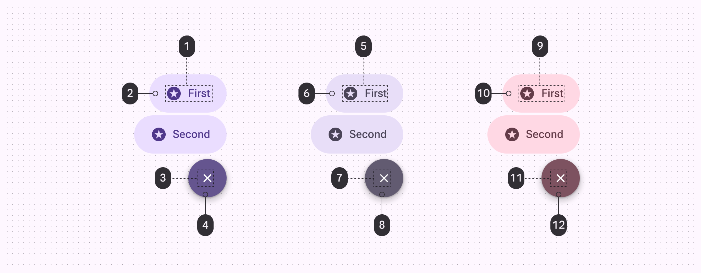

*On primary container; Primary container; On primary; Primary; On secondary container; Secondary container; On secondary; Secondary; On tertiary container; Tertiary container; On tertiary; Tertiary*

## States

States are visual representations used to communicate the status of a component or interactive element. [Learn more about interaction states](https://m3.material.io/m3/pages/interaction-states)

### Close button

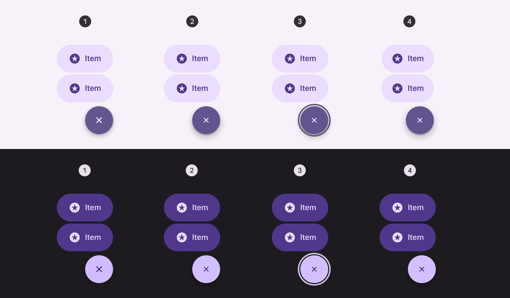

*Enabled; Hovered; Focused; Pressed*

### Menu item

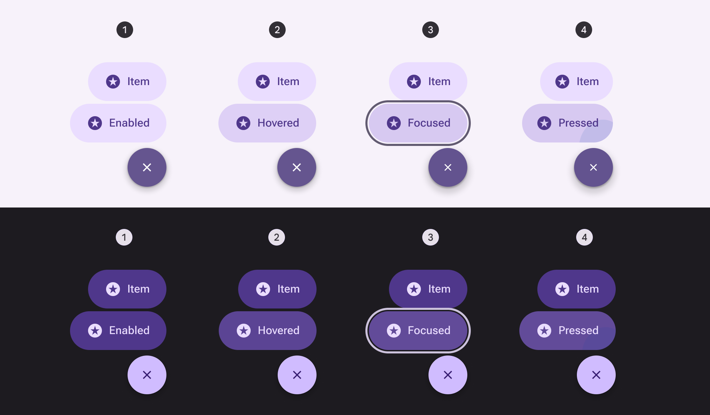

*Enabled; Hovered; Focused; Pressed*

## Measurements

FAB menu items share the same measurements as the medium button (Buttons let people take action and make choices with one tap. [More on buttons](https://m3.material.io/m3/pages/common-buttons/overview)) specs.

The close button should always be 56dp.

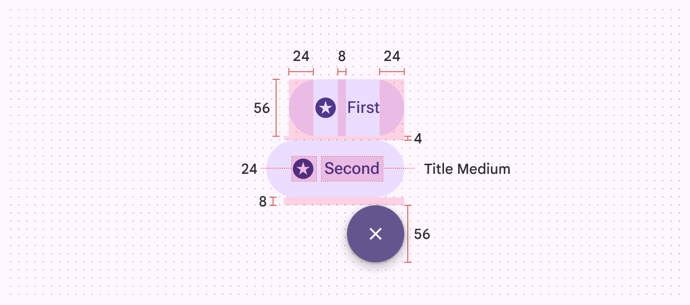

*FAB menu size measurements*

The FAB menu animates from the top trailing edge of the FAB to ensure a smooth animation.

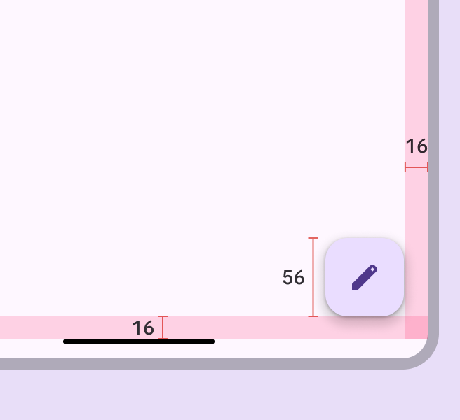

*The FAB should always have 16dp margins*

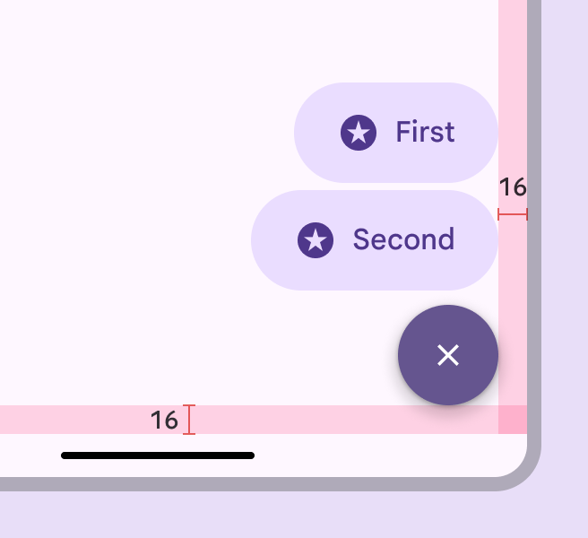

*The close button and FAB share the top trailing corner as an anchor and appear in the same place*

Larger FABs will place the FAB menu slightly higher, with larger margins underneath.

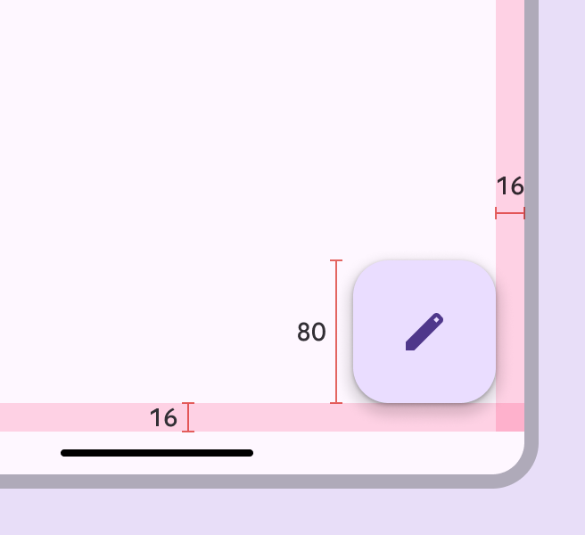

*The medium FAB placement has 16dp margins*

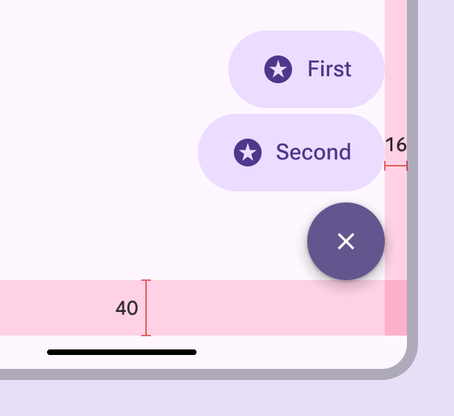

*The close button is placed higher to align with the top of the medium FAB*

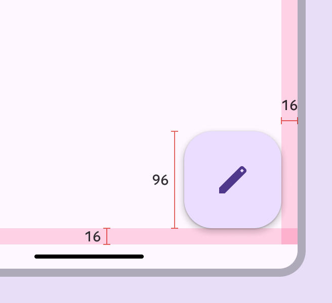

*The large FAB placement has 16dp margins*

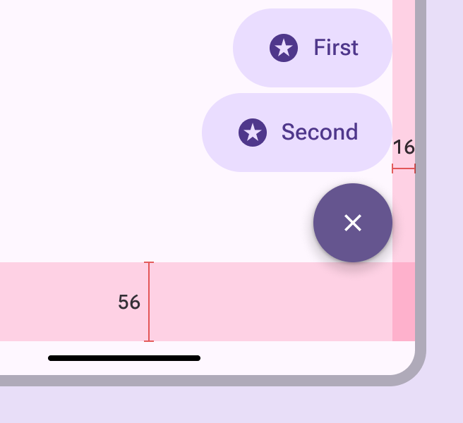

*The close button is placed higher to align with the top of the large FAB*

On web, the FAB menu opens from the FAB, and inherits its states and specs from the baseline menu (Menus display a list of choices on a temporary surface. [More on menus](https://m3.material.io/m3/pages/menus/overview/a47977cb-db49-44f0-8864-ebad19fe3e35?edit=true)) component.

The gap between the FAB and menu can vary, but 4dp is recommended.

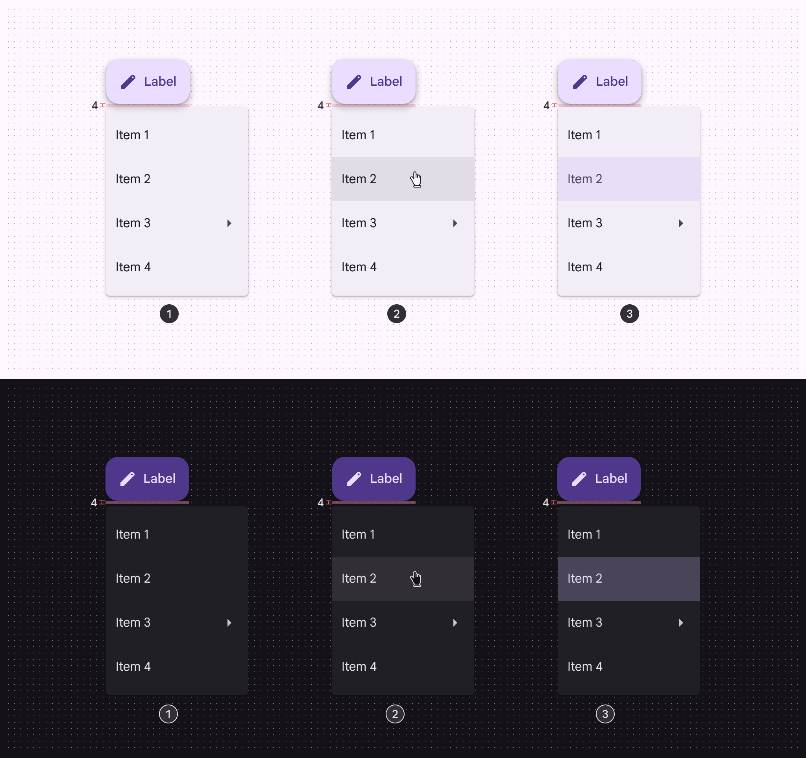

*Enabled; Hovered; Selected*
