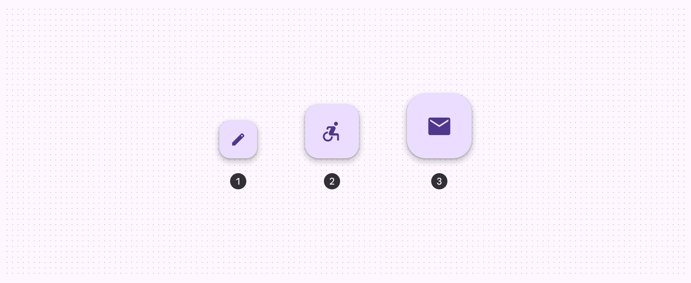
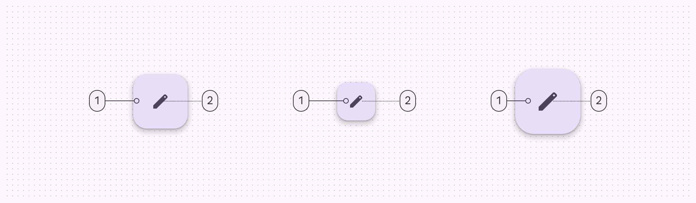
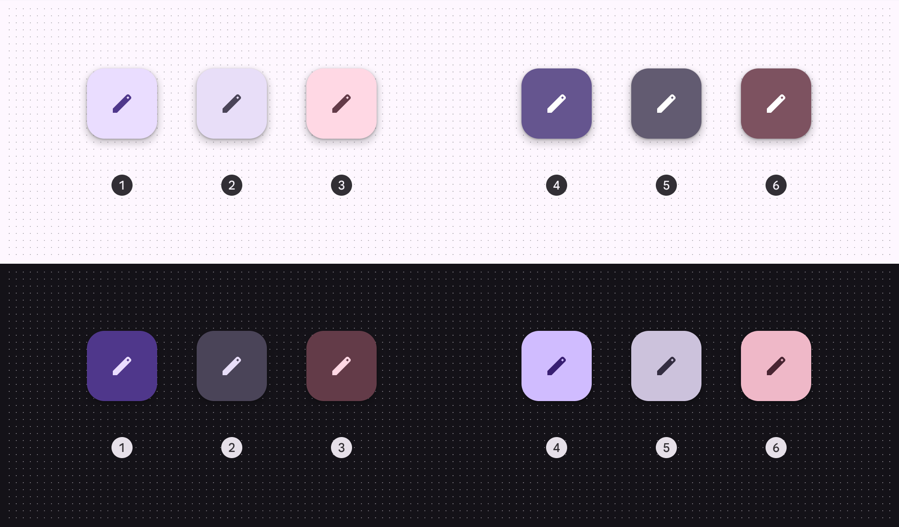
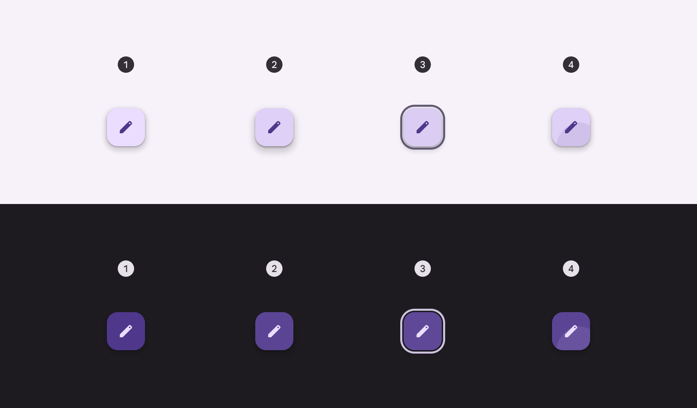
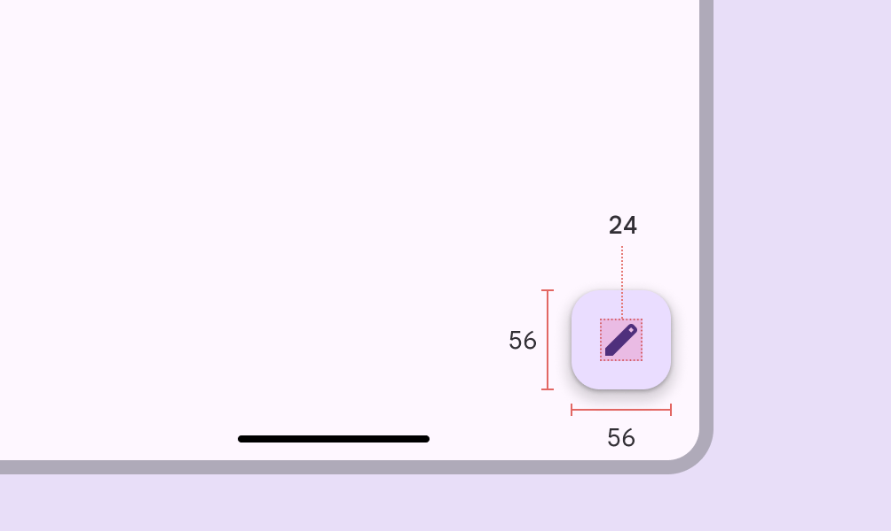
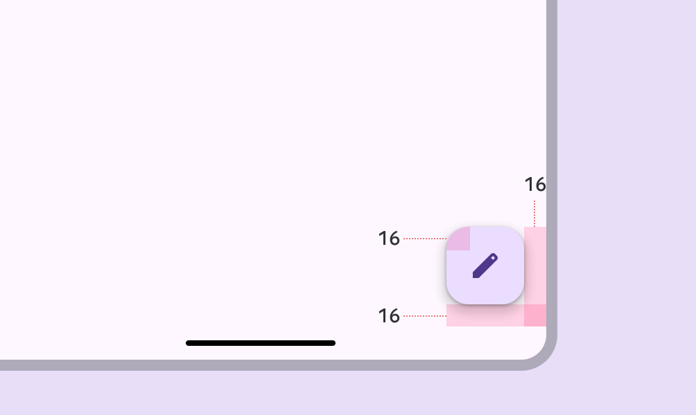
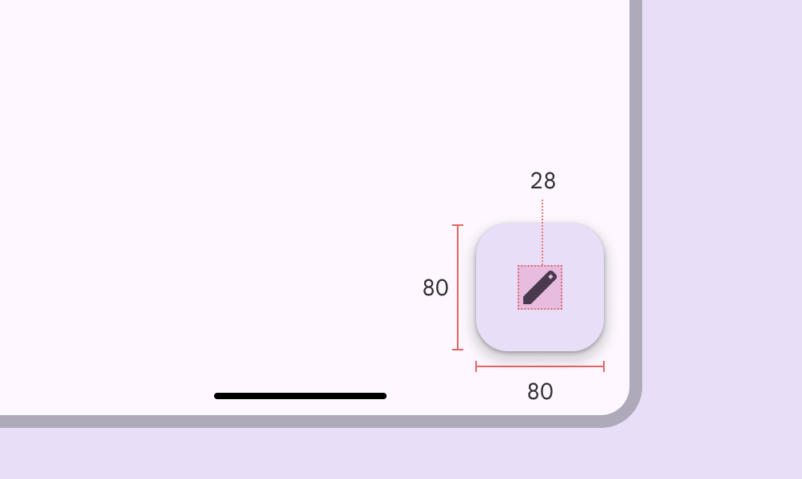
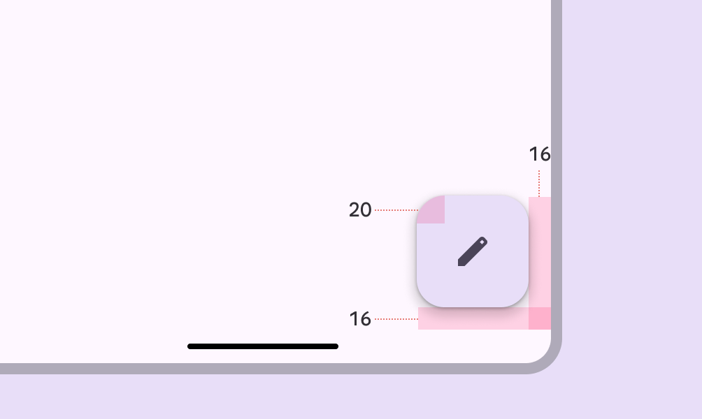
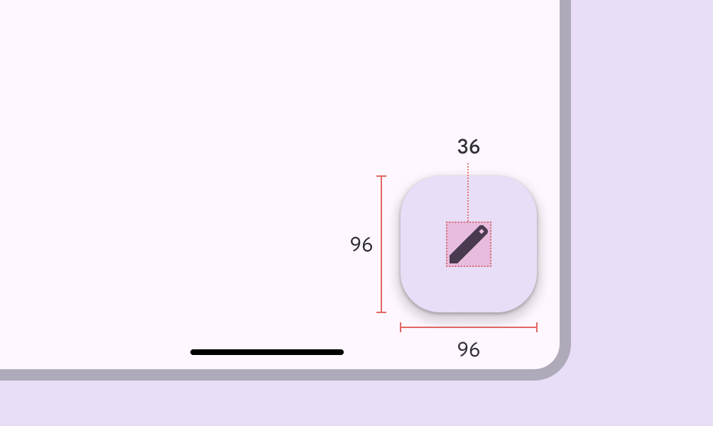
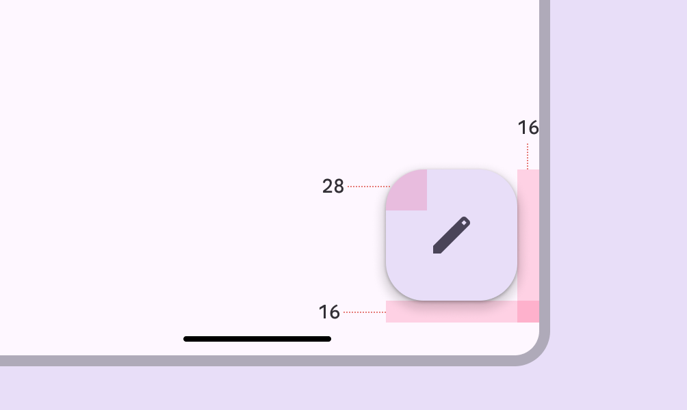

# FAB

Source: https://m3.material.io/components/floating-action-button/specs

## Variants

*FAB; Medium FAB; Large FAB*

### Baseline variants

The small FAB is still available, but no longer recommended. [Jump to baseline specs](https://m3.material.io/m3/pages/fab/specs#cd336045-e97d-4a6d-ac23-f778fa695e3c)

*1. Small FAB*

| Variant | M3 | M3 Expressive |
| --- | --- | --- |
| FAB | Available | Available |
| Medium FAB | -- | Available |
| Large FAB | Available | Available |
| Small FAB | Available | Not recommended. Use a larger size. |

## Configurations

In the expressive update, the primary, secondary, and tertiary set colors were renamed to primary container, secondary container, and tertiary container to match the actual color roles used. New primary, secondary, and tertiary color styles were created to match the corresponding color roles. [View details in the color styles section](https://m3.material.io/m3/pages/fab/specs#67e71ec7-b520-405a-aa06-2decfa0b92a3)

| Category | Configuration | M3 | M3 Expressive |
| --- | --- | --- | --- |
| Color | Primary container, secondary container, tertiary container | Available as primary, secondary, tertiary | Available |
| Color | Primary. secondary, tertiary | -- | Available |

## Tokens & specs

Use the table's menu to select a token set. FAB tokens are organized by size and color. [Learn more about design tokens](https://m3.material.io/m3/pages/design-tokens/overview/)

- Token sets: FAB - Size - Medium; FAB - Size - Large; FAB - Color - Tonal primary; FAB - Color - Tonal secondary; FAB - Color - Tonal tertiary
- Columns: Token; Value

## Anatomy

*1. Container 2. Icon*

## Color

Color values are implemented through design tokens. For design, this means working with color values that correspond with tokens. In implementation, a color value will be a token that references a value. [Learn more about design tokens](https://m3.material.io/m3/pages/design-tokens)

### Color styles

FABs can use several combinations of color and on-color styles, such as primary and on-primary. The following color mappings provide the same legibility and functionality, so the color mapping you use depends on style alone.

*Primary container & On primary container (default); Secondary container & On secondary container; Tertiary container & On tertiary container; Primary & On primary; Secondary & On secondary; Tertiary & On tertiary*

### Baseline color styles

Surface FAB color styles are still available, but no longer recommended.

*Surface FABs*

## States

States are visual representations used to communicate the status of a component or interactive element. When using a non-default color mapping for FABs, make sure the state layer color is the same as the icon color. For example, the state layer color for the primary color style should be md.sys.color.primary.

*Enabled; Hovered (8% state layer) - elevation 4; Focused (10% state layer); Pressed (10% state layer)*

## Measurements

### FAB

*FAB size measurements*

*FAB padding measurements*

### Medium FAB

*Medium FAB size measurements*

*Medium FAB padding measurements*

### Large FAB

*Large FAB size measurements*

*Large FAB padding measurements*

## Baseline tokens & specs

Use the table's menu to select a token set. This only includes baseline tokens, including small and surface FABs. It doesn't include large or regular FABs, since those are still currently used.

- Token sets: [Deprecated] FAB - Primary, small; [Deprecated] FAB - Primary, large; [Deprecated] FAB - Secondary, small; [Deprecated] FAB - Secondary, large; [Deprecated] FAB - Tertiary, small; [Deprecated] FAB - Tertiary, large; [Deprecated] FAB - Surface, small; [Deprecated] FAB - Surface, large
- Columns: Token
- Visible groups: [Deprecated] Enabled; [Deprecated] Hovered; [Deprecated] Focused; [Deprecated] Pressed (ripple)
