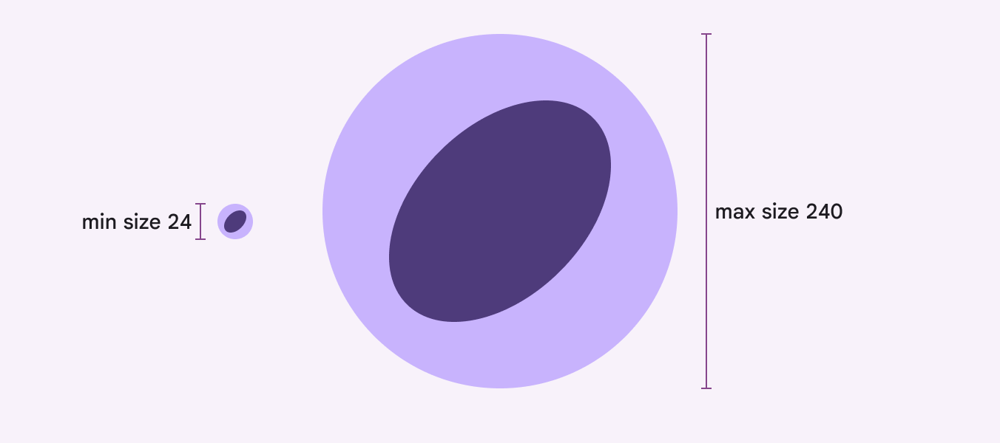

# Loading indicator

Source: https://m3.material.io/components/loading-indicator/guidelines

[Video: Loading indicator on media player.](assets/asset-001-loading-indicators-are-best-for-indicating-a-short-c748e9cf57.webp)

*Loading indicators are best for indicating a short, indeterminate wait time*

## Usage

Loading indicators use animation to grab attention, mitigate perceived latency, and indicate that an activity is in progress. They should be used when progress isn’t detectable, or when it’s not necessary to indicate how long an activity will take. While similar in function to circular progress indicators, loading indicators are a better alternative for short processes between 200ms and 5s.

[Video: Loading indicator in loading state with “Getting your device ready...”.](assets/asset-002-use-a-loading-indicator-when-a-background-process-b2b6f61b2a.webp)

*Use a loading indicator when a background process is running*

Choose a loading or progress indicator (Progress indicators show the status of a process in real time. [More on progress indicators](https://m3.material.io/m3/pages/progress-indicators/overview)) that corresponds to the expected wait time and type of process. If the wait is very long, consider allowing users to navigate away from the page while the process finishes up.

| Expected wait time | Recommendation |
| --- | --- |
| Instant (under 200ms) | No indicator |
| Short (between 200ms and 5s) | Loading indicator |
| Long (Over 5s) | Progress indicator |

[Video: Content appearing on a screen quickly without a loading indicator.](assets/asset-003-instant-under-200ms-display-the-content-immediately-96ca3bd267.webp)

*Instant (under 200ms): Display the content immediately*

[Video: Content appearing on a screen with a slight lag and a loading indicator.](assets/asset-004-short-between-200ms-and-5s-use-a-loading-760141321e.webp)

*Short (between 200ms and 5s): Use a loading indicator*

[Video: Content appearing on a screen with a long lag and a progress indicator.](assets/asset-005-long-over-5s-use-a-progress-indicator-550e51ac09.webp)

*Long (over 5s): Use a progress indicator*

When a process can transition from indeterminate (unknown progress) to determinate (known remaining progress), transition between the corresponding progress indicators. Don’t transition a loading indicator into a progress indicator.

[Video: A screen transitioning from an indeterminate progress indicator to a determinate progress indicator.](assets/asset-006-do-transition-from-an-indeterminate-progress-indicator-to-3281e49c66.webp)

*Do Transition from an indeterminate progress indicator to a determinate progress indicator*

[Video: A screen transitioning from a loading indicator to a determinate progress indicator.](assets/asset-007-don-t-avoid-transitioning-from-a-loading-indicator-55934da003.webp)

*Don’t Avoid transitioning from a loading indicator to a determinate progress indicator*

## Anatomy

*Active indicator; Container (optional)*

### Active indicator

The active indicator is a looping shape morph sequence composed of seven unique Material 3 shapes. [More about the Material shape library](https://m3.material.io/m3/pages/shape/overview-principles#579dd4ba-39f3-4e60-bd9b-1d97ed6ef1bf)

*The active indicator morphs shape to capture attention*

### Container (optional)

When the container is visible, the active indicator should change color from primary to on-primary-container. The container should be visible when the loading indicator is placed over other content. This helps it stand out better by giving it a stronger contrast. It’s not needed when the loading indicator is placed directly on a surface. The container should be used with pull-to-refresh behavior.

*The container is a circle that provides extra contrast from body content*

## Placement

While loading a page or container, the loading indicator should be centered on the element.

[Video: Active indicator with shape morph centered on a screen.](assets/asset-011-center-the-loading-indicator-in-the-middle-of-c39f8b67c6.webp)

*Center the loading indicator in the middle of the page or container*

When loading more items on a page with existing content, place the loading indicator in the empty space where the new content will appear. Avoid overlapping existing content.

[Video: Loading indicator with shape morph underneath photos in a photo app.](assets/asset-012-center-the-loading-indicator-in-the-empty-space-2389bd309d.webp)

*Center the loading indicator in the empty space where content will appear*

Loading indicators can be placed within other components, such as buttons (Buttons let people take action and make choices with one tap. [More on buttons](https://m3.material.io/m3/pages/common-buttons/overview)), to indicate that the action is ongoing, such as validating a form or checking for updates.

[Video: Loading indicator in a button.](assets/asset-013-loading-indicators-can-be-placed-in-buttons-that-ba5fa0a58b.webp)

*Loading indicators can be placed in buttons that take a few seconds to take effect*

[Video: Loading indicator as the icon in a tab.](assets/asset-014-use-loading-indicators-to-show-progress-without-taking-25e6a887f1.webp)

*Use loading indicators to show progress without taking up much space*

## Responsive layout

Loading indicators default to 48dp, but the size is flexible. It should be between 24dp to 240dp, depending on the placement and the window size. Avoid exceeding the minimum and maximum sizes. The ratio between the container and the active indicator stays the same when resizing the loading indicator. Reserve very large progress indicators for large and extra-large windows, like desktop.

*Loading indicators can range in size from 24–240dp*

### Larger windows

As the pane or window size grows, consider scaling the loading indicator as well, so it remains proportional in size to the empty space around it. The loading indicator shouldn’t exceed 240dp.

[Video: Loading indicator on mobile and tablet screens.](assets/asset-016-the-loading-indicator-s-default-size-is-ideal-60d5de073d.webp)

*The loading indicator’s default size is ideal for mobile and other compact windows. The loading indicator should scale up in larger windows.*

## Behavior

### Pull-to-refresh

The loading indicator is used in [pull-to-refresh](https://developer.android.com/develop/ui/compose/components/pull-to-refresh) on Jetpack Compose only. Pull-to-refresh is an Android system feature that manually refreshes screen content with an action or gesture. It’s used at the beginning of lists, grid lists, and card collections where the most recent content appears. It’s best to use pull-to-refresh with dynamic content that can have frequent updates, where people have a high chance of seeing new content after refreshing.

[Video: A loading indicator can appear above content in pull-to-refresh.](assets/asset-017-the-loading-indicator-for-pull-to-refresh-can-079f8571be.webp)

*The loading indicator for pull-to-refresh can appear on top of the content or adjacent to it*

### Threshold requirements

To ensure intentional usage of the pull-to-refresh gesture, the loading indicator must pass a threshold before the app will refresh.

[Video: Loading indicator with screen refresh after threshold time has passed.](assets/asset-018-after-passing-the-threshold-completing-the-gesture-initiates-7f6021692f.webp)

*After passing the threshold, completing the gesture initiates a refresh*

[Video: Loading indicator reversed can cancel refresh action.](assets/asset-019-reversing-the-gesture-past-the-threshold-will-cancel-c540b8bb5c.webp)

*Reversing the gesture past the threshold will cancel the refresh action*

The loading indicator remains visible until the refresh activity completes and any new content is visible, or someone navigates away from the refreshing content.

[Video: A loading indicator at the top of a screen, which appears until content loads.](assets/asset-020-do-keep-the-loading-indicator-in-view-until-bbf2c2e35e.webp)

*Do Keep the loading indicator in view until the activity is completed to provide status of the refresh activity*

[Video: A loading indicator that scrolls off screen.](assets/asset-021-don-t-scroll-the-loading-indicator-off-screen-1dc73175af.webp)

*Don’t scroll the loading indicator off-screen, as it hides the status of the refresh activity. It could imply that the refresh activity is associated with a specific component, such as a card, instead of the entire screen.*
