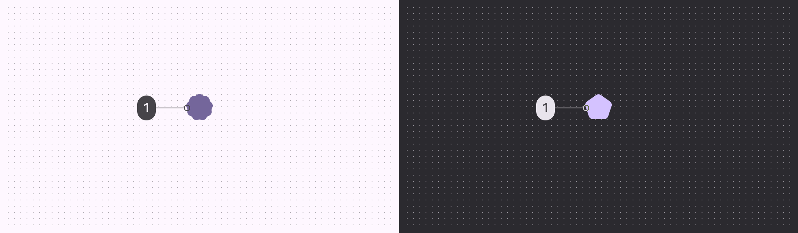
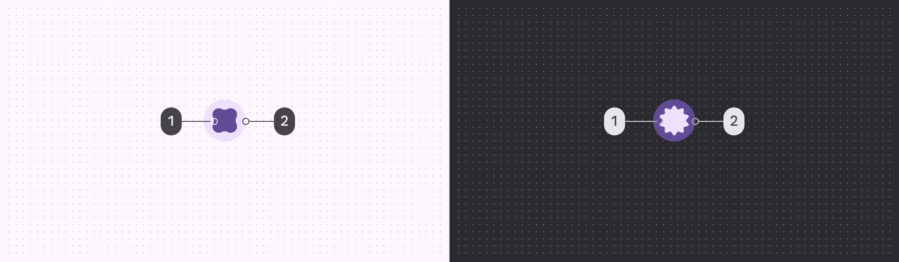

# Loading indicator

Source: https://m3.material.io/components/loading-indicator/specs

## Variants

*Loading indicator*

| Variant | M3 | M3 Expressive |
| --- | --- | --- |
| Loading indicator | -- | Available |

## Configurations

*Default; Contained*

| Category | Configuration | M3 | M3 Expressive |
| --- | --- | --- | --- |
| Containment | Default | -- | Available |
| Containment | Contained | -- | Available |

## Tokens & specs

Loading indicators have a single token set.

- Columns: Token
- Visible groups: Color; Size; Shape

## Anatomy

*Active indicator; Container*

## Color

### Default

Color values are implemented through design tokens (Design tokens are the building blocks of all UI elements. The same tokens are used in designs, tools, and code. [More on tokens](https://m3.material.io/m3/pages/design-tokens/overview)). For designers, this means working with color values that correspond with tokens; in implementation, a color value will be a token that references a value.

*Primary*

### Contained

*On primary container; Primary container*

## Measurements

*To ensure sufficient margins, the size is 48dp while the shape container is 38dp*
