# Menus

Source: https://m3.material.io/components/menus/specs

## Variants

### Vertical menus

Use vertical menus for a more expressive look and feel, including rounded corners, standard and vibrant color styles, more selection states, and submenu motion.

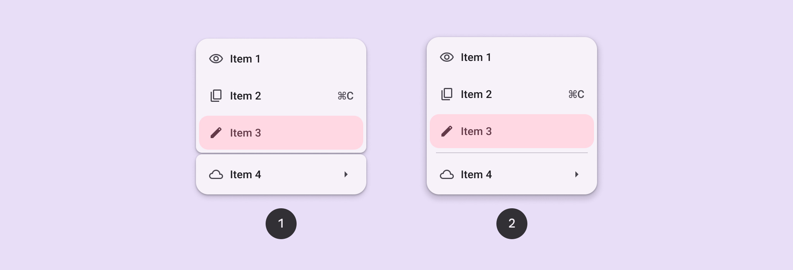

*Vertical menu with gap; Vertical menu with divider*

### Baseline variant

In M3 Expressive, baseline (Baseline variants are the original M3 component designs. They may not have the latest features introduced in M3 Expressive, like updated motion, shapes, type, and styles. [More on M3 Expressive](https://m3.material.io/blog/building-with-m3-expressive)) menu is still available to use, but doesn’t have the latest shapes, color styles, selection states, and motion. [See baseline menu specs](https://m3.material.io/m3/pages/menus/specs#a80df2f9-8610-4ce0-b3a3-b9ee749d5c98)

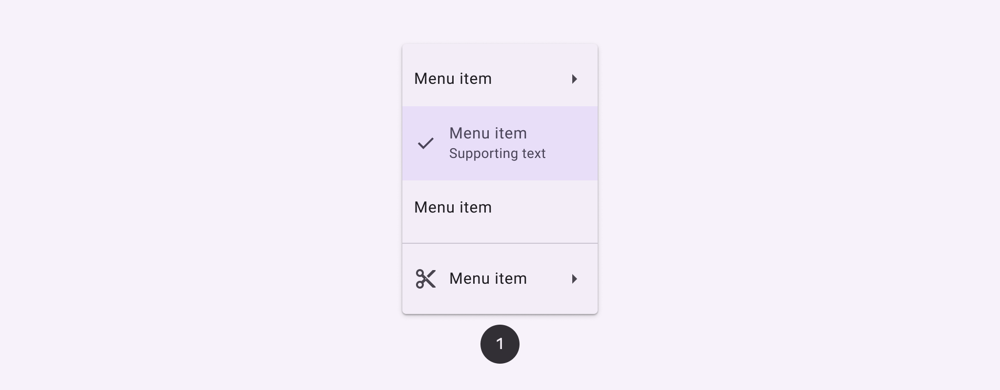

*A baseline menu has square corners, as compared to a vertical menu’s round corners and expressive styling*

| Variant | M3 | M3 Expressive |
| --- | --- | --- |
| Vertical menus | -- | Available |
| Menu ( baseline (Baseline variants are the original M3 component designs. They may not have the latest features introduced in M3 Expressive, like updated motion, shapes, type, and styles. [More on M3 Expressive](https://m3.material.io/blog/building-with-m3-expressive)) ) | Available | Available |

## Configurations

### Vertical menus layout

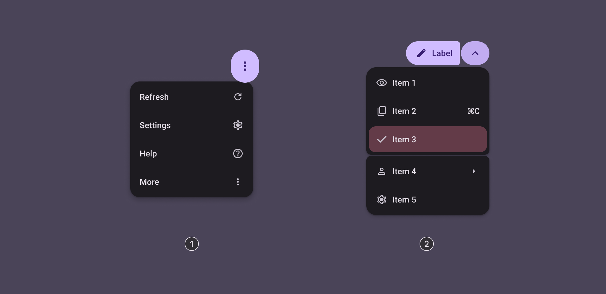

*Standard; Grouped*

| Category | Configuration | M3 | M3 Expressiv e |
| --- | --- | --- | --- |
| Color | Standard | Available | Available |
| Color | Vibrant | -- | Available |
| Layout | Standard | Available | Available |
| Layout | Grouped | -- | Available |

## Tokens & specs

Browse the component elements, attributes, tokens, and their values. [Learn about design tokens](https://m3.material.io/foundations/design-tokens/overview)

- Columns: Token
- Visible groups: Enabled; Disabled; Hover; Focus; Pressed; Focus indicator

## Anatomy

### Vertical menus

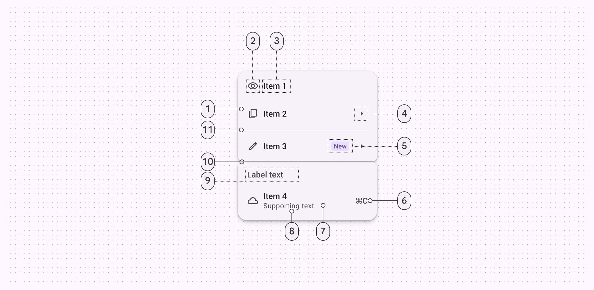

*Menu item; Leading icon (optional); Menu item text; Trailing icon (optional); Badge (optional); Trailing text (optional); Container; Supporting text (optional); Label text (optional); Gap (optional); Divider (optional)*

## Color

Color values are implemented through design tokens (Design tokens are the building blocks of all UI elements. The same tokens are used in designs, tools, and code. [More on tokens](https://m3.material.io/foundations/design-tokens/overview)). For designers, this means working with color values that correspond with tokens. In implementation, a color value will be a token that references a value. [Learn more about design tokens](https://m3.material.io/foundations/design-tokens/overview)

Menus have two color mappings:

- Standard: Surface-based
- Vibrant: Tertiary-based

These mappings provide options for lower or higher visual emphasis. Vibrant menus are more prominent so should be used sparingly.

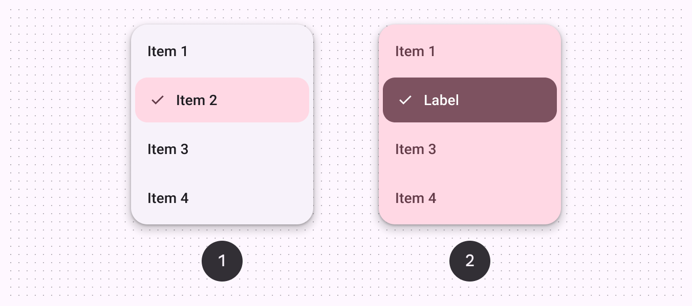

*Standard color scheme; Vibrant color scheme*

### Standard colors

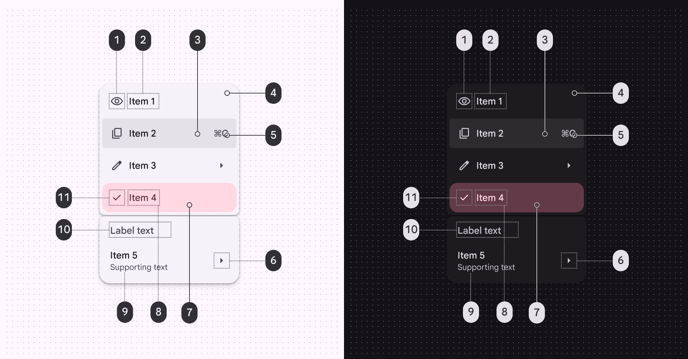

*On surface variant; On surface; On surface (state layer); Surface container low; On surface variant; On surface variant; Tertiary container (selected); On tertiary container (selected); On surface variant; On surface variant; On tertiary container (selected)*

### Vibrant colors

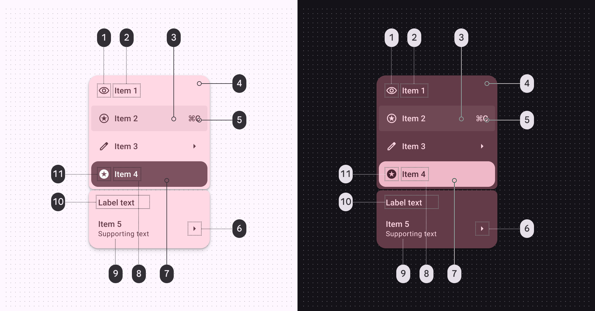

*On tertiary container; On tertiary container; On tertiary container (state layer); Tertiary container; On tertiary container; On tertiary container; Tertiary (selected); On tertiary (selected); On tertiary container; On tertiary container; On tertiary (selected)*

## States

States (States show the interaction status of a component or UI element. [More on states](https://m3.material.io/m3/pages/interaction-states/overview)) are visual representations used to communicate the status of a component or an interactive element. [More on interaction states](https://m3.material.io/m3/pages/interaction-states/overview) Shape morphing in vertical menus creates an expressive active state. As focus moves between submenus, the corner shape changes to highlight the active menu. [More on menu focus](https://m3.material.io/m3/pages/menus/guidelines#7cc1d01b-a454-48c7-8306-e60347ffd17f)

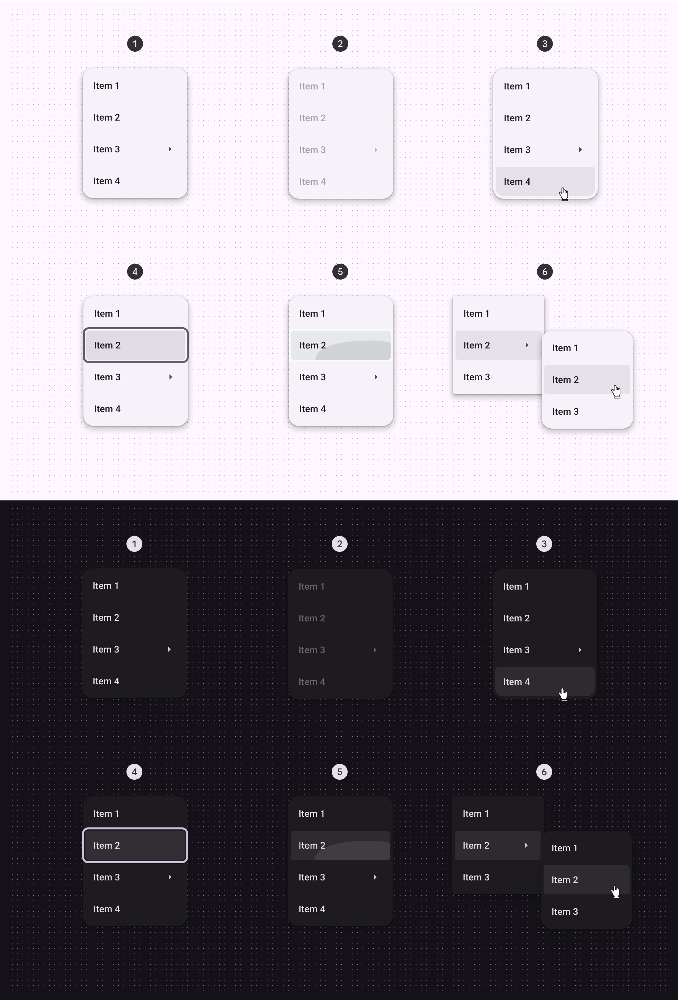

*Enabled; Disabled; Hovered; Focused; Pressed; Active (main menu reveals submenu)*

## Measurements

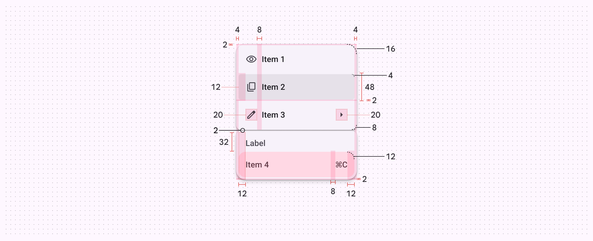

*Vertical menu padding and size measurements*

## Menu (baseline)

The baseline (Baseline variants are the original M3 component designs. They may not have the latest features introduced in M3 Expressive, like updated motion, shapes, type, and styles. [More on M3 Expressive](https://m3.material.io/blog/building-with-m3-expressive)) menu variant is available and continues to work in existing products. However, M3 expressive vertical menus are recommended for new designs.

### Baseline tokens & specs

Browse the component elements, attributes, tokens, and their values. [Learn about design tokens](https://m3.material.io/foundations/design-tokens/overview)

- Token sets: Menu (baseline)
- Columns: Token
- Visible groups: Enabled; Disabled; Hover; Focus; Pressed; Focus indicator

### Anatomy

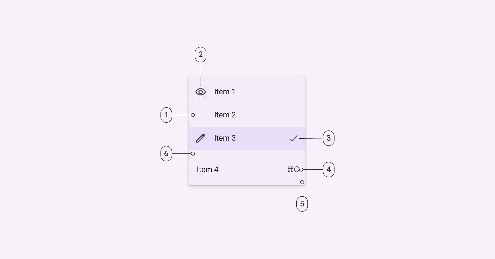

*List item; List item leading icon; List item trailing icon; Container; List item trailing text; Divider*

### Color

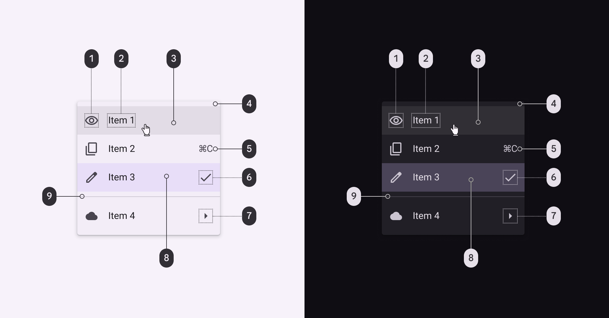

*On surface variant; On surface; On surface - opacity: 0.08; Surface container; On surface variant; On surface variant; On surface variant; Surface container highest; Outline variant*

### States

#### Default menu items

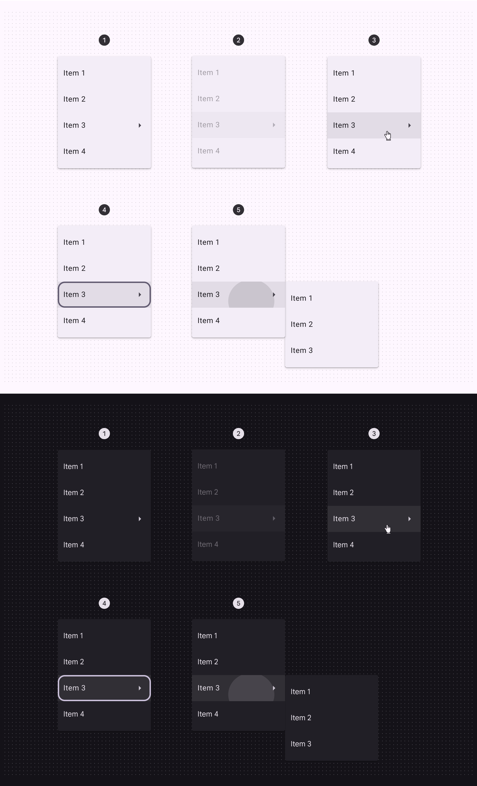

*Enabled; Disabled; Hovered; Focused; Pressed*

#### Selected menu items

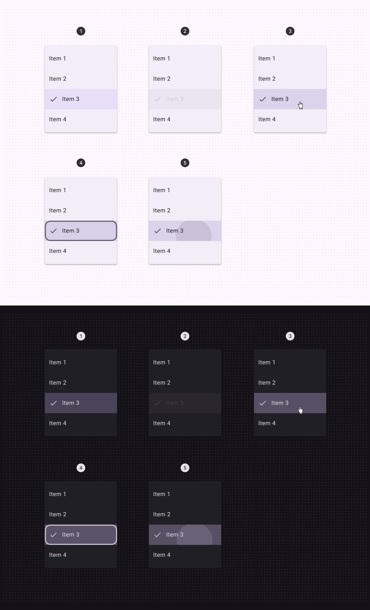

*Enabled; Disabled; Hovered; Focused; Pressed*

[State specs are in the token module above](https://m3.material.io/m3/pages/menus/specs#c811d2fa-469a-4e4e-9d9f-0f535c5c9b4c)

### Measurements

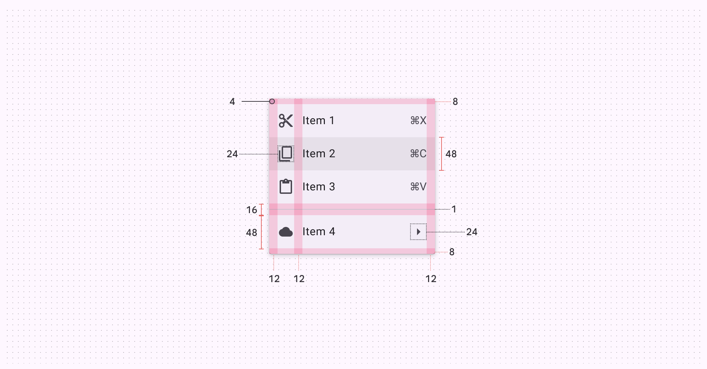

*Baseline menu padding and size measurements*

| Attribute | Value |
| --- | --- |
| Container width | 112dp min, 280dp max |
| Corner radius | 4dp |
| Vertical label text alignment | Center-aligned |
| Horizontal label text alignment | Start-aligned |
| Left/right padding | 12dp |
| Left/right padding with-icon | 12dp |
| List item height | 48dp |
| Padding between elements within a list item | 12dp |
| Divider top/bottom padding | 8dp |
| Divider height | 1dp |
| Divider width | Dynamic |
| Leading/trailing icon size | 24dp |

### Configurations

A baseline menu appears when a person interacts with a button, action, or other control.

A few examples:

1. Button (Buttons let people take action and make choices with one tap. [More on buttons](https://m3.material.io/m3/pages/common-buttons/overview))
2. Text field (Text fields let users enter text into a UI. [More on text fields](https://m3.material.io/m3/pages/text-fields/overview))
3. Icon button (Icon buttons help people take minor actions with one tap. [More on icon buttons](https://m3.material.io/m3/pages/icon-buttons/overview))
4. Selected text

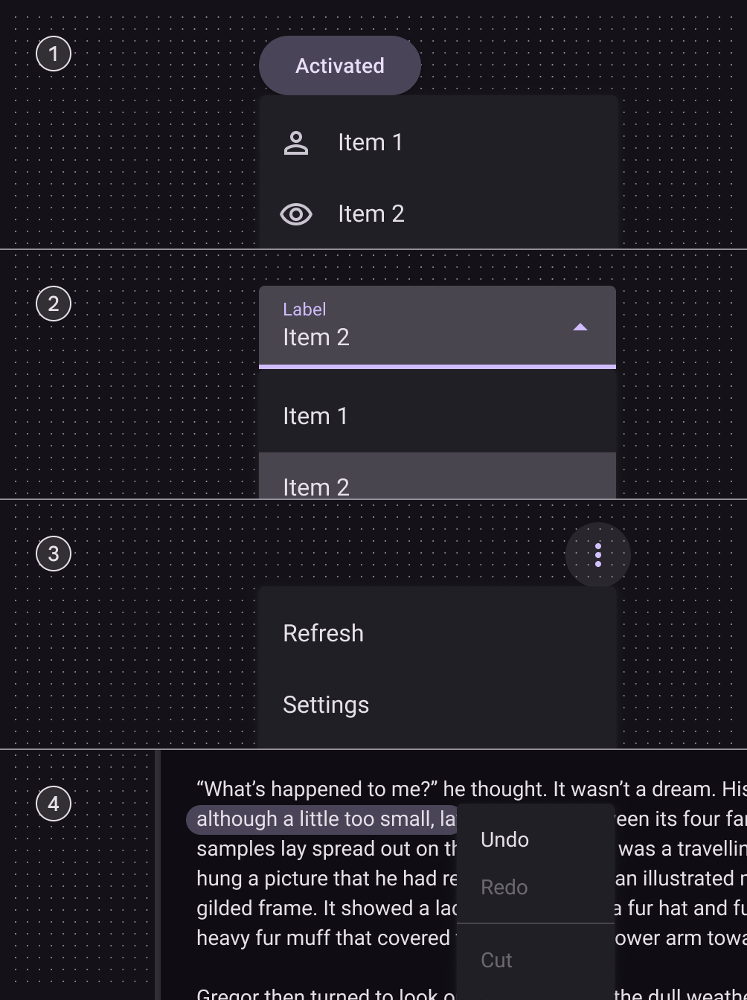
