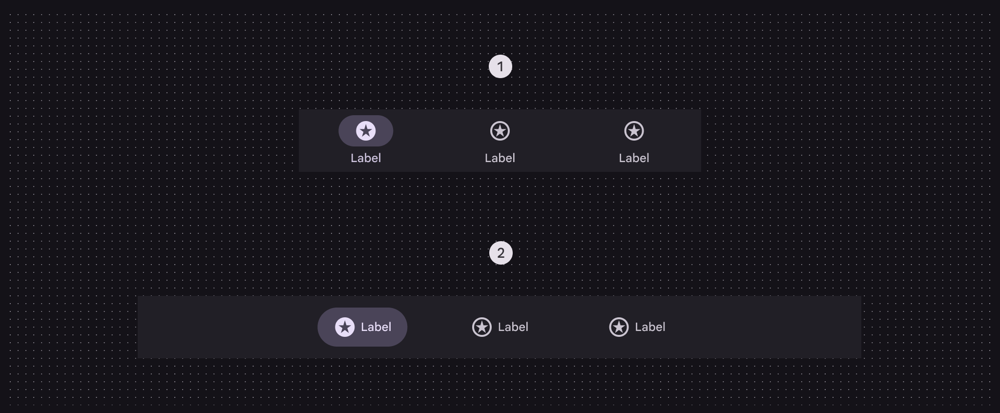
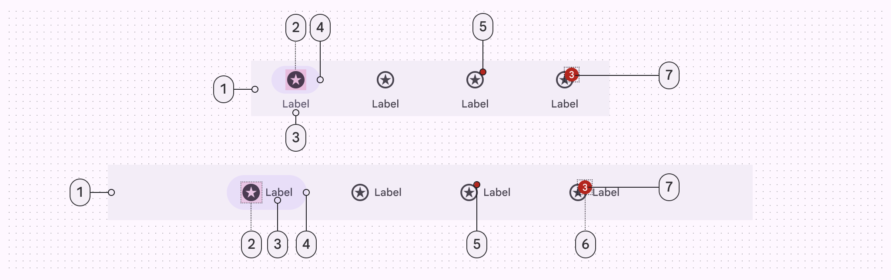
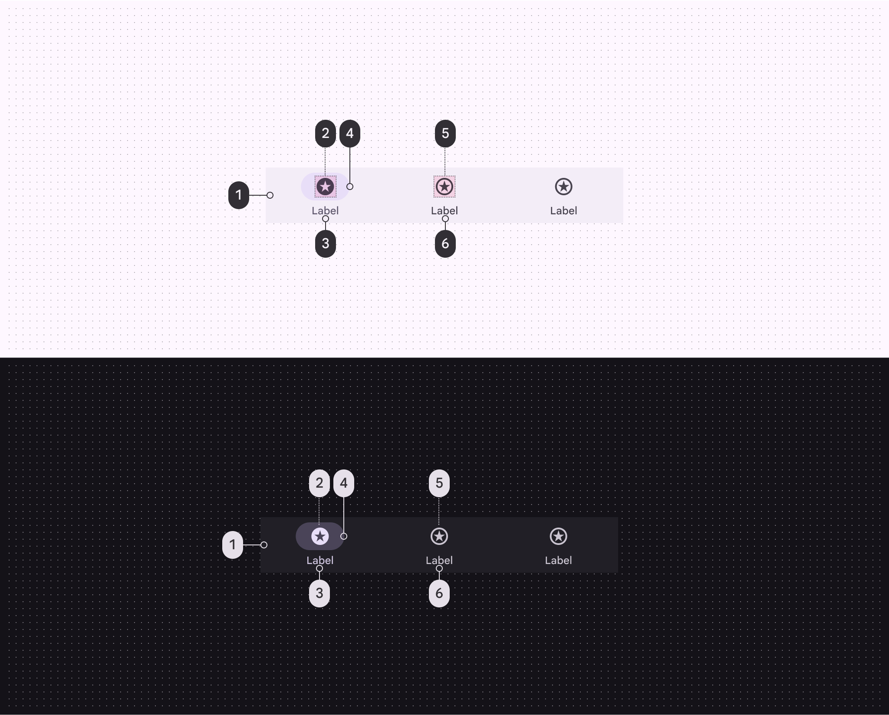
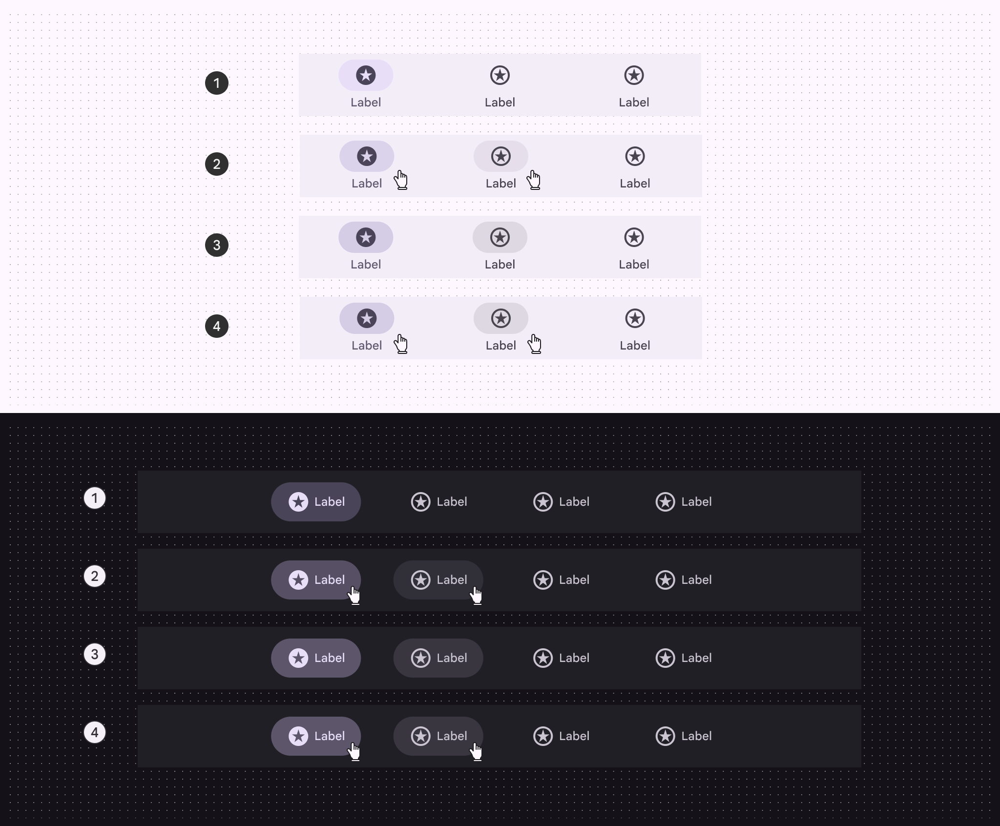
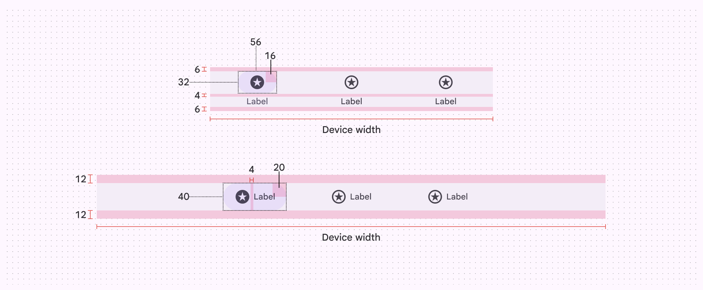
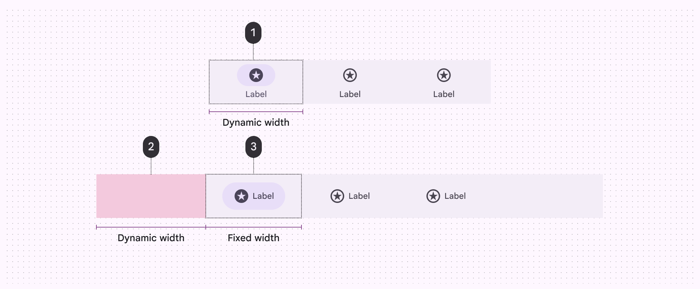
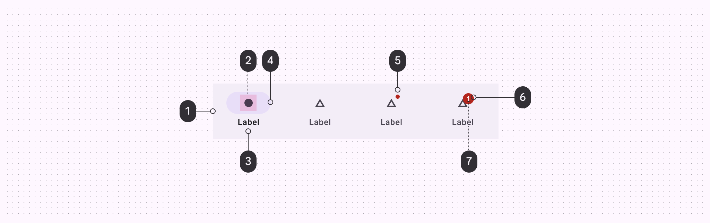
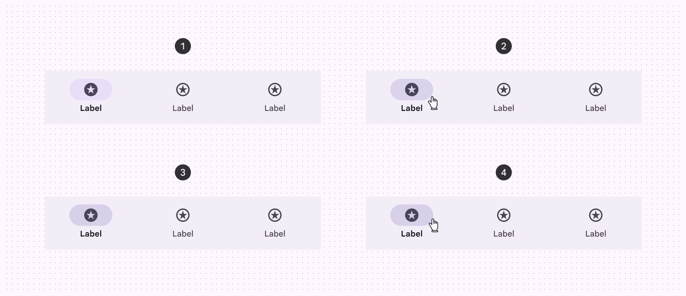
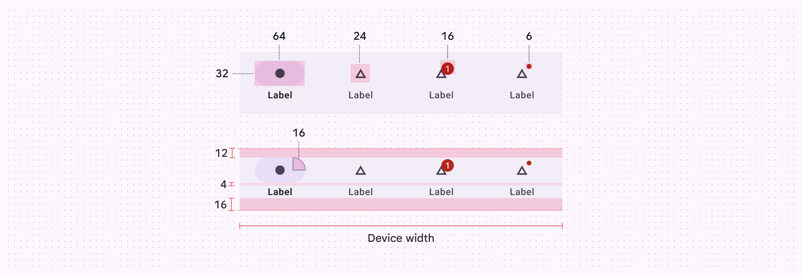
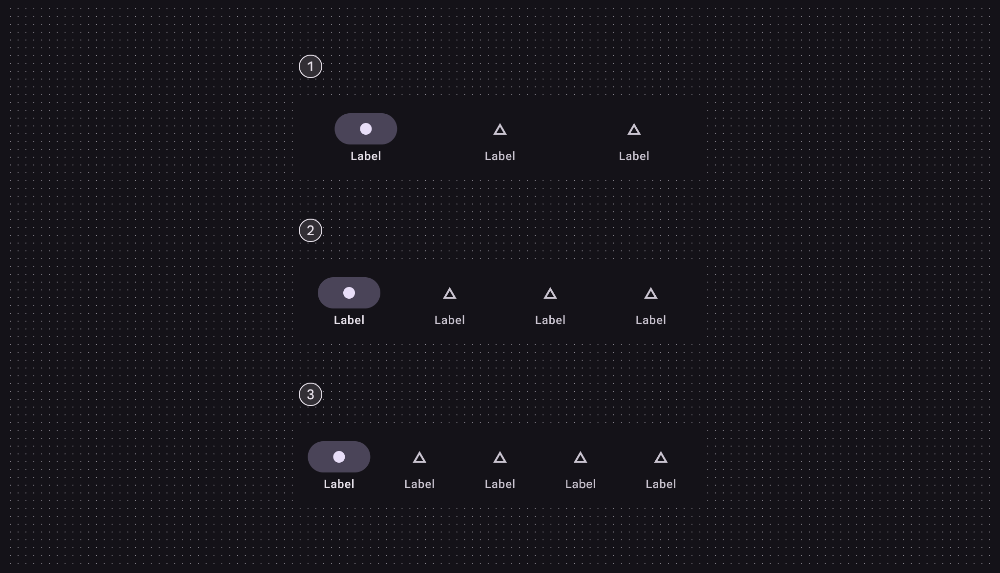

# Navigation bar

Source: https://m3.material.io/components/navigation-bar/specs

## Variants

*Flexible navigation bar*

### Baseline variants

The baseline nav bar is no longer recommended, and should be replaced by the flexible nav bar, which is shorter and supports horizontal navigation items in medium windows. [View baseline nav bar specs](https://m3.material.io/m3/pages/navigation-bar/specs#46dc2521-acf0-44e3-bbc0-78dc225b9749)

*Navigation bar (not recommended)*

| Variant | M3 | M3 Expressive |
| --- | --- | --- |
| Flexible navigation bar | -- | Available |
| Navigation bar | Available | Not recommended. Use flexible navigation bar. |

## Configurations

In compact windows, navigation bars use vertical items. In medium windows, navigation bars should use horizontal items.

*Vertical navigation items; Horizontal navigation items*

| Category | Configuration | M3 | M3 Expressive |
| --- | --- | --- | --- |
| Navigation item layout | Vertical (default) | Available | Available |
| Navigation item layout | Horizontal | -- | Available |

## Tokens & specs

Use the table's menu to switch between token sets for the navigation bar and the nav items. [Learn about design tokens](https://m3.material.io/m3/pages/design-tokens/overview/)

- Token sets: Nav bar - Common; Nav bar - Item - Vertical; Nav bar - Item - Horizontal
- Columns: Token; Value
- Visible groups: Color; Nav item; Container

## Anatomy

*Container; Icon; Label text; Active indicator; Small badge (optional); Large badge (optional); Large badge label*

## Color

Color values are implemented through design tokens. For designers, this means working with color values that correspond with tokens; in implementation, a color value will be a token that references a value. [Learn more about design tokens](https://m3.material.io/m3/pages/design-tokens/overview)

*Surface container; On-secondary container; Secondary; Secondary container; On-surface variant; On-surface variant*

For badge color roles, go to [badge specs](https://m3.material.io/m3/pages/badges/specs).

## States

States are visual representations used to communicate the status of a component or an interactive element.

*Enabled; Hovered (8% state layer); Focused (10% state layer); Pressed (10% state layer)*

## Measurements

The navigation bar stretches the full window width.

*Navigation bar padding and size measurements*

Vertical navigation items dynamically change width to equally fit the container. Horizontal navigation items have a fixed width, so extra space is added to the ends of the navigation bar instead.

*Vertical navigation item; Margin from window edge; Horizontal navigation item*

## Baseline navigation bar

*Container; Icon; Label text; Active indicator; Small badge; Large badge; Large badge label*

### Tokens & specs

These tokens are for the baseline navigation bar.

- Token sets: Navigation bar (baseline); Nav bar - Common; Nav bar - Item - Vertical; Nav bar - Item - Horizontal
- Columns: Token; Value
- Visible groups: Enabled

### Color

Color values are implemented through design tokens. For designers, this means working with color values that correspond with tokens; in implementation, a color value will be a token that references a value. [Learn more about design tokens](https://m3.material.io/m3/pages/design-tokens/overview)

*Surface; On secondary container; On surface; Secondary container; On surface variant; On surface variant*

For badge color roles, go to [badge specs](https://m3.material.io/m3/pages/badges/specs).

### States

States are visual representations used to communicate the status of a component or an interactive element.

*Enabled; Hovered; Focused; Pressed*

## Measurements

*Navigation bar padding and size measurements*

*Navigation bar target size and margins*

## Configurations

*3 destinations; 4 destinations; 5 destinations*
