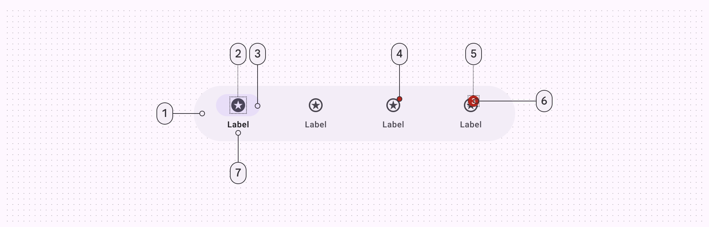
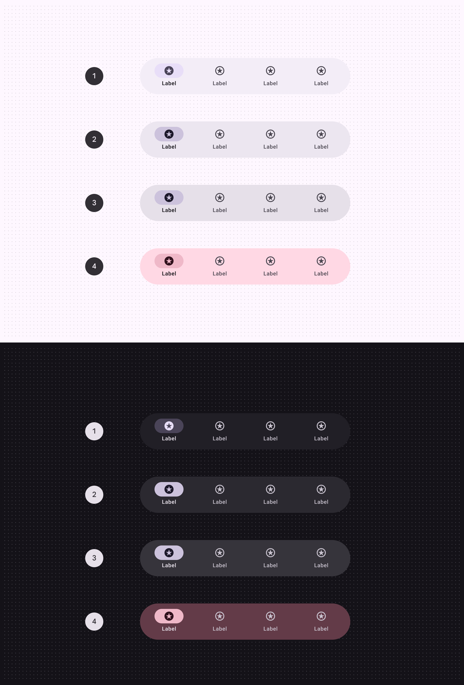
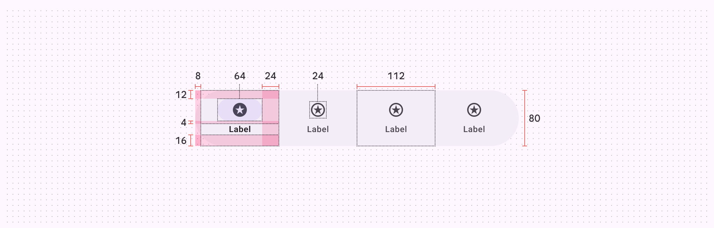

# Navigation bar

Source: https://m3.material.io/components/navigation-bar/xr

Extended reality (XR) interfaces have special design requirements, like showing apps in 3D space. Material has an XR-specific navigation bar with custom specs and guidance. See [XR developer documentation](http://developer.android.com/design/ui/xr/guides/foundations) for more details.

## Anatomy

*Container; Icon; Active indicator; Small badge (optional); Large badge (optional); Large badge label (optional); Label text*

## Color & elevation

On XR, color is used to highlight elevated UI elements and orbiters (Orbiters are floating elements that control the content within spatial panels. [More on orbiters](https://developer.android.com/design/ui/xr/guides/spatial-ui#orbiters)). With [spatial elevation](https://developer.android.com/design/ui/xr/guides/spatial-ui#spatial-elevation), the navigation bar displays above the spatial panel (In Android XR, a spatial panel is a container for UI elements, interactive components, and immersive content. [More on spatial panels](https://developer.android.com/design/ui/xr/guides/spatial-ui#spatial-panels)), on the Z-axis. Color communicates elevation on UI elements and orbiters. Elevated nav bars can use any of these color options:

*Surface container; Surface container high; Surface container highest; Tertiary container*

## Measurements

*Navigation bar orbiter padding and measurements*

## Usage

In full space (Full space is Android XR’s immersive mode and supports spatial components. [More on full space](https://developer.android.com/design/ui/xr/guides/foundations#modes)), a navigation bar can appear in an orbiter (Orbiters are floating elements that control the content within spatial panels. [More on orbiters](https://developer.android.com/design/ui/xr/guides/spatial-ui#orbiters)) for a more immersive experience. Currently, spatial capabilities, such as orbiters, are only available in full space. In home space (Home space is compatible with mobile and large screen apps, but doesn’t support spatial components. [More on home space](https://developer.android.com/design/ui/xr/guides/foundations#modes)), use a regular navigation bar on the same plane as the body content to mimic a 2D experience.

Navigation bar behavior and placement changing when going from a 2D to a 3D experience

## Behavior

### Global context

When placed in global context, the navigation bar orbiter is centered at the bottom of the app it controls. It stays anchored to the app during layout or content changes. This ensures navigation elements are easy to find and use.

A navigation bar orbiter centered and anchored to the bottom of the app

### Local context

When placed in local context, the navigation bar orbiter is centered at the bottom of the spatial panel it controls. It repositions in response to layout or content changes.

Caution Use caution before placing a navigation bar in local context. If it contains navigation elements that affect the overall app, a navigation bar orbiter should be placed in global context.

## Placement

### Navigation context

The position of the navigation bar orbiter should communicate its navigational context:

- Use offset positioning for global actions that affect the overall app experience
- Use inset positioning for local actions that are specific to a spatial panel

A navigation bar orbiter can either overlap or be positioned adjacent to spatial panels with a 20dp margin for visual separation.

Position the navigation bar orbiter to reflect context: offset for global actions, inset for spatial panel-specific actions

### Inset positioning

Don’t obstruct content. To ensure a balanced and uncluttered layout, a navigation bar orbiter should overlap spatial panels by 12dp and no more than half their height.

Don’t Avoid overlapping an inset a navigation bar orbiter by more than half its height

### Horizontal alignment

The navigation bar orbiter placement shouldn't exceed the width of adjacent spatial panels.

[Video: Nav bar orbiter placement that exceeds the width of its spatial panel.](assets/asset-004-don-t-the-navigation-bar-orbiter-shouldn-t-5dda62de2f.webp)

*Don’t The navigation bar orbiter shouldn’t exceed the width of the spatial panel*

### Spatial panel alignment

A navigation bar orbiter should always be placed at the bottom of a spatial panel and within the immediate field of view (FOV). Follow common usability practices to make the experience easy to use and consistent across platforms. Avoid placing the navigation bar orbiter at the top of a spatial panel, as this area is typically reserved for app bar orbiters or other critical UI elements.

[Video: Nav bar orbiter incorrectly placed above a spatial panel.](assets/asset-005-don-t-don-t-position-a-navigation-bar-c04ddb6fa9.webp)

*Don’t Don't position a navigation bar orbiter at the top of a spatial panel. Position it at the bottom in the field of view to maintain usability and minimize interaction effort.*

## Accessibility considerations

[XR accessibility](https://developer.android.com/design/ui/xr/guides/get-started#make-app) guidelines are still evolving. XR navigation bars should follow applicable Material [nav bar accessibility standards](https://m3.material.io/m3/pages/navigation-bar/accessibility).
