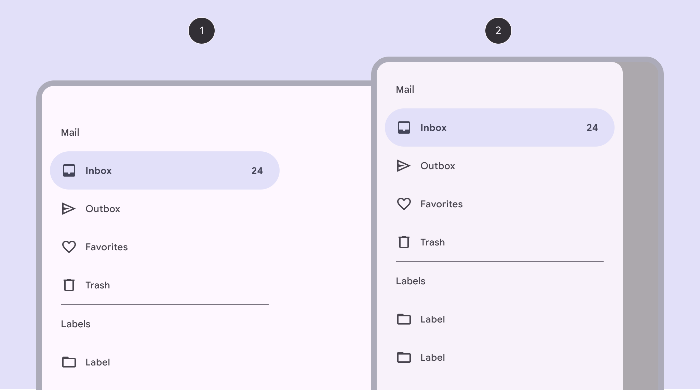
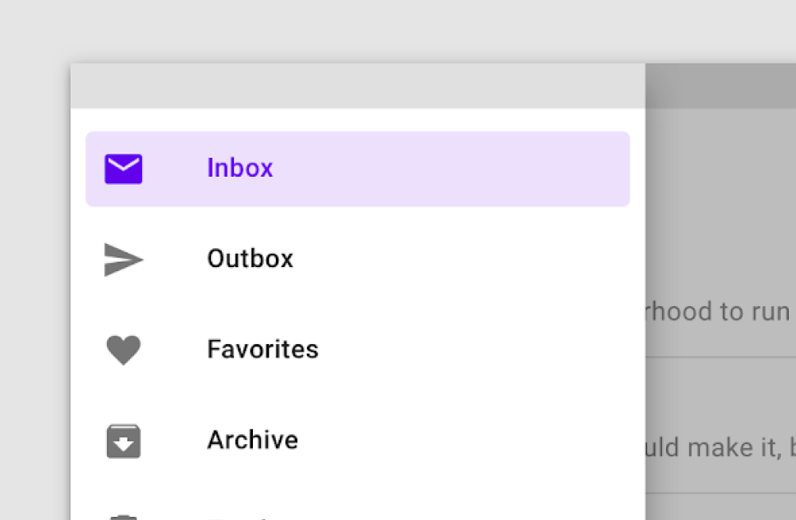
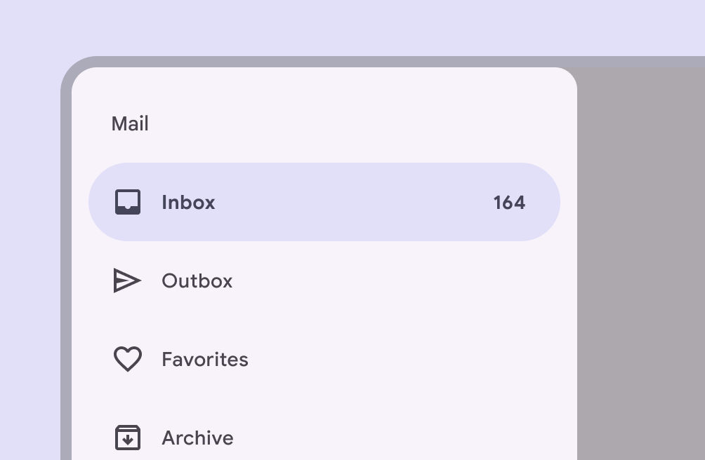

# Navigation drawer

Source: https://m3.material.io/components/navigation-drawer/overview

- Use standard navigation drawers in expanded (Window widths 840dp to 1199dp, such as a tablet or foldable in landscape orientation, or desktop. [More on expanded window size class](https://m3.material.io/m3/pages/applying-layout/expanded)), large (Window widths 1200dp to 1599dp, such as desktop. [More on large window size class](https://m3.material.io/m3/pages/applying-layout/large-extra-large)), and extra-large window sizes (Window widths 1600dp and larger, such as ultra-wide monitors. [More on extra-large window size class](https://m3.material.io/m3/pages/applying-layout/large-extra-large))
- Use modal navigation drawers in compact (Window widths smaller than 600dp, such as a phone in portrait orientation. [More on compact window size class](https://m3.material.io/m3/pages/applying-layout/compact)) and medium (Window widths from 600dp to 839dp, such as a tablet or foldable in portrait orientation. [More on medium window size class](https://m3.material.io/m3/pages/applying-layout/medium)) window sizes
- Can be open or closed by default
- Two variants: standard and modal
- Put the most frequent destinations at the top and group related destinations together

*Standard navigation drawer; Modal navigation drawer*

## Availability & resources

| Type | Resource | Status |
| --- | --- | --- |
| Design | [Design Kit (Figma)](https://www.figma.com/community/file/1035203688168086460) | Available |
| Implementation | [Flutter](https://api.flutter.dev/flutter/material/NavigationDrawer-class.html) | Available |
| Implementation | [Jetpack Compose](https://developer.android.com/develop/ui/compose/components/drawer) | Available |
| Implementation | [MDC-Android](https://github.com/material-components/material-components-android/blob/master/docs/components/NavigationDrawer.md) | Available |
| Implementation | Web | Unavailable |

## M3 Expressive update

May 2025

The navigation drawer is no longer recommended. Use the expanded navigation rail (Expanded navigation rails show text labels and an extended FAB, and can be default or modal. [More on navigation rails](https://m3.material.io/m3/pages/navigation-rail/overview)) instead. [More on M3 Expressive](https://m3.material.io/blog/building-with-m3-expressive)

## Differences from M2

- Color: New color mappings and compatibility with dynamic color (Dynamic color takes a single color from a user's wallpaper or in-app content and creates an accessible color scheme assigned to elements in the UI. [More on dynamic color](https://m3.material.io/m3/pages/dynamic/choosing-a-source))
- Variants: Distinguishes two separate variants of navigation drawer: Standard and modal
- Shape: Rounded corners at the ending edge of the drawer
- States (States show the interaction status of a component or UI element. [More on states](https://m3.material.io/m3/pages/interaction-states/overview)): Updated color and shape for indicating selected state

*M2: Navigation drawer had square corners and a rectangular shape indicating the active destination*

*M3: Navigation drawer has rounded corners, new color mappings, and an updated style for indicating the active destination*
