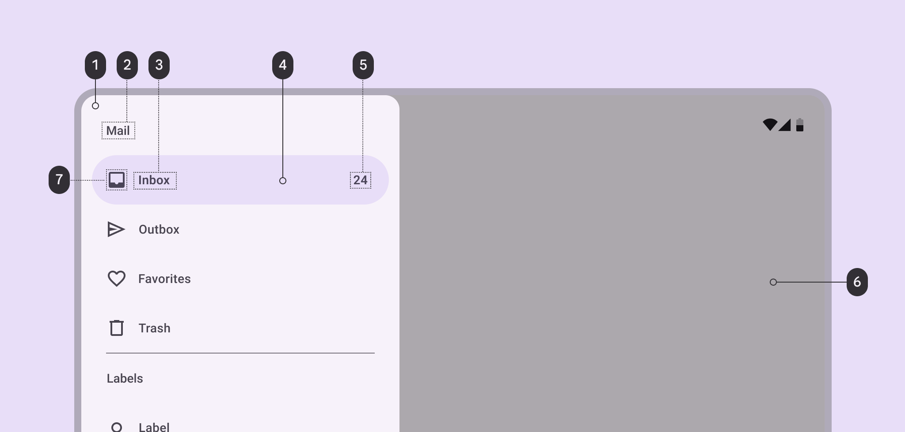
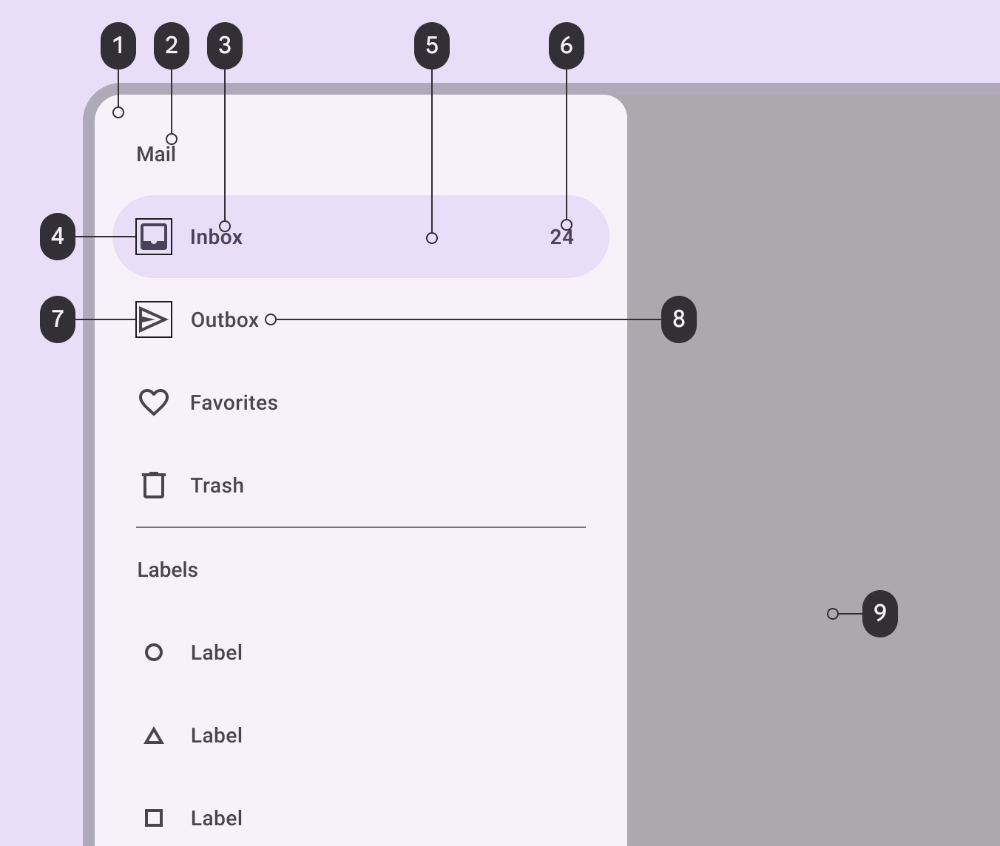
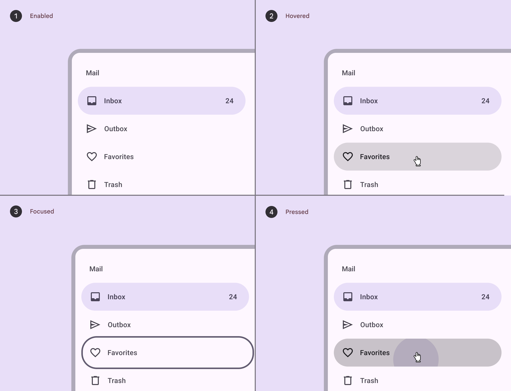
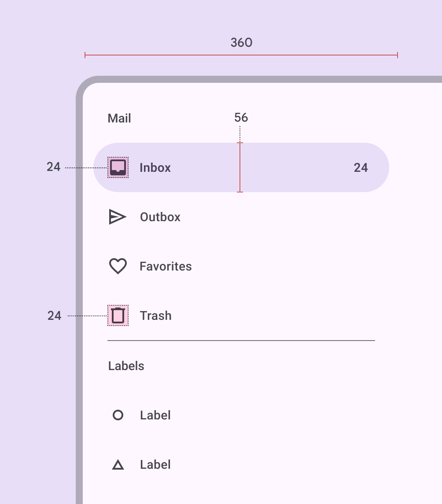
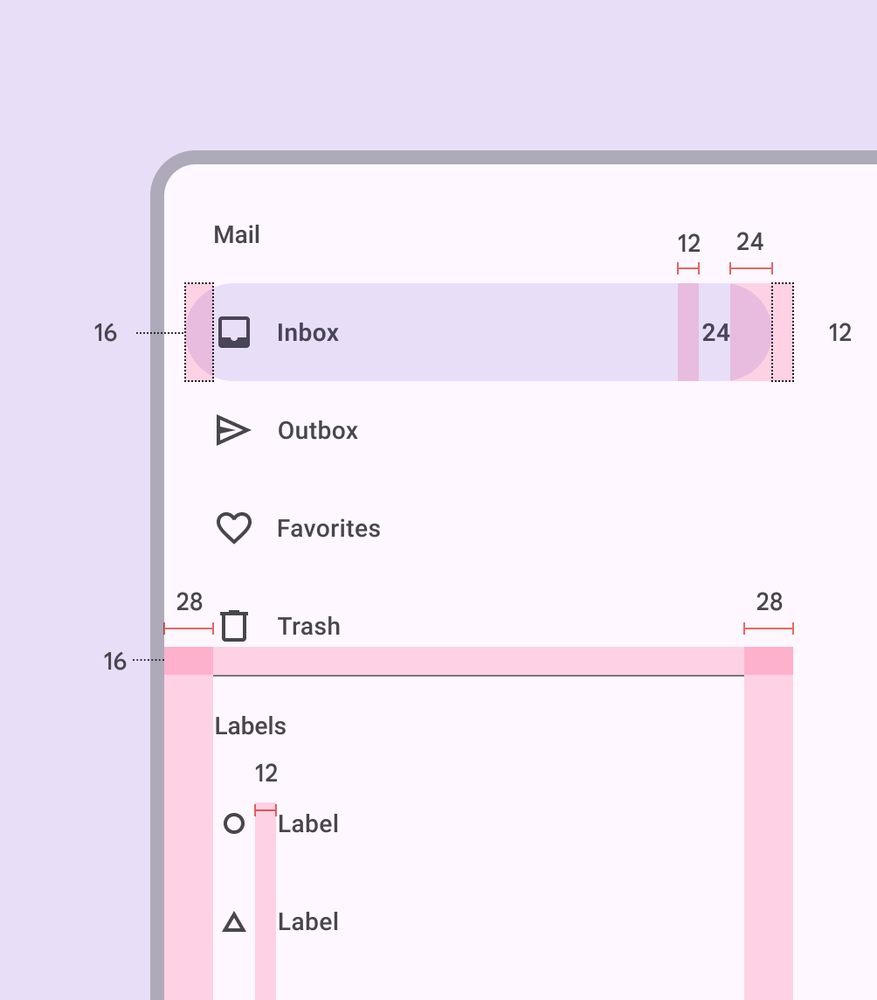
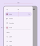
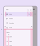

# Navigation drawer

Source: https://m3.material.io/components/navigation-drawer/specs

*Container; Headline; Label text; Active indicator; Badge label text; Scrim; Icon*

## Tokens & specs

The navigation drawer has one token set. [Learn about design tokens](https://m3.material.io/m3/pages/design-tokens/overview/)

- Columns: Token
- Visible groups: Enabled; Hovered; Focused; Pressed (ripple)

## Color

Color values are implemented through design tokens (Design tokens are the building blocks of all UI elements. The same tokens are used in designs, tools, and code. [More on tokens](https://m3.material.io/m3/pages/design-tokens/overview)). For design, this means working with color values that correspond with tokens. For implementation, a color value will be a token that references a value. [Learn more about design tokens](https://m3.material.io/m3/pages/design-tokens/overview)

*Surface container low; On surface variant; On secondary container; On secondary container; Secondary container; On secondary container; On surface variant; On surface variant; Scrim*

For divider color roles, go to [divider specs](https://m3.material.io/m3/pages/divider/specs).

## States

States (States show the interaction status of a component or UI element. [More on states](https://m3.material.io/m3/pages/interaction-states/overview)) are visual representations used to communicate the status of a component or interactive element. [Learn more about interaction states](https://m3.material.io/m3/pages/interaction-states/overview)

*Enabled; Hovered; Focused; Pressed*

[State specs are in the tokens module above](https://m3.material.io/m3/pages/navigation-drawer/specs#6207b00f-a259-41d2-8146-b6efc6380976)

## Measurements

### Standard navigation drawer

*Element size measurements*

*Padding and margins*

| Attribute | Value |
| --- | --- |
| Container height | 100% |
| Container width | 360dp |
| Container shape | 0,16,16,0dp corner radii |
| Icon size | 24dp |
| Active indicator height | 56dp |
| Active indicator shape | 28dp |
| Active indicator width | 336dp |
| Horizontal label alignment | Start-aligned |
| Left padding | 28dp |
| Right padding | 28dp |
| Active indicator padding | 12dp |
| Padding between elements | 0dp |

### Modal navigation drawer

*Element size measurements*

*Padding and margins*

| Attribute | Value |
| --- | --- |
| Container height | 100% |
| Container width | 360dp |
| Icon size | 24dp |
| Active indicator height | 56dp |
| Active indicator shape | 28dp |
| Active indicator width | 336dp |
| Horizontal label alignment | Start-aligned |
| Left padding | 28dp |
| Right padding | 28dp |
| Active indicator padding | 12dp |
| Padding between elements | 0dp |
