# Navigation rail

Source: https://m3.material.io/components/navigation-rail/specs

## Variants

*Collapsed navigation rail; Expanded navigation rail*

### Baseline variants

The baseline navigation rail is no longer recommended, and should be replaced by the collapsed navigation rail. [View baseline tokens](https://m3.material.io/m3/pages/navigation-rail/specs#d4d97764-20ec-496f-a6f3-0d423940ec5a)

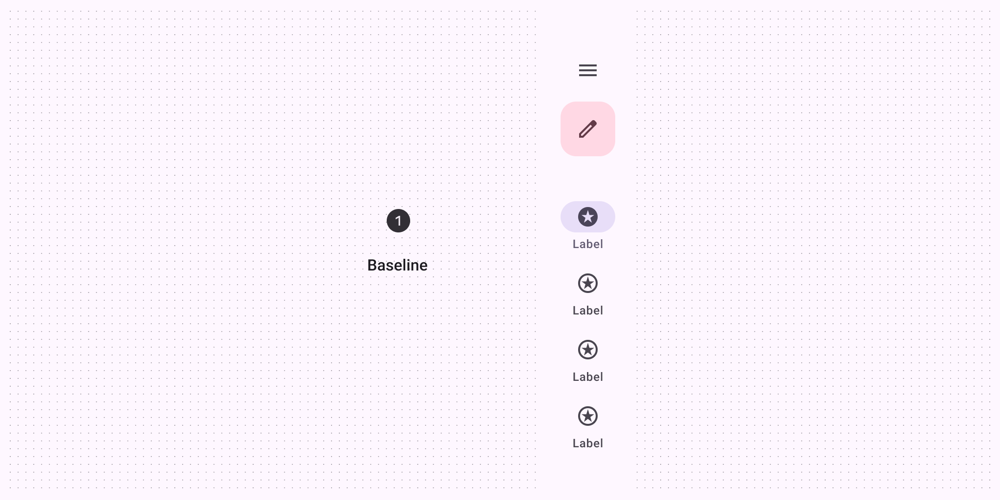

*The baseline navigation rail is no longer recommended*

| Variant | M3 | M3 Expressive |
| --- | --- | --- |
| Collapsed navigation rail | -- | Available |
| Expanded navigation rail | -- | Available |
| Navigation rail (baseline) | Available | Not recommended. Use collapsed navigation rail. |

## Configurations

*Expanded layout: standard; Expanded layout: modal*

| Category | Configuration | M3 | M3 Expressive |
| --- | --- | --- | --- |
| Expanded layout | Standard (default) | Available as navigation drawer (Navigation drawers let people switch between UI views on larger devices. In the expressive update, use an expanded navigation rail. [More on navigation drawers](https://m3.material.io/m3/pages/navigation-drawer/overview)) | Available |
| Expanded layout | Modal | Available as navigation drawer (Navigation drawers let people switch between UI views on larger devices. In the expressive update, use an expanded navigation rail. [More on navigation drawers](https://m3.material.io/m3/pages/navigation-drawer/overview)) | Available |
| Expanded behavior | Hide when collapsed | -- | Available |

## Tokens & specs

Browse the component elements, attributes, tokens, and their values. [Learn about design tokens](https://m3.material.io/m3/pages/design-tokens/overview/)

- Token sets: Nav rail - Common; Nav rail - Collapsed; Nav rail - Expanded; Nav rail item - Common; Nav rail item - Vertical; Nav rail item - Horizontal
- Columns: Token
- Visible groups: Enabled; Hovered; Focused; Pressed

## Anatomy

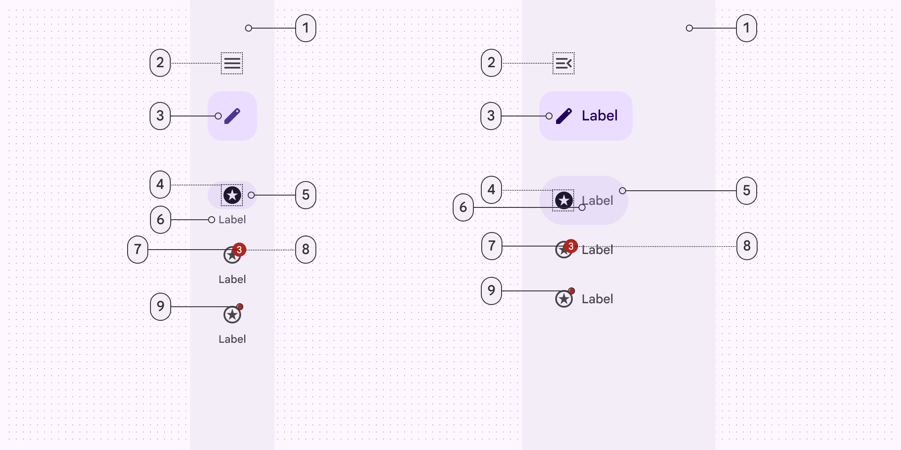

*Container; Menu (optional); FAB or Extended FAB (optional); Icon; Active indicator; Label text; Large badge (optional); Large badge label (optional); Small badge (optional)*

## Color

Color values are implemented through design tokens. For designers, this means working with color values that correspond with tokens; in implementation, a color value will be a token that references a value. [Learn more about design tokens](https://m3.material.io/m3/pages/design-tokens/overview)

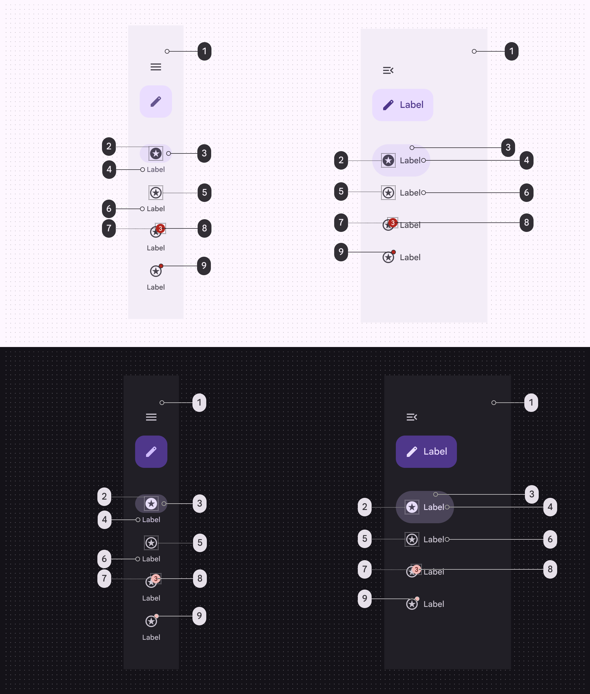

*Surface container (optional); On secondary container; Secondary container; Secondary (vertical), On secondary container (horizontal); On surface variant; On surface variant; Error; On error; Error*

## States

States (States show the interaction status of a component or UI element. [More on states](https://m3.material.io/m3/pages/interaction-states/overview)) are visual representations used to communicate the status of a component or an interactive element. The navigation item’s target area always spans the full width of the nav rail, even if the item container hugs its contents.

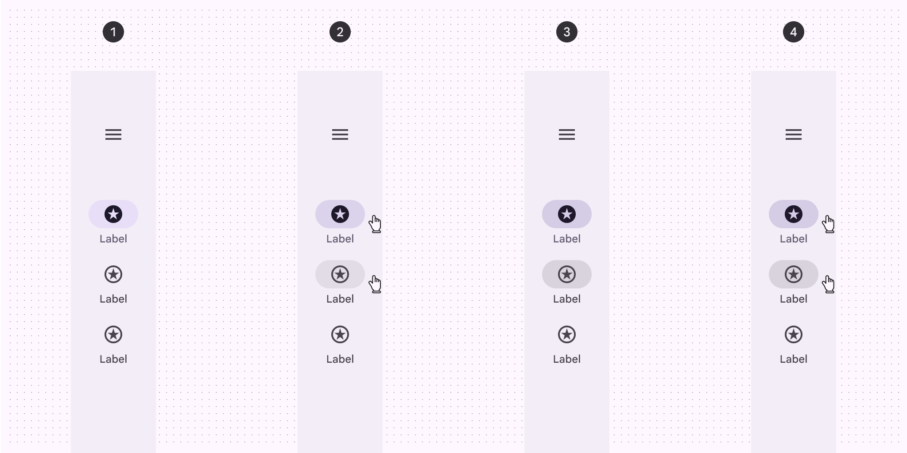

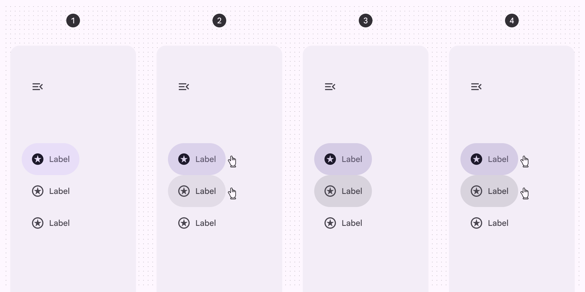

*Enabled; Hovered; Focused; Pressed*

## Measurements

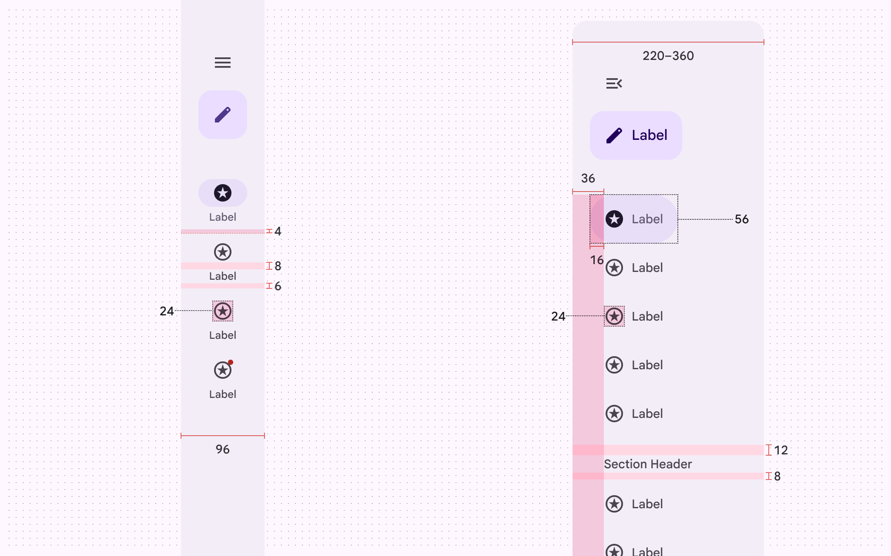

*Navigation rail padding and size measurements*

## Common layouts

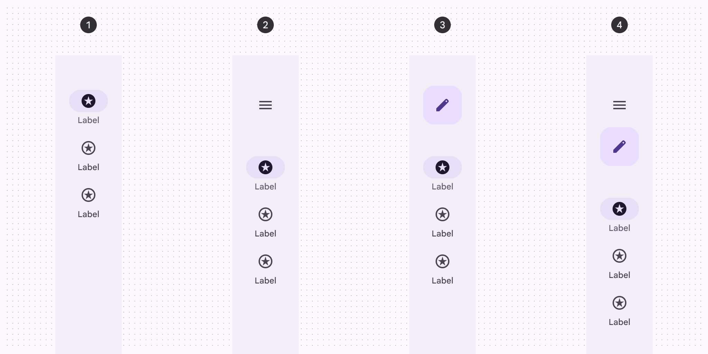

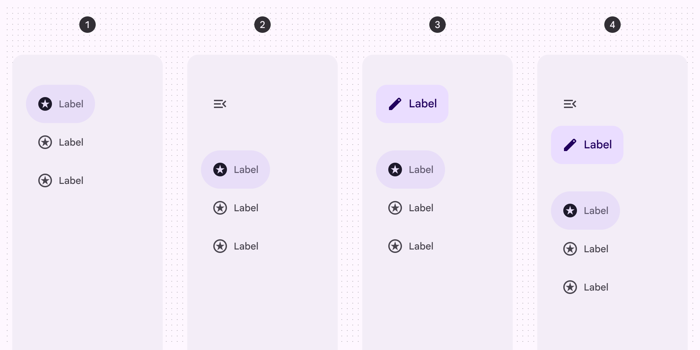

*Three navigation items; Three navigation items with a menu; Three navigation items with a FAB; Three navigation items with a menu and FAB*

## Baseline navigation rail

*Container; Menu icon (optional); Icon; Active indicator; Label text; Large badge label (optional); Large badge (optional); Badge (optional)*

### Tokens & specs

- Token sets: Navigation rail (baseline); Nav rail item - Horizontal; Nav rail item - Common; Nav rail - Common; Nav rail - Collapsed; Nav rail - Expanded; Nav rail item - Vertical
- Columns: Token; Value
- Visible groups: Enabled; Hovered; Focused; Pressed (ripple)

### Color

Color values are implemented through design tokens. For design, this means working with color values that correspond with tokens. For implementation, a color value will be a token that references a value. [Learn more about design tokens](https://m3.material.io/m3/pages/design-tokens/overview)

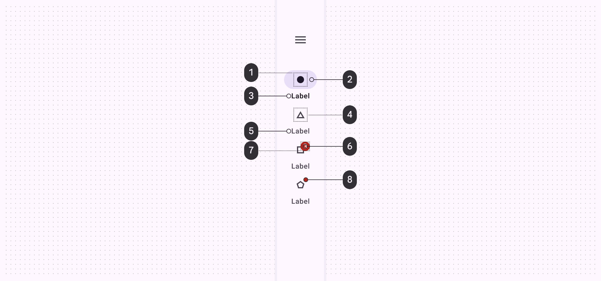

*On secondary container; Secondary container; On surface; On surface variant; On surface variant; Error; On error; Error*

### States

States are visual representations used to communicate the status of a component or interactive element.

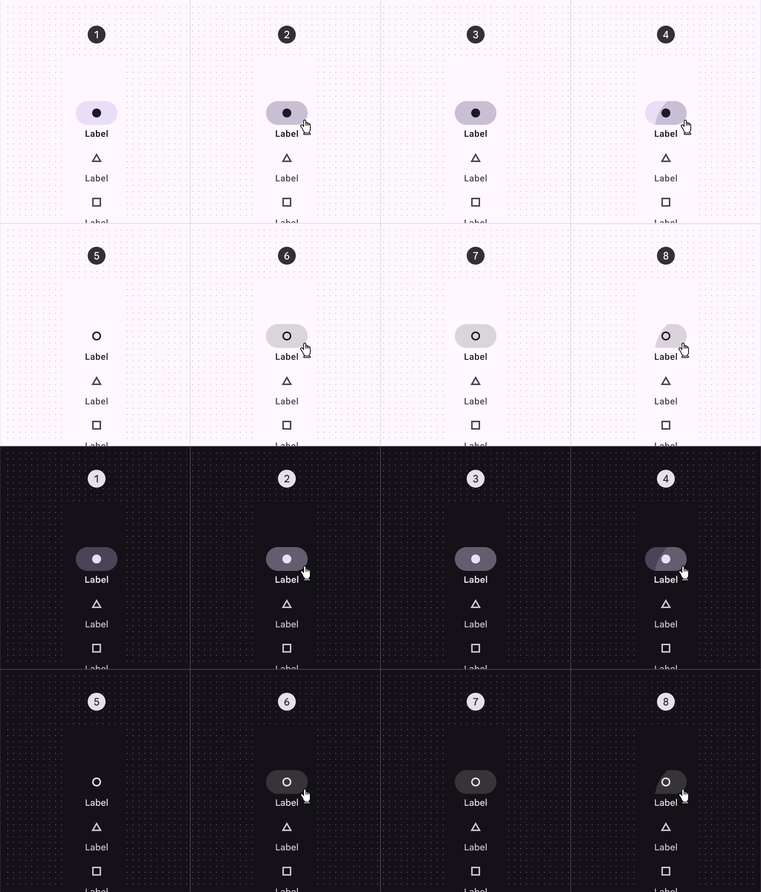

*Enabled (on active destination); Hovered (on active destination); Focused (on active destination); Pressed (on active destination); Enabled (on inactive destination); Hovered (on inactive destination); Focused (on inactive destination); Pressed (on inactive destination)*

### Measurements

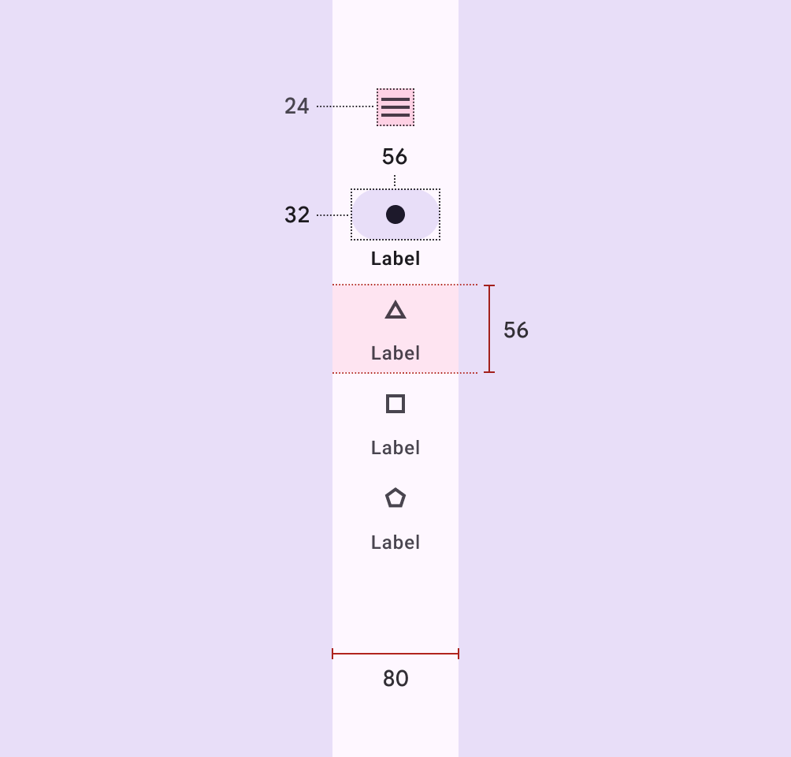

*Navigation rail size measurements*

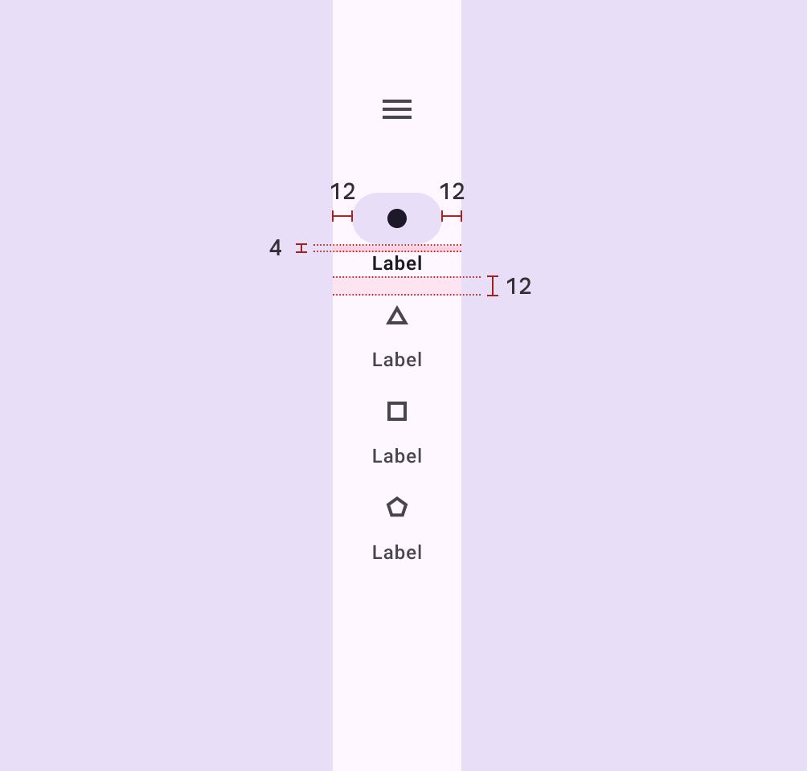

*Navigation rail padding and margin measurements*

### Configurations

Common arrangements of elements within a navigation rail.

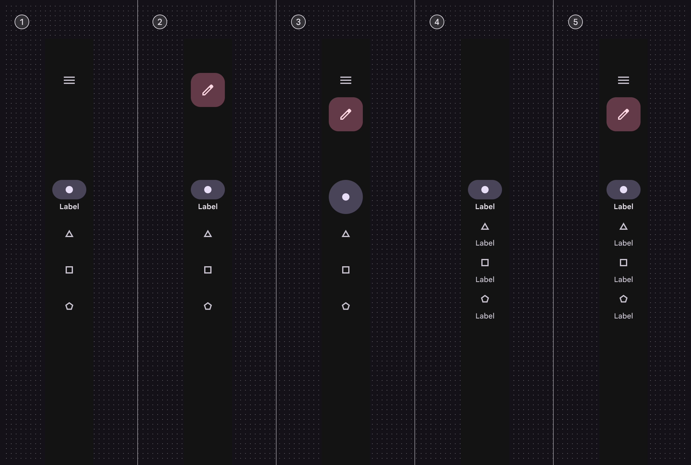

*With a menu; With a FAB; With menu and FAB, without labels; All destinations with text labels; With menu, FAB, and label text for all destinations*
