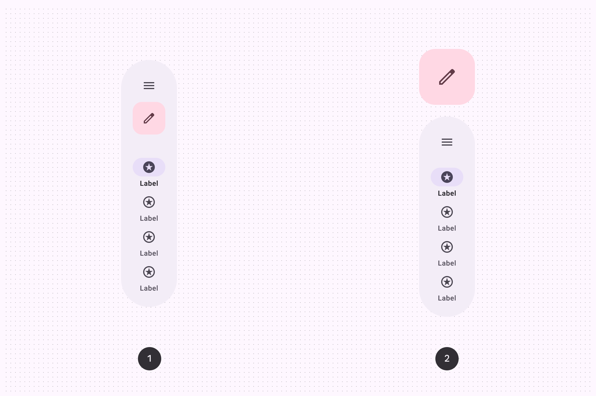
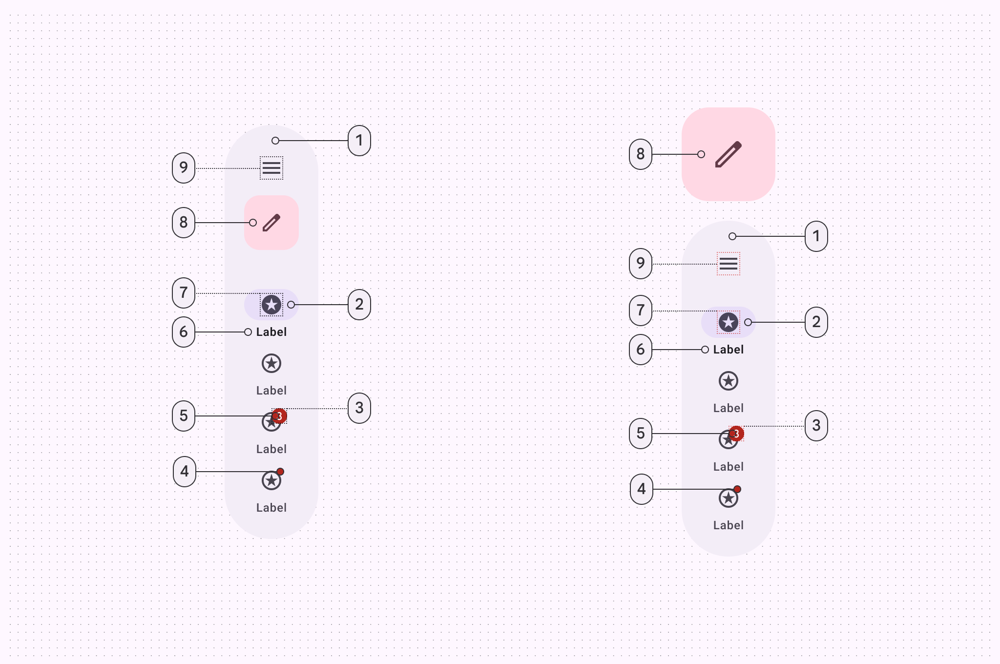
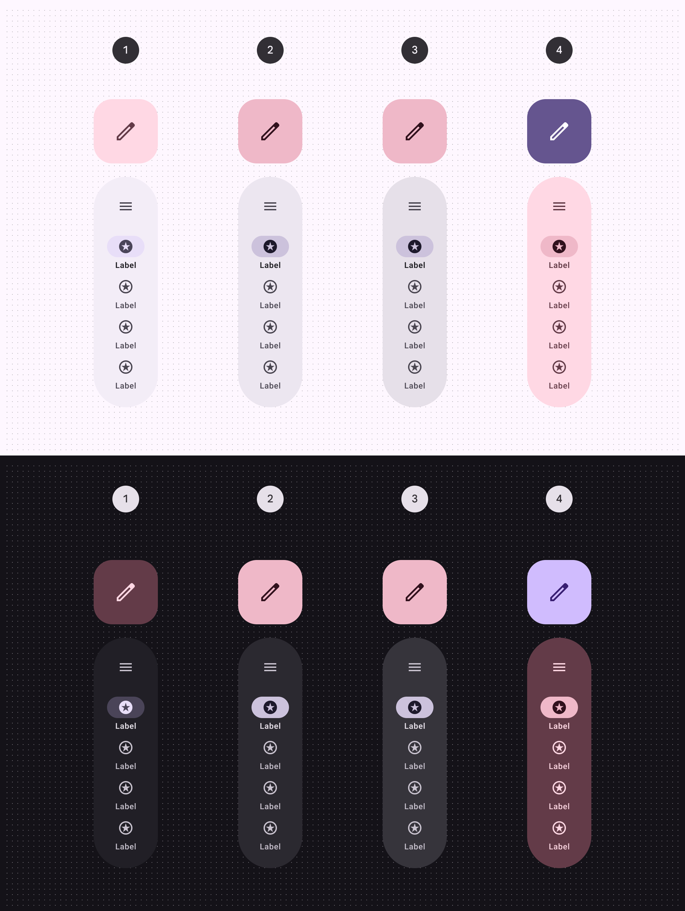
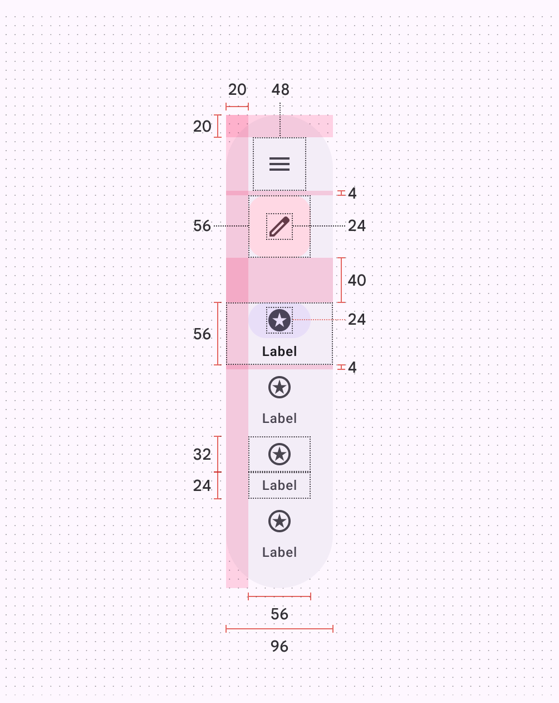
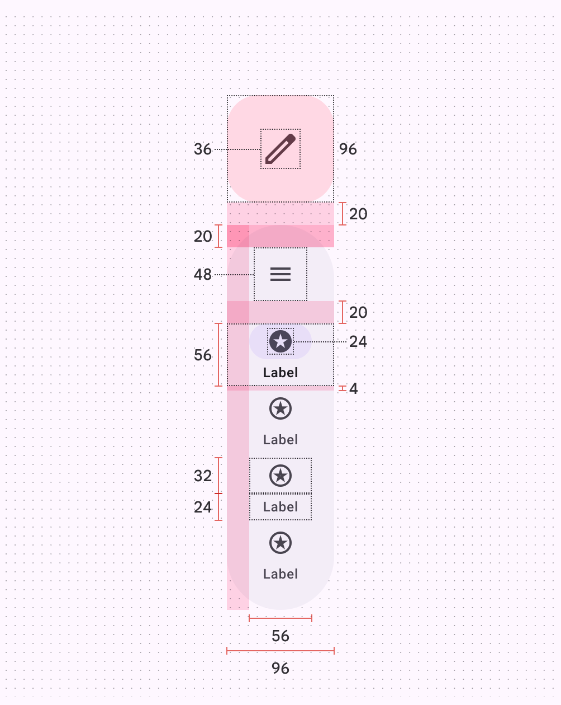

# Navigation rail

Source: https://m3.material.io/components/navigation-rail/xr

Extended reality (XR) interfaces have special design requirements, like showing apps in 3D space. Material has XR-specific navigation rails with custom specs and guidance. See [XR developer documentation](http://developer.android.com/design/ui/xr/guides/foundations) for more details.

## Variants

There are two variants of navigation rail orbiters (Orbiters are floating elements that control the content within spatial panels. [More on orbiters](https://developer.android.com/design/ui/xr/guides/spatial-ui#orbiters)): the contained FAB and spatialized FAB navigation rails.

*Contained FAB rail; Spatialized FAB rail*

## Anatomy

*Container; Active indicator; Large badge (optional); Badge (optional); Large badge label (optional); Label text; Icon; Embedded or spatialized FAB (optional); Menu icon (optional)*

## Color & elevation

On XR, color is used to highlight elevated UI elements and orbiters. With [spatial elevation](https://developer.android.com/design/ui/xr/guides/spatial-ui#spatial-elevation), the navigation bar displays above the spatial panel (In Android XR, a spatial panel is a container for UI elements, interactive components, and immersive content. [More on spatial panels](https://developer.android.com/design/ui/xr/guides/spatial-ui#spatial-panels)), on the Z-axis. Color communicates elevation on UI elements and orbiters. Elevated nav rails can use any of these color options:

*Surface container with tertiary FAB; Surface container high with tertiary fixed dim FAB; Surface container highest with tertiary fixed dim FAB; Tertiary container with primary FAB*

## Measurements

*Navigation rail orbiter padding and measurements with contained FAB*

*Navigation rail orbiter padding and measurements with spatialized FAB*

## Usage

In full space (Full space is Android XR’s immersive mode and supports spatial components. [More on full space](https://developer.android.com/design/ui/xr/guides/foundations#modes)), a navigation rail can appear in an orbiter (Orbiters are floating elements that control the content within spatial panels. [More on orbiters](https://developer.android.com/design/ui/xr/guides/spatial-ui#orbiters)) for a more immersive experience. Currently, spatial capabilities, such as orbiters, are only available in full space. In home space (Home space is compatible with mobile and large screen apps, but doesn’t support spatial components [More on home space](https://developer.android.com/design/ui/xr/guides/foundations#modes)), use a regular navigation rail on the same plane as the body content to mimic a 2D experience.

Navigation rail orbiter behavior and placement changing when going from a 2D to a 3D experience

## Behavior

### Global context

Intended for global navigation, a nav rail orbiter should be centered along the left or right edge of the app it controls. It stays anchored to the app during layout or content changes to ensure controls are easy to find.

Do A navigation rail orbiter should be placed in global context, centered and anchored to the left or right of the app

### Local context

Don’t place a navigation rail orbiter in local context or [between spatial panels](https://m3.material.io/m3/pages/navigation-rail/xr#519a112b-51d6-4200-96a9-54af92fb787d). Local placement can make controls hard to find. Nav rails are designed for app-level navigation, so should only use the global context.

Don’t Avoid placing a navigation rail orbiter in local context. It can be hard to find if placed between two spatial panels.

## Placement

### Navigation context

The position of the navigation rail orbiter should communicate its navigational context:

- Use offset positioning (Offset positioning is when orbiters are placed adjacent to spatial panels without overlap. [More on offset positioning](https://developer.android.com/design/ui/xr/guides/spatial-ui#orbiters)) for global actions that affect the overall app experience
- Use inset positioning (Inset positioning is when orbiters overlap with spatial panels. [More on inset positioning](https://developer.android.com/design/ui/xr/guides/spatial-ui#orbiters)) for local actions that are specific to a spatial panel

A navigation rail orbiter can either overlap or be positioned adjacent to spatial panels with a 20dp margin for visual separation.

Position the navigation rail orbiter to reflect context: offset for global actions, inset for spatial panel-specific actions

### Inset positioning

Don’t obstruct content. To ensure a balanced and uncluttered layout, a navigation rail orbiter should overlap spatial panels by 12dp and no more than half their width.

[Video: Nav rail orbiter overlapping content by more than half its width.](assets/asset-006-don-t-avoid-overlapping-an-inset-navigation-rail-9ccf88fa75.webp)

*Don’t Avoid overlapping an inset navigation rail orbiter by more than half its width*

### Vertical alignment

A navigation rail orbiter can be aligned to the top, middle, or center of spatialized panels, providing different levels of visual prominence and accessibility. Align the navigation rail orbiter based on the specific design and user experience goals for the application.

[Video: Nav rail orbiter positioning moving from the top, to middle, to center of spatialized panels.](assets/asset-007-align-the-navigation-rail-orbiter-at-the-top-9172bed9dc.webp)

*Align the navigation rail orbiter at the top, middle, or center of spatialized panels*

The navigation rail orbiter placement shouldn't exceed the height of adjacent spatial panels.

[Video: A nav rail orbiter positioning above its spatial panel.](assets/asset-008-don-t-the-navigation-rail-orbiter-shouldn-t-6b1b79f472.webp)

*Don’t The navigation rail orbiter shouldn’t exceed the height of the spatial panel*

### Spatial panel alignment

Avoid placing a navigation rail orbiter between spatial panels. This negatively affects the interface structure. For layouts that span more than two spatial panels, consider using a navigation bar orbiter.

[Video: A nav rail orbiter incorrectly positioned between spatial panels.](assets/asset-009-don-t-don-t-place-a-navigation-rail-214588c7b1.webp)

*Don’t Don't place a navigation rail orbiter between spatial panels*

## Spatialized FAB

There are two variants of navigation rail orbiters with different FAB treatments:

- Contained FAB rail: A contained FAB within the rail. This offers a compact and familiar layout.
- Spatialized FAB rail: The FAB becomes an orbiter of it’s own and is placed outside the navigation rail orbiter. Use this for higher emphasis and a distinct spatial effect.

Use the spatialized FAB rail to emphasize key actions and leverage XR hierarchy. Use the contained FAB rail to be more subtle, and align the experience with the baseline navigation bar.

Choose between a navigation rail orbiter with a contained FAB or a spatialized FAB

To maintain visual association, place the spatialized FAB in close proximity to the navigation rail orbiter. Material recommends a 20dp margin. The spatialized FAB can be placed above or below the navigation rail orbiter.

Position the spatialized FAB close to the navigation rail orbiter

While the spatialized FAB and navigation rail orbiter are typically positioned together, their placement is adaptable.

Caution Use caution when positioning spatialized FABs. Keep them within the height of adjacent spatial panels

## Accessibility considerations

[XR accessibility](https://developer.android.com/design/ui/xr/guides/get-started#make-app) guidelines are still evolving. XR navigation rails should follow applicable Material [nav rail accessibility standards](https://m3.material.io/m3/pages/navigation-rail/accessibility).
