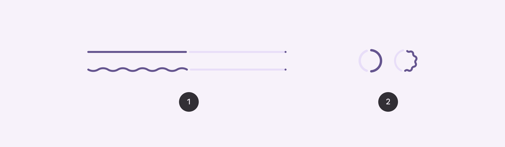
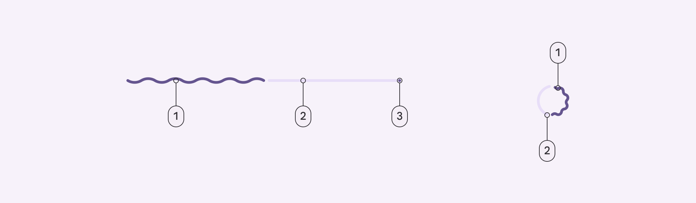
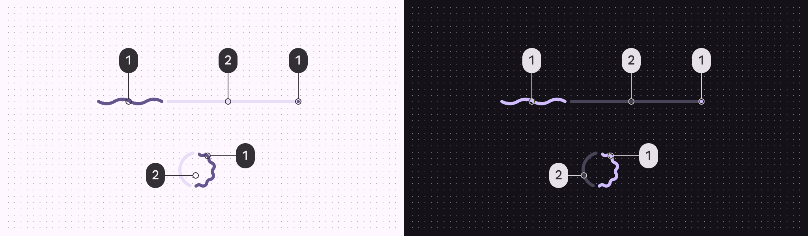
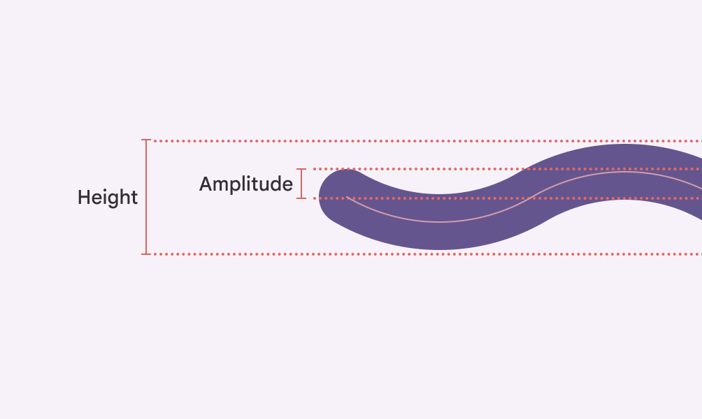
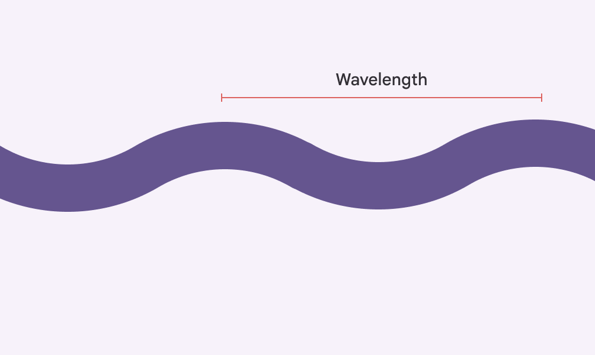
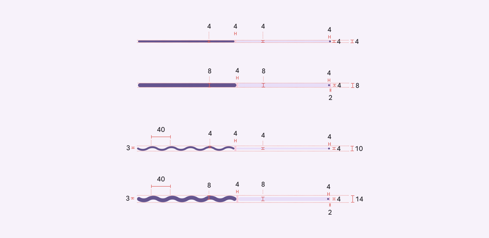
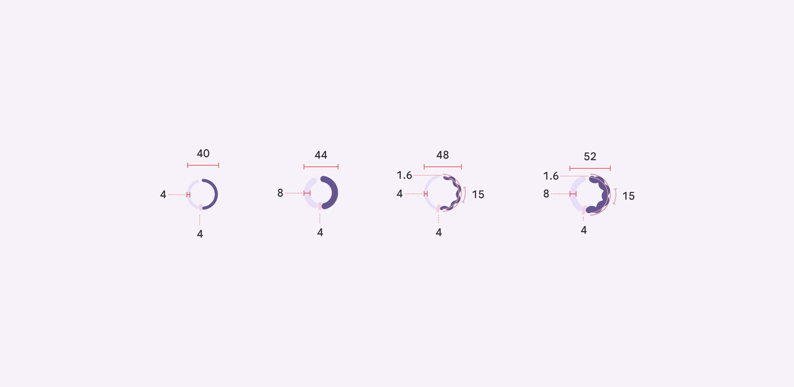

# Progress indicators

Source: https://m3.material.io/components/progress-indicators/specs

## Variants

*Linear progress indicator; Circular progress indicator*

| Variant | M3 | M3 Expressive |
| --- | --- | --- |
| Linear progress indicator | Available | Available |
| Circular progress indicator | Available | Available |

## Configurations

*Behavior: Determinate and indeterminate; Thickness: Default (4dp) and variable; Shape: Flat and wavy*

| Category | Configuration | M3 | M3 Expressive |
| --- | --- | --- | --- |
| Behavior | Determinate (default), Indeterminate | Available | Available |
| Track thickness | Fixed (4dp) | Available | Available |
| Track thickness | Configurable | -- | Available |
| Shape | Flat (default) | Available | Available |
| Shape | Wavy | -- | Available |

## Tokens & specs

Browse the component elements, attributes, tokens, and their values. [View baseline tokens](https://m3.material.io/m3/pages/progress-indicators/specs#c6f484b0-2bc6-4d37-bd75-f859a35a3594)

- Token sets: Progress Indicator - Common; Progress indicator - Linear; Progress indicator - Circular
- Columns: Token
- Visible groups: Color; Shape; [Deprecated] Enabled

## Anatomy

*Active indicator; Track; Stop indicator*

## Color

*Primary; Secondary container*

## Measurements

Wavy indicators use amplitude and wavelength to determine the shape of the wave. The height is the overall container height.

*Amplitude measures from the center of the resting position to the center of the peak*

*Wavelength measures the distance between two adjacent peaks*

*Size measurements for linear progress indicators. The thicker variants are provided as sample measurement for makers to adjust the default version based on their use cases.*

*Size measurements for circular progress indicators. The thicker variants are provided as sample measurement for makers to adjust the default version based on their use cases.*

*The linear progress indicator is inset from the edge of the screen by 4dp*

## Baseline tokens

The circular and linear progress indicator had separate token sets. These are no longer recommended.

- Token sets: [Deprecated] Progress indicator - Circular; [Deprecated] Progress indicator - Linear
- Columns: Token
- Visible groups: [Deprecated] Enabled
