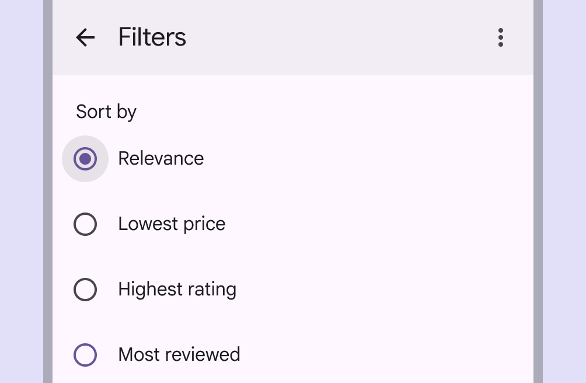
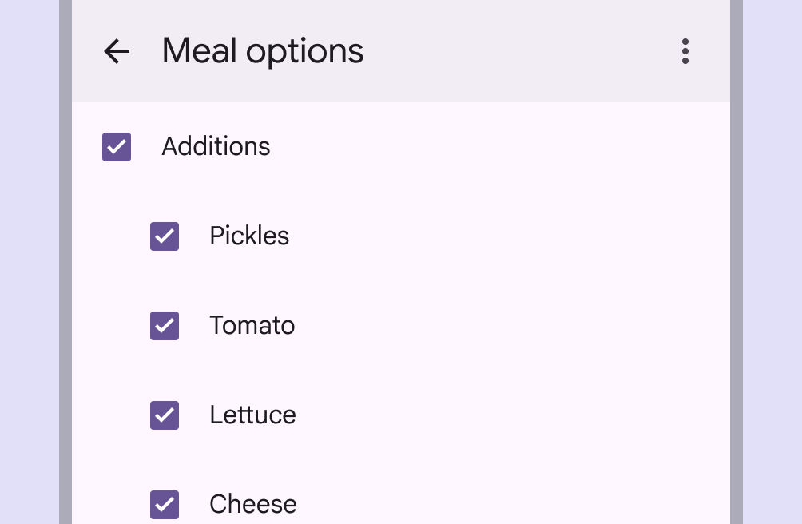
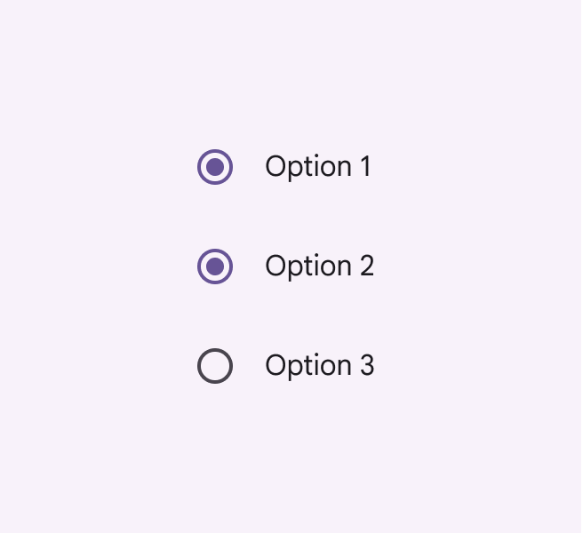
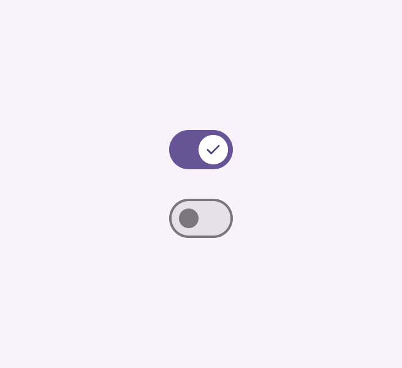
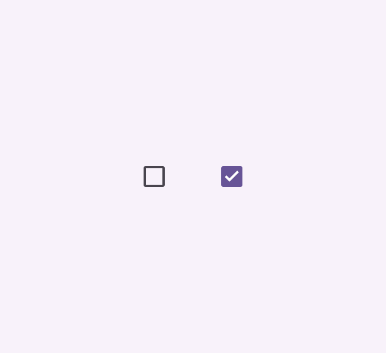
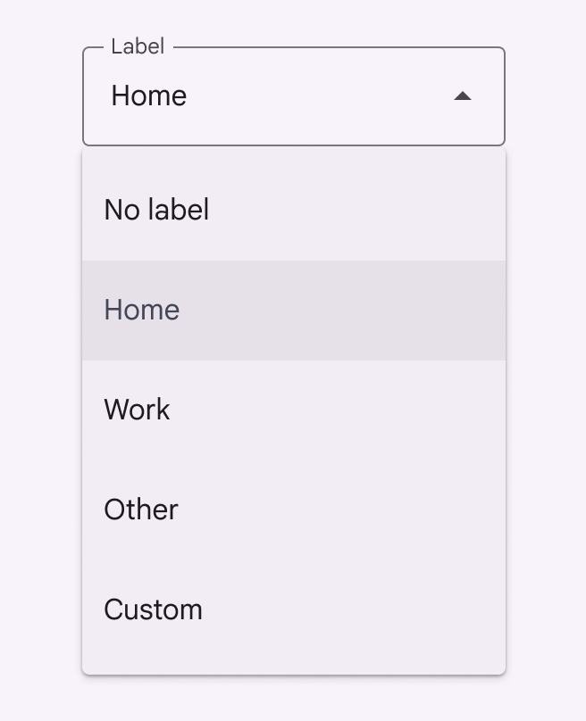
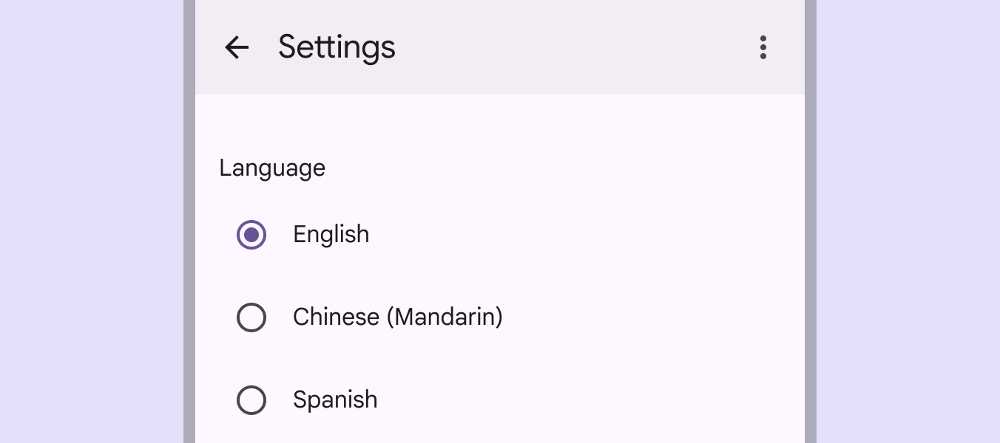
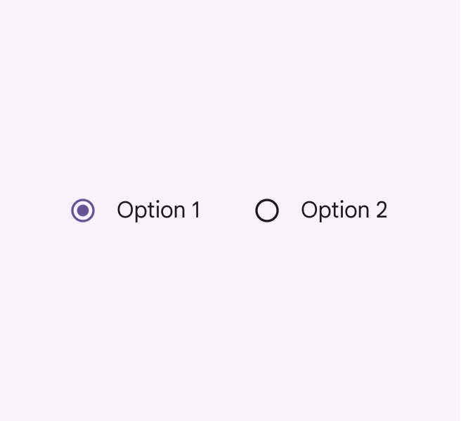

# Radio button

Source: https://m3.material.io/components/radio-button/guidelines

*Radio buttons*

## Usage

Radio buttons are the recommended way to allow users to make a single selection (Selection lets users choose specific items to act on. [More on selection](https://m3.material.io/m3/pages/selection)) from a list of options.

Only one radio button can be selected at a time.

[Video: 1 of 3 languages is chosen using radio buttons. Selecting a language deselects the previous 1.](assets/asset-002-radio-buttons-should-always-be-accompanied-by-clear-2126ffe12a.webp)

*Radio buttons should always be accompanied by clear inline labels*

Use radio buttons to:

- Select a single option from a set
- Expose all available options

*Radio buttons are single-select, unlike checkboxes which are multi-select*

*Do Use radio buttons when only one option can be selected from a list*

*Do Use checkboxes when multiple options can be selected from a list*

Avoid nesting radio buttons or using radio buttons to select multiple options.

*Don’t nest radio buttons*

*Don’t allow radio buttons to select multiple options*

### Alternate selection controls

Radio buttons are one of several selection (Selection lets users choose specific items to act on. [More on selection](https://m3.material.io/m3/pages/selection)) controls, which allow people to make choices such as selecting options or switching settings on or off.

Switches (Switches toggle the state of an item on or off. [More on switches](https://m3.material.io/m3/pages/switch/overview)) and checkboxes (Checkboxes let users select one or more items from a list, or turn an item on or off. [More on checkboxes](https://m3.material.io/m3/pages/checkbox/overview)) are alternative selection controls that can be used to change settings or preferences.

*Switches*

*Checkboxes*

Use radio buttons when there are five or fewer options.

Consider using a drop-down menu (Menus display a list of choices on a temporary surface. [More on menus](https://m3.material.io/m3/pages/menus/overview)) instead of radio buttons when it’s important to save space on a screen. However, drop-down menus require additional steps for a person, both in the number of clicks and cognitive effort.

*Do Use radio buttons when there are five or fewer options*

*Do Consider using a drop-down menu instead of radio buttons when space is constrained*

## Anatomy

*Selected icon; Adjacent label text; Unselected icon*

### Adjacent label text

Always pair radio buttons with an adjacent label describing what the radio button selects.

Because only one radio button can be selected at a time, each choice must have its own label.

[Video: Checkout page with 2 radio buttons for home and office addresses. The labels are "Home" and "Office."](assets/asset-013-radio-button-always-need-label-text-b96b11d018.webp)

*Radio button always need label text*

## Placement

Radio buttons are often arranged in stacked layouts (Layout is the visual arrangement of elements on the screen. [More on layout](https://m3.material.io/m3/pages/understanding-layout/overview)).

Radio buttons should be vertically listed and have one option always selected.

*Do Radio buttons should always have one option pre-selected*

*Caution Avoid using horizontal radio button lists*

## Behavior

A radio button is successfully selected when a person clicks or taps either the radio button icon or the label.

[Video: Selecting the radio button for dark theme instantly changes the screen to dark theme.](assets/asset-017-radio-buttons-should-take-effect-immediately-unless-they-7841f03379.webp)

*Radio buttons should take effect immediately, unless they're in a dialog or page that needs to be saved*
