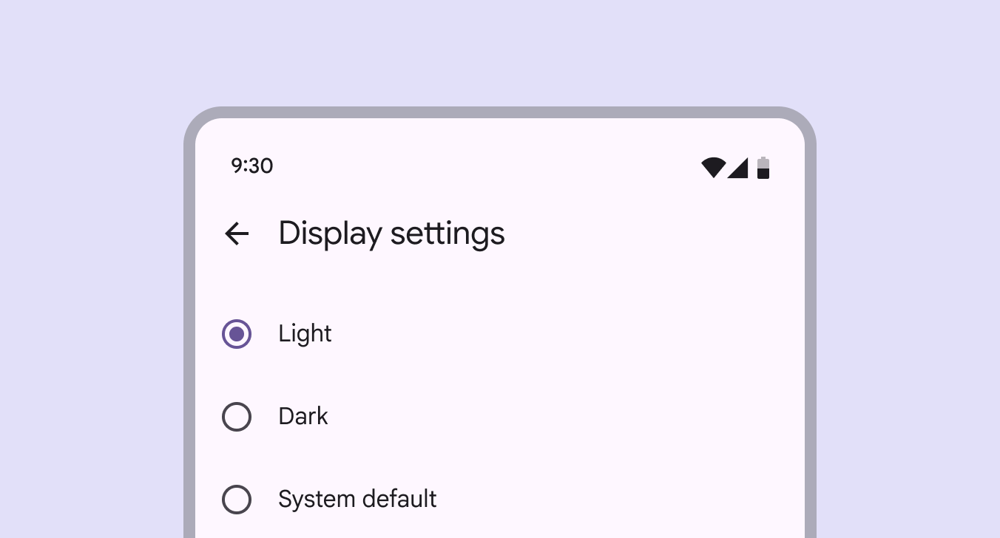

# Radio button

Source: https://m3.material.io/components/radio-button/overview

- Use radio buttons (not switches (Switches toggle the state of an item on or off. [More on switches](https://m3.material.io/m3/pages/switch/overview)) ) when only one item can be selected from a list (Lists are continuous, vertical indexes of text and images. [More on lists](https://m3.material.io/m3/pages/lists/overview))
- Label should be scannable
- Selected items are more prominent than unselected items

*Radio buttons can be selected*

## Resources & availability

| Type | Resource | Status |
| --- | --- | --- |
| Design | [Design Kit (Figma)](https://www.figma.com/community/file/1035203688168086460) | Available |
| Implementation | [Flutter](https://api.flutter.dev/flutter/material/ThemeData/useMaterial3.html) | Available |
| Implementation | [Jetpack Compose](https://developer.android.com/develop/ui/compose/components/radio-button) | Available |
| Implementation | [MDC-Android](https://github.com/material-components/material-components-android/blob/master/docs/components/RadioButton.md) | Available |
| Implementation | [Web](https://github.com/material-components/material-web/blob/main/docs/components/radio.md) | Available |

## What’s new

- Color: New color mappings and compatibility with dynamic color (Dynamic color takes a single color from a user's wallpaper or in-app content and creates an accessible color scheme assigned to elements in the UI. [More on dynamic color](https://m3.material.io/m3/pages/dynamic-color/overview))

*Radio buttons feature new color mappings*
