# Search

Source: https://m3.material.io/components/search/guidelines

[Video: A mobile UI search with hinted text “Search recipes”, “Mexican dishes” is entered, and a list of recipe results appear.](assets/asset-001-when-focused-a-search-bar-can-show-a-65e0cc93e9.webp)

*When focused, a search bar can show a list of search suggestions. As text is entered, search results appear.*

## Usage

Search helps people find information quickly. Use search for products with many items to manage, such as files or messages.

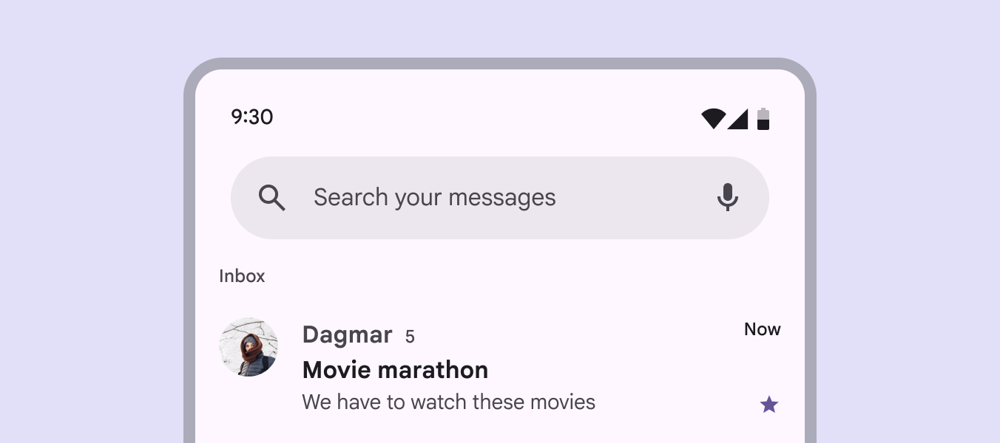

*Search helps people find information in large inboxes like messages or emails*

### Different ways to search

The search entry point is dependent on a product’s needs, and should be easy to find:

- Search bar (The search bar is a persistent and prominent search field at the top of the screen.): Use to search contents in a specific view, like Search your messages
- Search app bar (Search app bars provide an emphasized entry-point to open search. [More on search app bars](https://m3.material.io/m3/pages/app-bars/guidelines#ed1f4c54-fc2d-4544-b1ed-ac667181dabe)): Use this app bar (App bars contain page navigation and information at the top of a screen. [More on app bars](https://m3.material.io/m3/pages/app-bars/overview)) variant when search is the primary, global function
- Search icon button (Icon buttons help people take minor actions with one tap. [More on icon buttons](https://m3.material.io/m3/pages/icon-buttons/overview)): Use when search is a secondary action or not the main focus

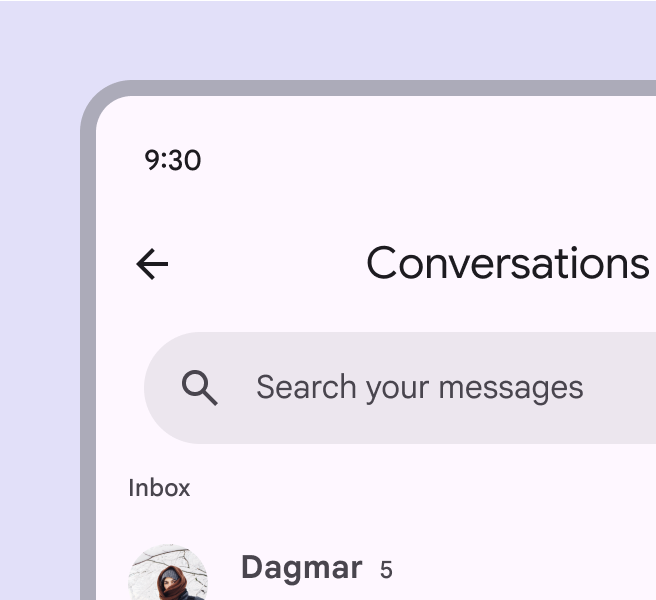

*Add a search bar below a title to search specific content*

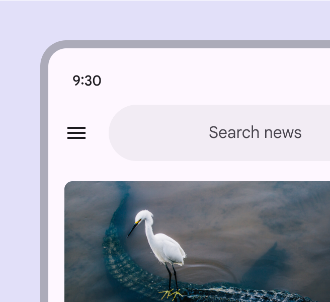

*For global search, use a persistent search app bar, integrated into an app bar*

*Use a search icon button when search is a secondary action*

### Focused search

When a search entry point is selected, it opens focused (A focused state communicates when a user has highlighted an element, using an input method such as a keyboard or voice. [More on focused state](https://m3.material.io/m3/pages/interaction-states/applying-states#bc6d6853-48ef-490e-8076-448e89e69f0f)) search.

- Search suggestions can appear before text is entered
- Search results can show as someone is typing or after a search is executed
- Individual elements maintain their own interaction states (States show the interaction status of a component or UI element. [More on states](https://m3.material.io/m3/pages/interaction-states/overview)) when search is focused

[More on search states](https://m3.material.io/m3/pages/search/specs#65c58b10-4569-43d6-9c11-64a5b02f3099)

*When focused, a search bar expands to show search suggestions or results in a list*

If search is the primary action, focused search can be a standalone destination reached from a navigation bar (Navigation bars let people switch between UI views on smaller devices. [More on navigation bars](https://m3.material.io/m3/pages/navigation-bar/overview)).

*Focused search can be a standalone destination, reached by selecting an item in a navigation bar*

### Search suggestions & results

Search suggestions and results both appear in a list (Lists are continuous, vertical indexes of text and images. [More on lists](https://m3.material.io/m3/pages/lists/overview)) component by default. To help people find information quickly, consider adding variety and context, such as:

- Leading icons related to suggestions
- Category labels, like Recent, Contacts, or Suggestions
- Avatars or other high-priority items
- Filter chips to narrow down results

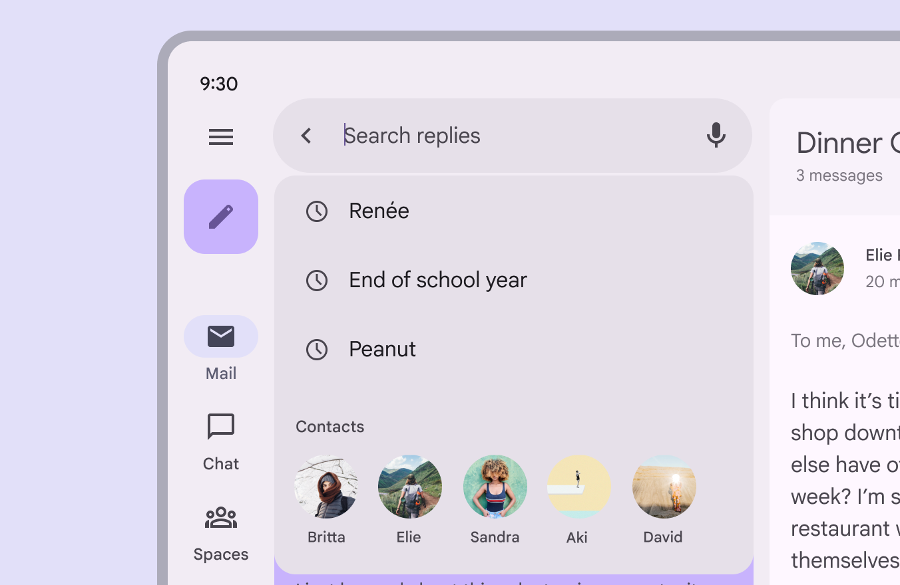

*Include high-priority items like avatars in search suggestions or results*

### Gaps

Use gaps to separate a list of suggestions or results into groups. [More on using gaps in lists](https://m3.material.io/m3/pages/lists/guidelines#9e96fd72-5bf3-49df-9baf-e025dcca344d)

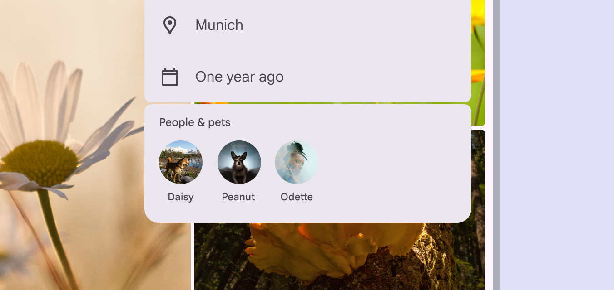

*To separate list items into distinct groups, use a gap*

## Placement

A search bar is typically placed at the top of a screen to remain prominent and accessible. Its location depends on whether search is the primary focus of a product or a secondary action.

*A search bar can be the primary focus of a page*

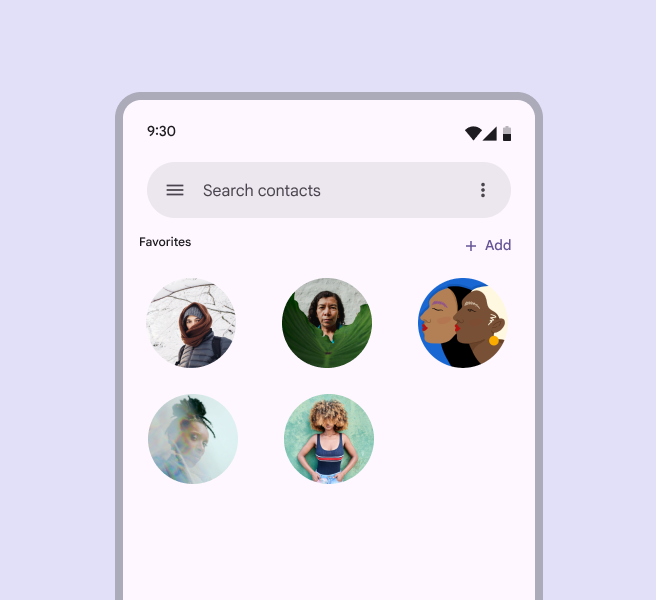

*Search bars should usually be placed at the top of the content*

*Search can be a secondary action*

### Focused search layouts

When focused, search suggestions and results appear in a list below the search bar. There are two layout options:

- Docked opens a list below the search bar, with a scrim covering main content
- Full-screen expands to fill the screen

[More on adaptive design](https://m3.material.io/m3/pages/search/guidelines#eb45ccc4-d1b5-4ea1-bee5-ea1c3d1c5436)

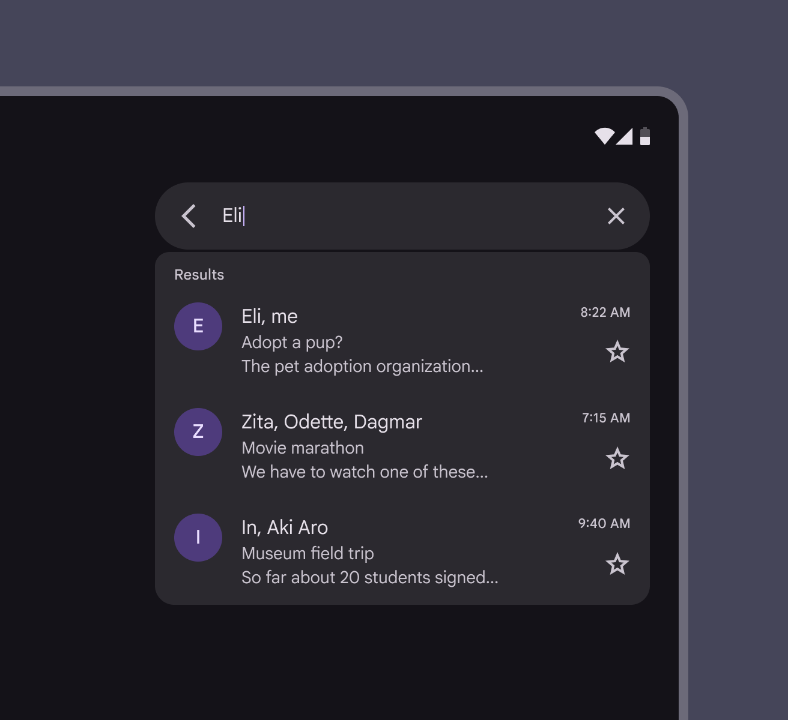

*Docked layout on a tablet*

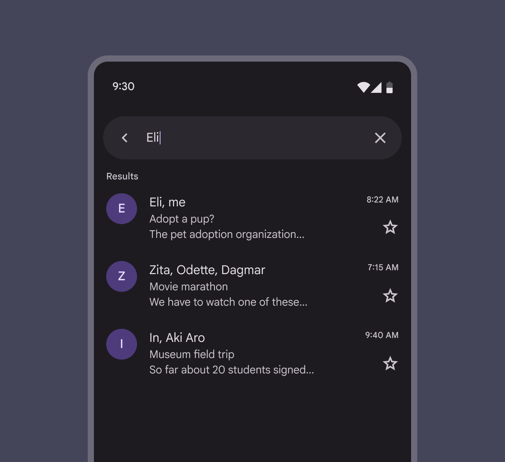

*Full-screen layout on mobile*

## Anatomy

*Search bar container; Leading icon; Supporting text; Avatar or trailing icon (optional); Input text; Container for search suggestions or results*

### Search bar container

In the contained style, the search bar container remains the same shape in both the unfocused and focused states. Avoid changing the container behavior. The container’s margins should be:

- Unfocused: 24dp
- Focused: 12dp

In the divided (baseline) style, a divider separates the search bar and results.

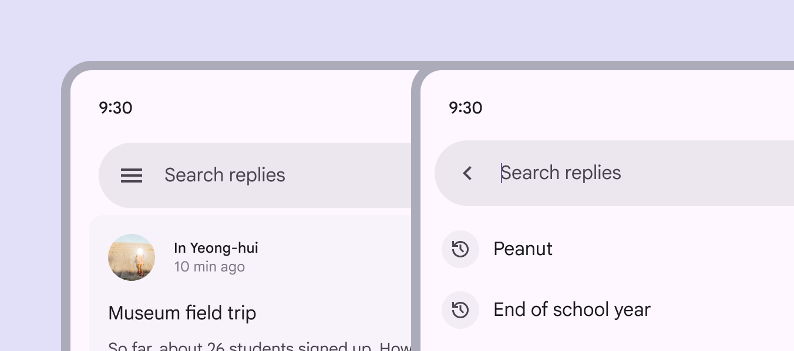

*Search bar containers have persistent, rounded corners*

#### Container color

Search bars use the surface container high color role (Material has 26 standard color roles organized into six groups: primary, secondary, tertiary, error, surface, and outline. [More on color roles](https://m3.material.io/m3/pages/color-roles?s=m3)). This role applies when the screen background is white or a tonal surface color, ensuring the container has clear contrast.

*Search bars use surface container high to provide clear contrast*

Avoid using a surface container high color on a surface container background. This can cause the search bar to blend in, making it difficult for people to find. To ensure proper contrast, use surface container roles that are more than one step apart.

*Caution Using a surface container high color on a surface container background reduces contrast and may affect accessibility*

### Icons & icon buttons

#### Leading icons

The leading side of a search bar should include either:

- A navigational icon button, such as a menu or arrow
- A non-functional search icon

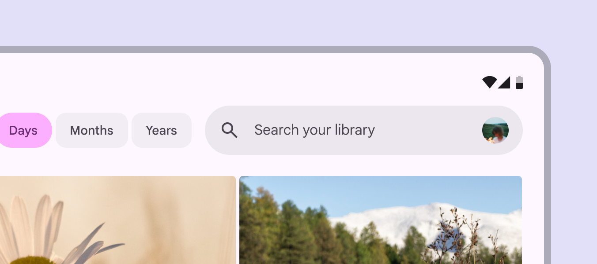

*A search bar can contain a non-functional search icon*

#### Trailing icons

A search bar should have one or two trailing icons or icon buttons. Trailing actions can include:

- Additional modes of searching like voice search
- A separate high-level action such as current location or profile
- An overflow menu
- A decorative search icon

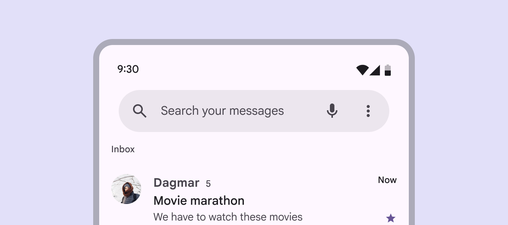

*Use a maximum of two trailing icons*

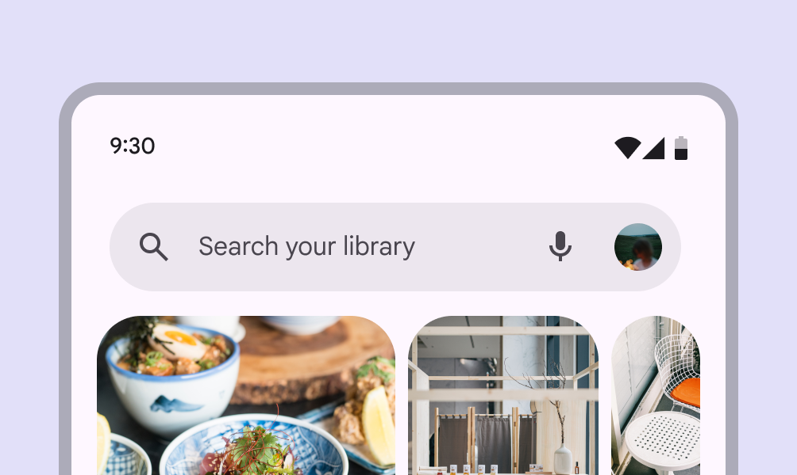

*Combine an avatar with up to one other trailing icon button*

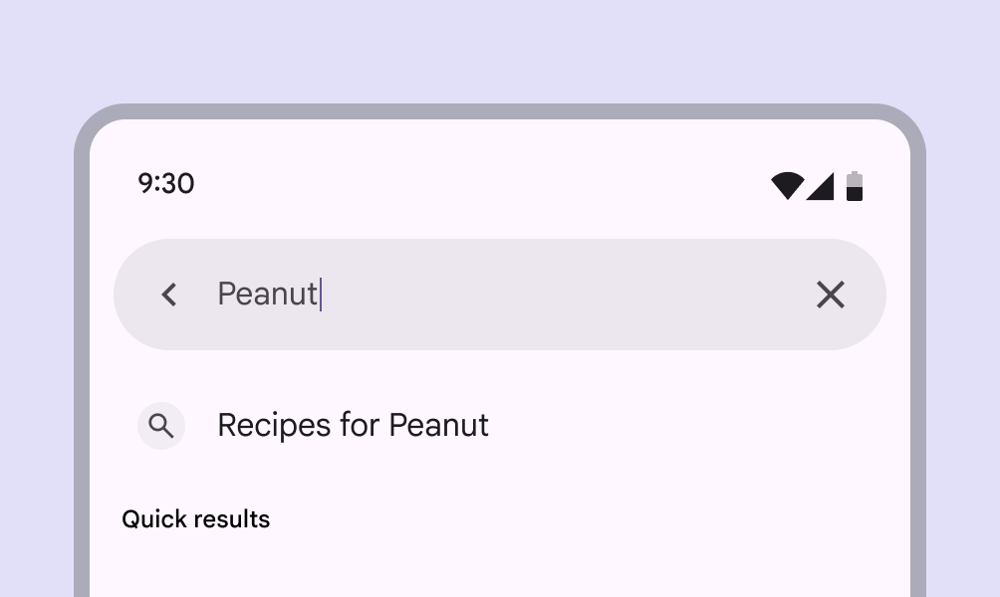

*Focused search can show an optional clear icon to remove input text*

### Text

#### Hinted search text

Provide a short description of the information people can search, like Search replies or Search your messages.

#### Input text

When a person starts typing, the hinted text is replaced with the input text.

[Video: A search bar labeled “Search replies”. “Peanut is entered and “Quick results” appear.](assets/asset-023-hinted-search-text-is-replaced-when-a-search-e341ea01e6.webp)

*Hinted search text is replaced when a search query is entered*

## Adaptive design

The search bar position and alignment should scale with the layout, and stay close to the searchable content. In most cases, a search bar should:

- Stay in its pane and scale in width accordingly
- Internal elements anchor to the left and right as the parent container scales

[More on applying layout](https://m3.material.io/m3/pages/applying-layout/window-size-classes)

[Video: A search bar keeps its layout region and scales with different window sizes and layouts.](assets/asset-024-keep-the-search-bar-close-to-the-content-d56a5f12b3.webp)

*Keep the search bar close to the content a person can search*

### Focused search

When focused, search can switch between showing suggestions or results in a:

- Docked layout: Best for medium (Window widths from 600dp to 839dp, such as a tablet or foldable in portrait orientation. [More on medium window sizes](https://m3.material.io/m3/pages/applying-layout/medium/c35895ad-d5af-438e-aa68-6105247b8312?edit=true)) and expanded (Window widths 840dp to 1199dp, such as a tablet or foldable in landscape orientation, or desktop. [More on expanded window sizes](https://m3.material.io/m3/pages/applying-layout/expanded/c35895ad-d5af-438e-aa68-6105247b8312?edit=true)) windows
- Full-screen layout: Default for compact window sizes (Window widths smaller than 600dp, such as a phone in portrait orientation. [More on compact window sizes](https://m3.material.io/m3/pages/applying-layout/compact/c35895ad-d5af-438e-aa68-6105247b8312?edit=true))

[More on search layouts](https://m3.material.io/m3/pages/search/specs#fc12e839-f356-4f48-9bd5-0ed210565bfe)

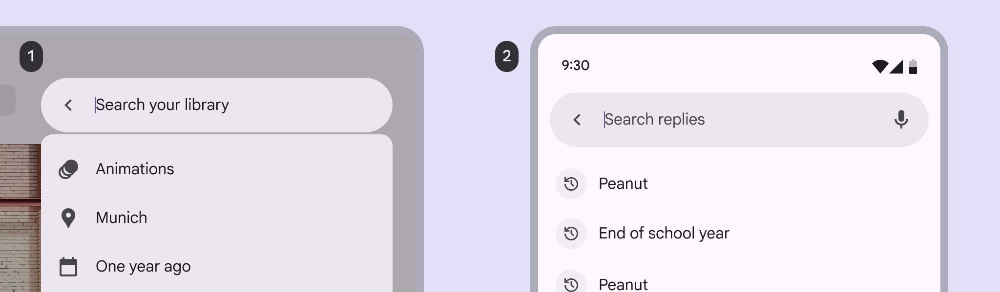

*A docked layout on a large screen; A full-screen layout, the default for compact screens*

Search suggestions or results should swap from full-screen in compact windows to docked in larger window sizes.

[Video: Animation shows search suggestions adapting from full-screen on mobile to a docked layout as the window size increases.](assets/asset-026-search-suggestions-and-results-should-adapt-to-fit-165b37b7c7.webp)

*Search suggestions and results should adapt to fit different window sizes*

## Behavior

### Focused search

When a search bar is selected, search becomes focused and can:

- Show historical suggestions before typing
- Show suggestions or results as someone is typing
- Wait to show suggestions or results until a search is queried

The back icon releases focus, dismisses any suggestions or results, and returns the search bar to its original state.

[Video: When a search bar is tapped, it becomes focused, and suggestions appear in a list.](assets/asset-027-when-focused-a-list-of-search-suggestions-can-bae3f6a5d7.webp)

*When focused, a list of search suggestions can appear*

[Video: A person searches a photo app. The back icon returns the search bar to its original state.](assets/asset-028-focus-is-released-when-the-back-icon-is-728967ad2d.webp)

*Focus is released when the back icon is selected*

### Scroll

Depending on needs, a search bar can:

- Scroll away with content, then reappear when a person begins scrolling up
- Remain fixed at the top of the screen

[Video: Scrolling up hides the search bar. It reappears when scrolling down.](assets/asset-029-a-search-bar-can-scroll-up-with-content-bb8c757750.webp)

*A search bar can scroll up with content, then reappear when a person scrolls down*

### Search results

To execute a search, a person can:

- Type a query and press Enter
- Select a suggestion or result without querying a search

Search results appear in a list (Lists are continuous, vertical indexes of text and images. [More on lists](https://m3.material.io/m3/pages/lists/overview/4c963afe-70e3-4795-9077-8d371038bacb?edit=true)) below the bar, and scroll beneath the bar. For accessibility, focused search needs a clear status indicator that it’s searching content, like a search icon or Results label. [More on search accessibility](https://m3.material.io/m3/pages/search/accessibility/)

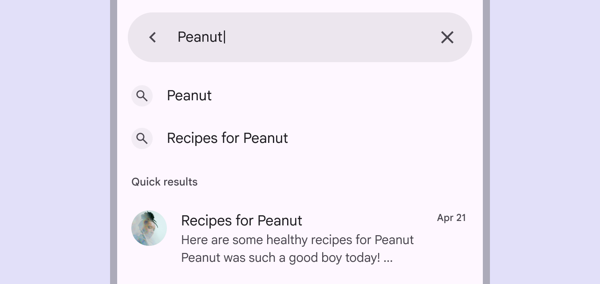

*Show search results in a compact, organized list, with an indicator like Quick results*

When search results are queried, the input text should remain visible, but not in focus.

[Video: “Pla” is entered into the search bar, “Plants” is suggested and selected.](assets/asset-031-search-suggestions-and-results-display-in-a-list-af68cd3e15.webp)

*Search suggestions and results display in a list, and the input text remains visible*

### Predictive back

On Android, [predictive back](https://github.com/material-components/material-components-android/blob/master/docs/foundations/PredictiveBack.md) allows a person to swipe left or right on search.

- Search detaches from the screen edge to signal the full-screen layout will minimize
- The previous screen is revealed in a preview

[More predictive back design guidance](https://developer.android.com/guide/navigation/custom-back/predictive-back-gesture)

[Video: Swiping left on search causes the Android screen to scale left.](assets/asset-032-the-search-surface-and-content-scale-back-in-76bcf5ae8a.webp)

*The search surface and content scale back in the direction of the gesture*
