# Search

Source: https://m3.material.io/components/search/specs

## Variants

[Video: Typing “Ping” into a search bar reveals a list of email results.](assets/asset-001-when-a-person-executes-a-search-results-appear-0202b27498.webp)

*When a person executes a search, results appear in a list below the search bar*

| Variant | M3 | M3 Expressive |
| --- | --- | --- |
| Search | Available | Available |

## Configurations

### Style

Search comes in two styles:

- Contained: Has an expressive (M3 Expressive is a major update to Material 3, adding visually stunning features, components, and variants, plus updates to the shape, motion, and typography systems. [More on M3 expressive](https://m3.material.io/blog/building-with-m3-expressive)) look and feel. It uses a filled container to separate a search bar from a list (Lists are continuous, vertical indexes of text and images. [More on lists](https://m3.material.io/m3/pages/lists/overview)) of suggestions or results
- Divided ( baseline (Baseline variants and styles are the original M3 component designs. They may not have the latest features introduced in M3 Expressive, like updated motion, shapes, type, and styles.) ): Doesn’t have the latest visual style, motion, or flexibility

*The contained style has a persistent, filled container, expressive motion, and rounded shape*

*The divided (baseline) style uses a divider to separate the search bar from suggestions and results*

### Layout

Search suggestions and results appear in customizable lists, with two layout options: full-screen and docked. [More on search layouts](https://m3.material.io/m3/pages/search/guidelines#4f6c921c-795f-4e06-9b12-27ae7d502adb)

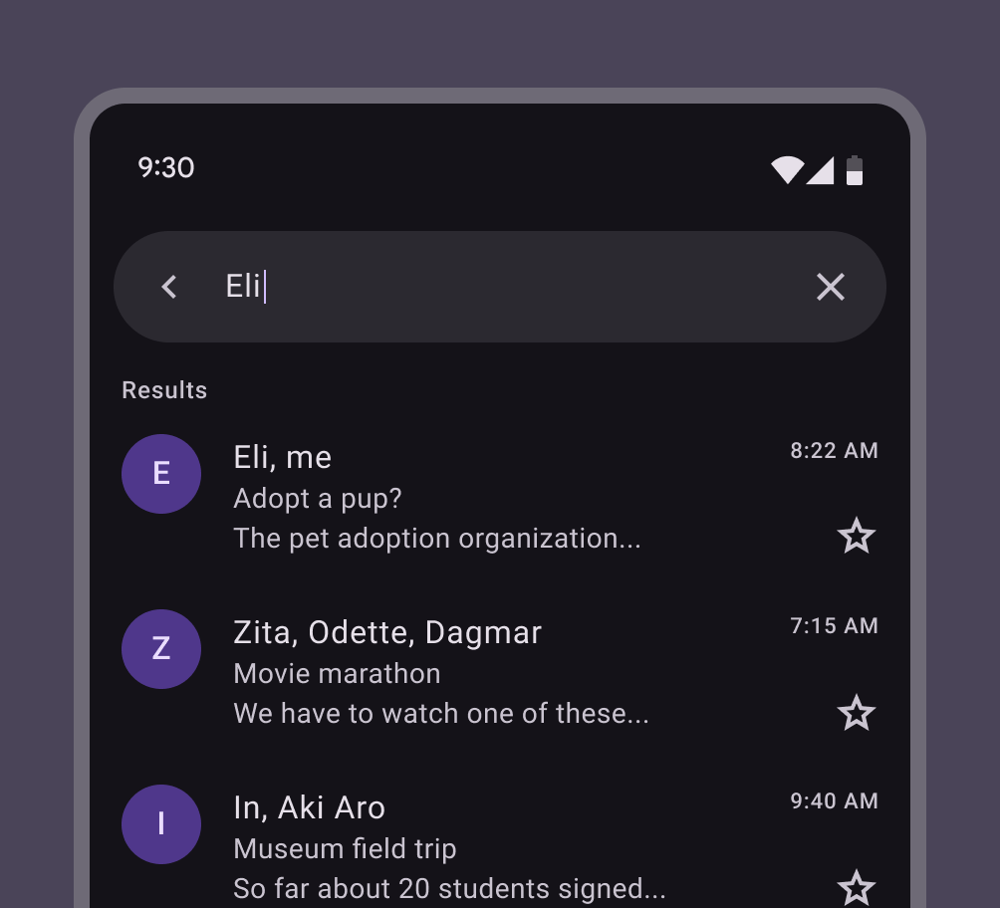

*Full-screen layout in the contained style*

*Docked layout in the contained style*

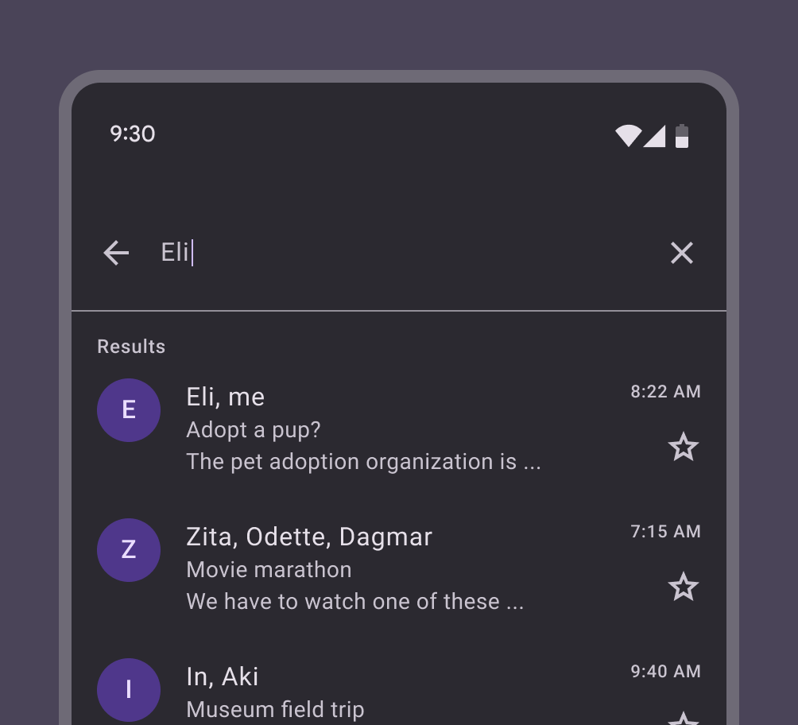

*Full-screen layout in the divided style*

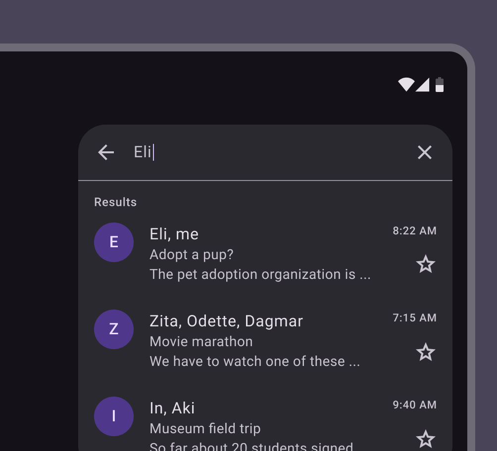

*Docked layout in the divided style*

| Category | Configuration | M3 | M3 Expressive |
| --- | --- | --- | --- |
| Style | Contained | -- | Available |
|  | Divided | Available | Not recommended. Use contained. |
| Layout | Docked, full-screen | Available | Available |

## Tokens & specs

Use the table's menu to select a token set. The search bar set only contains tokens for the unfocused search bar. The search view set contains all other tokens when interacting with search, including all styles and layouts. [Learn more about design tokens](https://m3.material.io/m3/pages/design-tokens/overview)

- Columns: Token
- Visible groups: Color; Layout and Text

## Anatomy

Search includes a search bar and a container for suggestions and results. The container is empty by default. Use the list (Lists are continuous, vertical indexes of text and images. [More on lists](https://m3.material.io/m3/pages/lists/overview)) component to add content. In the divided (baseline) style, a divider separates the search bar and results.

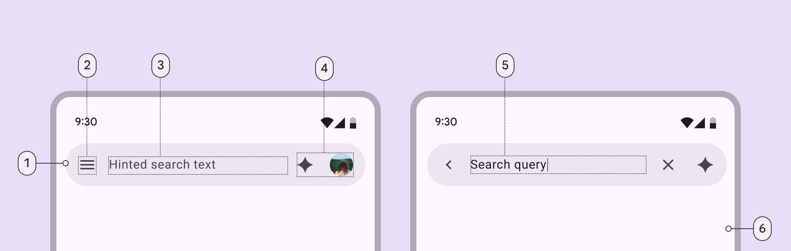

*Search bar container; Leading icon; Supporting text; Trailing icon and avatar (optional); Input text; Container for search suggestions or results*

### Examples

1. With avatar
2. With one trailing icon button (Icon buttons help people take minor actions with one tap. [More on icon buttons](https://m3.material.io/m3/pages/icon-buttons/overview))
3. With two trailing icon buttons
4. With trailing icon button and avatar

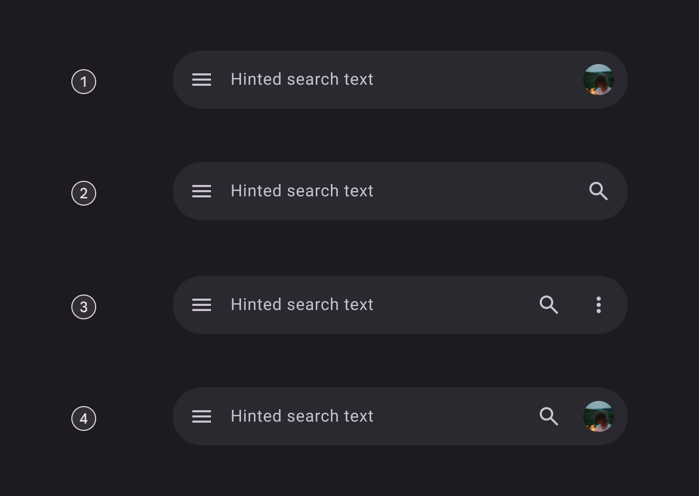

## Color

Color values are implemented through design tokens (Design tokens are the building blocks of all UI elements. The same tokens are used in designs, tools, and code. [More on tokens](https://m3.material.io/m3/pages/design-tokens/overview)). For designers, this means working with color values that correspond with tokens. In implementation, a color value will be a token that references a value.

### Full-screen layout

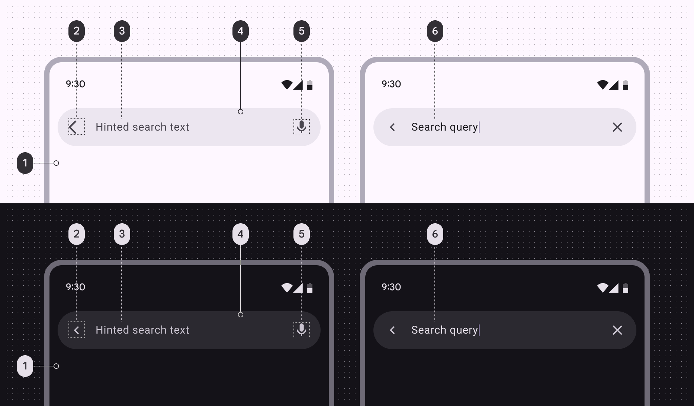

*Surface container low; On surface variant; On surface variant; Surface container high; On surface variant; On surface*

### Docked layout

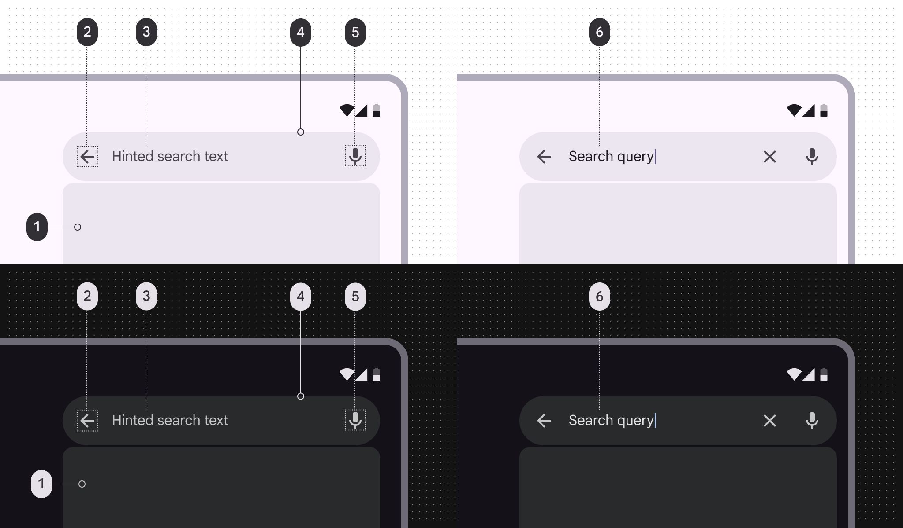

*Surface container high; On surface variant; On surface variant; Surface container high; On surface variant; On surface*

## States

States are visual representations used to communicate the status of a component or an interactive element. In [focused search](https://m3.material.io/m3/pages/search/guidelines#a9b2df31-8561-4326-82cd-41ed6532b765), individual elements maintain their own interaction states. [Learn more about interaction states](https://m3.material.io/m3/pages/interaction-states/overview)

### Search bar

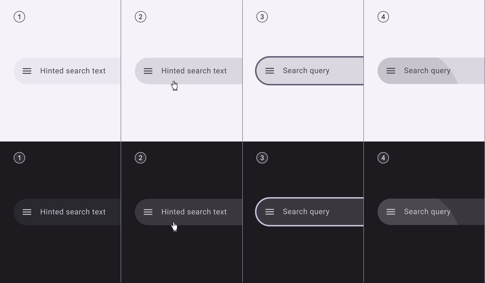

*Enabled; Hovered; Focused; Pressed (ripple)*

### Search suggestions & results

Search includes a container for suggestions and results. The container is empty by default. Use the list component to add content.

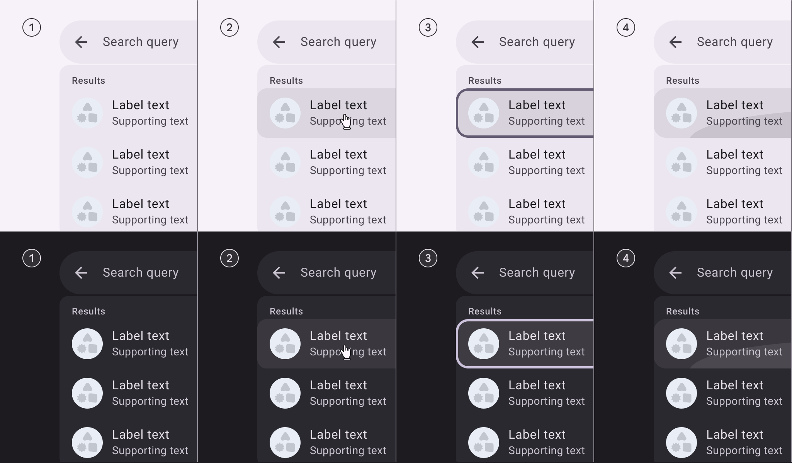

*Enabled; Hovered; Focused; Pressed (ripple)*

## Measurements

### Search bar

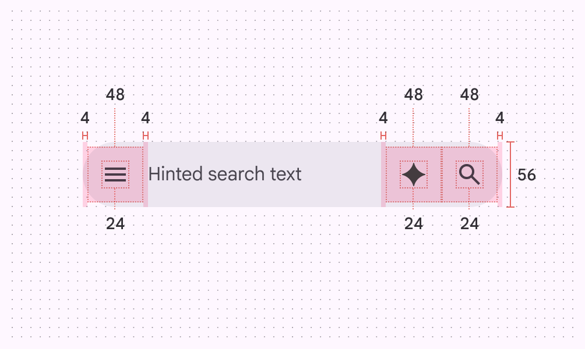

*Unfocused search bar with leading and trailing icon measurements*

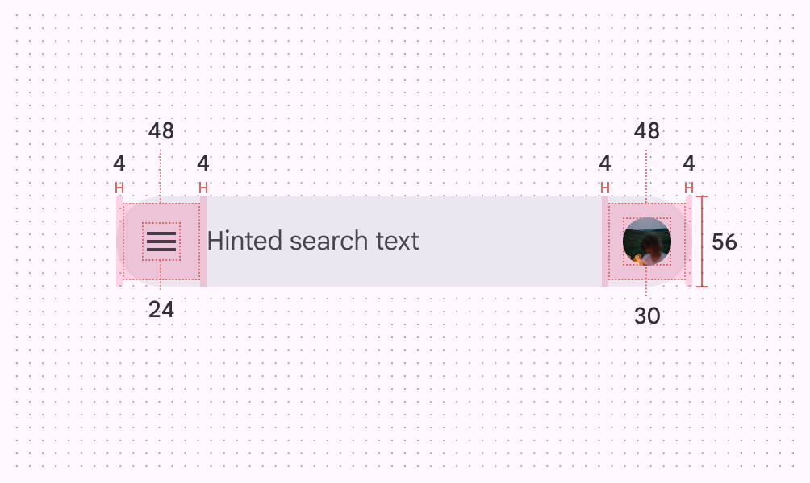

*Unfocused search bar with avatar measurements*

In M3 Expressive, the search bar expands when focused. The margins change from 24dp to 12dp.

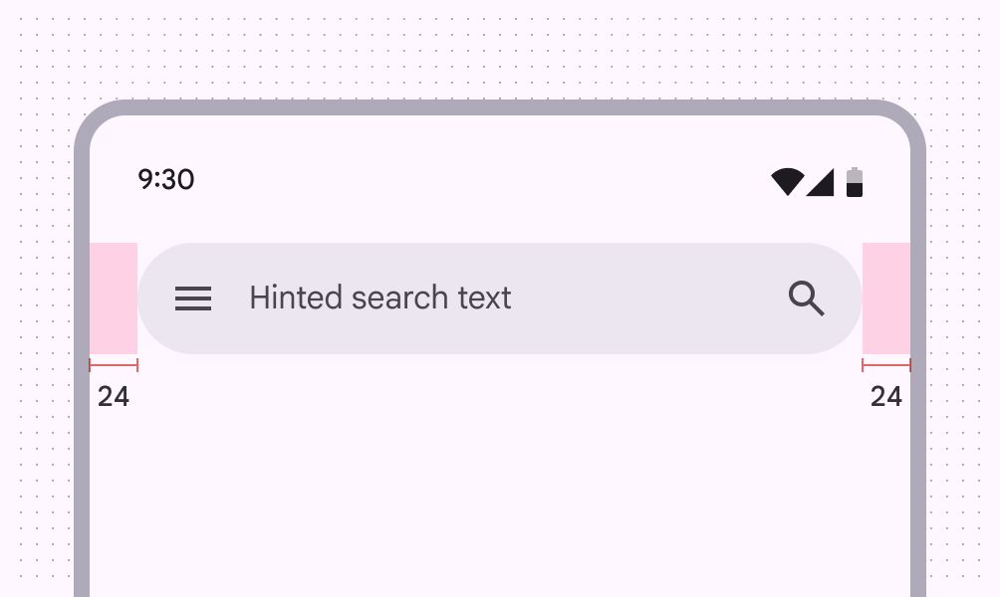

*Unfocused search bar margin measurements*

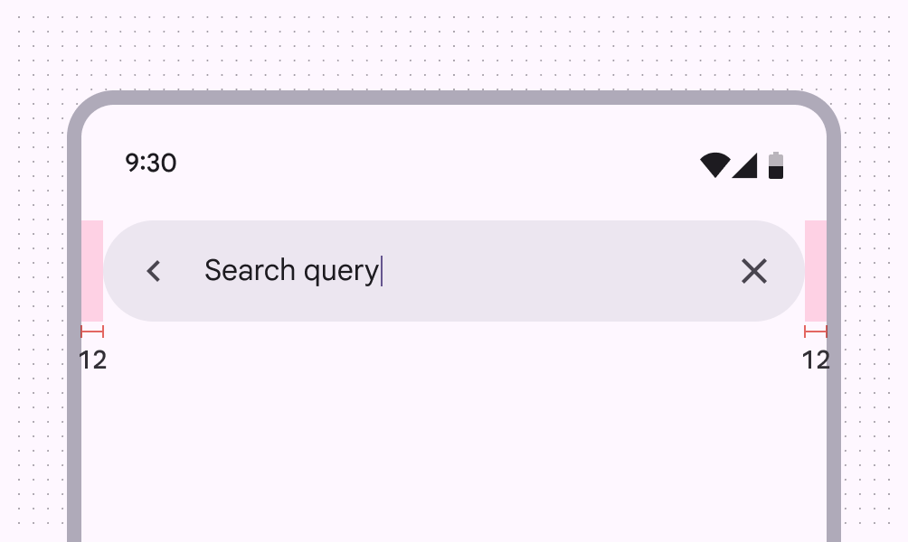

*Focused search bar margin measurements*

| Element | Attribute | Value |
| --- | --- | --- |
| Container | Width | Min: 360dp, max: 720dp |
| Container | Height | 56dp |
| Container | Label alignment | Start-aligned |
| Container | Leading padding | Unfocused: 24dp, focused: 12dp |
| Container | Trailing padding | Unfocused: 24dp, focused: 12dp |
| Container | Leading icon and label padding (from tap target) | 4dp |
| Container | Label and trailing icon padding (from tap target) | 4dp |
| Avatar | Size | 30dp |

### Focused search

#### Contained style

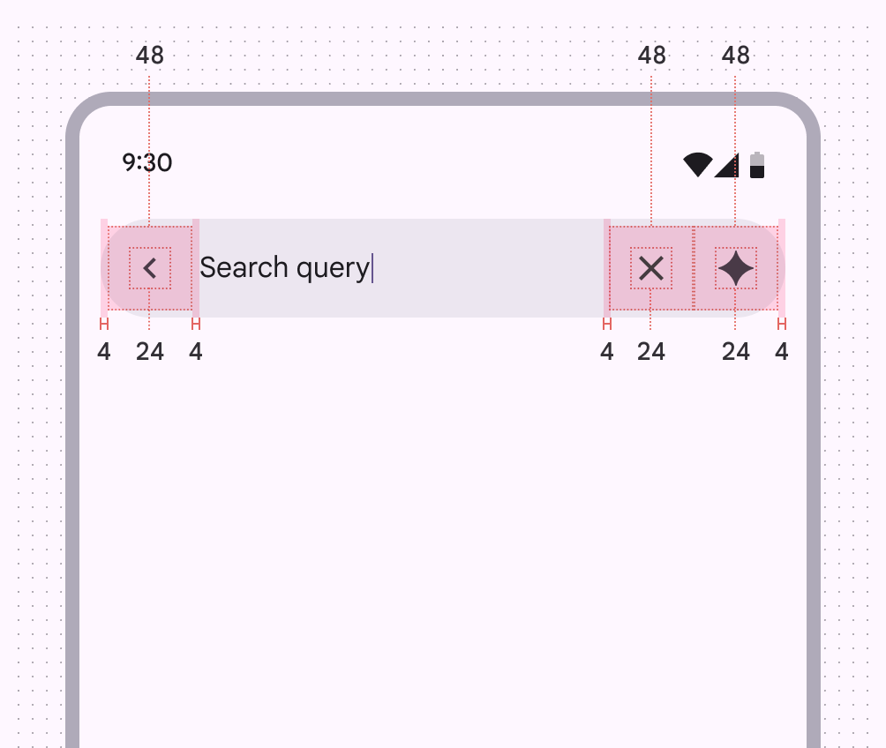

*Full-screen search padding and size measurements for contained style*

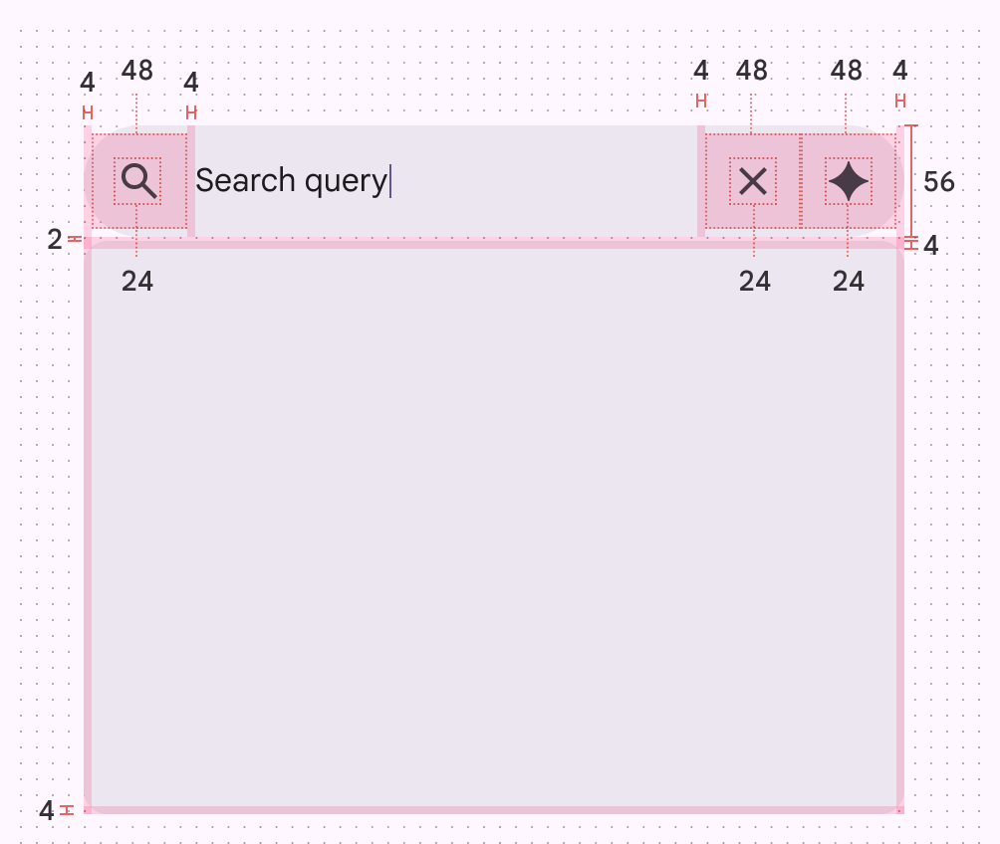

*Docked search padding and size measurements for contained style*

| Element | Attribute | Value |
| --- | --- | --- |
| Full-screen container | Width | Full width |
| Full-screen container | Height | Full height |
| Docked container | Width | Min: 360dp, max: 720dp |
| Docked container | Height | Min: 240dp, max: 2/3 of screen height |
| Search bar container | Height | 56dp |
| Search bar container | Label alignment | Start-aligned |
| Search bar container | Leading padding | 16dp |
| Search bar container | Trailing padding | 16dp |
| Search bar container | Leading icon and label padding (from tap target) | 4dp |
| Search bar container | Leading icon and label padding (from tap target) | 4dp |

#### Divided style

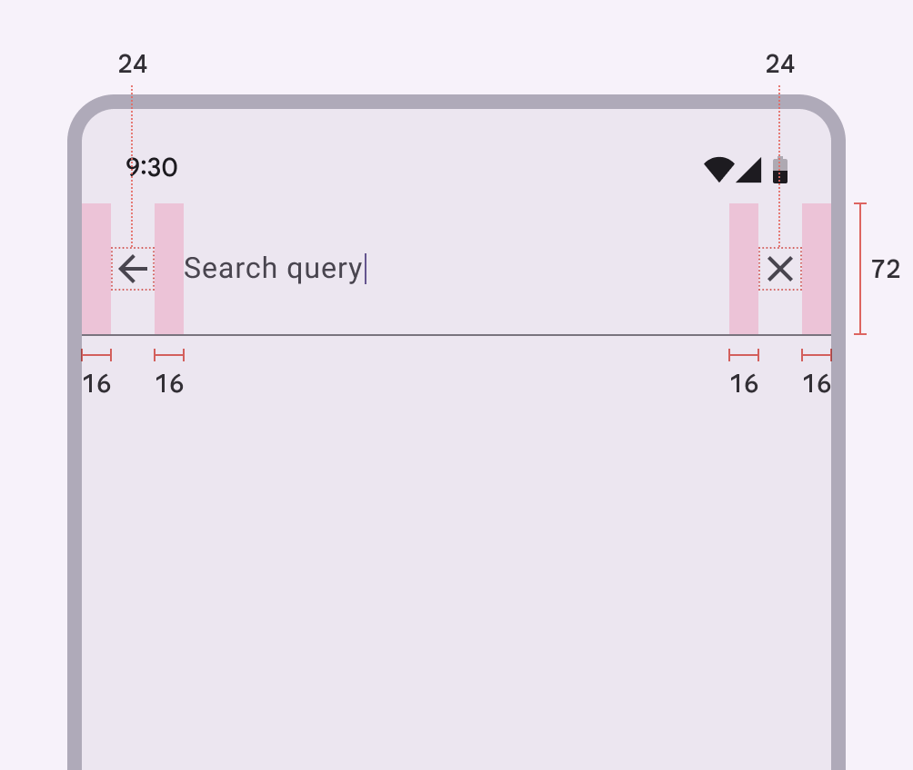

*Full-screen search padding and size measurements for divided style*

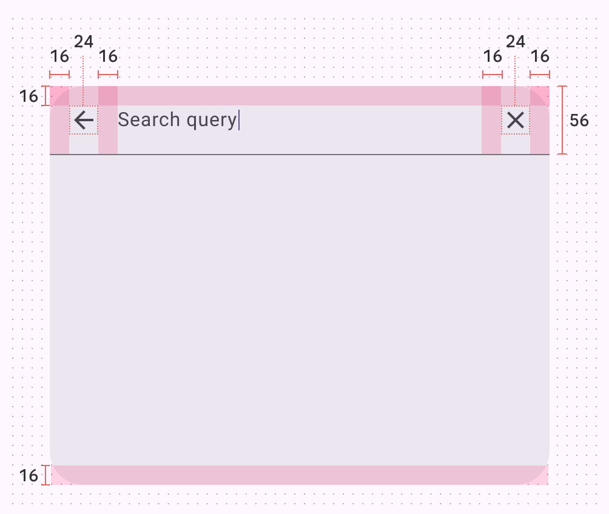

*Docked search padding and size measurements for divided style*
