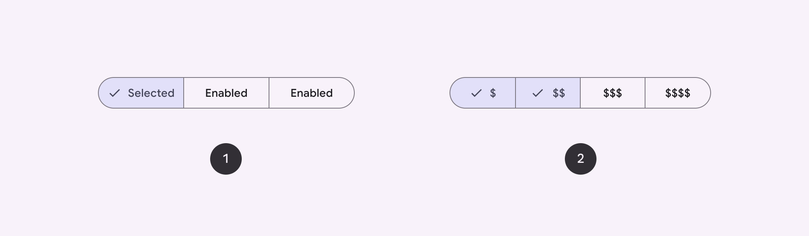
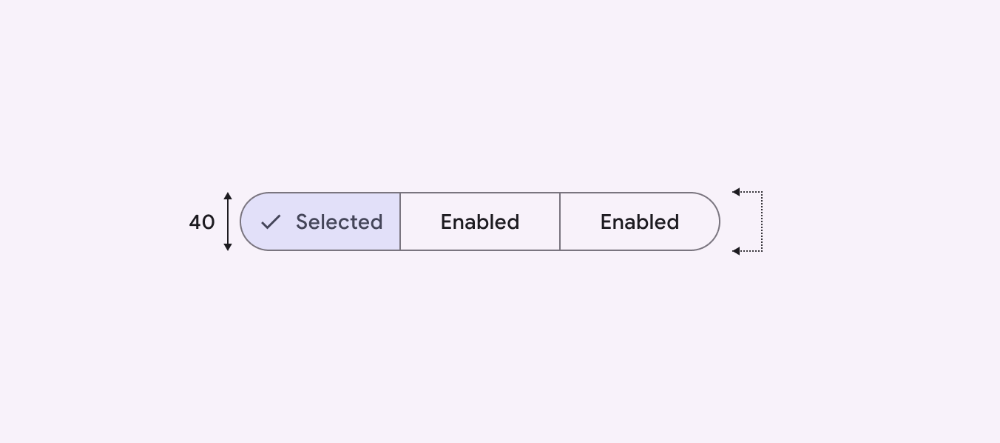
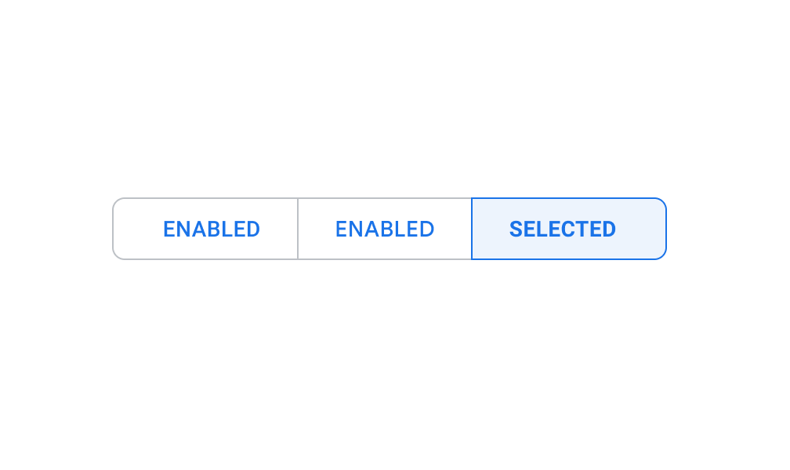
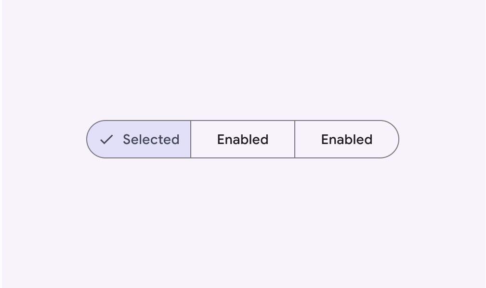

# Segmented buttons

Source: https://m3.material.io/components/segmented-buttons/overview

- Segmented buttons can contain icons, label text, or both
- Two variants: single-select and multi-select
- Use for simple choices between two to five items (for more items or complex choices, use chips (Chips help people enter information, make selections, filter content, or trigger actions. [More on chips](https://m3.material.io/m3/pages/chips/overview)) )

*Single-select segmented button; Multi-select segmented button*

## Availability & resources

| Type | Resource | Status |
| --- | --- | --- |
| Design | [Design Kit (Figma)](https://www.figma.com/community/file/1035203688168086460) | Available |
| Implementation | [Flutter](https://api.flutter.dev/flutter/material/SegmentedButton-class.html) | Available |
| Implementation | [Jetpack Compose](https://developer.android.com/develop/ui/compose/components/segmented-button) | Available |
| Implementation | [MDC-Android](https://github.com/material-components/material-components-android/blob/master/docs/components/Button.md#toggle-button) | Available |
| Implementation | Web | Unavailable |

## M3 Expressive update

May 2025

The segmented button is no longer recommended. Use the [connected button group](https://m3.material.io/m3/pages/button-groups/overview/) instead. [More on M3 Expressive](https://m3.material.io/blog/building-with-m3-expressive)

## Differences from M2

- Color: New color mappings and compatibility with dynamic color (Dynamic color takes a single color from a user's wallpaper or in-app content and creates an accessible color scheme assigned to elements in the UI. [More on dynamic color](https://m3.material.io/m3/pages/dynamic/choosing-a-source))
- Icons: Optional check icon to indicate selected state (States show the interaction status of a component or UI element. [More on states](https://m3.material.io/m3/pages/interaction-states/overview))
- Layout: Taller container height of 40dp
- Name and variants: Segmented buttons were previously known as toggle buttons. They now have two official variants: single-select and multi-select.
- Shape: Fully rounded corners
- Typography: Labels use sentence case instead of all caps

*Segmented buttons now have a container height of 40dp*

*M2: Segmented buttons had a small corner radius and label text in all caps*

*M3: Segmented buttons have fully rounded corners, sentence-case text, different height, and new color mappings*
