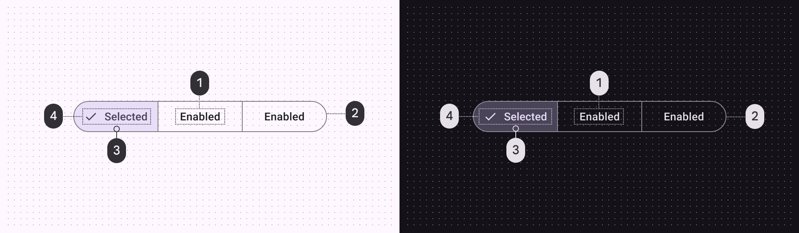
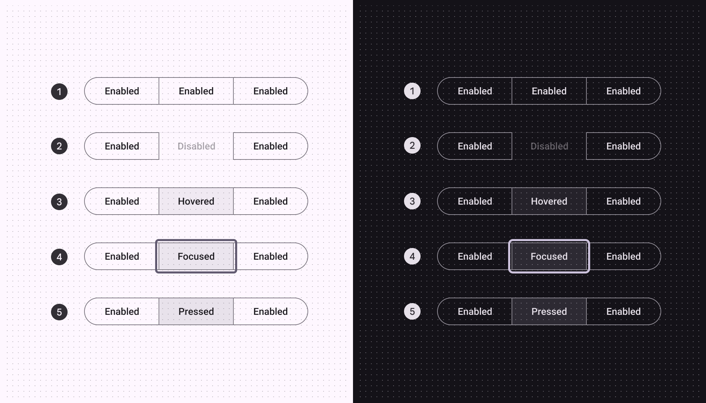
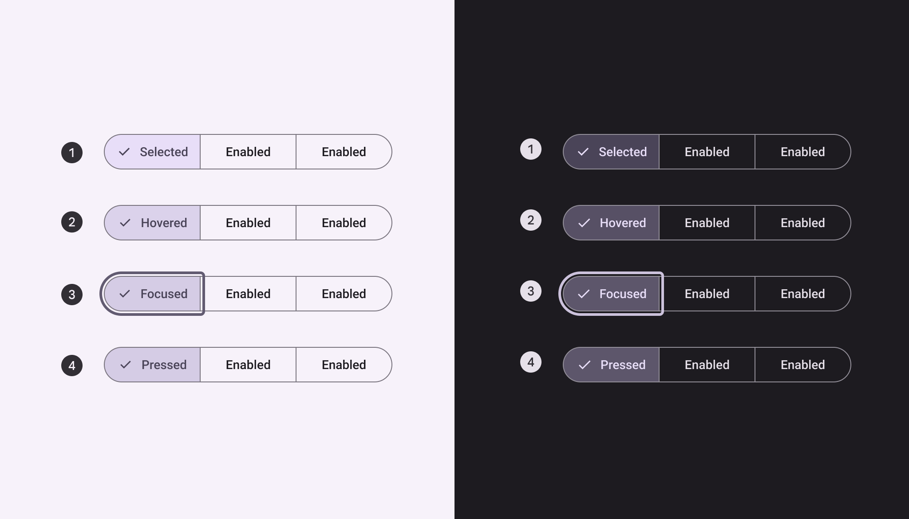
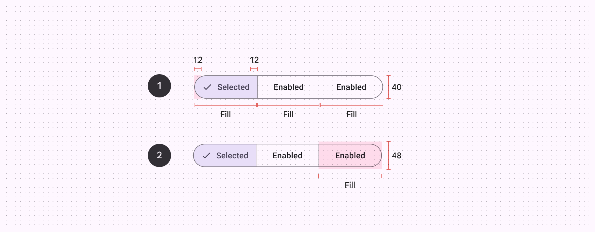
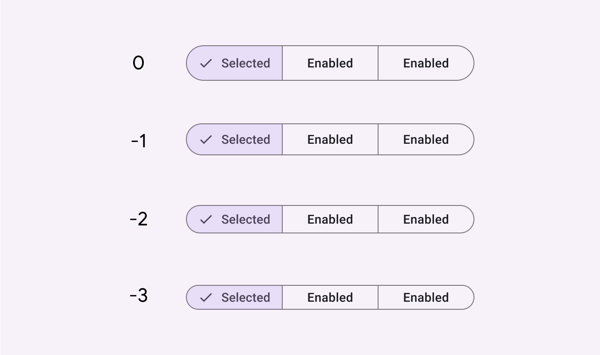

# Segmented buttons

Source: https://m3.material.io/components/segmented-buttons/specs

*Container; Icon (optional for unselected state); Label text*

## Tokens and specs

Browse the component elements, attributes, tokens, and their values. [Learn more about design tokens](https://m3.material.io/m3/pages/design-tokens/overview)

- Columns: Token
- Visible groups: Enabled; Disabled; Hovered; Focused; Pressed (ripple)

## Color

Color values are implemented through design tokens (Design tokens are the building blocks of all UI elements. The same tokens are used in designs, tools, and code. [More on tokens](https://m3.material.io/m3/pages/design-tokens/overview)). For design, this means working with color values that correspond with tokens. For implementation, a color value will be a token that references a value. [Learn more about design tokens](https://m3.material.io/m3/pages/design-tokens/overview)

*On surface; Outline; Secondary container; On secondary container*

## States

States (States show the interaction status of a component or UI element. [More on states](https://m3.material.io/m3/pages/interaction-states/overview)) are visual representations used to communicate the status of a component or interactive element. [Learn more about interaction states](https://m3.material.io/m3/pages/interaction-states/overview)

### Unselected

*Enabled; Disabled; Hovered; Focused; Pressed*

### Selected

*Selected; Hovered on selected; Focused on selected; Pressed on selected*

## Measurements

*Padding and container size; Target size*

| Attribute | Value |
| --- | --- |
| Container width | Dynamic based on labels |
| Segment width | Container width / total segments (Example: 1/3) |
| Height | 40dp |
| Outline width | 1dp |
| Label alignment | Center |
| Left/right padding | Min 12dp |
| Padding between elements | 8dp |
| Target size | 48dp |

### Density

Density can be used in denser UIs where space is limited. Density is only applied to the height.

*Each step down in density removes 4dp from the height*
