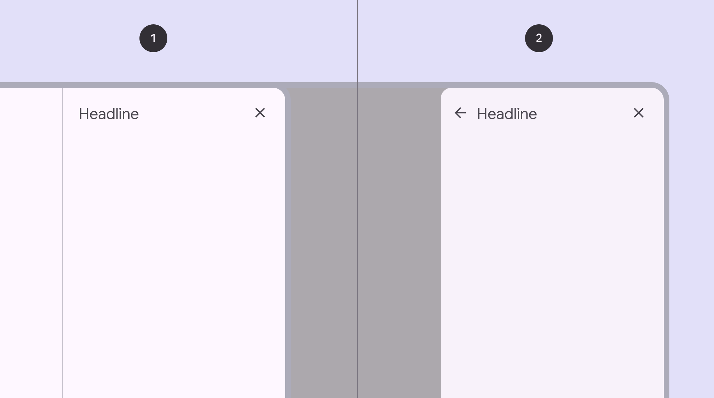
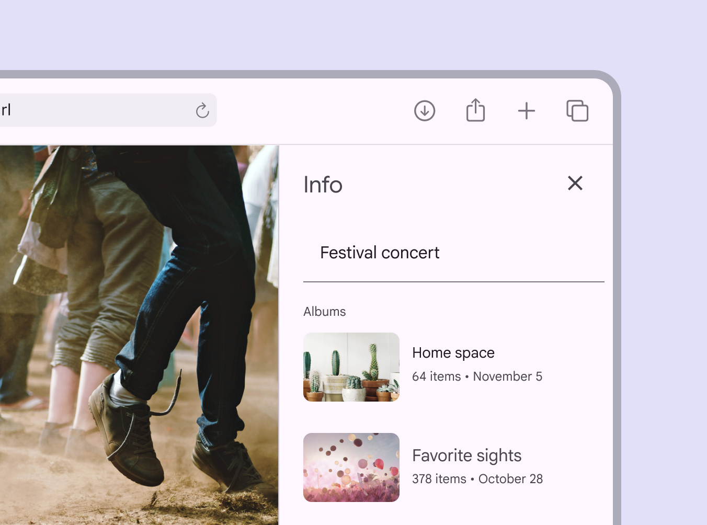
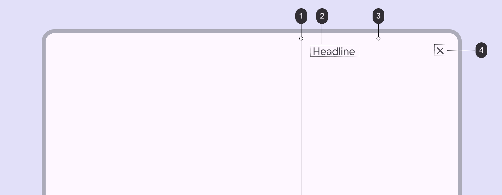
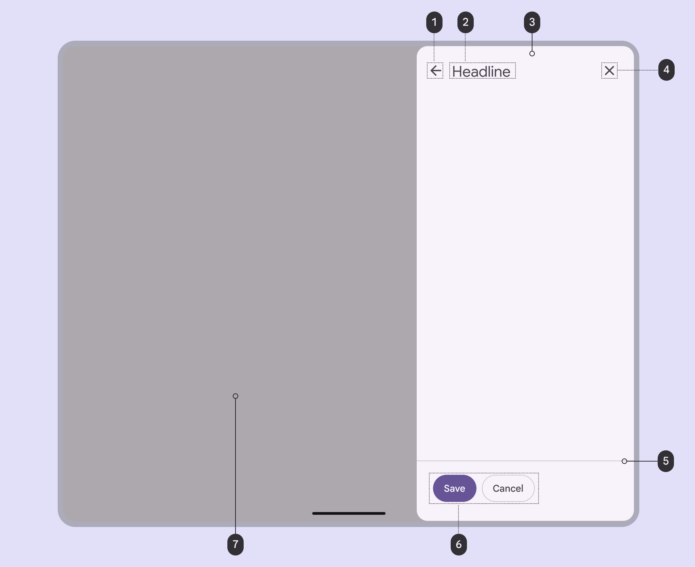
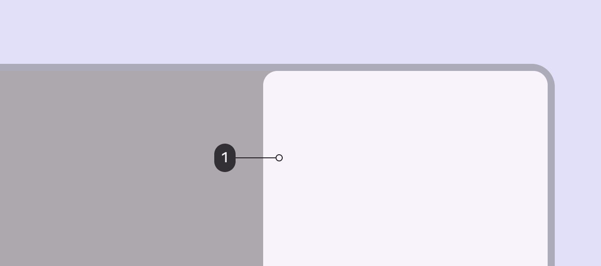
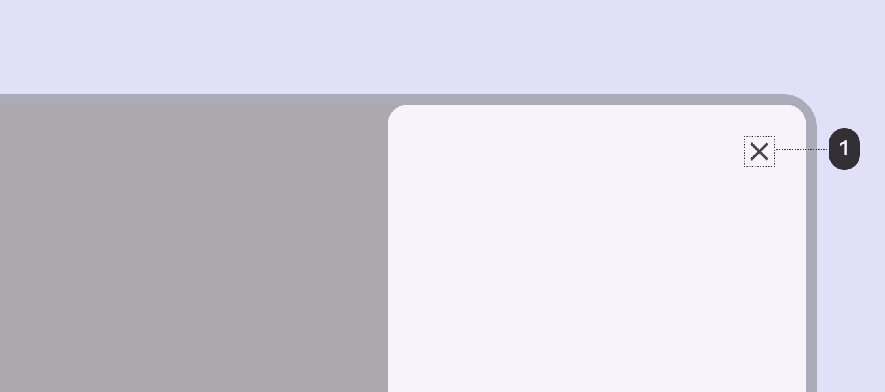
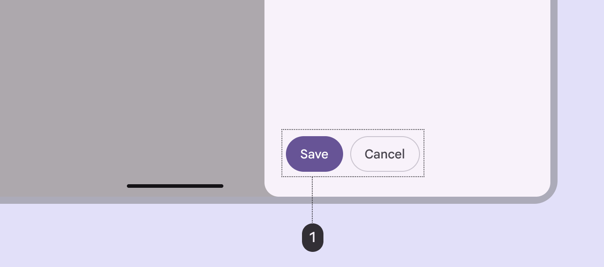
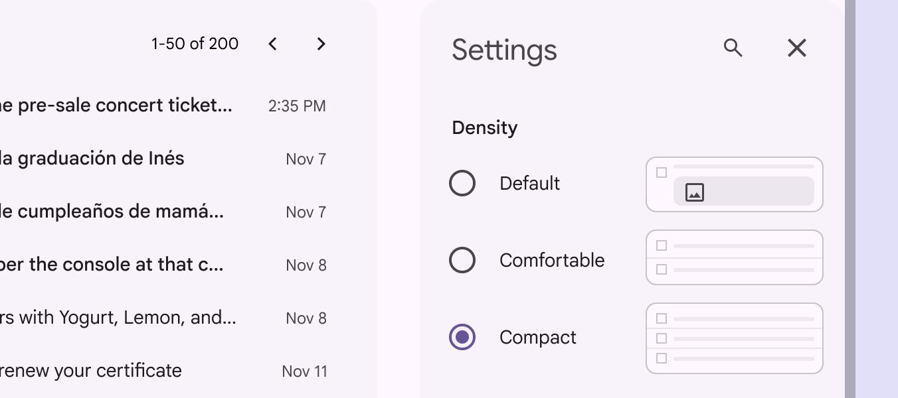

# Side sheets

Source: https://m3.material.io/components/side-sheets/guidelines

*Standard side sheet; Modal side sheet*

## Usage

Standard side sheets (Standard side sheets display content without blocking access to the screen’s primary content, such as an audio player at the side of a music app. They're often used in medium and expanded window sizes like tablet or desktop.) are supplementary surfaces used mostly in medium (Window widths from 600dp to 839dp, such as a tablet or foldable in portrait orientation. [More on medium window size class](https://m3.material.io/m3/pages/applying-layout/medium)) to expanded window sizes, (Window widths 840dp to 1199dp, such as a tablet or foldable in landscape orientation, or desktop. [More on expanded window size class](https://m3.material.io/m3/pages/applying-layout/expanded)) like tablet and desktop. They provide a consistent and predictable surface for contextual actions and information. Standard side sheets display content that complements the screen’s primary content. They remain visible while people interact with primary content.

Common uses include:

- Displaying a list of actions that affect the screen’s primary content, such as filters
- Displaying supplemental content and features

*Information about a photo in a standard side sheet*

Modal side sheets (Modal side sheets appear in front of app content, disabling all other app functionality when they appear, and remaining on screen until confirmed, dismissed, or a required action has been taken. They're often used in compact window sizes, like mobile, due to limited screen size.) are preferred in compact window sizes (Window widths smaller than 600dp, such as a phone in portrait orientation. [More on compact window size class](https://m3.material.io/m3/pages/applying-layout/compact)), like mobile, due to limited screen size.

They can display the same kinds of content as standard side sheets, but must be dismissed in order to interact with the underlying content.

*Modal side sheet with filter controls*

Side sheets have a fixed width and typically span the height of the screen.

Their dimensions depend on how the app’s layout (Layout is the visual arrangement of elements on the screen. [More on layout](https://m3.material.io/m3/pages/understanding-layout/overview)) is subdivided into UI regions.

*Do Place side sheets along the edge of the screen, usually on the right side to avoid interference with any navigational components on the left edge. They can be slightly inset by 16dp.*

*Don’t inset a side sheet from the screen edges far beyond the recommended margin. This makes the sheet’s position and scroll behavior unclear, while obscuring primary content.*

## Anatomy

*Divider (optional); Headline; Container; Close icon button*

*Back icon button (optional); Headline; Container; Close icon button; Divider (optional); Action buttons (optional); Scrim*

### Container

Side sheet containers hold all side sheet elements. Their size is determined by the space those elements occupy. The container is the only required element of a side sheet.

*Container*

### Back icon button (optional)

Icon buttons (Icon buttons help people take minor actions with one tap. [More on icon buttons](https://m3.material.io/m3/pages/icon-buttons/overview)) can provide ways to exit a side sheet or move to a different experience. Because the primary content behind or beside a side sheet is always visible, it’s important to provide affordances for leaving a side sheet and returning to the primary content.

*Back icon button*

### Close icon button (optional)

A close affordance provides a consistent method for dismissing a side sheet.

A close icon button is highly recommended, increases accessibility (Accessible design makes products usable for people with all kinds of abilities. [More on accessibility](https://m3.material.io/m3/pages/overview/principles)), and makes focused (A focused state communicates when a user has highlighted an element, using an input method such as a keyboard or voice. [More on focused state](https://m3.material.io/m3/pages/interaction-states/applying-states#bc6d6853-48ef-490e-8076-448e89e69f0f)) side sheets easier to close.

*Close icon button*

### Action buttons (optional)

Buttons (Buttons let people take action and make choices with one tap. [More on buttons](https://m3.material.io/m3/pages/common-buttons/overview)) represent actions available from a side sheet. Examples: Save, Edit, Download

Use elevation (Elevation is the distance between two surfaces on the z-axis [More on elevation](https://m3.material.io/m3/pages/elevation/overview)), fill, and tone (Tone is how light or dark a color appears. Tone is sometimes also referred to as luminance. [More on hue, chroma, and tone](https://m3.material.io/m3/pages/color/how-the-system-works#dc7848f3-b094-4f9a-9e50-bfa5a5029617)) to call attention to specific actions.

*Action buttons*

### Divider (optional)

Dividers (Dividers are thin lines that group content in lists or other containers. [More on dividers](https://m3.material.io/m3/pages/divider/overview)) can separate different kinds of content and create distinct regions in a side sheet.

Use a divider to separate:

- Action buttons from content
- User-generated content from system-generated content

*Divider*

### Content (optional)

Side sheets can display a wide variety of content and layouts (Layout is the visual arrangement of elements on the screen. [More on layout](https://m3.material.io/m3/pages/understanding-layout/overview)), ranging from a list (Lists are continuous, vertical indexes of text and images. [More on lists](https://m3.material.io/m3/pages/lists/overview)) of actions to supplemental content in a tabular layout.

*Form controls shown in a side sheet for app settings*

[Video: As a small screen changes to a larger size the modal side sheet transitions to a standard side sheet.](assets/asset-014-modal-side-sheets-on-smaller-screens-can-transition-20fc9f364a.webp)

*Modal side sheets on smaller screens can transition to standard side sheets at larger screen sizes*

## Adaptive design

Side sheets have a default width, but can be resized depending on the needs of the layout (Layout is the visual arrangement of elements on the screen. [More on layout](https://m3.material.io/m3/pages/understanding-layout/overview)). When a standard side sheet (Standard side sheets display content without blocking access to the screen’s primary content, such as an audio player at the side of a music app. They're often used in medium and expanded window sizes like tablet or desktop.) opens, the body area shrinks to accommodate the sheet’s width while maintaining a margin (Margins are the spaces between the edge of a nested element and its parent element, such as the space between a button's label text and the edge of its container. [More on margins](https://m3.material.io/m3/pages/understanding-layout/spacing#38a538d7-991f-4c39-8449-195d32caf397)) on the body’s trailing edge.

[Video: Body area of a screen adjusts to accommodate entrance and exit of side sheet.](assets/asset-015-entrance-of-standard-side-sheets-will-cause-the-a8ebb32a07.webp)

*Entrance of standard side sheets will cause the body area to adjust and accommodate the new content*

### RTL language support

In right-to-left (RTL) languages, side sheets should appear on the left edge of the window with all elements reversed.

*Side sheet elements are reversed in RTL languages*

## Behavior

Side sheets can vertically scroll independent of the rest of the UI.

This allows their scroll position and content to persist while the page is scrolled, and vice versa. Side sheets cannot scroll horizontally.

[Video: Animation showing a side sheet being scrolled vertically to view all the options.](assets/asset-017-do-side-sheets-can-vertically-scroll-internally-when-7b8310af00.webp)

*Do Side sheets can vertically scroll internally when their content exceeds the screen height*

*Don’t allow horizontal scrolling or lay out the side sheet in a way that suggests horizontal scrolling. A side sheet’s narrow width leaves limited space to fully view items.*

### Predictive back

On Android, a gesture (Gestures are all the ways people interact with UI elements using touch. [More on gestures](https://m3.material.io/m3/pages/gestures)) called [predictive back](https://github.com/material-components/material-components-android/blob/master/docs/foundations/PredictiveBack.md) allows a person to swipe left or right on the side sheet.

When predictive back is used:

- The side sheet detaches from the top and bottom edges of the screen to signal it will close
- The previous screen is revealed in a preview
- The side sheet and its content always scales in the direction of the gesture

[Find a list of compatible components](https://m3.material.io/m3/pages/gestures#22462fb2-fbe8-4e0c-b3e7-9278bd18ea0d)

[Video: Swiping to go back shows a preview of the previous screen.](assets/asset-019-preview-of-the-result-of-the-gestures-release-b1cb2fe646.webp)

*Preview of the result of the gestures: release to commit, fling to commit, and cancel*
