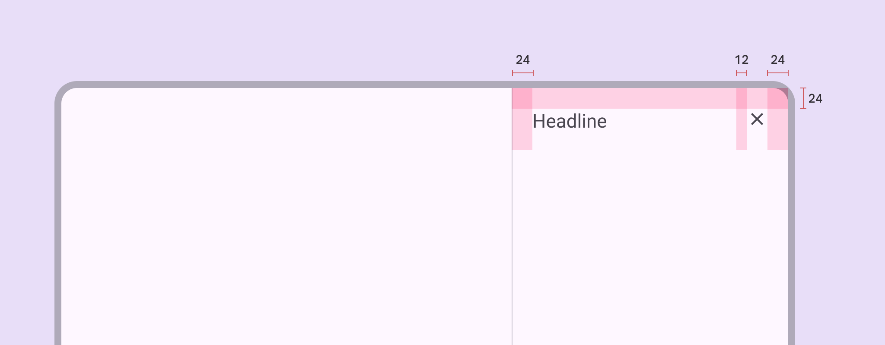
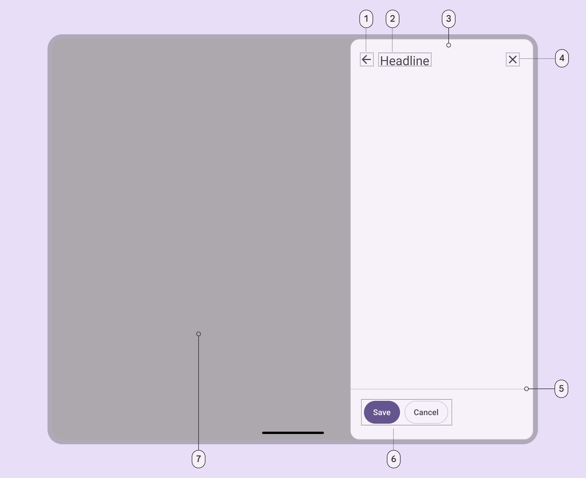
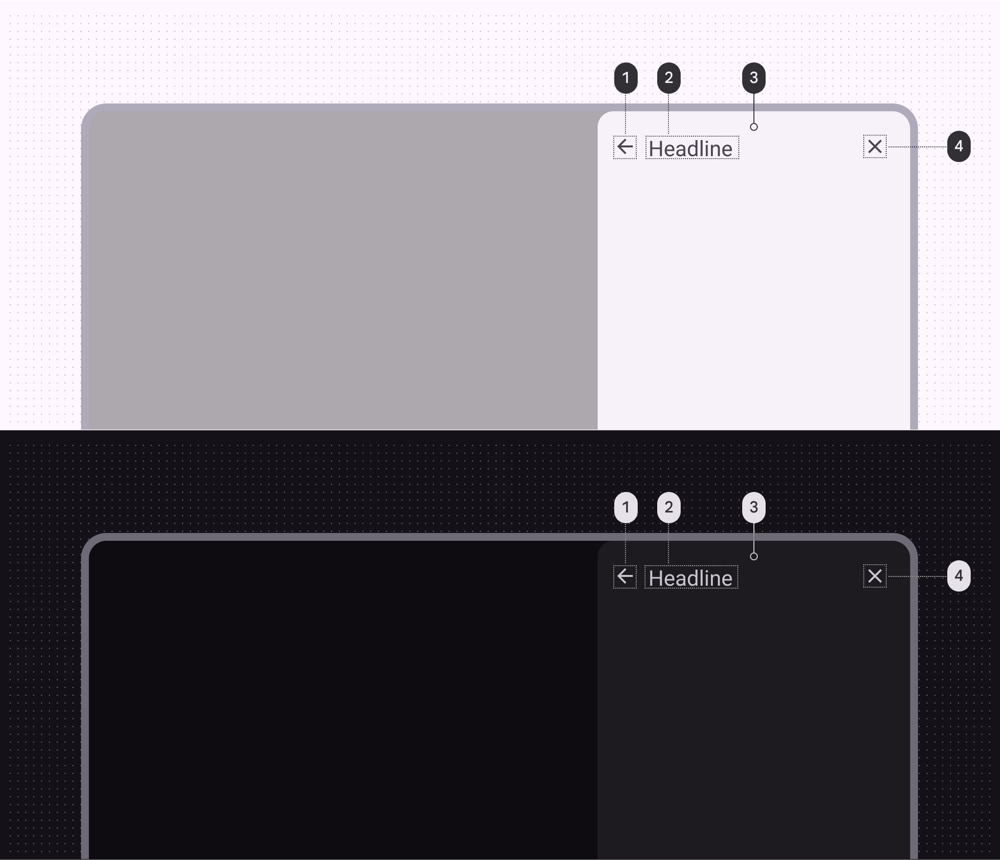
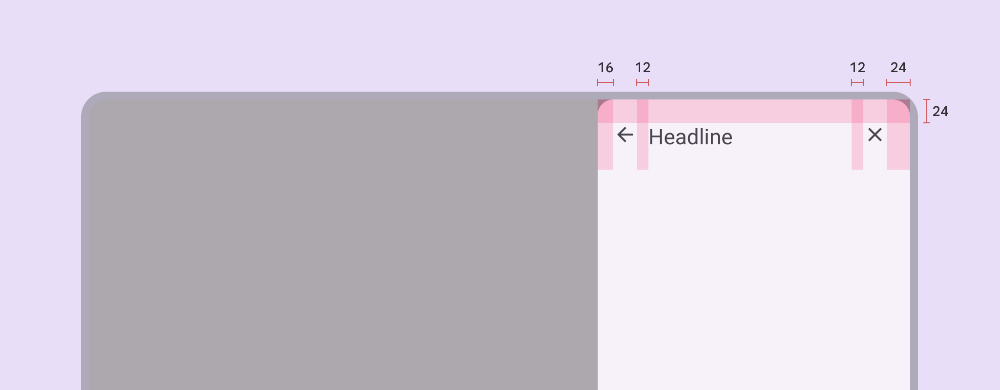

# Side sheets

Source: https://m3.material.io/components/side-sheets/specs

## Tokens & specs

Browse the component elements, attributes, tokens, and their values. [Learn more about design tokens](https://m3.material.io/m3/pages/design-tokens/overview)

- Columns: Token
- Visible groups: Enabled; Hovered; Focused; Pressed (ripple)

## Standard side sheet

*Divider (optional); Headline; Container; Close icon button*

### Standard side sheet color

Color values are implemented through design tokens (Design tokens are the building blocks of all UI elements. The same tokens are used in designs, tools, and code. [More on tokens](https://m3.material.io/m3/pages/design-tokens/overview)). For design, this means working with color values that correspond with tokens. For implementation, a color value will be a token that references a value. [Learn more about design tokens](https://m3.material.io/m3/pages/design-tokens/overview/)

*Outline variant; On surface variant; Surface; On surface variant*

### Standard side sheet measurements

*Side sheet padding and size measurements*

| Attribute | Value |
| --- | --- |
| Start/end padding | 24dp |
| Padding between top elements | 12dp |
| Bottom actions height | 72dp |
| Bottom actions top padding | 16dp |
| Bottom actions bottom padding | 24dp |
| Bottom actions alignment (horizontal) | Left |
| Max-width | 400dp |
| Margins (when detached) | 16dp |

## Modal side sheet

*Back icon button (optional); Headline; Container; Close icon button; Divider (optional); Action buttons (optional); Scrim*

### Modal side sheet color

Color values are implemented through design tokens (Design tokens are the building blocks of all UI elements. The same tokens are used in designs, tools, and code. [More on tokens](https://m3.material.io/m3/pages/design-tokens/overview)). For design, this means working with color values that correspond with tokens. For implementation, a color value will be a token that references a value. [Learn more about design tokens](https://m3.material.io/m3/pages/design-tokens/overview/).

*On surface variant; On surface variant; Surface container low; On surface variant*

### Modal side sheet measurements

*Modal side sheet padding and size measurements*

| Attribute | Value |
| --- | --- |
| Start/end padding | 24dp |
| Start padding with icon | 16dp |
| Padding between top elements | 12dp |
| Bottom actions height | 72dp |
| Bottom actions top padding | 16dp |
| Bottom actions bottom padding | 24dp |
| Bottom actions alignment (horizontal) | Left |
| Max-width | 400dp |
| Margins (when detached) | 16dp |
