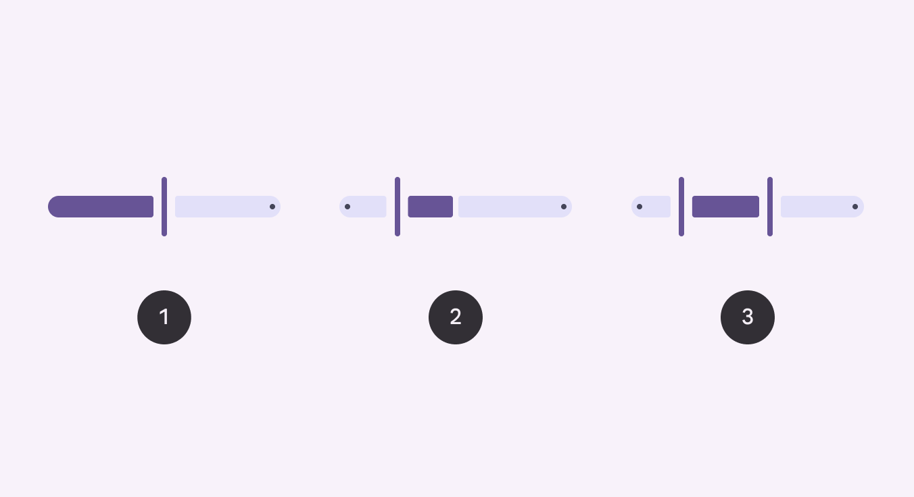
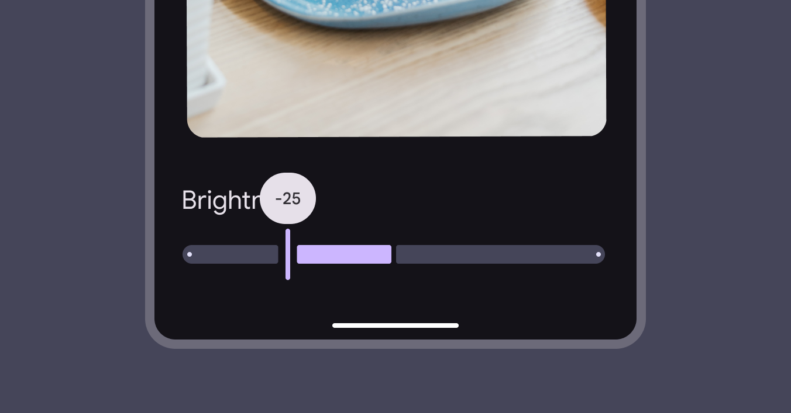
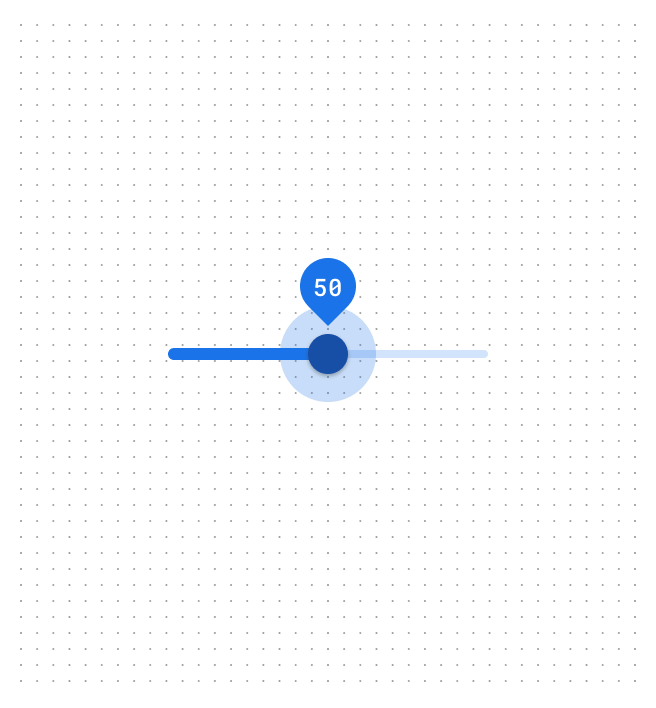
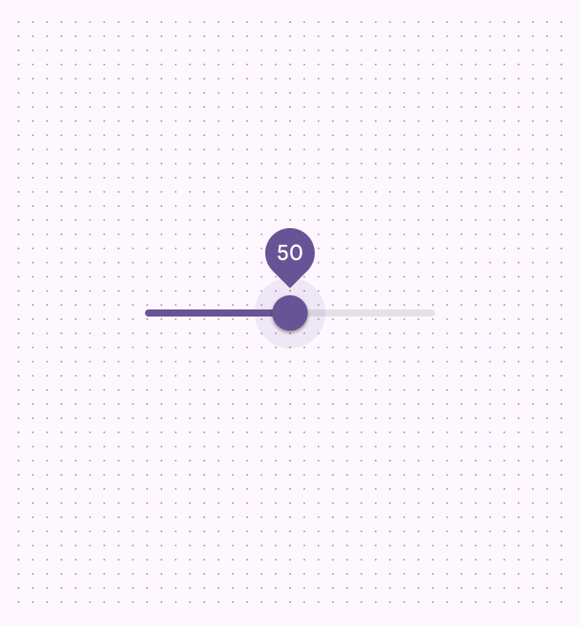

# Sliders

Source: https://m3.material.io/components/sliders/overview

- Three variants: Standard, centered, range
- Has five sizes, vertical and horizontal orientation, and an optional inset icon
- Sliders should present the full range of available values
- The slider value should take effect immediately

[Video: A vertical slider changes the brightness of bedroom lights.](assets/asset-001-sliders-change-values-along-a-range-a74358a7b3.webp)

*Sliders change values along a range*

## Availability & resources

| Type | Resource | Status |
| --- | --- | --- |
| Design | [Design Kit (Figma)](https://www.figma.com/community/file/1035203688168086460) | Available |
| Implementation | [Flutter](https://api.flutter.dev/flutter/material/Slider-class.html) | Available |
| Implementation | [Jetpack Compose](https://developer.android.com/develop/ui/compose/components/slider) | Available |
| Implementation | [Jetpack Compose: Expressive](https://developer.android.com/reference/kotlin/androidx/compose/material3/package-summary#Slider(androidx.compose.material3.SliderState,androidx.compose.ui.Modifier,kotlin.Boolean,androidx.compose.material3.SliderColors,androidx.compose.foundation.interaction.MutableInteractionSource,kotlin.Function1,kotlin.Function1)) | Available |
| Implementation | [MDC-Android](https://github.com/material-components/material-components-android/blob/master/docs/components/Slider.md) | Available |
| Implementation | [MDC-Android: Expressive](https://github.com/material-components/material-components-android/blob/master/docs/components/Slider.md) | Available |
| Implementation | [Web](https://github.com/material-components/material-web/blob/main/docs/components/slider.md) | Available |
| Implementation | Web: Expressive | Unavailable |

## M3 Expressive update

May 2025

The slider includes expressive configurations for orientation, shape sizes, and an inset icon. [More on M3 Expressive](https://m3.material.io/blog/building-with-m3-expressive)

Updated on MDC-Android and Jetpack Compose.

Variants and naming:

- Changed continuous slider to standard slider
- The discrete slider is now the stops configuration

New configurations:

- Orientation: Horizontal, vertical
- Optional inset icon (standard slider only)
- Sizes: XS (existing default), S, M, L, XL

*Standard slider; Centered slider; Range slider*

## Previous updates

### Visual refresh to improve non-text contrast

Dec 2023: Updated on MDC-Android and Jetpack Compose.

- Configuration: Added centered configuration and range selection
- Shape: New shape for slider tracks and handles. Slider elements change shape when selected.
- Motion: Slider handle adjusts width upon selection. Slider tracks adjust in shape when sliding to the edge.
- Color: Refreshed color mappings

*M3 visual refresh: Sliders have a stop indicator, larger label text, and a vertical handle that narrows when pressed. Centered sliders start from the middle instead of the leading edge.*

## Differences from M2

- Color: New color mappings and compatibility with dynamic color (Dynamic color takes a single color from a user's wallpaper or in-app content and creates an accessible color scheme assigned to elements in the UI. [More on dynamic color](https://m3.material.io/m3/pages/dynamic/choosing-a-source))

*M2: Sliders have a circular handle and a small label when pressed*

*M3: Sliders have new color mappings and support dynamic color*
