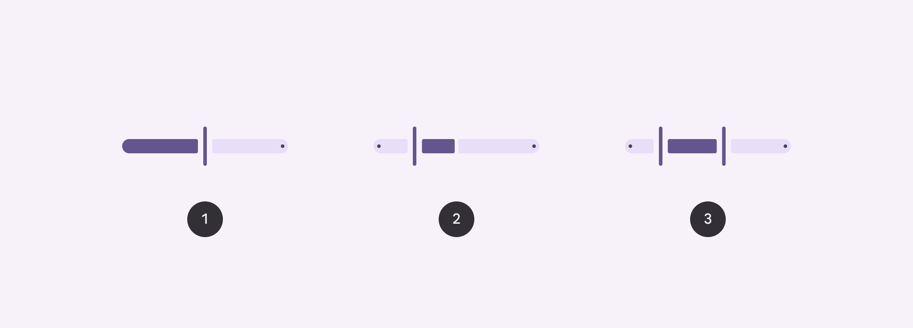
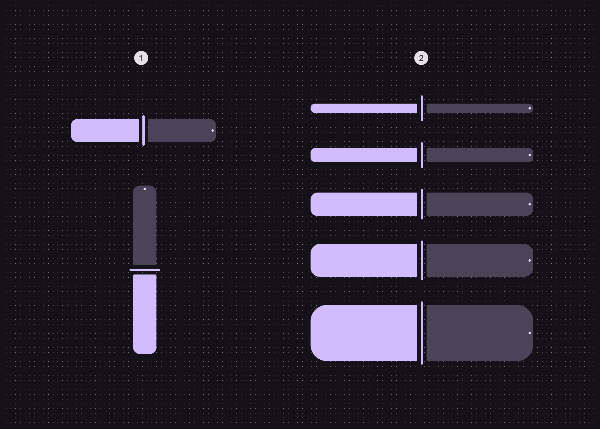
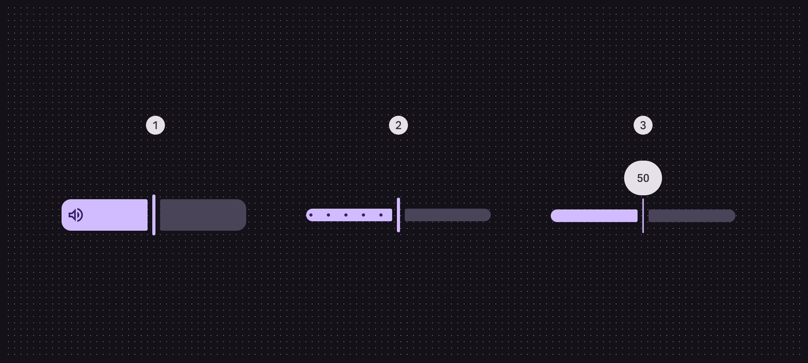
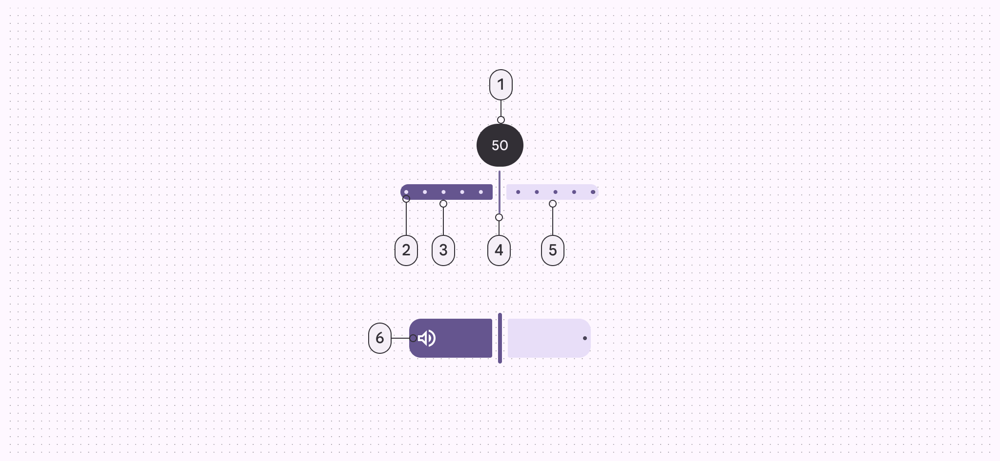
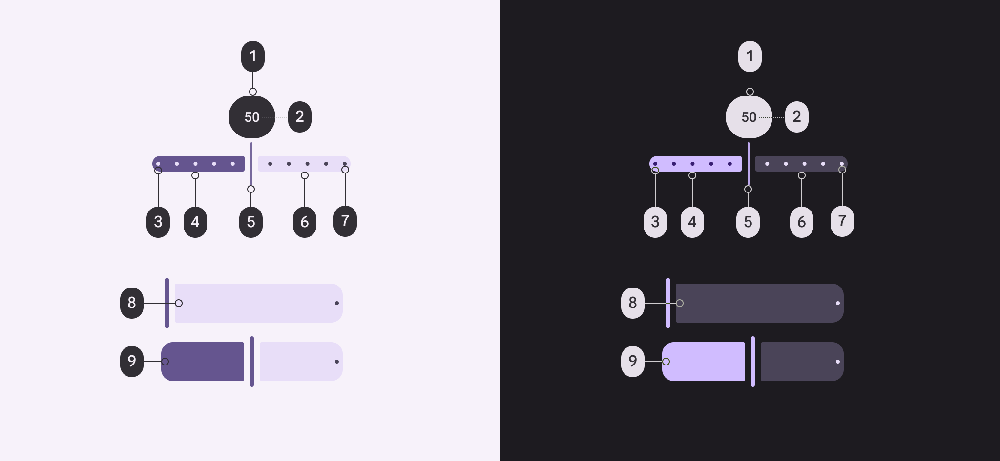
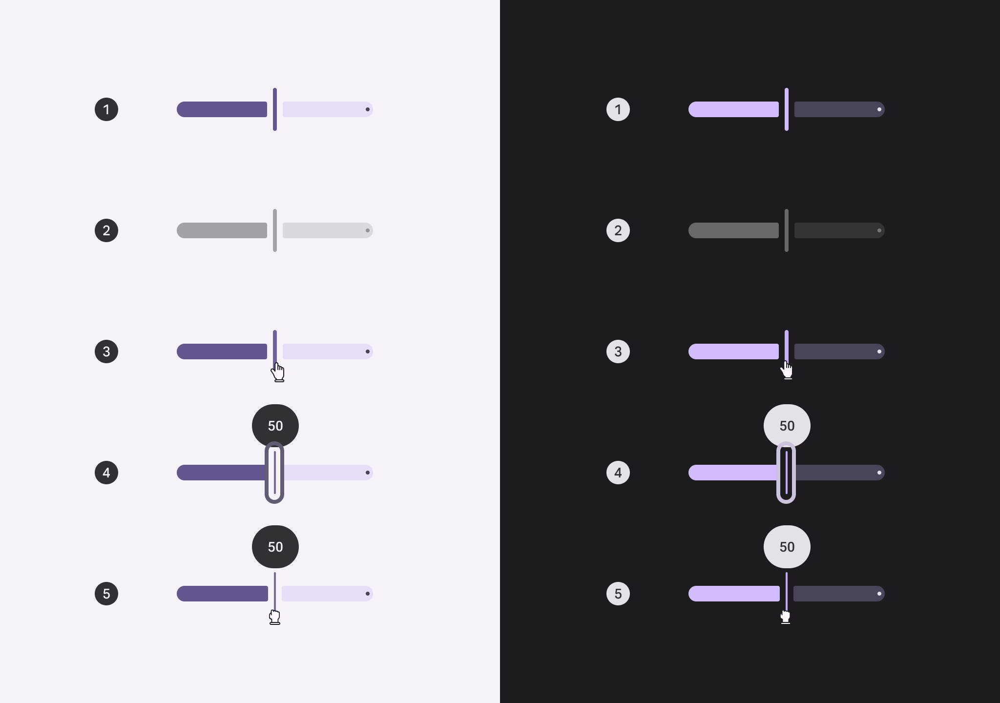
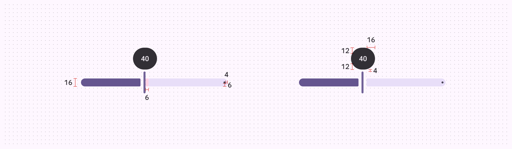
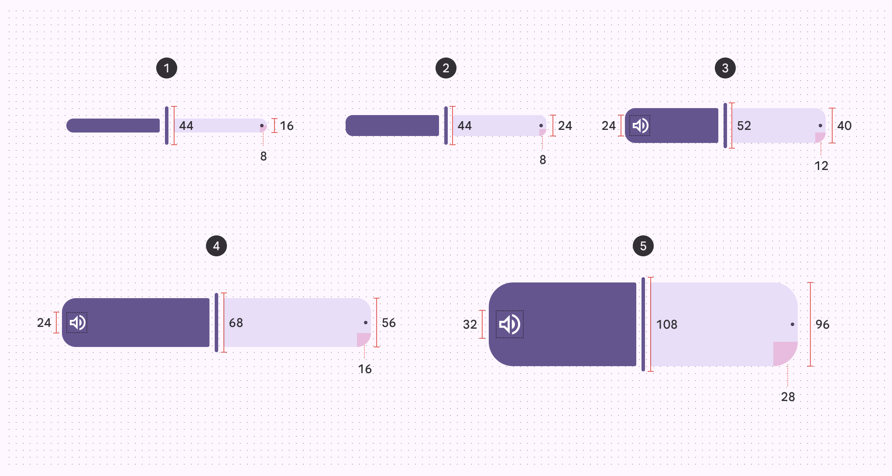

# Sliders

Source: https://m3.material.io/components/sliders/specs

## Variants

*Standard; Centered; Range*

| Variant | M3 | M3 Expressive |
| --- | --- | --- |
| Standard | Available as “continuous” slider | Available |
| Centered | Available (web only) | Available |
| Range | Available | Available |
| Discrete | Available | Available as “stops” configuration |

## Configurations

*Orientation: Horizontal, vertical; Size: XS, S, M, L, XL*

*Inset icon; Stops; Value indicator*

| Category | Configuration | M3 | M3 Expressive |
| --- | --- | --- | --- |
| Inset icon | No (default) | Available | Available |
| Inset icon | Yes | -- | Available |
| Orientation | Horizontal (default) | Available | Available |
| Orientation | Vertical | -- | Available |
| Size | XS (default) | Available | Available |
| Size | S, M, L, XL | -- | Available on MDC-Android. Available as tokens on other platforms.* |
| Stop indicators | No (default), Yes | Available as “discrete” slider | Available |
| Value Indicator | No (default), Yes | Available | Available |

## Tokens & specs

Slider tokens are organized into a common token set, and token sets for each size. Switch token sets from the table’s menu. [Learn more about design tokens](https://m3.material.io/m3/pages/design-tokens/overview)

- Columns: Token
- Visible groups: Enabled; Disabled; Hovered; Focused; Pressed (ripple)

## Anatomy

*Value indicator (optional); Stop indicators (optional); Active track; Handle; Inactive track; Inset icon (optional)*

## Color

*Inverse surface; Inverse on surface; Primary; On primary; Primary; Secondary container; On secondary container; On secondary container; On primary*

## States

*Enabled; Disabled; Hovered; Focused; Pressed*

## Measurements

*Padding and size measurements for common sliders*

*Padding and size measurements for XS, S, M, L, and XL sliders*

| Attribute | XS | S | M | L | XL |
| --- | --- | --- | --- | --- | --- |
| Track height | 16dp | 24dp | 40dp | 56dp | 96dp |
| Label container height | 44dp | 44dp | 44dp | 44dp | 44dp |
| Label container width | 48dp | 48dp | 48dp | 48dp | 48dp |
| Handle height | 44dp | 44dp | 52dp | 68dp | 108dp |
| Handle width | 4dp | 4dp | 4dp | 4dp | 4dp |
| Track shape | 8dp | 8dp | 12dp | 16dp | 28dp |
| Inset icon size | -- | -- | 24dp | 24dp | 32dp |
