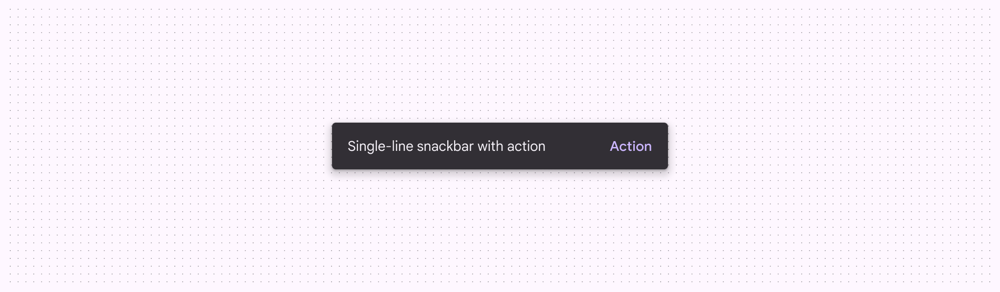
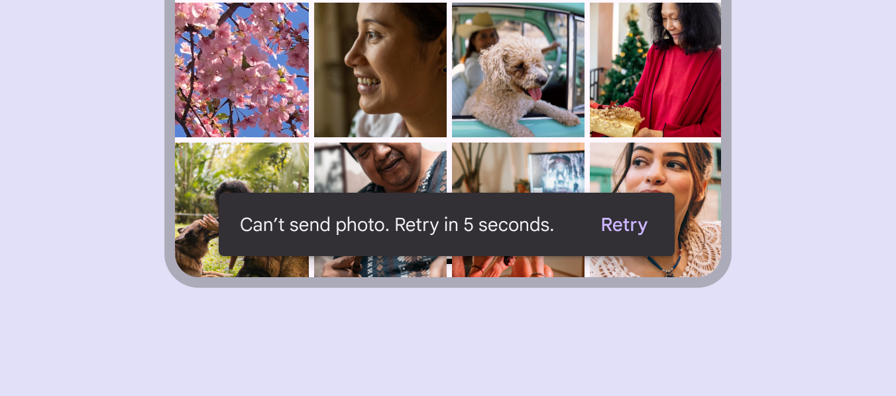

# Snackbar

Source: https://m3.material.io/components/snackbar/overview

- Snackbars shouldn’t interrupt the user’s experience
- Usually appear at the bottom of the UI
- Can disappear on their own or remain on screen until the user takes action

## Availability & resources

| Type | Resource | Status |
| --- | --- | --- |
| Design | [Design Kit (Figma)](https://www.figma.com/community/file/1035203688168086460) | Available |
| Implementation | [Flutter](https://api.flutter.dev/flutter/material/SnackBar-class.html) | Available |
| Implementation | [Jetpack Compose](https://developer.android.com/develop/ui/compose/components/snackbar) | Available |
| Implementation | [MDC-Android](https://github.com/material-components/material-components-android/blob/master/docs/components/Snackbar.md) | Available |
| Implementation | Web | Unavailable |

## Differences from M2

- Color: New color mappings and compatibility with dynamic color (Dynamic color takes a single color from a user's wallpaper or in-app content and creates an accessible color scheme assigned to elements in the UI. [More on dynamic color](https://m3.material.io/m3/pages/dynamic/choosing-a-source))
- Behavior: Clarified that snackbars can either appear temporarily (dismissive) or persist until the user takes an action (non-dismissive)

*Snackbars have new color mappings*
