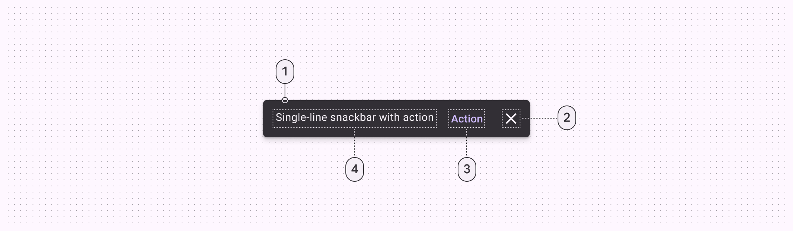
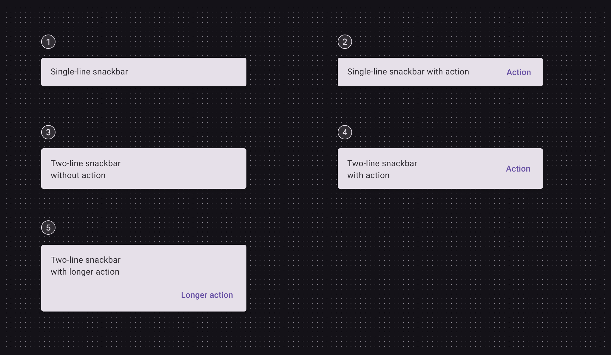

# Snackbar

Source: https://m3.material.io/components/snackbar/specs

*Container; Icon (optional close affordance); Action (optional); Supporting text*

## Tokens and specs

Browse the component elements, attributes, tokens, and their values. [Learn more about design tokens](https://m3.material.io/m3/pages/design-tokens/overview)

- Columns: Token
- Visible groups: Enabled; Hovered; Focused; Pressed (ripple)

## Color

Color values are implemented through design tokens (Design tokens are the building blocks of all UI elements. The same tokens are used in designs, tools, and code. [More on tokens](https://m3.material.io/m3/pages/design-tokens/overview)). For design, this means working with color values that correspond with tokens. For implementation, a color value will be a token that references a value. [Learn more about design tokens](https://m3.material.io/m3/pages/design-tokens/overview)

*Inverse surface; Inverse on surface; Inverse primary; Inverse on surface*

## Measurements

*Snackbar padding and size measurements*

## Configurations

*Single line; Single line with action; Two lines; Two lines with action; Two lines with longer action*
