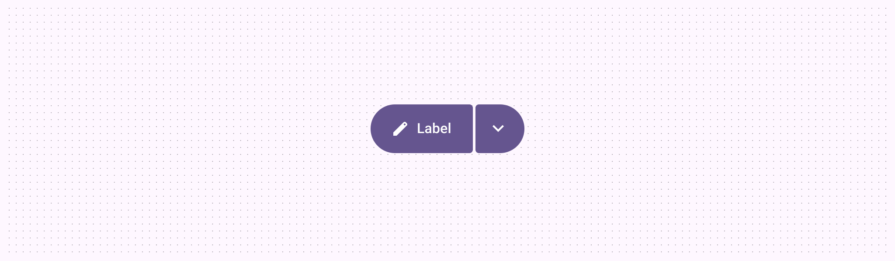
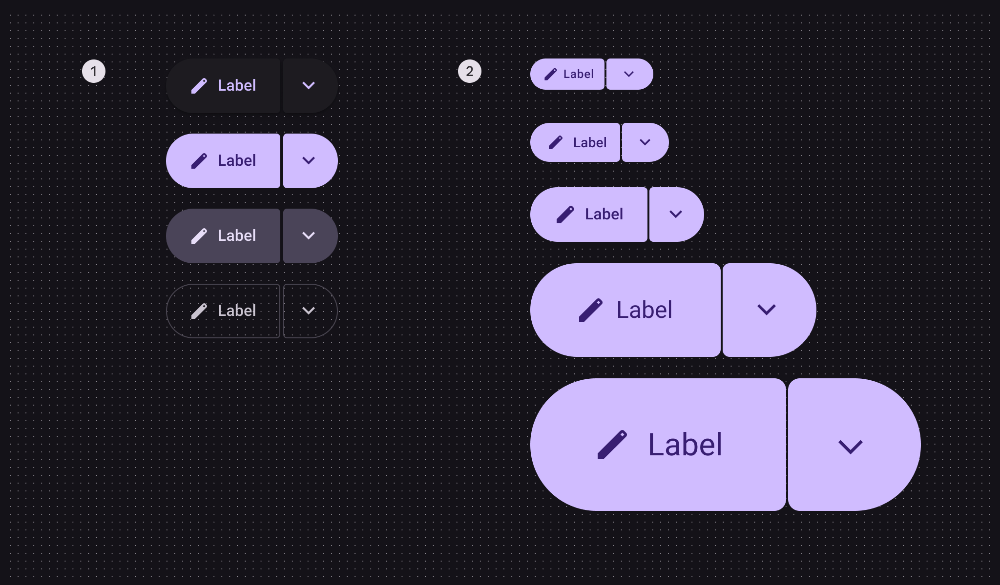
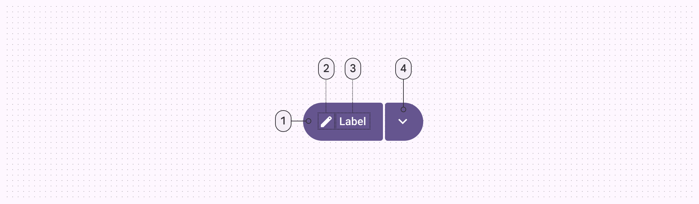
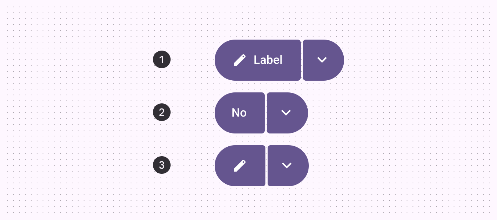
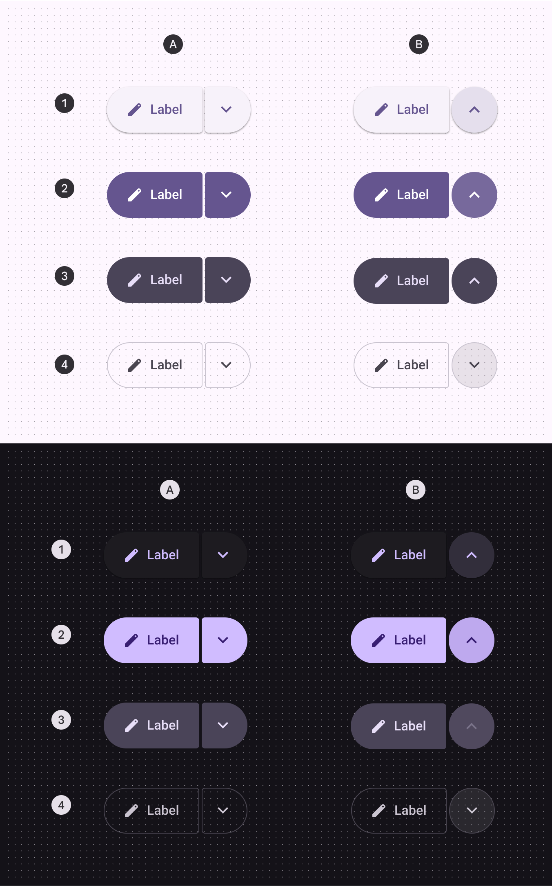
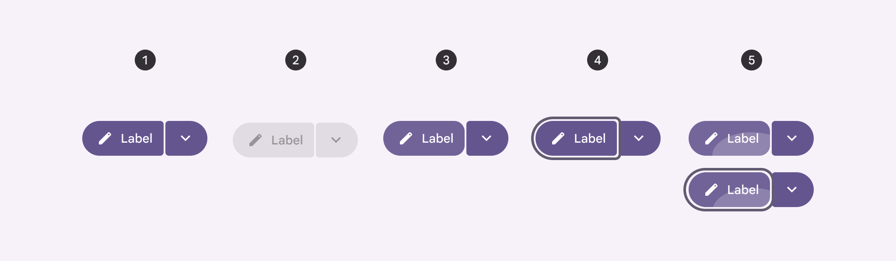
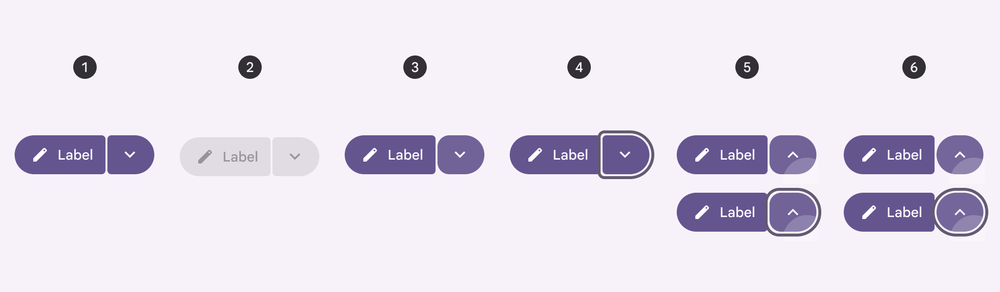
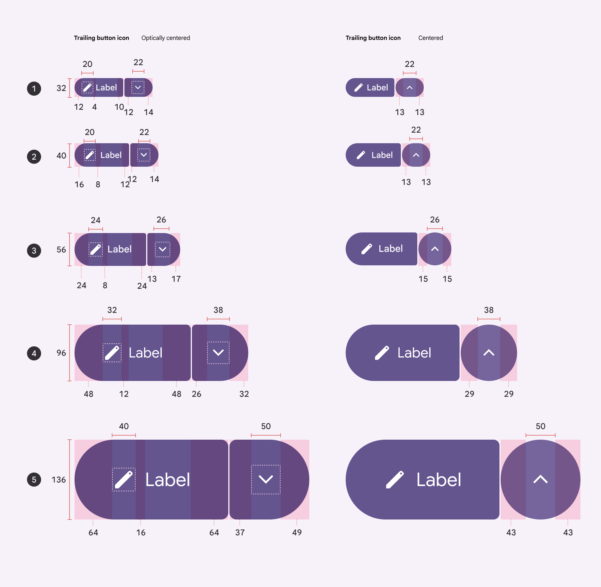
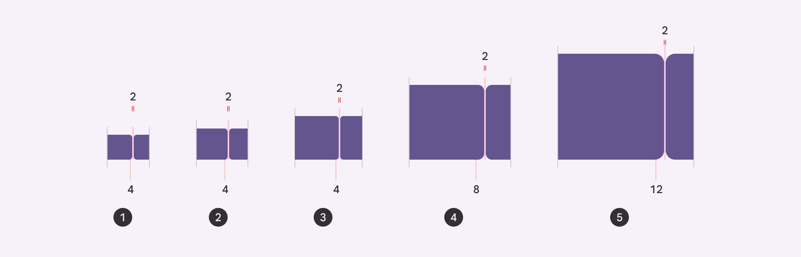

# Split buttons

Source: https://m3.material.io/components/split-button/specs

## Variants

| Variant | M3 | M3 Expressive |
| --- | --- | --- |
| Split button | -- | Available |

## Configurations

*Color configurations: Elevated, filled, tonal, outlined; Size configurations: XS, S, M, L, XL*

| Category | Configuration | M3 | M3 Expressive |
| --- | --- | --- | --- |
| Size | XS, S, M, L, XL | -- | Available |
| Color | Elevated, filled, tonal, outlined | -- | Available |

## Tokens & specs

Use the table's menu to select a token set. Split button token sets are organized by size. [Learn about design tokens](https://m3.material.io/m3/pages/design-tokens/overview/)

- Token sets: Split button - Size - Xsmall; Split button - Size - Small; Split button - Size - Medium; Split button - Size - Large; Split button - Size - Xlarge
- Columns: Token; Value

## Anatomy

*Leading button; Icon; Label text; Trailing button*

The leading button in split buttons can have an icon, label text, or both. The trailing button should always have a menu icon.

*Label + icon; Label; Icon*

## Color

Color values are implemented through design tokens (Design tokens are the building blocks of all UI elements. The same tokens are used in designs, tools, and code. [More on tokens](https://m3.material.io/m3/pages/design-tokens/overview)). For designers, this means working with color values that correspond with tokens; in implementation, a color value will be a token that references a value.

Split buttons use the same color schemes as standard buttons (Buttons let people take action and make choices with one tap. [More on buttons](https://m3.material.io/m3/pages/common-buttons/overview)). However, unlike toggle buttons, the split button color doesn’t change when selected—only a state layer is applied.

Split buttons use the same colors and state layers as buttons, shown in the following token module. [Go to buttons](https://m3.material.io/m3/pages/common-buttons/overview) for more details.

*Elevated; Filled; Tonal; Outlined*

- Token sets: Button - Color - Elevated; Button - Color - Filled; Button - Color - Tonal; Button - Color - Outlined
- Columns: Token
- Visible groups: Enabled; Disabled; Hovered; Focused; Pressed

## States

States (States show the interaction status of a component or UI element. [More on states](https://m3.material.io/m3/pages/interaction-states/overview)) are visual representations used to communicate the status of a component or an interactive element.

Split button states use the same colors and state layers as buttons (Buttons let people take action and make choices with one tap. [More on buttons](https://m3.material.io/m3/pages/common-buttons/specs)) and icon buttons (Icon buttons help people take minor actions with one tap. [More on icon buttons](https://m3.material.io/m3/pages/icon-buttons/specs)). Go to those specs for details.

### Leading button shape

The inner corners change shape for hovered, focused, and pressed states.

*Enabled; Disabled; Hovered; Focused; Pressed, pressed with focus*

### Trailing button shape

The inner corners change shape for hovered, focused, and pressed states, and the icon becomes centered when selected.

*Enabled; Disabled; Hovered; Focused; Pressed, pressed with focus; Selected, selected with focus*

## Measurements

Text and icons are optically centered when the buttons are asymmetrical. They’re centered normally when symmetrical.

*XS: -1dp from center; S: -1dp from center; M: -2dp from center; L: -3dp from center; XL: -6dp from center*

The inner corner radius changes depending on button sizing. The space should always be 2dp.

*Extra small 4dp; Small 4dp; Medium 4dp; Large 8dp; Extra large 12dp*
