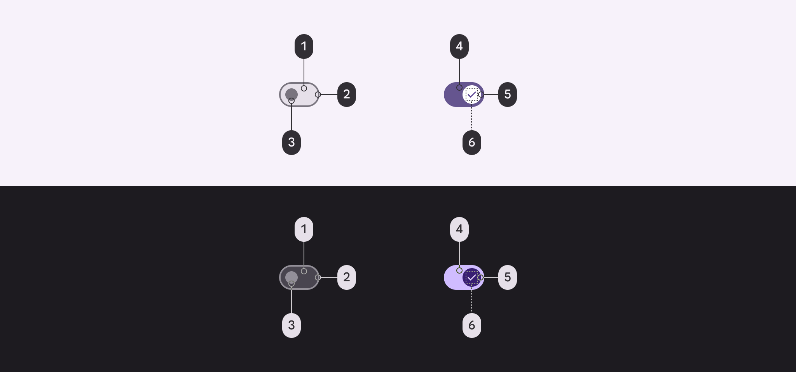
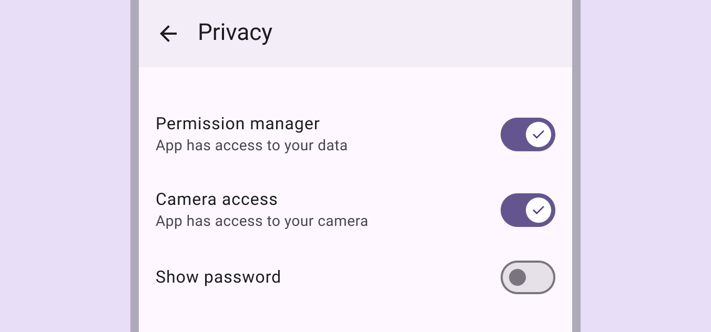
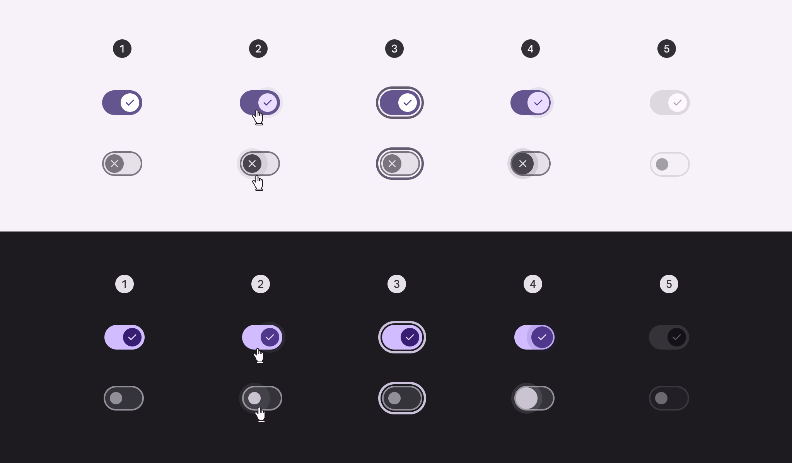
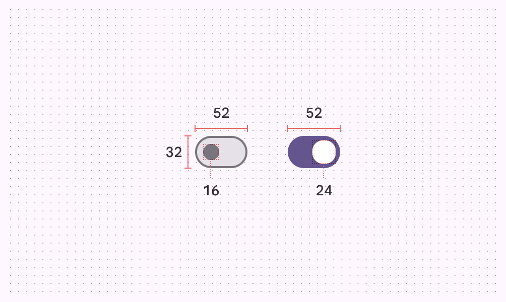
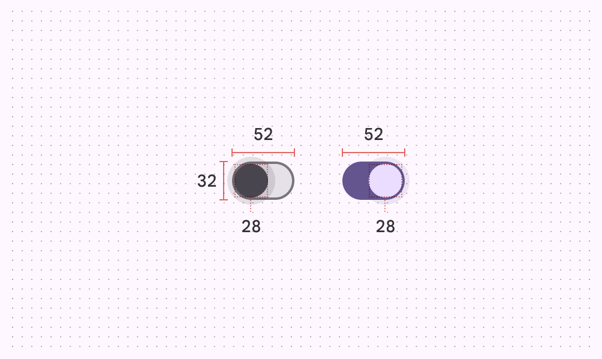
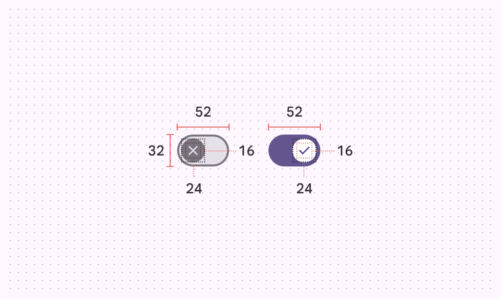
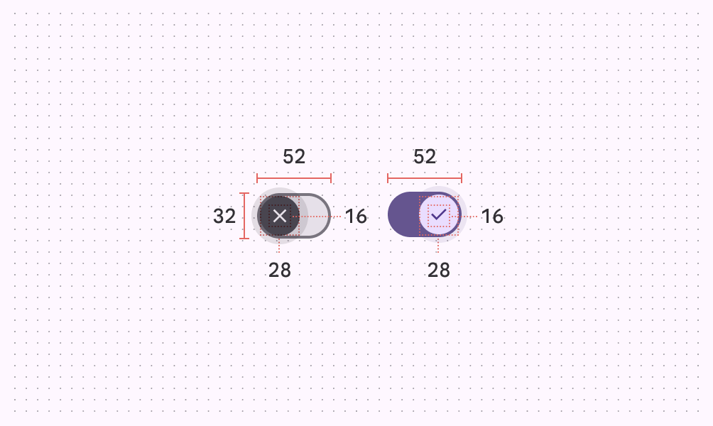
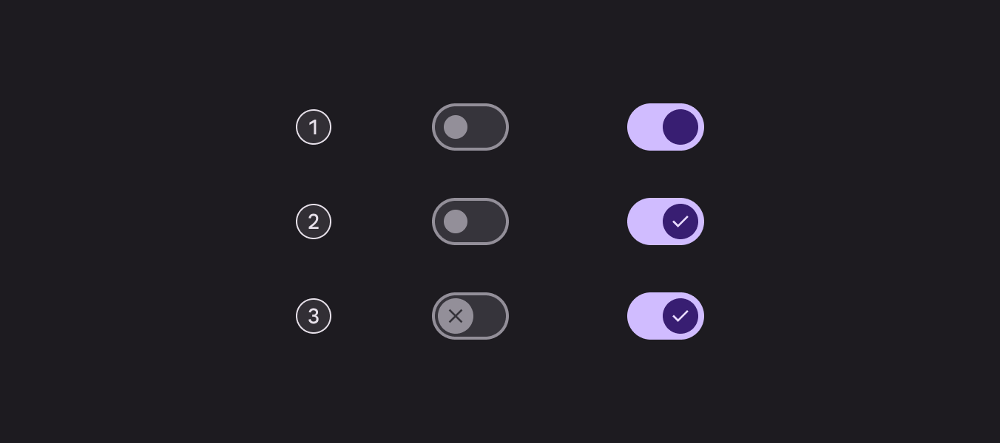

# Switch

Source: https://m3.material.io/components/switch/specs

*Track; Handle (formerly "thumb"); Icon*

## Tokens & specs

Browse the component elements, attributes, tokens, and their values. [Learn more about design tokens](https://m3.material.io/m3/pages/design-tokens/overview)

- Columns: Token
- Visible groups: Enabled; Disabled; Hovered; Focused; Pressed (ripple)

## Color

Color values are implemented through design tokens (Design tokens are the building blocks of all UI elements. The same tokens are used in designs, tools, and code. [More on tokens](https://m3.material.io/m3/pages/design-tokens/overview)). For design, this means working with color values that correspond with tokens. For implementation, a color value will be a token that references a value. [Learn more about design tokens](https://m3.material.io/m3/pages/design-tokens/overview/)

*Surface container highest; Outline; Outline; Primary; On primary; On primary container*

### Adjacent text label color

Use the color role (Color roles are assigned to UI elements based on emphasis, container type, and relationship with other elements. This ensures proper contrast and usage in any color scheme. [More on color roles](https://m3.material.io/m3/pages/color-roles)) on surface for adjacent text labels. This remains the same even if interacting with the label or component.

*The text label uses on surface. Supporting text may use on surface variant.*

## States

States (States show the interaction status of a component or UI element. [More on states](https://m3.material.io/m3/pages/interaction-states/overview)) are visual representations used to communicate the status of a component or interactive element. [Learn more about interaction states](https://m3.material.io/m3/pages/interaction-states)

*Enabled; Hovered; Focused; Pressed; Disabled*

[State specs are in the token module above](https://m3.material.io/m3/pages/switch/specs#3708644e-b4d7-4237-bb0a-7afeeae4a9b0)

## Measurements

*Switches without icons*

*Pressed switches without icons*

*Switches with icons*

*Pressed switches with icons*

| Element | Attribute | Value |
| --- | --- | --- |
| Track | Height | 32dp |
| Track | Width | 52dp |
| Track | Outline width | 2dp |
| Track | Shape | [md.sys.shape.corner.full](https://m3.material.io/m3/pages/shape/corner-radius-scale#56e2bfb5-4bec-49bd-b3a3-bd822c8ab88e) |
| Handle | Height (unselected) | 16dp |
| Handle | Height - with icon | 24dp |
| Handle | Height (selected) | 24dp |
| Handle | Height (pressed) | 28dp |
| Handle | Width (unselected) | 16dp |
| Handle | Width - with icon | 24dp |
| Handle | Width (selected) | 24dp |
| Handle | Width (pressed) | 28dp |
| Handle | Shape | [md.sys.shape.corner.full](https://m3.material.io/m3/pages/shape/corner-radius-scale#56e2bfb5-4bec-49bd-b3a3-bd822c8ab88e) |
| State layer | Size | 40dp |
| State layer | Shape | [md.sys.shape.corner.full](https://m3.material.io/m3/pages/shape/corner-radius-scale#56e2bfb5-4bec-49bd-b3a3-bd822c8ab88e) |
| Target | Size | 48dp |
| Icon | Size (selected) | 16dp |
| Icon | Size (unselected) | 16dp |

## Configurations

1. Without icons
2. Icon on selected switch
3. Icon on selected and unselected switch

