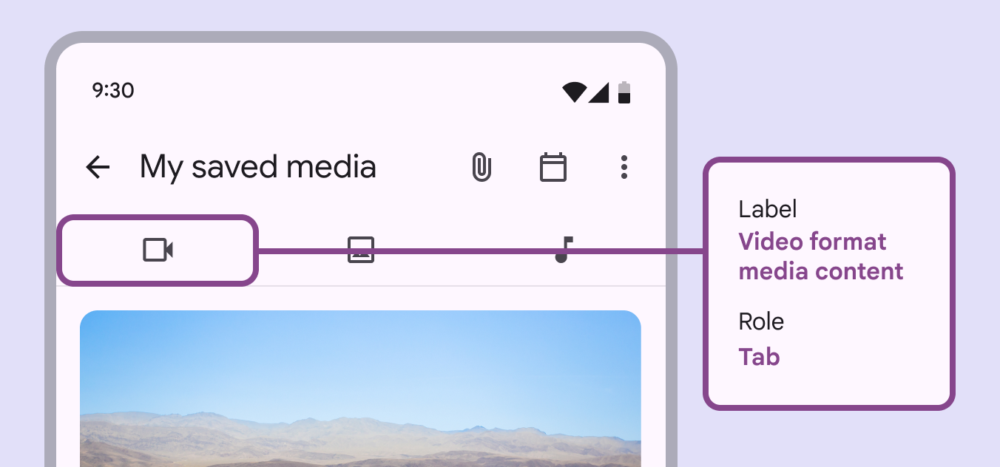

# Tabs

Source: https://m3.material.io/components/tabs/accessibility

## Use cases

Users should be able to:

- Undertake actions or invoke navigation to a new destination with assistive tech
- Select an action or destination from an off screen tab with assistive tech
- Maintain access of primary actions when the content is in a scrolled state (States show the interaction status of a component or UI element. [More on states](https://m3.material.io/m3/pages/interaction-states/overview))

## Interaction & style

Touch

- When a user taps on an icon button (Icon buttons help people take minor actions with one tap. [More on icon buttons](https://m3.material.io/m3/pages/icon-buttons/overview)), a touch ripple appears, indicating interaction feedback
- The selected indicator becomes active and shifts into position once the touch has been engaged

[Video: The ripple effect resulting from tapping on an action item.](assets/asset-001-touch-tap-051957c843.webp)

*Touch: Tap*

Scrollable

- When a set of tabs cannot fit on screen, scrollable tabs are used. They are best used for browsing on touch interfaces.
- To navigate between scrollable tabs, users swipe the set left or right. Users can also use arrow/tab to navigate through.
- It's not recommended to loop a tab set where it scrolls infinitely. This can trap users who are navigating linearly with a screen reader.
- To select an individual tab, users tap or press space/enter.
- Horizontal scrolling tabs meet accessibility requirements because they need to increase in width to respond to label text without affecting the layout, and horizontal scrolling is necessary to view those labels.

[Video: Swiping right and left scrolls through tabs when scrolling is enabled.](assets/asset-002-scrollable-scrollable-tabs-d0129d07a7.webp)

*Scrollable: Scrollable Tabs*

Cursor

- When hovered, the hover state (A hover state communicates when a user has placed a cursor above an interactive element. [More on hover state](https://m3.material.io/m3/pages/interaction-states/applying-states#71c347c2-dd75-485b-892e-04d2900bd844)) appears, providing a visual cue that the icon button (Icon buttons help people take minor actions with one tap. [More on icon buttons](https://m3.material.io/m3/pages/icon-buttons/overview)) is interactive. When clicked (in both active and inactive states), a ripple appears and the indicator shifts into position, showing the user feedback.

[Video: Hover state appears when hovering over tabs, clicking on them changes the state to active.](assets/asset-003-cursor-hover-click-153a68fe26.webp)

*Cursor: Hover, Click*

Keyboard/Switch

- When tabbed, a focus indicator appears, providing a visual cue to the user that the destination is now selected
- When the user engages with the selected tab via Space/Enter in active states (States show the interaction status of a component or UI element. [More on states](https://m3.material.io/m3/pages/interaction-states/overview)), the user is taken to a new destination
- Within the tab menu, the user is able to arrow/tab through the menu items, Space/Enter to select an item, or tab to exit the active state

Keyboard/Switch: Tab, Space/Enter, Arrow

### Avoid applying density by default

Don't apply density to tabs by default — this lowers their targets below our best practice of 48x48 CSS pixels. Instead, give people a way to choose a higher density, like selecting a denser layout or changing the theme.

To ensure that this density setting can be easily reverted when it's active, keep all the targets to change it at minimum 48x48 CSS pixels each.

## Initial focus

On arrow/tab in a tab menu (Menus display a list of choices on a temporary surface. [More on menus](https://m3.material.io/m3/pages/menus/overview)), the active indicator appears on the first interactive element, providing feedback to the user that it is selected. The user is then able to tab to additional interactive elements until all available items are complete within the tab menu.

[Video: Arrow or Tab being used to navigate through a tab menu.](assets/asset-004-do-use-arrow-tab-to-navigate-through-items-778c9978ee.webp)

*Do Use Arrow/Tab to navigate through items*

[Video: Space or Enter being used to navigate through a tab menu.](assets/asset-005-don-t-don-t-use-space-enter-for-c332c1b6b0.webp)

*Don’t Don't use Space/Enter for navigating tabs. Space/Enter is only used for completing actions.*

## Keyboard navigation

| Keys | Actions |
| --- | --- |
| Arrow | Focus lands on the next available navigation destination |
| Space / Enter | Activates the focused (A focused state communicates when a user has highlighted an element, using an input method such as a keyboard or voice. [More on focused state](https://m3.material.io/m3/pages/interaction-states/applying-states#bc6d6853-48ef-490e-8076-448e89e69f0f)) navigation destination |
| Arrow | Allows navigation through menu (Menus display a list of choices on a temporary surface. [More on menus](https://m3.material.io/m3/pages/menus/overview)) items |

## Labeling elements

When the visible UI text is ambiguous, or there is no visible UI text, accessibility (Accessible design makes products usable for people with all kinds of abilities. [More on accessibility](https://m3.material.io/m3/pages/overview)) labels need to be more descriptive. For example, an icon button (Icon buttons help people take minor actions with one tap. [More on icon buttons](https://m3.material.io/m3/pages/icon-buttons/overview)) that visually represents a “video camera” requires additional information in its accessibility label to clarify the icon’s intent.

*While the icon visually represents a “Video camera,” the accessibility label for this tab clarifies its function: “Video format media content”*
