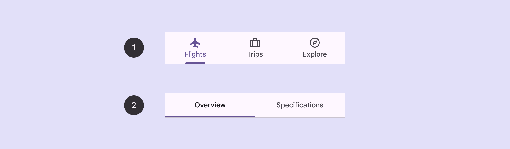
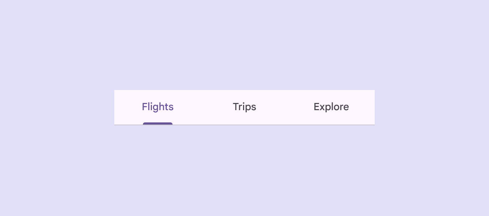

# Tabs

Source: https://m3.material.io/components/tabs/overview

- Use tabs to group content into helpful categories
- Two variants: primary (Primary tabs display an app's main content destinations. They're are placed at the top of the screen, often under a top app bar.) and secondary (Secondary tabs display related content within a content area. They're always placed below primary tabs.)
- Tabs can horizontally scroll, so a UI can have as many tabs as needed
- Place tabs next to each other as peers

*Primary tabs; Secondary tabs*

## Availability & resources

| Type | Resource | Status |
| --- | --- | --- |
| Design | [Design Kit (Figma)](https://www.figma.com/community/file/1035203688168086460) | Available |
| Implementation | [Flutter](https://api.flutter.dev/flutter/material/TabBar-class.html) | Available |
| Implementation | [Jetpack Compose](https://developer.android.com/develop/ui/compose/components/tabs) | Available |
| Implementation | [MDC-Android](https://github.com/material-components/material-components-android/blob/master/docs/components/Tabs.md) | Available |
| Implementation | [Web](https://github.com/material-components/material-web/blob/main/docs/components/tabs.md) | Available |

## Differences from M2

- Color: New color mappings and compatibility with dynamic color (Dynamic color takes a single color from a user's wallpaper or in-app content and creates an accessible color scheme assigned to elements in the UI. [More on dynamic color](https://m3.material.io/m3/pages/dynamic/choosing-a-source))
- Layout: Icons and labels are now vertically centered within the container

*Tab icons and labels are positioned in the vertical center of the container*
