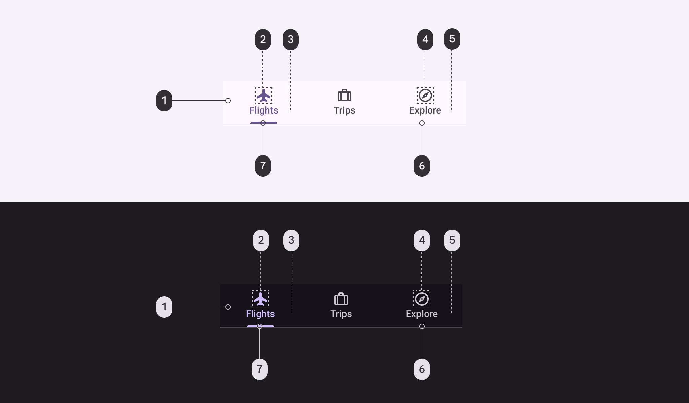
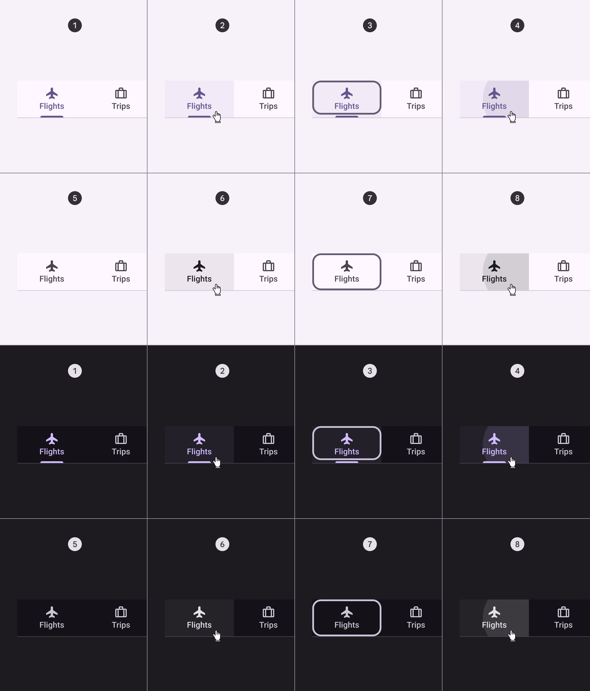
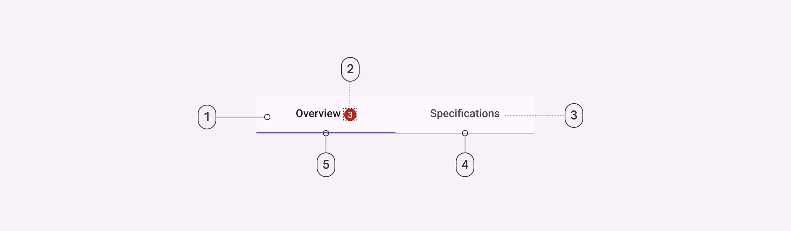
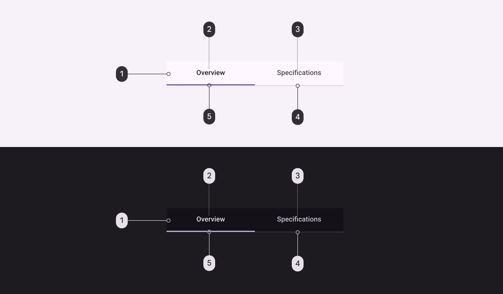
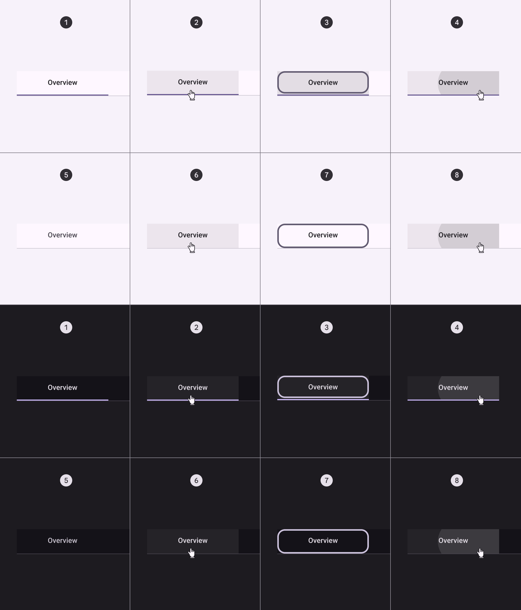
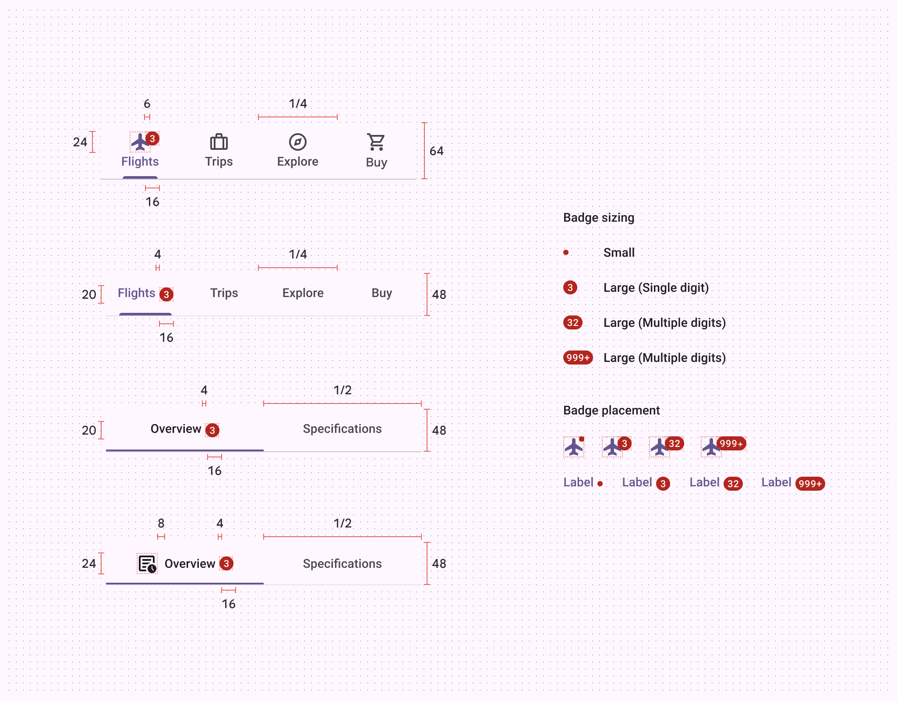
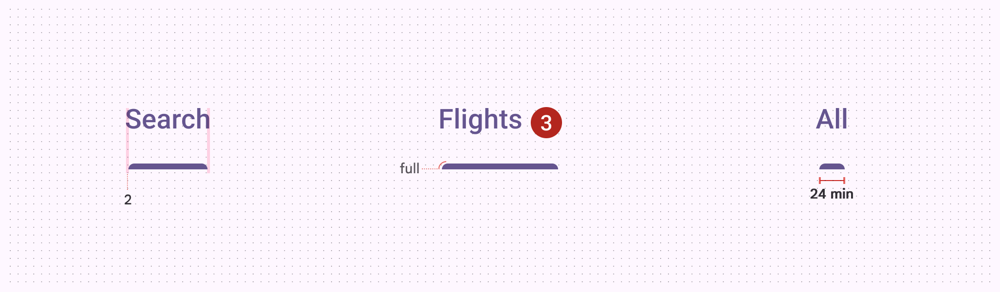

# Tabs

Source: https://m3.material.io/components/tabs/specs

## Tokens and specs

Select a component variant below to see its elements, attributes, tokens, and their values.

- Columns: Token
- Visible groups: Enabled; Hovered; Focused; Pressed (ripple)

## Primary tabs

*Container; Badge (optional); Icon (optional); Label; Divider; Active indicator*

### Primary tabs color

Color values are implemented through design tokens (Design tokens are the building blocks of all UI elements. The same tokens are used in designs, tools, and code. [More on tokens](https://m3.material.io/m3/pages/design-tokens/overview)). For design, this means working with color values that correspond with tokens. For implementation, a color value will be a token that references a value. [Learn more about design tokens](https://m3.material.io/m3/pages/design-tokens/overview)

*Surface; Primary; Primary; On surface variant; On surface variant; Outline variant; Primary*

### Primary tabs states

*Enabled (active destination); Hover (active destination); Focused (active destination); Pressed (active destination); Enabled (inactive destination); Hover (inactive destination); Focused (inactive destination); Pressed (inactive destination)*

## Secondary tabs

*Container; Badge (optional); Label; Divider; Active indicator*

### Secondary tabs color

Color values are implemented through design tokens (Design tokens are the building blocks of all UI elements. The same tokens are used in designs, tools, and code. [More on tokens](https://m3.material.io/m3/pages/design-tokens/overview)). For design, this means working with color values that correspond with tokens. For implementation, a color value will be a token that references a value. [Learn more about design tokens](https://m3.material.io/m3/pages/design-tokens/overview)

*Surface; On surface; On surface variant; Outline variant; Primary*

### Secondary tabs states

*Enabled (active destination); Hover (active destination); Focused (active destination); Pressed (active destination); Enabled (inactive destination); Hover (inactive destination); Focused (inactive destination); Pressed (inactive destination)*

## Measurements

*Tabs are divided into equal sections, with labels and icons positioned vertically centered. The divider is included in the height, placed inside the container.*

*Primary tab active indicators are inset 2dp on each side, have a fully rounded corner radius, and a minimum length of 24dp.*

| Attribute | Value |
| --- | --- |
| Container height (label text only) | 48dp |
| Container height (icon and label text) | 64dp |
| Icon size | 24dp |
| Divider height | 1dp |
| Primary active indicator height | 3dp |
| Secondary active indicator height | 2dp |
| Active indicator shape | 3, 3, 0, 0 |
| Active indicator minimum length | 24dp |
| Padding between inline icon and text | 8dp |
| Padding between inline text and badge | 4dp |
| Overlap of badge on stacked icon | 6dp |
