# Time pickers

Source: https://m3.material.io/components/time-pickers/specs

## Tokens & specs

Select a component variant below to see its elements, attributes, tokens, and their values. [Learn more about design tokens](https://m3.material.io/m3/pages/design-tokens/overview)

- Token sets: Time picker - Dial; Time picker - Input
- Columns: Token
- Visible groups: Enabled; Hovered; Focused; Pressed (ripple)

## Anatomy

### Time picker dial

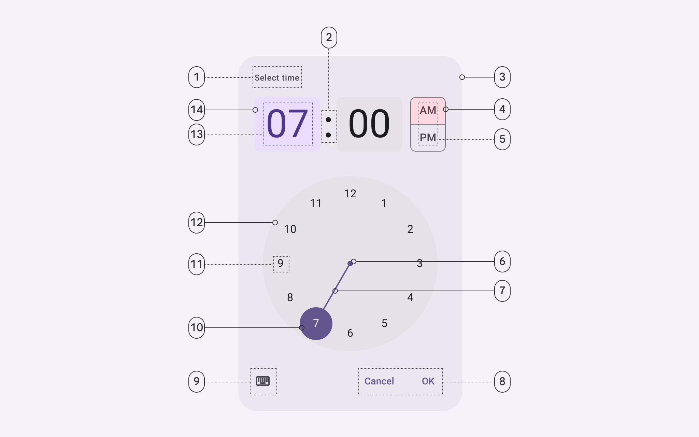

*Headline; Time selector separator; Container; Period selector container; Period selector label text; Clock dial selector center; Clock dial selector track; Text button; Icon button; Clock dial selector container; Clock dial label text; Clock dial container; Time selector label text; Time selector container*

### Time picker input

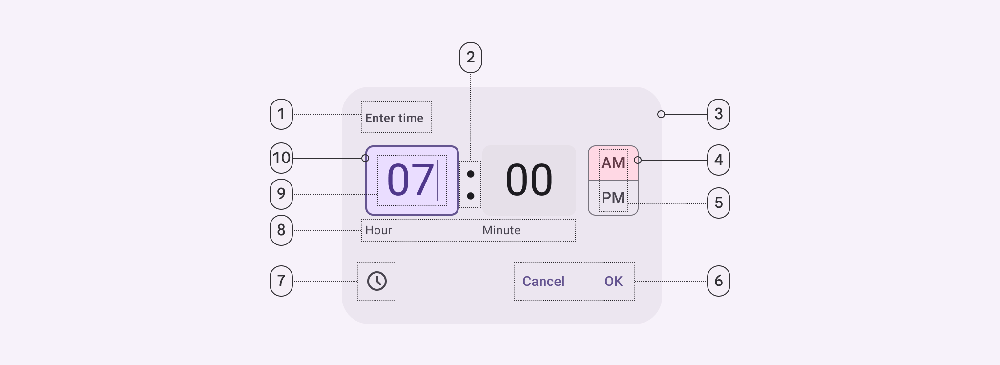

*Headline; Time input field seperator; Container; Period selector container; Period selector label text; Text button; Icon button; Time input field supporting text; Time input field label text; Time input field container*

## Color

Color values are implemented through design tokens (Design tokens are the building blocks of all UI elements. The same tokens are used in designs, tools, and code. [More on tokens](https://m3.material.io/m3/pages/design-tokens/overview)). For design, this means working with color values that correspond with tokens. For implementation, a color value will be a token that references a value. [Learn more about design tokens](https://m3.material.io/m3/pages/design-tokens/overview)

### Time picker dial color

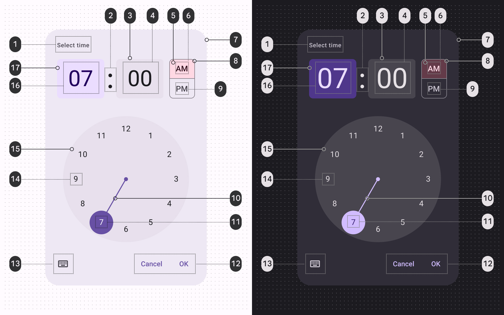

*On surface variant; On surface; Surface container highest; On surface; Tertiary container; On tertiary container; Surface container high; Outline; On surface; Primary; On primary; Primary; On surface variant; On surface; Surface container highest; On primary container; Primary container*

### Time picker input color

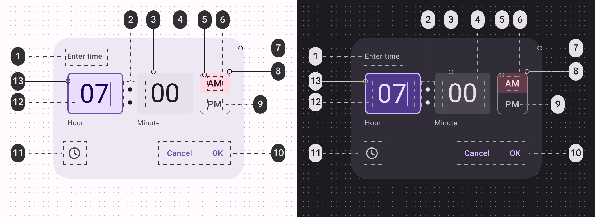

*On surface variant; On surface; Surface container highest; On surface; Tertiary container; On tertiary container; Surface container high; Outline; On surface; Primary; On surface variant; On primary container; Primary container*

## States

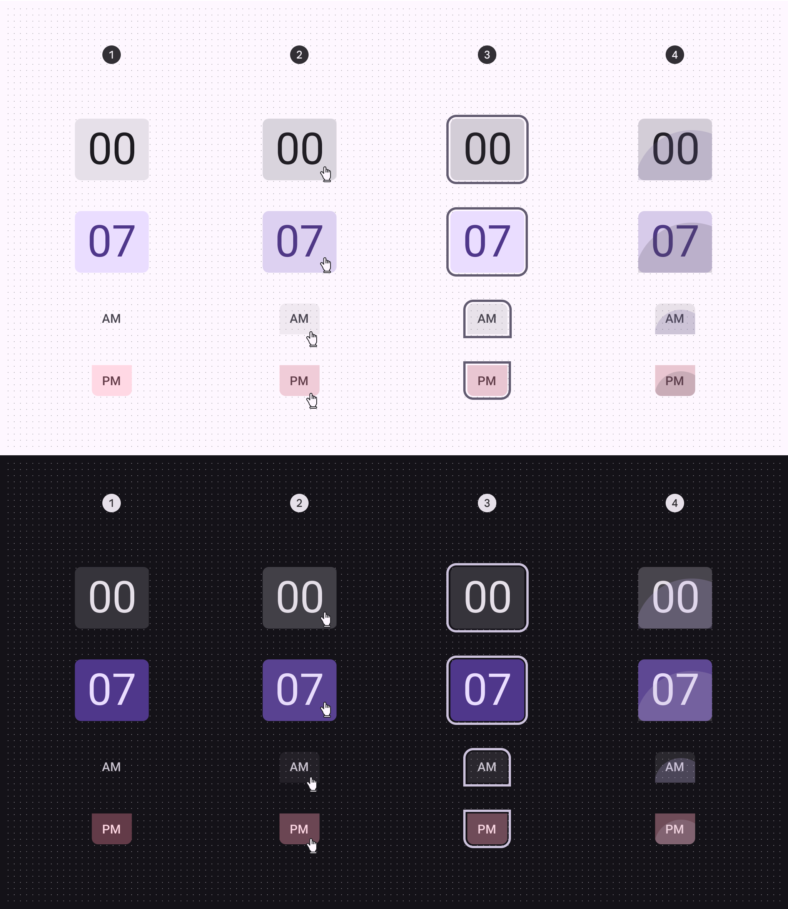

*Enabled; Hover; Focus; Pressed*

[States specs can be found in the token module above](https://m3.material.io/m3/pages/time-pickers/specs#2ccd9809-9246-4667-85fa-7747f4ac7349)

## Measurements

### Time picker dial - vertical

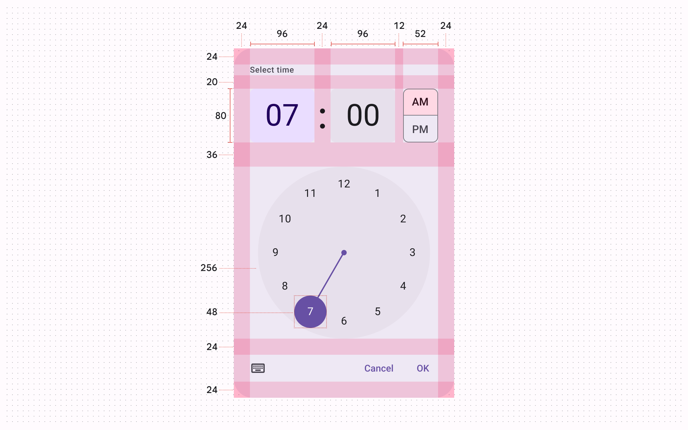

*Vertical time picker dial padding and size measurements*

| Element | Attribute | Value |
| --- | --- | --- |
| Container | Width | Dynamic |
| Container | Height | Dynamic |
| Container | Headline alignment | Left |
| Container | Top/bottom padding | 24dp |
| Container | Left/right padding | 24dp |
| Time selector container | Width | 96dp |
| Time selector container | Width (24h vertical) | 114dp |
| Time selector container | Height | 80dp |
| Period selector container | Width (vertical layout) | 52dp |
| Period selector container | Height (vertical layout) | 80dp |
| Period selector container | Width (horizontal layout) | 216dp |
| Period selector container | Height (horizontal layout) | 38dp |
| Clock dial container | Size | 256dp |
| Clock dial selector handle | Size | 48dp |
| Clock dial selector center | Size | 8dp |
| Clock dial selector track | Width | 2dp |

### Time picker dial - horizontal

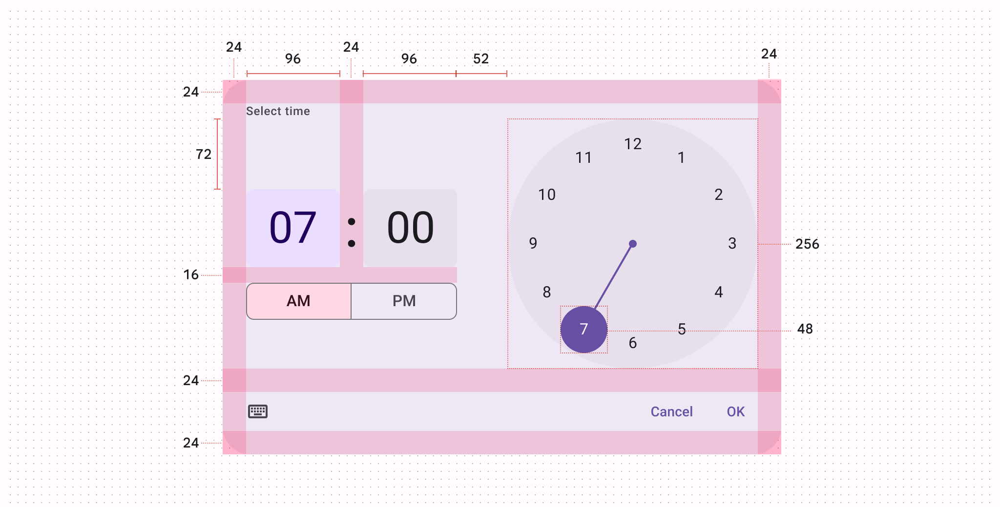

*Horizontal time picker dial padding and size measurements*

| Element | Attribute | Value |
| --- | --- | --- |
| Container | Width | Dynamic |
| Container | Height | Dynamic |
| Container | Headline alignment | Left |
| Container | Top/bottom padding | 24dp |
| Container | Left/right padding | 24dp |
| Time selector container | Width | 96dp |
| Time selector container | Width (24h vertical) | 114dp |
| Time selector container | Height | 80dp |
| Period selector container | Width (vertical layout) | 52dp |
| Period selector container | Height (vertical layout) | 80dp |
| Period selector container | Width (horizontal layout) | 216dp |
| Period selector container | Height (horizontal layout) | 38dp |
| Clock dial container | Size | 256dp |
| Clock dial selector handle | Size | 48dp |
| Clock dial selector center | Size | 8dp |
| Clock dial selector track | Width | 2dp |

### Time picker input

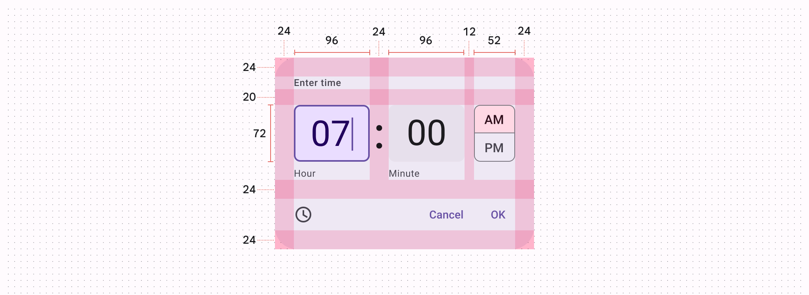

*Time picker input padding and size measurements*

| Element | Attribute | Value |
| --- | --- | --- |
| Container | Width | Dynamic |
| Container | Height | Dynamic |
| Container | Headline alignment | Left |
| Container | Top/bottom padding | 24dp |
| Container | Left/right padding | 24dp |
| Time input field container | Width | 96dp |
| Time input field container | Height | 72dp |
| Period selector container | Width | 52dp |
| Period selector container | Height | 72dp |

## Configurations

### Vertical orientation and horizontal orientation

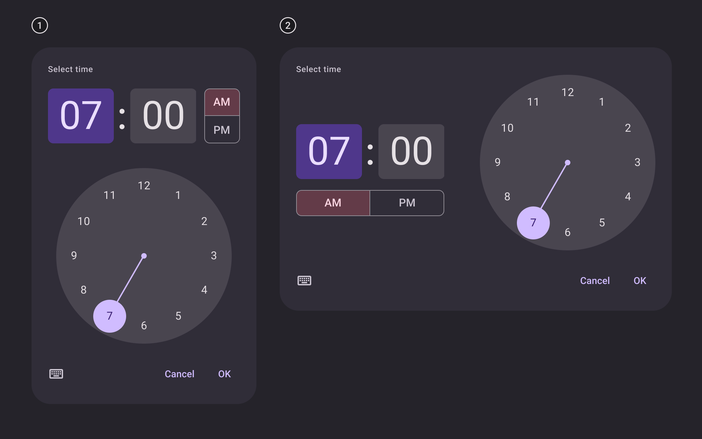

*Vertical layout (default on mobile); Horizontal layout*

### 24-hour time picker dial

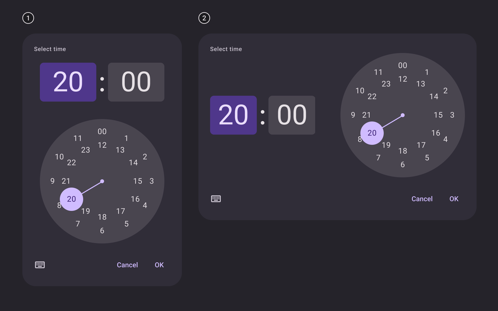

*24h dial in vertical layout (default on mobile); 24h dial in horizontal layout*

### 12-hour and 24-hour time picker inputs

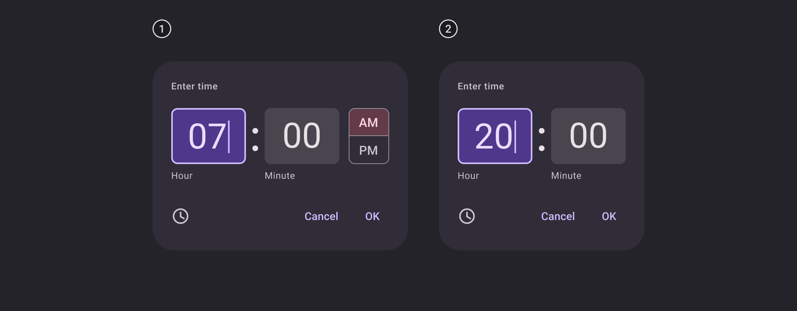

*12h input; 24h input*
