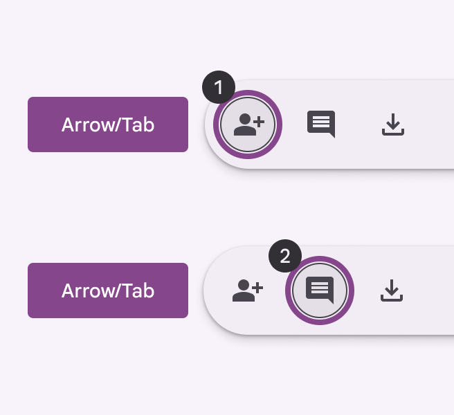
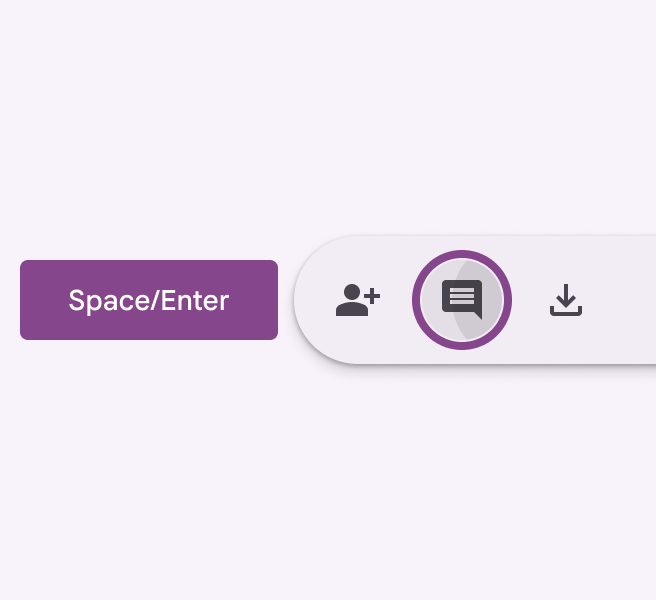
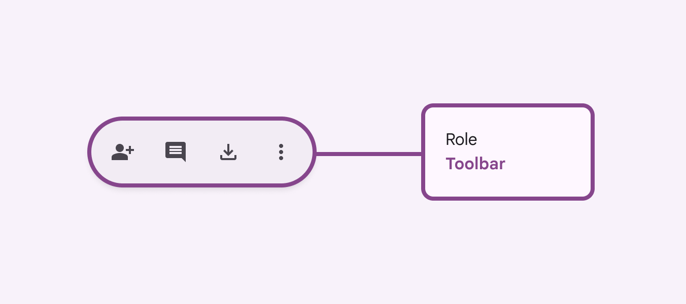

# Toolbars

Source: https://m3.material.io/components/toolbars/accessibility

## Use cases

People should be able to the following with assistive technology:

- Navigate and activate any actions in the toolbar
- Select a destination from a menu
- Activate a back button
- Maintain access to toolbar controls when the content is scrolled or collapsed

## Interaction & style

The toolbar has no interactions by default. All interactions are with the elements placed inside.

Touch

- When tapping on an icon button in the toolbar, a touch ripple appears, indicating interaction feedback.

[Video: An animation of the user tapping on an action item and the ripple effect being shown.](assets/asset-001-touch-tap-cbe8ec82da.webp)

*Touch: Tap*

Cursor

- When hovered, the hover state provides a visual cue to the user that the element is interactive.
- When clicked (in both active and inactive states), a ripple appears, showing the user feedback.

[Video: A mouse hovering over a button in the top app bar, then clicking.](assets/asset-002-cursor-hover-click-564d1e6c99.webp)

*Cursor: Hover, Click*

### Initial focus

Focus lands on the first interactive element.

Use Tab to navigate through all other actions.

*Use Tab to navigate through interactive elements*

*Use Space or Enter to activate actions*

## Keyboard navigation

| Keys | Actions |
| --- | --- |
| Tab or Arrows | Navigate between interactive elements |
| Space or Enter | Activate the focused element |

### Labeling elements

On web, the toolbar container should have the toolbar role.

On mobile, it can be a generic container.

All actions inside the toolbar should follow their respective accessibility guidelines.

*On web, use the toolbar role*
